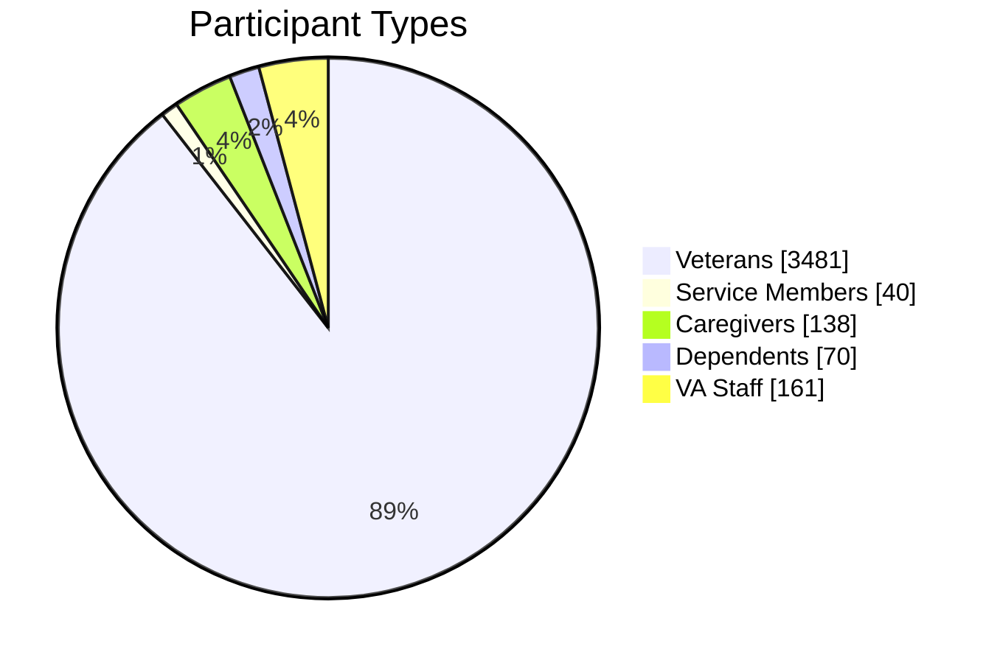
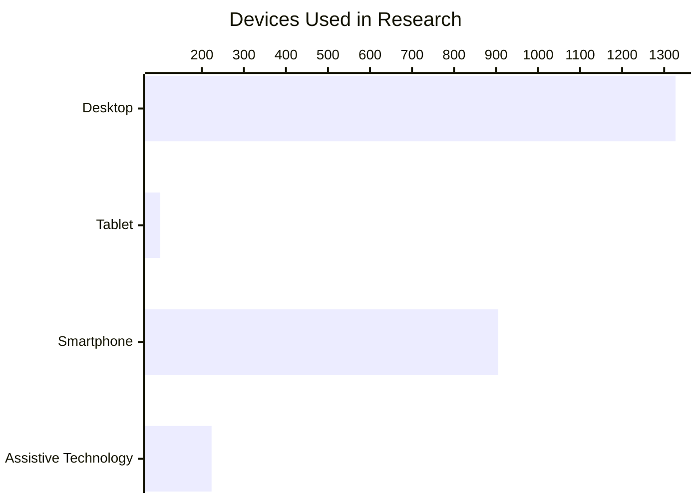
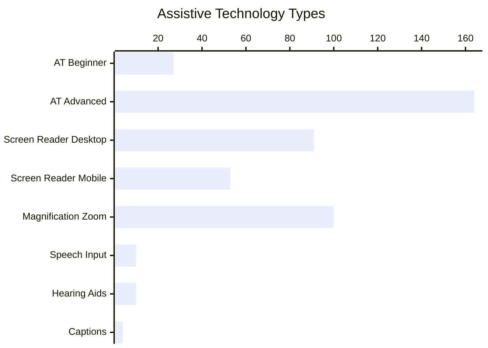
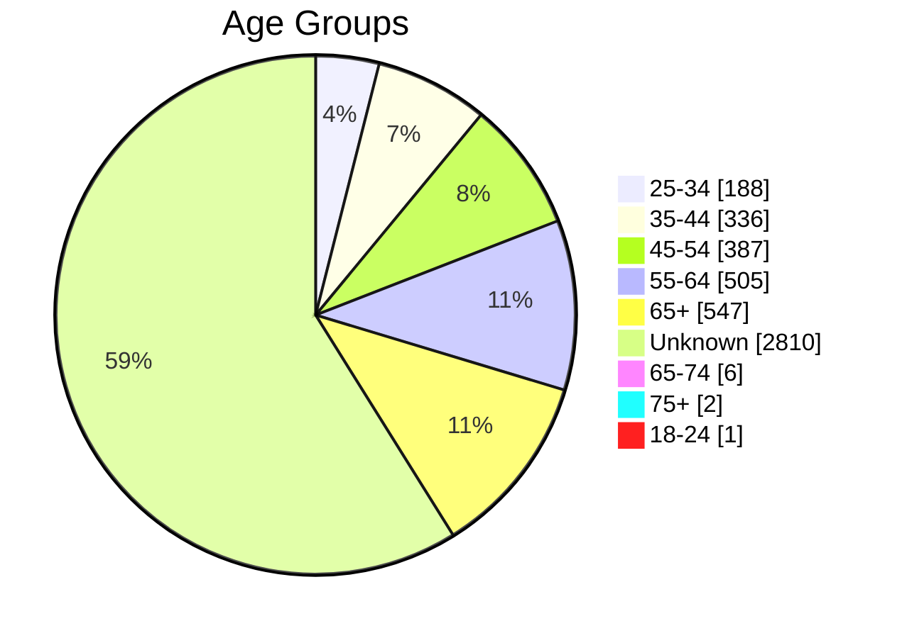
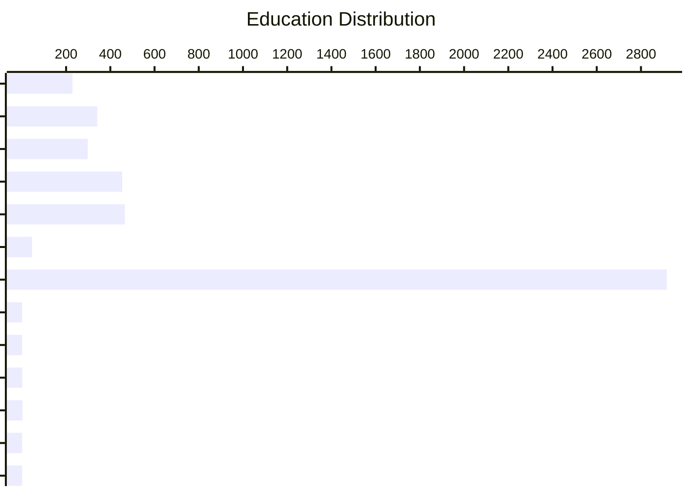
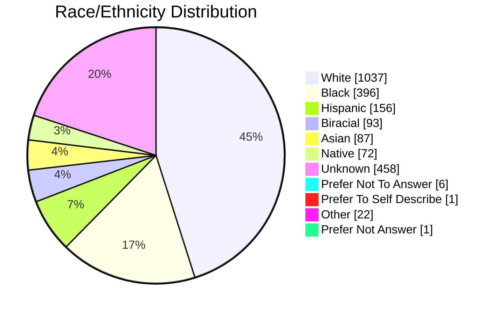

# 📊 Historical Participant Data Report (2017-2025)

> **Report Period:** 2017 - 2025 | **Total Years:** 9
> **Generated:** 2026-02-13T16:51:33.107Z
> 📖 **Purpose:** Comprehensive historical analysis of participant demographics from VA.gov research findings

## 📈 Overview Statistics

| Metric | Value |
|--------|-------|
| 📚 **Total Studies** | 244 |
| 👥 **Total Participants** | 5075 |
| 📅 **Years Covered** | 2017-2025 (9 years with data) |
| ♿ **AT Inclusion Rate** | 57/244 studies (23.4%) |

---
## 📅 Year-by-Year Breakdown

| Year | Studies | Participants | Studies with AT | AT Participants |
|------|---------|--------------|----------------|-----------------|
| 2017 | 4 | 16 | 0 | 0 |
| 2018 | 1 | 4 | 0 | 0 |
| 2019 | 4 | 25 | 0 | 0 |
| 2020 | 12 | 112 | 0 | 0 |
| 2021 | 23 | 180 | 0 | 0 |
| 2022 | 33 | 456 | 11 | 37 |
| 2023 | 18 | 340 | 7 | 26 |
| 2024 | 94 | 2315 | 26 | 137 |
| 2025 | 45 | 1551 | 12 | 50 |

---
## 👥 Participant Types (Overall)

View detailed breakdown

| Type | Count | Percentage | Distribution |
|------|------:|------------|--------------|
| Veterans | 3481 | 89.5% | █████████████░░ |
| Service Members | 40 | 1.0% | ░░░░░░░░░░░░░░░ |
| Caregivers | 138 | 3.5% | █░░░░░░░░░░░░░░ |
| Dependents | 70 | 1.8% | ░░░░░░░░░░░░░░░ |
| VA Staff | 161 | 4.1% | █░░░░░░░░░░░░░░ |

---
## 💻 Devices Used

| Device | Count | Percentage | Distribution |
|--------|------:|------------|--------------|
| Desktop | 1327 | 51.9% | ████████░░░░░░░ |
| Tablet | 101 | 4.0% | █░░░░░░░░░░░░░░ |
| Smartphone | 905 | 35.4% | █████░░░░░░░░░░ |
| Assistive Technology | 223 | 8.7% | █░░░░░░░░░░░░░░ |

---
## ♿ Assistive Technology Inclusion

| Metric | Value |
|--------|-------|
| Studies with AT Users | **57** of 244 (23.4%) |
| Total AT Participants | **255** |

### AT Types Used

---
## 📅 Age Distribution

View detailed breakdown

| Age Group | Count | Percentage | Distribution |
|-----------|------:|------------|--------------|
| 25-34 | 188 | 3.9% | █░░░░░░░░░░░░░░ |
| 35-44 | 336 | 7.0% | █░░░░░░░░░░░░░░ |
| 45-54 | 387 | 8.1% | █░░░░░░░░░░░░░░ |
| 55-64 | 505 | 10.6% | ██░░░░░░░░░░░░░ |
| 65+ | 547 | 11.4% | ██░░░░░░░░░░░░░ |
| unknown | 2810 | 58.8% | █████████░░░░░░ |
| 65-74 | 6 | 0.1% | ░░░░░░░░░░░░░░░ |
| 75+ | 2 | 0.0% | ░░░░░░░░░░░░░░░ |
| 18-24 | 1 | 0.0% | ░░░░░░░░░░░░░░░ |

---
## 🎓 Education Levels

View detailed breakdown

| Education Level | Count | Percentage | Distribution |
|-----------------|------:|------------|--------------|
| High School | 229 | 4.8% | █░░░░░░░░░░░░░░ |
| Some College | 341 | 7.2% | █░░░░░░░░░░░░░░ |
| Associates | 298 | 6.3% | █░░░░░░░░░░░░░░ |
| Bachelors | 454 | 9.5% | █░░░░░░░░░░░░░░ |
| Masters | 466 | 9.8% | █░░░░░░░░░░░░░░ |
| Doctorate | 46 | 1.0% | ░░░░░░░░░░░░░░░ |
| Unknown | 2917 | 61.3% | █████████░░░░░░ |
| Some College (No Degree) | 1 | 0.0% | ░░░░░░░░░░░░░░░ |
| Associate'S Degree, Trade Certificate Or Vocational Training | 1 | 0.0% | ░░░░░░░░░░░░░░░ |
| Bachelor'S Degree | 2 | 0.0% | ░░░░░░░░░░░░░░░ |
| Master'S Degree | 3 | 0.1% | ░░░░░░░░░░░░░░░ |
| Doctorate Degree | 1 | 0.0% | ░░░░░░░░░░░░░░░ |
| Professional | 1 | 0.0% | ░░░░░░░░░░░░░░░ |

---
## 🗺️ Geographic Location

| Location | Count | Percentage | Distribution |
|----------|------:|------------|--------------|
| 🏙️ Urban | 756 | 15.9% | ███░░░░░░░░░░░░░░░░░ |
| 🌾 Rural | 540 | 11.4% | ██░░░░░░░░░░░░░░░░░░ |
| ❓ Unknown | 3453 | 72.7% | ███████████████░░░░░ |

---
## 🌍 Race/Ethnicity

View detailed breakdown

| Race/Ethnicity | Count | Percentage | Distribution |
|----------------|------:|------------|--------------|
| White | 1037 | 44.4% | ███████░░░░░░░░ |
| Black | 396 | 16.9% | ███░░░░░░░░░░░░ |
| Hispanic | 156 | 6.7% | █░░░░░░░░░░░░░░ |
| Biracial | 93 | 4.0% | █░░░░░░░░░░░░░░ |
| Asian | 87 | 3.7% | █░░░░░░░░░░░░░░ |
| Native | 72 | 3.1% | ░░░░░░░░░░░░░░░ |
| Unknown | 458 | 19.6% | ███░░░░░░░░░░░░ |
| Prefer Not To Answer | 6 | 0.3% | ░░░░░░░░░░░░░░░ |
| Prefer To Self Describe | 1 | 0.0% | ░░░░░░░░░░░░░░░ |
| Other | 22 | 0.9% | ░░░░░░░░░░░░░░░ |
| White | 4 | 0.2% | ░░░░░░░░░░░░░░░ |
| Black | 1 | 0.0% | ░░░░░░░░░░░░░░░ |
| Hispanic | 2 | 0.1% | ░░░░░░░░░░░░░░░ |
| Asian | 1 | 0.0% | ░░░░░░░░░░░░░░░ |
| Prefer Not Answer | 1 | 0.0% | ░░░░░░░░░░░░░░░ |

---
## ♿ Disability & Accessibility Details

| Category | Count | Distribution |
|----------|------:|--------------|
| Cognitive | 337 | ███████████████ |
| AT Beginner | 27 | █░░░░░░░░░░░░░░ |
| AT Advanced | 164 | ███████░░░░░░░░ |
| Screen Reader Desktop | 91 | ████░░░░░░░░░░░ |
| Screen Reader Mobile | 53 | ██░░░░░░░░░░░░░ |
| Magnification Zoom | 100 | ████░░░░░░░░░░░ |
| Speech Input | 10 | ░░░░░░░░░░░░░░░ |
| Hearing Aids | 10 | ░░░░░░░░░░░░░░░ |
| Captions | 4 | ░░░░░░░░░░░░░░░ |
| Unknown | 94 | ████░░░░░░░░░░░ |
| Visually Impaired | 1 | ░░░░░░░░░░░░░░░ |

---
## 📋 Appendix: Studies Included

View all 244 studies

| Study | Date | Year | Participants |
|-------|------|------|-------------:|
| [[2025-10 Supplemental Claims Design Directions]...](https://github.com/department-of-veterans-affairs/va.gov-team/blob/master/products/disability/526ez/research/CC-Team-Research/2025-10-Supplemental-Claim/Research%20Findings%20-%20Mental%20Model.md) | 2026-02-03 | 2026 | 10 |
| [Side Navigation Research Findings](https://github.com/department-of-veterans-affairs/va.gov-team/blob/master/products/disability/526ez/research/2025-11%20Side%20Navigation/Side%20Nav%20Research%20Findings%20Report.md) | 2026-01-30 | 2026 | 8 |
| [Complex Claims UAT Research Findings](https://github.com/department-of-veterans-affairs/va.gov-team/blob/master/products/health-care/beneficiary-travel/research/2025-12%20Complex%20Claims%20UAT/research%20report.md) | 2026-01-29 | 2026 | 0 |
| [Pension Disability Alert Research Findings](https://github.com/department-of-veterans-affairs/va.gov-team/blob/master/products/pension/research/2025-12%20Pension%20Disability%20Alert/research-findings.md) | 2026-01-15 | 2026 | 6 |
| [[2025-10 Supplemental Claims Design Directions]...](https://github.com/department-of-veterans-affairs/va.gov-team/blob/master/products/disability/526ez/research/CC-Team-Research/2025-10-Supplemental-Claim/Research%20Findings%20-%20Usability.md) | 2026-01-15 | 2026 | 10 |
| [Topline Findings: Medication renewal flow and p...](https://github.com/department-of-veterans-affairs/va.gov-team/blob/master/products/health-care/digital-health-modernization/mhv-to-va.gov/medications/research/2025-11-medications-messaging-and-status-labels-usability-study/topline-findings.md) | 2026-01-06 | 2026 | 12 |
| [Medication renewal flow and prescription status...](https://github.com/department-of-veterans-affairs/va.gov-team/blob/master/products/health-care/digital-health-modernization/mhv-to-va.gov/medications/research/2025-11-medications-messaging-and-status-labels-usability-study/findings.md) | 2026-01-06 | 2026 | 12 |
| [Benefits Management Notifications Study Researc...](https://github.com/department-of-veterans-affairs/va.gov-team/blob/master/products/claim-appeal-status/research/2025-10-Notifications-Research/Notifications_Research_Findings.md) | 2025-12-19 | 2025 | 11 |
| [One VA Debt Letter in mobile app Research Findings](https://github.com/department-of-veterans-affairs/va.gov-team/blob/master/products/Debt%20Resolution/one_va_debt_letter/mobile/research-findings.md) | 2025-12-16 | 2025 | 10 |
| [Ask VA Form + Inbox Usability Study Research Fi...](https://github.com/department-of-veterans-affairs/va.gov-team/blob/master/products/ask-va/design/User%20research/2025-10%20Form%20and%20Inbox%20Usability%20Study/Co-pilot%20Findings.md) | 2025-12-15 | 2025 | 13 |
| [686c Fully Digital Form Viewer MVP Usability Te...](https://github.com/department-of-veterans-affairs/va.gov-team/blob/master/products/disability/526ez/research/2025-11-686c-Fully-Digital-Form-Viewer-MVP-Usability-Testing/veteran-research-readout.md) | 2025-12-11 | 2025 | 8 |
| [Time of Need Lite Research Findings](https://github.com/department-of-veterans-affairs/va.gov-team/blob/master/products/burials-memorials/time-of-need/research/Time%20of%20Need%20Lite%20Research%20Findings.md) | 2025-12-10 | 2025 | 14 |
| [FMP Claims Content Comprehension Study Research...](https://github.com/department-of-veterans-affairs/va.gov-team/blob/master/products/health-care/foreign-medical-program/10-7959f-2/research/2025-10-FMP-Claims-Direct-Deposit-Content-Study/research-findings.md) | 2025-12-04 | 2025 | 8 |
| [Veteran Onboarding Modal Research Findings](https://github.com/department-of-veterans-affairs/va.gov-team/blob/master/products/veteran-onboarding/research/2025-study/research-findings.md) | 2025-11-24 | 2025 | 16 |
| [Facility Locator Autosuggest and Progressive Di...](https://github.com/department-of-veterans-affairs/va.gov-team/blob/master/products/facilities/facility-locator/initiatives/2023-2025-search-improvements/research/services-and-progressive-disclosure/NonATResearchReport.md) | 2025-10-30 | 2025 | 8 |
| [Forms MVP Usability Study 2 - Assistive Technol...](https://github.com/department-of-veterans-affairs/va.gov-team/blob/master/products/va-mobile-app/research/Forms%20MVP%20Research/research-findings-AT-study2.md) | 2025-10-22 | 2025 | 10 |
| [Research Findings for Providing Veterans with a...](https://github.com/department-of-veterans-affairs/va.gov-team/blob/master/products/disability/526ez/research/2025-09-Copy%20of%20Submission/research-report.md) | 2025-10-04 | 2025 | 8 |
| [Calculator Detail Page Line Chart Testing Resea...](https://github.com/department-of-veterans-affairs/va.gov-team/blob/master/products/health-care/clinical-decision-support/medical-calculators/research/2025-09-Calculator-Detail-Page-Line-Chart-Testing/research-findings.md) | 2025-10-02 | 2025 | 5 |
| [Chatbot User Testing Round 2](https://github.com/department-of-veterans-affairs/va.gov-team/blob/master/products/virtual-agent/research/2025-10-Chatbot%20User%20Testing%20Round%202/ResearchFindings.md) | 2025-10-01 | 2025 | 17 |
| [Intent to File Content Study Research Findings](https://github.com/department-of-veterans-affairs/va.gov-team/blob/master/products/pension/research/2025-09%20Intent%20to%20File%20Unmoderated%20Study/research-findings.md) | 2025-09-25 | 2025 | 20 |
| [Email verification desk research findings](https://github.com/department-of-veterans-affairs/va.gov-team/blob/master/products/identity-personalization/profile/Research/2025-09-email-verification-desk-research/research-findings.md) | 2025-09-15 | 2025 | 0 |
| [Save in Progress Usability Research Findings](https://github.com/department-of-veterans-affairs/va.gov-team/blob/master/teams/digital-experience/ADE/research/2025-05-save-in-progress/research-findings.md) | 2025-09-15 | 2025 | 11 |
| [Travel Pay Complex Claims Concept Study Researc...](https://github.com/department-of-veterans-affairs/va.gov-team/blob/master/products/health-care/beneficiary-travel/research/08-2025--Travel%20Complex%20Claims%20Concept%20Study/09-2025%20Travel%20Pay%20Complex%20Claims%20Concept%20Study%20Research%20Findings.md) | 2025-09-10 | 2025 | 13 |
| [Chatbot Research Findings](https://github.com/department-of-veterans-affairs/va.gov-team/blob/master/products/virtual-agent/research/2025-07-Chatbot%20User%20Testing/ResearchFindings.md) | 2025-09-03 | 2025 | 14 |
| [Forms MVP Usability Study Research Findings](https://github.com/department-of-veterans-affairs/va.gov-team/blob/master/products/va-mobile-app/research/Forms%20MVP%20Research/research-findings.md) | 2025-08-28 | 2025 | 11 |
| [Evidence Request Study Research Findings](https://github.com/department-of-veterans-affairs/va.gov-team/blob/master/products/identity-personalization/my-va/research/2025-08-myva3.0-phase1-usabilitytesting/research-findings.md) | 2025-08-28 | 2025 | 10 |
| [Copilot findings for Auth Experience, My VA 3.0...](https://github.com/department-of-veterans-affairs/va.gov-team/blob/master/products/identity-personalization/my-va/research/2025-08-myva3.0-phase1-usabilitytesting/copilot-findings.md) | 2025-08-28 | 2025 | 9 |
| [Your VA benefit letters and documents Research ...](https://github.com/department-of-veterans-affairs/va.gov-team/blob/master/products/benefit-letters/research/2025-06-Your-VA-benefit-letters-and-documents/research-findings.md) | 2025-08-25 | 2025 | 11 |
| [Continuous Discovery Pilot - Round 1 Research F...](https://github.com/department-of-veterans-affairs/va.gov-team/blob/master/products/dependents/research/2025-08-continuous-discovery-pilot/Round%201/findings.md) | 2025-08-25 | 2025 | 7 |
| [[Mobile App Debt Portal: Overpayments and Copay...](https://github.com/department-of-veterans-affairs/va.gov-team/blob/master/products/combined_va_debt_portal/mobile/research-findings.md) | 2025-08-21 | 2025 | 12 |
| [Veteran Transition Experience Research Findings](https://github.com/department-of-veterans-affairs/va.gov-team/blob/master/products/vet-transition-support/research/2025-07-generative-and-user-testing-study/research-findings.md) | 2025-08-15 | 2025 | 28 |
| [VA Form 21P-0969 Usability Study Research Findings](https://github.com/department-of-veterans-affairs/va.gov-team/blob/master/products/pension/research/2025-07%200969%20Usability%20Study/research-findings.md) | 2025-08-15 | 2025 | 7 |
| [Dependent Verification with Picklist Research F...](https://github.com/department-of-veterans-affairs/va.gov-team/blob/master/products/dependents/research/2025-08-dependent-verification-with-picklist/findings.md) | 2025-08-01 | 2025 | 10 |
| [Continuous Discovery Pilot - Round 5 Research F...](https://github.com/department-of-veterans-affairs/va.gov-team/blob/master/products/dependents/research/2025-08-continuous-discovery-pilot/Rounds%205%266/Round%205-%20findings.md) | 2025-08-01 | N/A | 4 |
| [Continuous Discovery Pilot - Round 4 Research F...](https://github.com/department-of-veterans-affairs/va.gov-team/blob/master/products/dependents/research/2025-08-continuous-discovery-pilot/Round%204/findings.md) | 2025-08-01 | N/A | 5 |
| [Continuous Discovery Pilot - Round 7 Research F...](https://github.com/department-of-veterans-affairs/va.gov-team/blob/master/products/dependents/research/2025-08-continuous-discovery-pilot/Round%207/findings.md) | 2025-08-01 | N/A | 9 |
| [2025-06 New/Increase at Condition Level: Toplin...](https://github.com/department-of-veterans-affairs/va.gov-team/blob/master/products/disability/526ez/research/CC-Team-Research/2025-06%20New%20or%20Increase%20at%20Condition%20Level/Preliminary%20findings%20%26%20Next%20Steps.md) | 2025-07-25 | 2025 | 7 |
| [My health on VA.gov IA – Research findings](https://github.com/department-of-veterans-affairs/va.gov-team/blob/master/products/health-care/digital-health-modernization/mhv-to-va.gov/overall-content-IA/2025-06-appointments-and-other-tasks-tree-test/research-findings.md) | 2025-07-23 | 2025 | 48 |
| [Medications In Product Education (IPE) A/B/C St...](https://github.com/department-of-veterans-affairs/va.gov-team/blob/master/products/health-care/digital-health-modernization/mhv-to-va.gov/medications/research/2025-06-IPE-ABC-testing/research-findings.md) | 2025-07-10 | 2025 | 227 |
| [Secure Messages Curated List Usability Research...](https://github.com/department-of-veterans-affairs/va.gov-team/blob/master/products/health-care/digital-health-modernization/mhv-to-va.gov/secure-messaging/research/2025-06-curated-list-usability-testing/research-findings.md) | 2025-07-09 | 2025 | 9 |
| [2025-07 - CYOA Task List Early Exploration - Un...](https://github.com/department-of-veterans-affairs/va.gov-team/blob/master/products/health-care/application/va-application/research/2025-06-Task%20List%20and%20Traditional%20Form%20Unmoderated/research-findings.md) | 2025-07-01 | 2025 | 42 |
| [Resubmissions and File Verification Research Fi...](https://github.com/department-of-veterans-affairs/va.gov-team/blob/master/products/health-care/champva/10-7959a/research/user-research/2025-07-Claims-Resubmissions-and-File-Verification/2025-07-Claims-Resubmissions-Findings-Report.md) | 2025-07-01 | 2025 | 14 |
| [Profile Hub Tree Test Research Findings](https://github.com/department-of-veterans-affairs/va.gov-team/blob/master/products/identity-personalization/profile/Research/profile-hub/2025-05-profile-hub-tree-test/research-findings.md) | 2025-05-16 | 2025 | 45 |
| [Medications on VA.gov IPE Study Research Findings](https://github.com/department-of-veterans-affairs/va.gov-team/blob/master/products/health-care/digital-health-modernization/mhv-to-va.gov/medications/research/2025-03-IPE-study/research-findings.md) | 2025-05-01 | 2025 | 6 |
| [2025 Q1 Survey Data Findings](https://github.com/department-of-veterans-affairs/va.gov-team/blob/master/products/identity/Research/Ongoing%20-%20quantitative%20data/2025%20Q1%20survey%20data%20findings.md) | 2025-04-30 | 2025 | 0 |
| [Multistep task pattern Research Findings](https://github.com/department-of-veterans-affairs/va.gov-team/blob/master/products/health-care/supply-reordering-tool/research/2025-02%20Multistep%20task%20pattern%20research/research-findings.md) | 2025-04-22 | 2025 | 766 |
| [Facility Locator Mobile Map Research - Interim ...](https://github.com/department-of-veterans-affairs/va.gov-team/blob/master/products/facilities/facility-locator/initiatives/2023-2025-search-improvements/research/mobile-map/2025-03-interim-findings.md) | 2025-04-01 | 2025 | 5 |
| [2025-02 Dependent Verification MVP Research Fin...](https://github.com/department-of-veterans-affairs/va.gov-team/blob/master/products/dependents/research/2025-02-dependents-verification-mvp-research/2025-02-dependents-verification-mvp-research-findings.md) | 2025-03-13 | 2025 | 10 |
| [VA.gov Profile Desk Research for the Authentica...](https://github.com/department-of-veterans-affairs/va.gov-team/blob/master/products/identity-personalization/profile/Research/2025-03-profile-secondary-research/research-findings.md) | 2025-03-01 | 2025 | 0 |
| [My VA Desk Research for the Authenticated Exper...](https://github.com/department-of-veterans-affairs/va.gov-team/blob/master/products/identity-personalization/my-va/research/2025-03-secondaryresearch/research-findings.md) | 2025-03-01 | 2025 | 0 |
| [My HealtheVet Email Appointment Reminder Conten...](https://github.com/department-of-veterans-affairs/va.gov-team/blob/master/products/vetext/research/2025-01-VEText-MyHealtheVet-email-appointment-reminder-content-research/research-findings.md) | 2025-02-05 | 2025 | 11 |
| [Medical Records on VA.gov Usability Study Round...](https://github.com/department-of-veterans-affairs/va.gov-team/blob/master/products/health-care/digital-health-modernization/mhv-to-va.gov/medical-records/research/2025-01-usability-testing-rd4-at/research-findings.md) | 2025-02-01 | 2025 | 11 |
| [Condition Information Entry Assistive Technolog...](https://github.com/department-of-veterans-affairs/va.gov-team/blob/master/products/disability/526ez/research/CC-Team-Research/2024-11%20Conditions%20Info%20Entry/2024-11%20Condition%20Info%20Entry%20Report.md) | 2025-01-14 | 2025 | 7 |
| [Patient Details Research Findings](https://github.com/department-of-veterans-affairs/va.gov-team/blob/master/products/health-care/clinical-decision-support/platform/research/2025-12-Patient-Details-Testing/research-findings.md) | 2025-01-09 | 2025 | 8 |
| [Check-in with an MSA after eCheck-in Unmoderate...](https://github.com/department-of-veterans-affairs/va.gov-team/blob/master/products/health-care/checkin/research/2024-10%20Check%20in%20with%20an%20MSA%20after%20eCheck-in%20Unmoderated%20Survey/Check-in%20with%20MSAs%20after%20eCheck-in%20Findings%20Report.md) | 2025-01-06 | 2025 | 44 |
| [2024 Q4 Quantitative Data Findings](https://github.com/department-of-veterans-affairs/va.gov-team/blob/master/products/identity/Research/Ongoing%20-%20quantitative%20data/2024%20Q4%20quantitative%20data%20findings.md) | 2024-12-31 | 2024 | 15 |
| [Toxic Exposure Release 1.0-1.1 Evaluative Resea...](https://github.com/department-of-veterans-affairs/va.gov-team/blob/master/products/disability/526ez/research/2024-11-Toxic%20Exposure/Toxic%20Exposure%20Research%20Findings.md) | 2024-12-26 | 2024 | 11 |
| [Appointments Details Card Sort Research Findings](https://github.com/department-of-veterans-affairs/va.gov-team/blob/master/products/health-care/appointments/va-online-scheduling/research/2024-08-appointment-details-card-sort/research-findings.md) | 2024-12-18 | 2024 | 48 |
| [Veteran Transition Support Version 2 User Testi...](https://github.com/department-of-veterans-affairs/va.gov-team/blob/master/products/vet-transition-support/research/2024-10-user-testing-v2/research-findings.md) | 2024-12-12 | 2024 | 12 |
| [Research Findings for AEDP Update Prefill Study](https://github.com/department-of-veterans-affairs/va.gov-team/blob/master/products/authenticated-patterns/Design-and-research/2024-09-Research-Initiative-Two-Update-Prefill/Update%20Prefill%20Research%20Report.md) | 2024-12-12 | 2024 | 9 |
| [Burial VSOs Research Findings](https://github.com/department-of-veterans-affairs/va.gov-team/blob/master/products/burials-memorials/burial-allowance/research/2024-09-VSO-Research/research-findings.md) | 2024-12-09 | 2024 | 6 |
| [Medical Records, Secure Messages, and Medicatio...](https://github.com/department-of-veterans-affairs/va.gov-team/blob/master/products/health-care/digital-health-modernization/mhv-to-va.gov/medical-records/research/2024-11-MR-SM-RX-usability-study/research-findings.md) | 2024-12-09 | 2024 | 12 |
| [VSO Research Findings](https://github.com/department-of-veterans-affairs/va.gov-team/blob/master/products/pension/research/2024-09%20527EZ%20VSO%20Research/research-findings.md) | 2024-12-04 | 2024 | 6 |
| [Intent to File Comprehension - Research Findings](https://github.com/department-of-veterans-affairs/va.gov-team/blob/master/products/pension/research/2024-10%20Intent%20to%20File%20Comprehension/research-findings.md) | 2024-12-02 | 2024 | 7 |
| [MHV on VA.gov Adoption of My HealtheVet Researc...](https://github.com/department-of-veterans-affairs/va.gov-team/blob/master/products/health-care/digital-health-modernization/mhv-to-va.gov/overall-content-IA/2024-11-adoption-study/research-findings.md) | 2024-12-02 | 2024 | 10 |
| [Document Status Research Findings](https://github.com/department-of-veterans-affairs/va.gov-team/blob/master/products/claim-appeal-status/research/2024-11-Document-Status/research-findings.md) | 2024-11-20 | 2024 | 8 |
| [Discharge Upgrade Wizard Usability Testing Rese...](https://github.com/department-of-veterans-affairs/va.gov-team/blob/master/products/veteran-military-records/discharge-upgrade-wizard/research/2024-Review-Flow/research-findings.md) | 2024-11-14 | 2024 | 10 |
| [Historical Findings on 10-10CG Signatures and S...](https://github.com/department-of-veterans-affairs/va.gov-team/blob/master/products/caregivers/research/11-2024%20-%20Historical%20findings%20on%20Signature%20and%20Save%20In-progress.md) | 2024-11-01 | 2024 | 0 |
| [Version 1 User Testing Research Findings](https://github.com/department-of-veterans-affairs/va.gov-team/blob/master/products/vet-transition-support/research/2024-07-user-testing-v1/research-findings.md) | 2024-11-01 | 2024 | 12 |
| [2024-10 Caregiver Study Research Findings](https://github.com/department-of-veterans-affairs/va.gov-team/blob/master/products/caregivers/research/2024-09-%20Caregivers%20Study%20-%20form%20content%20and%20user%20interviews/research-findings.md) | 2024-11-01 | 2024 | 21 |
| [Medical Records on VA.gov Findability Study Res...](https://github.com/department-of-veterans-affairs/va.gov-team/blob/master/products/health-care/digital-health-modernization/mhv-to-va.gov/medical-records/research/2024-10-findability-study/research-findings.md) | 2024-11-01 | 2024 | 12 |
| [Benefits Discovery Tool V1 SME and VSO User Tes...](https://github.com/department-of-veterans-affairs/va.gov-team/blob/master/products/vet-transition-support/research/2024-07-user-testing-v1/v1-sme-vso-user-testing-research-findings.md) | 2024-10-31 | 2024 | 7 |
| [Supplemental Claims 2024 Updates Research Findings](https://github.com/department-of-veterans-affairs/va.gov-team/blob/master/products/decision-reviews/Supplemental-Claims/Research/0924-2024-SC-Updates/research-findings.md) | 2024-10-31 | 2024 | 11 |
| [VA Form 40-1330M Medallions Research Findings](https://github.com/department-of-veterans-affairs/va.gov-team/blob/master/products/burials-memorials/medallions/research/2024-10-Apply%20for%20a%20medallion%20in%20a%20private%20cemetery%20to%20products/VA-Form-40-1330M-Medallions-Research-Findings.md) | 2024-10-30 | 2024 | 8 |
| [Find Help on Contact Us - Research Findings](https://github.com/department-of-veterans-affairs/va.gov-team/blob/master/teams/digital-experience/veteran-support/Contact%20us%20page/User%20research/09-2024%20Find%20help%20on%20Contact%20us/Findings.md) | 2024-10-22 | 2024 | 10 |
| [Find Help on Contact Us - Additional Research F...](https://github.com/department-of-veterans-affairs/va.gov-team/blob/master/teams/digital-experience/veteran-support/Contact%20us%20page/User%20research/09-2024%20Find%20help%20on%20Contact%20us/Additional%20findings.md) | 2024-10-22 | 2024 | 10 |
| [VHA Debt Portal Payment History Usability and C...](https://github.com/department-of-veterans-affairs/va.gov-team/blob/master/products/combined_va_debt_portal/payment-history/research/2024-9-copay-usability/research-findings.md) | 2024-10-11 | 2024 | 10 |
| [Ask VA: Assistive Tech – Dashboard Research Fin...](https://github.com/department-of-veterans-affairs/va.gov-team/blob/master/products/ask-va/design/User%20research/2024-08%20Assistive%20technology%20-%20Dashboard/Findings.md) | 2024-10-04 | 2024 | 9 |
| [Community Care Self-Scheduling Research Present...](https://github.com/department-of-veterans-affairs/va.gov-team/blob/master/products/health-care/appointments/va-online-scheduling/initiatives/community-care-direct-scheduling/research/2024-06%20Community%20Care%20Self-Scheduling%20-%20Usability%20and%20Concept%20Testing/findings-presentation.md) | 2024-10-03 | 2024 | 0 |
| [Research Findings for AR Team, VSO - VA Benefit...](https://github.com/department-of-veterans-affairs/va.gov-team/blob/master/products/accredited-representation-management/research/2024-10-VSO-VAbenefits-interviews/research-findings.md) | 2024-10-01 | 2024 | 9 |
| [CHAMPVA Claims 10-7959a Usability/Interviews Re...](https://github.com/department-of-veterans-affairs/va.gov-team/blob/master/products/health-care/champva/10-7959a/research/user-research/2024-08-CHAMPVA-claim-usability/2024-09-Research-Report-for-champva-claims-usability-interviews.md) | 2024-09-27 | 2024 | 7 |
| [Travel Claims Status Language Generative Study ...](https://github.com/department-of-veterans-affairs/va.gov-team/blob/master/products/health-care/beneficiary-travel/research/2024-06-Travel-Claim-Status-Language-Generative-Study/ResearchFindings.md) | 2024-09-26 | 2024 | 16 |
| [Drupal CMS Image Upload Research Findings](https://github.com/department-of-veterans-affairs/va.gov-team/blob/master/products/facilities/medical-centers/research/2024%20VAMC%20CMS/ImageUploader/PostStudy/Findings/Drupal%20CMS%20Image%20Upload%20Research%20Findings.md) | 2024-09-26 | 2024 | 8 |
| [Research Findings for AEDP Prefill Study](https://github.com/department-of-veterans-affairs/va.gov-team/blob/master/products/authenticated-patterns/Design-and-research/2024-07-Research-Initiative-One-Prefill/Prefill%20Research%20Report%2009_2024.md) | 2024-09-25 | 2024 | 10 |
| [Development Letter Experience and 5103 Notice I...](https://github.com/department-of-veterans-affairs/va.gov-team/blob/master/products/claim-appeal-status/research/2024-07-Development-Letters/research-findings.md) | 2024-09-10 | 2024 | 13 |
| [10-10EZR | User Generated Content Analysis | Su...](https://github.com/department-of-veterans-affairs/va.gov-team/blob/master/products/health-care/application/va-application/research/2024-09-Social%20Listening/Research-Findings.md) | 2024-09-01 | 2024 | 159 |
| [Medical Records on VA.gov Usability Study Round...](https://github.com/department-of-veterans-affairs/va.gov-team/blob/master/products/health-care/digital-health-modernization/mhv-to-va.gov/medical-records/research/2024-08-usability-testing-rd3-at/research-findings.md) | 2024-09-01 | 2024 | 18 |
| [Sign-in Transition Usability Testing Research F...](https://github.com/department-of-veterans-affairs/va.gov-team/blob/master/products/identity/Research/2024-08%20Sign%20in%20transition/2024-08%20Research%20Findings.md) | 2024-08-31 | 2024 | 10 |
| [Ask VA: Assistive Tech – Form Research Findings](https://github.com/department-of-veterans-affairs/va.gov-team/blob/master/products/ask-va/design/User%20research/2024-07%20Assistive%20technology%20-%20Form/Findings.md) | 2024-08-29 | 2024 | 10 |
| [Community Care Self-Scheduling - Usability and ...](https://github.com/department-of-veterans-affairs/va.gov-team/blob/master/products/health-care/appointments/va-online-scheduling/initiatives/community-care-direct-scheduling/research/2024-06%20Community%20Care%20Self-Scheduling%20-%20Usability%20and%20Concept%20Testing/research-findings.md) | 2024-08-29 | 2024 | 15 |
| [Conditions Page Assistive Technology Usability ...](https://github.com/department-of-veterans-affairs/va.gov-team/blob/master/products/disability/526ez/research/CC-Team-Research/2024-07%20Conditions%20Page%20Assistive%20Technology%20Testing/researchreport.md) | 2024-08-20 | 2024 | 7 |
| [Form 0781 Updates Concept Testing and User Rese...](https://github.com/department-of-veterans-affairs/va.gov-team/blob/master/products/disability/526ez/research/2024-06%200781%20Research/Research%20Findings.md) | 2024-08-15 | 2024 | 12 |
| [Google Analytics Identity Related Findings](https://github.com/department-of-veterans-affairs/va.gov-team/blob/master/products/identity/Research/2024-08%20Analytics/2024-08%20Google%20Analytics%20identity%20related%20findings.md) | 2024-08-12 | 2024 | 31 |
| [Appointments Oracle Health Integration and Sche...](https://github.com/department-of-veterans-affairs/va.gov-team/blob/master/products/health-care/appointments/va-online-scheduling/research/2024-05-oh-scheduling/research-findings.md) | 2024-08-12 | 2024 | 13 |
| [ARM Team Appoint a Representative Cross-Accredi...](https://github.com/department-of-veterans-affairs/va.gov-team/blob/master/products/accredited-representation-management/research/2024-08-ARM-appointarep-crossaccreditedVSOR-usertest/research-findings.md) | 2024-08-01 | 2024 | 8 |
| [Updating Contact Information, VSO Certifying Of...](https://github.com/department-of-veterans-affairs/va.gov-team/blob/master/products/accredited-representative-facing/research/2024-07%20OGC%20Contact%20Information%20Updates/research-report.md) | 2024-08-01 | 2024 | 8 |
| [CHAMPVA Claims User Research Topline Summary](https://github.com/department-of-veterans-affairs/va.gov-team/blob/master/products/health-care/champva/10-7959a/research/user-research/2024-08-CHAMPVA-claim-usability/2024-08-Topline-Summary-for-champva-claims-usability-interviews-research-report.md) | 2024-08-01 | 2024 | 7 |
| [Direct Deposit Payment Instruction Consolidatio...](https://github.com/department-of-veterans-affairs/va.gov-team/blob/master/products/identity-personalization/profile/Research/2024-04-direct-deposit-ch33-UAT/Direct%20deposit%20payment%20instruction%20consolidation%20UAT%20Findings-July%202024.md) | 2024-07-31 | 2024 | 5 |
| [526 Submission Status Research Findings](https://github.com/department-of-veterans-affairs/va.gov-team/blob/master/products/disability/526ez/research/2024-07-Submission-Status/Research-findings.md) | 2024-07-29 | 2024 | 8 |
| [VBA Debt Portal Payment History Study - Usabili...](https://github.com/department-of-veterans-affairs/va.gov-team/blob/master/products/combined_va_debt_portal/payment-history/research/2024-6-overpayment-usability/research-findings.md) | 2024-07-16 | 2024 | 9 |
| [Ask VA: Dashboard Research Findings](https://github.com/department-of-veterans-affairs/va.gov-team/blob/master/products/ask-va/design/User%20research/2024-05%20Dashboard/Findings.md) | 2024-07-03 | 2024 | 10 |
| [VA Mobile App Personalized Home Screen Evaluati...](https://github.com/department-of-veterans-affairs/va.gov-team/blob/master/products/va-mobile-app/research/ux/personalized-homescreen/2024-04%20evaluative%20research/personalized%20home%20screen%20-%20findings.md) | 2024-07-03 | 2024 | 13 |
| [June 2024 Medallia Findings Summary](https://github.com/department-of-veterans-affairs/va.gov-team/blob/master/products/home-page/research/2024-medallia-feedback/findings-summary.md) | 2024-06-30 | 2024 | 743 |
| [CHAMPVA Claims (10-7959a) Stakeholder Research ...](https://github.com/department-of-veterans-affairs/va.gov-team/blob/master/products/health-care/champva/10-7959a/stakeholders/2024-06-CHAMPVA-Claims-(10-7959a)-Stakeholder-Research-Findings.md) | 2024-06-21 | 2024 | 4 |
| [CHAMPVA 10-10d Usability/Interviews Research Fi...](https://github.com/department-of-veterans-affairs/va.gov-team/blob/master/products/health-care/champva/1010D/research/users/2024-04-Usability-Accessibility%20Test/1010d-research-report.md) | 2024-06-17 | 2024 | 13 |
| [In-Person Proofing Pilot Research Findings - Hi...](https://github.com/department-of-veterans-affairs/va.gov-team/blob/master/products/login.gov-adoption/in-person-proofing/research/2024-03_Pilot/Research%20Findings/IPP%20Pilot%20Research%20Findings%20High%20Level%20Summary.md) | 2024-06-14 | 2024 | 16 |
| [In-Person Proofing Pilot - Comprehensive Resear...](https://github.com/department-of-veterans-affairs/va.gov-team/blob/master/products/login.gov-adoption/in-person-proofing/research/2024-03_Pilot/IPP-Pilot-Report.md) | 2024-06-14 | 2024 | 16 |
| [MHV on VA.gov Medications Usability Testing Rou...](https://github.com/department-of-veterans-affairs/va.gov-team/blob/master/products/health-care/digital-health-modernization/mhv-to-va.gov/medications/research/2024-05-medications-usability-testing-round3-AT/research-findings.md) | 2024-06-10 | 2024 | 13 |
| [Medical Records on VA.gov Usability Study Round...](https://github.com/department-of-veterans-affairs/va.gov-team/blob/master/products/health-care/digital-health-modernization/mhv-to-va.gov/medical-records/research/2024-03-usability-testing-rd2-at/research-findings.md) | 2024-06-10 | 2024 | 25 |
| [VAMC CMS Help Desk Data Findings - Research Fin...](https://github.com/department-of-veterans-affairs/va.gov-team/blob/master/products/facilities/medical-centers/research/2024%20VAMC%20CMS/Desk%20Research-%20Help%20desk%2C%20KB%2C%20CMS%20audit/VAMC%20CMS%20Help%20Desk%20Data%20Findings.md) | 2024-06-05 | 2024 | 0 |
| [VAMC CMS Knowledge Base Audit Report - Research...](https://github.com/department-of-veterans-affairs/va.gov-team/blob/master/products/facilities/medical-centers/research/2024%20VAMC%20CMS/Desk%20Research-%20Help%20desk%2C%20KB%2C%20CMS%20audit/VAMC%20CMS%20Knowledge%20Base%20Audit%20Report.md) | 2024-06-05 | 2024 | 0 |
| [ARM Team Appoint a Representative Digital Submi...](https://github.com/department-of-veterans-affairs/va.gov-team/blob/master/products/accredited-representation-management/research/2024-06-ARM-appointarep-digitalsubmit-usertest/research-findings.md) | 2024-06-01 | 2024 | 7 |
| [VA Drupal CMS Image Uploading Experience Audit ...](https://github.com/department-of-veterans-affairs/va.gov-team/blob/master/products/facilities/medical-centers/research/2024%20VAMC%20CMS/ImageUploader/PreStudy/VA%20CMS%20Image%20Uploading%20Experience%20Audit%20Findings.md) | 2024-06-01 | 2024 | 0 |
| [2024 Medallia Feedback - Outreach and Events Fi...](https://github.com/department-of-veterans-affairs/va.gov-team/blob/master/products/outreach-events/research/2024-Medallia-feedback/findings-summary.md) | 2024-05-17 | 2024 | 189 |
| [Transition Experience Interview Research Findings](https://github.com/department-of-veterans-affairs/va.gov-team/blob/master/products/vet-transition-support/research/2024-02-discovery/research-findings.md) | 2024-05-15 | 2024 | 27 |
| [Reimbursement Status Look and Feel Study Resear...](https://github.com/department-of-veterans-affairs/va.gov-team/blob/master/products/health-care/beneficiary-travel/research/2024-04-Reimbursement-Status-Look-and-Feel-Study/ResearchFindings.md) | 2024-05-15 | 2024 | 9 |
| [Ask VA: Progress bar Research Findings](https://github.com/department-of-veterans-affairs/va.gov-team/blob/master/products/ask-va/design/User%20research/2024-04%20Progress%20bar/Findings.md) | 2024-05-13 | 2024 | 8 |
| [Form 10-7959f-1 Content and FMP Experience Rese...](https://github.com/department-of-veterans-affairs/va.gov-team/blob/master/products/health-care/foreign-medical-program/10-7959f-1/research/users/2024-03-research-report.md) | 2024-05-09 | 2024 | 11 |
| [Reimbursement Status Look and Feel Study - Abbr...](https://github.com/department-of-veterans-affairs/va.gov-team/blob/master/products/health-care/beneficiary-travel/research/2024-04-Reimbursement-Status-Look-and-Feel-Study/05.08Findings.md) | 2024-05-08 | 2024 | 9 |
| [Improved Autosuggest Component Research Findings](https://github.com/department-of-veterans-affairs/va.gov-team/blob/master/products/disability/526ez/research/CC-Team-Research/202403%20Improved%20Autosuggest/Report.md) | 2024-05-07 | 2024 | 8 |
| [Medications and Medical Supplies Concept Testin...](https://github.com/department-of-veterans-affairs/va.gov-team/blob/master/products/health-care/supply-reordering-tool/research/2024-04-Meds%20and%20supplies%20concept%20testing/Findings.md) | 2024-05-06 | 2024 | 15 |
| [County VSO Representatives, NACVSO Intercept St...](https://github.com/department-of-veterans-affairs/va.gov-team/blob/master/products/accredited-representative-facing/research/2024-05%20NACVSO/research-report.md) | 2024-05-01 | 2024 | 105 |
| [Research Findings: ARP Single Accredited VSO Of...](https://github.com/department-of-veterans-affairs/va.gov-team/blob/master/products/accredited-representative-facing/research/2024-03%20Single%20Accredited%20Testing/research-report.md) | 2024-05-01 | 2024 | 9 |
| [Unmoderated Content Evaluation for Multiple Fac...](https://github.com/department-of-veterans-affairs/va.gov-team/blob/master/products/health-care/checkin/research/2024-04%20Unmoderated%20Content%20Evaluation%20for%20Multiple%20Facilities%20Selection%20in%20BT%20Oracle%20Health%20App/research-findings.md) | 2024-04-30 | 2024 | 60 |
| [Transitioning Service Member Engagement with VA...](https://github.com/department-of-veterans-affairs/va.gov-team/blob/master/products/identity-personalization/onboarding/discovery-research/2024-03-onboarding-generative-research/findings-summary.md) | 2024-04-08 | 2024 | 10 |
| [Research Findings for 2024-03 Dot Indicator and...](https://github.com/department-of-veterans-affairs/va.gov-team/blob/master/products/identity-personalization/onsite-notifications/dot-indicator/research/2024-03%20Dot%20Indicator%20and%20Slim%20Alert%20Usability%20Study/Research%20Findings%20for%202024-03%20Dot%20Indicator%20and%20Slim%20Alert%20Research%20Study.md) | 2024-04-03 | 2024 | 15 |
| [Accredited Representative Management - Veteran ...](https://github.com/department-of-veterans-affairs/va.gov-team/blob/master/products/accredited-representation-management/research/2024-04-ARM-veteran-representative-experience-interviews/research-findings.md) | 2024-04-01 | 2024 | 24 |
| [ARM Team - Find a Representative LIVE User Test...](https://github.com/department-of-veterans-affairs/va.gov-team/blob/master/products/accredited-representation-management/research/2024-03-ARM-findarep-live-usertest/research-findings.md) | 2024-04-01 | 2024 | 11 |
| [Research Findings for Health Questionnaire, Cli...](https://github.com/department-of-veterans-affairs/va.gov-team/blob/master/products/health-care/questionnaire/research/2024-04-clinincal-reminders-PCP/Research%20Findings%20for%20Primary%20Care%20Provider%20Survey%20Phase%201b.md) | 2024-04-01 | 2024 | 5 |
| [Research Findings for 10-10EZ Toxic Exposure Qu...](https://github.com/department-of-veterans-affairs/va.gov-team/blob/master/products/health-care/application/va-application/research/2024-04-ToxicExposure-UsabilityStudy/research-findings.md) | 2024-04-01 | 2024 | 7 |
| [R&S Search and Filtering - Research Findings](https://github.com/department-of-veterans-affairs/va.gov-team/blob/master/products/resources-and-support/research/2024-search-filters/research-report.md) | 2024-03-31 | 2024 | 12 |
| [Usability Test of VA Pension Benefits (527EZ) w...](https://github.com/department-of-veterans-affairs/va.gov-team/blob/master/products/pension/research/2024%2002%20Pension%20Usability%20Evaluation/research-findings.md) | 2024-03-24 | 2024 | 10 |
| [2024-03-Supply Reordering Usability Testing Res...](https://github.com/department-of-veterans-affairs/va.gov-team/blob/master/products/health-care/supply-reordering-tool/research/2024-03-Supply-Reordering-Research/Findings%20and%20recommendations.md) | 2024-03-22 | 2024 | 9 |
| [Enhanced Military Information Research Findings](https://github.com/department-of-veterans-affairs/va.gov-team/blob/master/products/identity-personalization/profile/Research/2024-01-military-info-enhancement-mvp/research-findings.md) | 2024-03-08 | 2024 | 16 |
| [Federal Standardized Header/Footer Usability Te...](https://github.com/department-of-veterans-affairs/va.gov-team/blob/master/products/header-footer/initiatives/2024-federal-standardized-header-footer/research/research-findings-phases1%262.md) | 2024-03-06 | 2024 | 19 |
| [MHV on VA.gov Medications Findability Study Res...](https://github.com/department-of-veterans-affairs/va.gov-team/blob/master/products/health-care/digital-health-modernization/mhv-to-va.gov/medications/research/2024-02-findability-study/research-findings.md) | 2024-03-04 | 2024 | 18 |
| [ARM Team - Appoint a Representative Form User T...](https://github.com/department-of-veterans-affairs/va.gov-team/blob/master/products/accredited-representation-management/research/2024-02-appointarep-unauth-usertest/research-findings.md) | 2024-03-01 | 2024 | 8 |
| [Preliminary Form Improvements: Form 10-7959f-1 ...](https://github.com/department-of-veterans-affairs/va.gov-team/blob/master/products/health-care/foreign-medical-program/10-7959f-1/research/users/2024-03-preliminary-research-findings.md) | 2024-03-01 | 2024 | 0 |
| [Combined VA Debt Portal Exploratory Research Fi...](https://github.com/department-of-veterans-affairs/va.gov-team/blob/master/products/combined_va_debt_portal/research/exploratory-2024/research-findings.md) | 2024-02-28 | 2024 | 9 |
| [In-Person Proofing Pilot - Proofing Agent Usabi...](https://github.com/department-of-veterans-affairs/va.gov-team/blob/master/products/login.gov-adoption/in-person-proofing/research/IPP%20Usability%20Testing%20Proofing%20Agent/2024-1-pilot/2024-1-in-person-proofing-pilot-proofing-agent-usability-test-research-report.md) | 2024-02-28 | 2024 | 7 |
| [Travel Pay Status Visibility Study Research Fin...](https://github.com/department-of-veterans-affairs/va.gov-team/blob/master/products/health-care/beneficiary-travel/research/2024-01-Status%20Visibility%20IA%20Study/ResearchFindings.md) | 2024-02-21 | 2024 | 66 |
| [Ask VA: Submit an inquiry (Round 1) Research Fi...](https://github.com/department-of-veterans-affairs/va.gov-team/blob/master/products/ask-va/design/User%20research/2024-01%20Submit%20an%20inquiry/Findings.md) | 2024-02-15 | 2024 | 8 |
| [Claim Contextualization Research Findings](https://github.com/department-of-veterans-affairs/va.gov-team/blob/master/products/claim-appeal-status/research/2023-10-Claim-Contextualization/research-findings.md) | 2024-02-05 | 2024 | 15 |
| [VSO Listening Session Findings](https://github.com/department-of-veterans-affairs/va.gov-team/blob/master/products/accredited-representative-facing/research/2024-01%20Listening%20Session/research-report.md) | 2024-02-02 | 2024 | 54 |
| [Analytics Findings for ARM Team](https://github.com/department-of-veterans-affairs/va.gov-team/blob/master/products/accredited-representation-management/research/2023-12-ARM-analytics/research-findings.md) | 2024-02-01 | 2024 | 0 |
| [Research Findings: Accredited Representative Us...](https://github.com/department-of-veterans-affairs/va.gov-team/blob/master/products/accredited-representative-facing/research/2024-02%20User%20Interviews/research-report.md) | 2024-02-01 | 2024 | 11 |
| [Accessible Record of Appeal Submission Research...](https://github.com/department-of-veterans-affairs/va.gov-team/blob/master/products/decision-reviews/Notice-of-Disagreement/Research/012024-accessible-submission-download/research-findings.md) | 2024-01-31 | 2024 | 16 |
| [SEP Audit Findings - Current State Analysis](https://github.com/department-of-veterans-affairs/va.gov-team/blob/master/products/accredited-representative-facing/research/2024-01%20Current%20State%20Analysis/SEP-audit-findings.md) | 2024-01-01 | 2024 | 0 |
| [ARM Team - Authenticated Appoint a Representati...](https://github.com/department-of-veterans-affairs/va.gov-team/blob/master/products/accredited-representation-management/research/2024-01-ARM-appointarep-usertest/research-findings.md) | 2024-01-01 | 2024 | 8 |
| [Verify Your Enrollment MVP Research Findings](https://github.com/department-of-veterans-affairs/va.gov-team/blob/master/products/verify-your-enrollment/research-folder/2023-11-Research-Initiative-One/2024.03%20VYE%20unmoderated%20research%20report.md) | 2023-12-08 | 2023 | 28 |
| [Find a Representative User Test Research Findings](https://github.com/department-of-veterans-affairs/va.gov-team/blob/master/products/accredited-representation-management/research/2023-11-ARM-findarep-nav-usertest/research-findings.md) | 2023-12-01 | 2023 | 8 |
| [11-2023 Family benefit hub Research Findings](https://github.com/department-of-veterans-affairs/va.gov-team/blob/master/products/content/audience-hubs/family-member-hub/research/11-2023-family-hub-research-findings.md) | 2023-11-30 | 2023 | 41 |
| [PACT Act Wizard Usability Testing - Research Fi...](https://github.com/department-of-veterans-affairs/va.gov-team/blob/master/products/pact-act-wizard/research/2023-2024-launch/research-findings.md) | 2023-11-01 | 2023 | 9 |
| [MHV Secure Messaging - Accessibility Research F...](https://github.com/department-of-veterans-affairs/va.gov-team/blob/master/products/health-care/digital-health-modernization/mhv-to-va.gov/secure-messaging/research/2023-09-usability-round3-phase0/2023-Sept-Oct-Secure-Messaging-accessibility-findings.md) | 2023-10-31 | 2023 | 4 |
| [Veteran Facing Forms - Form Header Accessibilit...](https://github.com/department-of-veterans-affairs/va.gov-team/blob/master/teams/digital-experience/content-and-information-architecture/accessibility/Deliverables/Veteran%20Facing%20Forms/2023-Oct-Veteran-Facing-Forms-Form-Header-accessibility-findings.md) | 2023-10-31 | 2023 | 9 |
| [2023-08 Terms of use Research Findings](https://github.com/department-of-veterans-affairs/va.gov-team/blob/master/products/identity/Research/2023-07%20Terms%20of%20Use/2023-08%20Terms%20of%20use%20research%20findings.md) | 2023-09-12 | 2023 | 13 |
| [Profile | Direct Deposit Migration UAT Findings](https://github.com/department-of-veterans-affairs/va.gov-team/blob/master/products/identity-personalization/direct-deposit/Research/2023-08-direct-deposit-UAT/2023-08%20UAT%20findings.md) | 2023-08-31 | 2023 | 5 |
| [Patient Check In (PCI): Travel Reimbursement Re...](https://github.com/department-of-veterans-affairs/va.gov-team/blob/master/products/health-care/checkin/research/2022-12%20Patient%20Check%20In%20Travel%20Reimbursement%20Veteran%20Intercept%20at%20Wilkes-Barre/research-findings.md) | 2023-08-08 | 2023 | 41 |
| [Patient Check In (PCI): Travel Reimbursement Re...](https://github.com/department-of-veterans-affairs/va.gov-team/blob/master/products/health-care/checkin/research/2022-12%20Patient%20Check%20In%20Travel%20Reimbursement%20Staff%20Interviews%20at%20Wilkes-Barre/research-findings.md) | 2023-08-08 | 2023 | 41 |
| [Evidence Submission Usability Testing Research ...](https://github.com/department-of-veterans-affairs/va.gov-team/blob/master/products/claim-appeal-status/research/2023-05-Evidence-Submission/research-findings.md) | 2023-06-01 | 2023 | 10 |
| [2023-04 Proactive CSP migration Research Findings](https://github.com/department-of-veterans-affairs/va.gov-team/blob/master/products/identity/Research/2023-04%20Proactive%20CSP%20Migration/2023-04%20Proactive%20CSP%20Migration%20research%20findings.md) | 2023-05-31 | 2023 | 14 |
| [CST Initial Decisions Research Findings](https://github.com/department-of-veterans-affairs/va.gov-team/blob/master/products/claim-appeal-status/research/2023-03-Initial-Decisions-CST/research-findings.md) | 2023-04-19 | 2023 | 16 |
| [My VA 2023 Audit Usability Testing Research Fin...](https://github.com/department-of-veterans-affairs/va.gov-team/blob/master/products/identity-personalization/my-va/2022-audit/research/MyVA-audit-research-findings.md) | 2023-03-03 | 2023 | 13 |
| [Decision Reviews Research Findings](https://github.com/department-of-veterans-affairs/va.gov-team/blob/master/products/claim-appeal-status/research/2022-11-Decision-Reviews/research-findings.md) | 2023-02-01 | 2023 | 25 |
| [My health IA tree test - Research Findings](https://github.com/department-of-veterans-affairs/va.gov-team/blob/master/products/health-care/digital-health-modernization/mhv-to-va.gov/overall-content-IA/2023-01-my-health-ia-tree-test/my-health-tree-test-findings.md) | 2023-01-31 | 2023 | 45 |
| [10-10EZ Healthcare Application household inform...](https://github.com/department-of-veterans-affairs/va.gov-team/blob/master/products/health-care/application/va-application/research/2022-10-Household%20Information%20Section/Research%20Findings.md) | 2023-01-31 | 2023 | 10 |
| [VA Mobile App Blind and Low Vision Usability St...](https://github.com/department-of-veterans-affairs/va.gov-team/blob/master/products/va-mobile-app/research/ux/blind-low-vision/2022-11-Blind-Low-vision/Research-findings.md) | 2023-01-11 | 2023 | 8 |
| [VBA Public Contact Staff Research Findings](https://github.com/department-of-veterans-affairs/va.gov-team/blob/master/products/facilities/regional-offices/research/2022-9-public-contact/research-findings.md) | 2022-12-23 | 2022 | 12 |
| [Login.gov Remote Identity Proofing and MFA Rese...](https://github.com/department-of-veterans-affairs/va.gov-team/blob/master/products/identity/Research/2022-11%20Login.gov%20Remote%20Identity%20Proofing/2022-11%20%20Research%20Findings%20-%20Remote%20Identity%20Proofing%20and%20MFA.md) | 2022-12-20 | 2022 | 21 |
| [Secure Messaging Round 2 Usability Testing Rese...](https://github.com/department-of-veterans-affairs/va.gov-team/blob/master/products/health-care/digital-health-modernization/mhv-to-va.gov/secure-messaging/research/2022-09-usability_testing_2/research-findings.md) | 2022-12-09 | 2022 | 17 |
| [Refill Status Usability Testing Research Findings](https://github.com/department-of-veterans-affairs/va.gov-team/blob/master/products/health-care/prescription-refills/mhv-prescription-refill/2022-medication-refill-statuses/Research/RefillStatus_ResearchFindings.md) | 2022-12-05 | 2022 | 11 |
| [Login.gov Adoption Discovery Research Findings](https://github.com/department-of-veterans-affairs/va.gov-team/blob/master/products/login.gov-adoption/discovery/research/2022-10-Login.gov-Adoption-Discovery-Research/login.gov%20adoption%20discovery%20research%20findings.md) | 2022-11-23 | 2022 | 36 |
| [VA.gov Home Page Redesign Round 2 Usability Tes...](https://github.com/department-of-veterans-affairs/va.gov-team/blob/master/products/home-page/research/2022-09-redesign-usability-round2/research-findings.md) | 2022-11-16 | 2022 | 11 |
| [Appointment List Usability Research Findings](https://github.com/department-of-veterans-affairs/va.gov-team/blob/master/products/health-care/appointments/va-online-scheduling/research/2022-09-appts-list-usability/research-findings.md) | 2022-10-31 | 2022 | 10 |
| [How Disabled Veterans Provide Accessibility Fee...](https://github.com/department-of-veterans-affairs/va.gov-team/blob/master/teams/digital-experience/ADE/research/2022-10-a11y-feedback/research-findings.md) | 2022-10-31 | 2022 | 0 |
| [How Disabled Veterans Provide Accessibility Fee...](https://github.com/department-of-veterans-affairs/va.gov-team/blob/master/teams/_archive/shared-support/accessibility/research/2022-10-a11y-feedback/research-findings.md) | 2022-10-31 | 2022 | 0 |
| [Patient Check In ID Verification - SSN4 Text In...](https://github.com/department-of-veterans-affairs/va.gov-team/blob/master/products/health-care/checkin/research/2022-10%20Patient%20Check%20In%20ID%20Verification%20-%20SSN4%20Text%20Input%20vs.%20Date%20of%20Birth%20(DoB)%20Memorable%20Date%20Comparison/research-findings.md) | 2022-10-21 | 2022 | 0 |
| [Unmoderated Appointment Information Prioritizat...](https://github.com/department-of-veterans-affairs/va.gov-team/blob/master/products/health-care/checkin/research/2022-09-precheckin-appointment-info-prioritization/research-report.md) | 2022-10-18 | 2022 | 34 |
| [Unmoderated Appointment Information Prioritizat...](https://github.com/department-of-veterans-affairs/va.gov-team/blob/master/products/health-care/checkin/research/2022-09-checkin-appointment-info-prioritization/research-report.md) | 2022-10-18 | 2022 | 32 |
| [Profile Editing Research Findings](https://github.com/department-of-veterans-affairs/va.gov-team/blob/master/products/identity-personalization/profile/Research/2022-09-profile-editing-evaluation/findings-summary.md) | 2022-10-17 | 2022 | 11 |
| [Veteran Facing VBA Research Findings](https://github.com/department-of-veterans-affairs/va.gov-team/blob/master/products/facilities/regional-offices/research/2022-8-veteran-facing/research-findings.md) | 2022-10-17 | 2022 | 12 |
| [Medical Records Discovery Research Findings](https://github.com/department-of-veterans-affairs/va.gov-team/blob/master/products/health-care/digital-health-modernization/mhv-to-va.gov/medical-records/research/2022-09-informational-interviews/research-findings.md) | 2022-10-03 | 2022 | 16 |
| [Decision Letter Download: Research Findings](https://github.com/department-of-veterans-affairs/va.gov-team/blob/master/products/claim-appeal-status/research/2022-08-Decision-Letter-Download/research-findings.md) | 2022-09-29 | 2022 | 10 |
| [2022 VA Mobile Rx Refill/Pharmacy Usability Tes...](https://github.com/department-of-veterans-affairs/va.gov-team/blob/master/products/va-mobile-app/features/medication/usability-testing/august-2022/research-findings.md) | 2022-08-31 | 2022 | 13 |
| [Veteran Facing VBA research Topline Summary](https://github.com/department-of-veterans-affairs/va.gov-team/blob/master/products/facilities/regional-offices/research/2022-8-veteran-facing/topline-report.md) | 2022-08-31 | 2022 | 12 |
| [Self-Service Login Tool Research Findings](https://github.com/department-of-veterans-affairs/va.gov-team/blob/master/products/platform/login-self-service-tool/research/2022-Q3/research-findings.md) | 2022-08-16 | 2022 | 12 |
| [My VA Benefit Payments and Debts 2022 Research ...](https://github.com/department-of-veterans-affairs/va.gov-team/blob/master/products/identity-personalization/my-va/payment-history/discovery-and-research/june-2022-research/research-findings.md) | 2022-08-10 | 2022 | 8 |
| [VA Mobile App Discovery Research: Post-Launch C...](https://github.com/department-of-veterans-affairs/va.gov-team/blob/master/products/va-mobile-app/research/ux/post-launch-discovery/2022-07-current-experience-discovery/final%20report.md) | 2022-07-31 | 2022 | 0 |
| [Veteran Top Tasks Unmoderated Survey Findings](https://github.com/department-of-veterans-affairs/va.gov-team/blob/master/teams/digital-experience/public-websites-2020-2022/research/Veteran-tasks/unmoderated/research-findings.md) | 2022-07-08 | 2022 | 55 |
| [Combined Debt Portal Research Findings](https://github.com/department-of-veterans-affairs/va.gov-team/blob/master/products/combined_va_debt_portal/research/usability-apr-2022/research-findings.md) | 2022-07-07 | 2022 | 11 |
| [PACT Act and presumptives Veteran discovery res...](https://github.com/department-of-veterans-affairs/va.gov-team/blob/master/products/disability/abd-vro/2022-06-PACT-Act-presumptive-veterans/PACT-Act-research-report.md) | 2022-07-01 | 2022 | 8 |
| [2022 VA Mobile Rx Refill/Pharmacy Usability Tes...](https://github.com/department-of-veterans-affairs/va.gov-team/blob/master/products/va-mobile-app/features/medication/usability-testing/june-2022/research-findings.md) | 2022-06-30 | 2022 | 10 |
| [Personal information UAT Findings](https://github.com/department-of-veterans-affairs/va.gov-team/blob/master/products/identity-personalization/profile/personal-information/personal-information-revision/uat/uat-findings.md) | 2022-06-27 | 2022 | 7 |
| [10-10 applications team, Usability research of ...](https://github.com/department-of-veterans-affairs/va.gov-team/blob/master/products/health-care/application/va-application/research/2022-06-Short%20form%20usability/research-findings.md) | 2022-06-23 | 2022 | 10 |
| [Veteran Top Tasks Moderated Research Findings](https://github.com/department-of-veterans-affairs/va.gov-team/blob/master/teams/digital-experience/public-websites-2020-2022/research/Veteran-tasks/moderated/research-findings.md) | 2022-06-03 | 2022 | 7 |
| [2022 VA Mobile Appointment Request Research Fin...](https://github.com/department-of-veterans-affairs/va.gov-team/blob/master/products/va-mobile-app/research/ux/appointments/2022-04-Appointment-Scheduling/research-findings.md) | 2022-05-31 | 2022 | 8 |
| [MHV and VA.gov Profile Evaluation and Compariso...](https://github.com/department-of-veterans-affairs/va.gov-team/blob/master/products/identity-personalization/profile/Research/2022-05-MHV-profile-research/comparison/findings.md) | 2022-05-31 | 2022 | 0 |
| [VA Mobile App - IA & Navigation Research: Close...](https://github.com/department-of-veterans-affairs/va.gov-team/blob/master/products/va-mobile-app/research/ux/information-architecture/2022-03-closed%20card%20sort/closed-card-sort-research-report.md) | 2022-03-10 | 2022 | 45 |
| [Appointments List Research Findings](https://github.com/department-of-veterans-affairs/va.gov-team/blob/master/products/health-care/appointments/va-online-scheduling/research/2022-01-mhv-and-vaos-appts-list-discovery/research-findings.md) | 2022-02-28 | 2022 | 9 |
| [VSA Caregiver, Representative and Primary Careg...](https://github.com/department-of-veterans-affairs/va.gov-team/blob/master/products/caregivers/1010cg-mvp/Sign-as-a%20Rep-Round3-Oct2021/Usability%20research/research-findings.md) | 2022-01-21 | 2022 | 8 |
| [Outreach & Events Usability Research Findings](https://github.com/department-of-veterans-affairs/va.gov-team/blob/master/products/outreach-events/research/2021-filtering-recurring-events/research-findings.md) | 2021-12-16 | 2021 | 8 |
| [VSA Caregiver, Mental model and Content-specifi...](https://github.com/department-of-veterans-affairs/va.gov-team/blob/master/products/caregivers/1010cg-mvp/Sign-as-a%20Rep-Round3-Oct2021/Content%20specific%20research/Research%20findings.md) | 2021-11-23 | 2021 | 7 |
| [Requests discovery - report Research Findings](https://github.com/department-of-veterans-affairs/va.gov-team/blob/master/products/health-care/appointments/va-online-scheduling/research/2021-11-request-clarification-research/research-findings.md) | 2021-11-01 | 2021 | 8 |
| [Usability research of shortened form based on d...](https://github.com/department-of-veterans-affairs/va.gov-team/blob/master/products/health-care/application/va-application/research/2021-11-short-form-usability/topline-summary-research%20findings.md) | 2021-11-01 | 2021 | 0 |
| [Audit VAMC Non-Clinical Service Taxonomy Resear...](https://github.com/department-of-veterans-affairs/va.gov-team/blob/master/products/facilities/va-service-taxonomy/health-taxonomy-research/2021-research/audit-vamc-nonclinical-service-taxonomy-findings.md) | 2021-10-31 | 2021 | 0 |
| [VAMC VHA Mobile Redesign Discovery Round 2 Rese...](https://github.com/department-of-veterans-affairs/va.gov-team/blob/master/products/facilities/medical-centers/initiatives/2021-vamc-vha-mobile-redesign/discovery-round-2/research-findings.md) | 2021-10-11 | 2021 | 0 |
| [Search Design Concepts Usability Research Findings](https://github.com/department-of-veterans-affairs/va.gov-team/blob/master/products/on-site-search/research/user-research/2021-Aug-research-study/research-findings.md) | 2021-09-27 | 2021 | 7 |
| [Caregiver, Usability research of shortened form...](https://github.com/department-of-veterans-affairs/va.gov-team/blob/master/products/health-care/application/va-application/research/2021-09-Flow%20Research/research-findings.md) | 2021-09-17 | 2021 | 14 |
| [VAMC VHA Mobile Redesign Discovery Research Fin...](https://github.com/department-of-veterans-affairs/va.gov-team/blob/master/products/facilities/medical-centers/initiatives/2021-vamc-vha-mobile-redesign/discovery/research-findings.md) | 2021-07-28 | 2021 | 16 |
| [Check-in MVP Usability Research Findings](https://github.com/department-of-veterans-affairs/va.gov-team/blob/master/products/health-care/checkin/research/veteran-facing/mvp-usability/research-findings.md) | 2021-07-01 | 2021 | 10 |
| [Caregiver, 10-10EZ Discovery research findings](https://github.com/department-of-veterans-affairs/va.gov-team/blob/master/products/health-care/application/va-application/research/april-may-2021/end-user-discovery/research%20findings.md) | 2021-05-20 | 2021 | 9 |
| [Profile Your VA Health Facilities Internal Usab...](https://github.com/department-of-veterans-affairs/va.gov-team/blob/master/products/identity-personalization/profile/preferred-facility/research/2021-05-preferred-facilities/internal-usability-study-findings.md) | 2021-05-10 | 2021 | 5 |
| [10-10CG Sign as Representative Round 2 Test - T...](https://github.com/department-of-veterans-affairs/va.gov-team/blob/master/products/caregivers/1010cg-mvp/Sign-as-Rep-Round2-Usability-April%202021/topline%20summary_research%20findings.md) | 2021-04-30 | 2021 | 5 |
| [Caregiver Sign as a Representative Round 2 Usab...](https://github.com/department-of-veterans-affairs/va.gov-team/blob/master/products/caregivers/1010cg-mvp/Sign-as-Rep-Round2-Usability-April%202021/research%20findings.md) | 2021-04-20 | 2021 | 5 |
| [Check-in Remote Discovery Research Findings](https://github.com/department-of-veterans-affairs/va.gov-team/blob/master/products/health-care/checkin/research/remote-discovery/research-findings.md) | 2021-04-01 | 2021 | 11 |
| [Board Appeals (Notice of Disagreement) Usabilit...](https://github.com/department-of-veterans-affairs/va.gov-team/blob/master/products/decision-reviews/Notice-of-Disagreement/Research/032021-NOD-usability/findings.md) | 2021-03-31 | 2021 | 7 |
| [Caregiver, Sign as a Representative Research Fi...](https://github.com/department-of-veterans-affairs/va.gov-team/blob/master/products/caregivers/1010cg-mvp/Usability%20Study-Sign%20as%20Representative-%20February%202021/research-findings.md) | 2021-02-28 | 2021 | 10 |
| [Mobile Experience Research Findings](https://github.com/department-of-veterans-affairs/va.gov-team/blob/master/products/facilities/facility-locator/research/user-research/2021-mobile-experience-research/research-findings.md) | 2021-02-23 | 2021 | 10 |
| [Vet Centers Product - Usability Study - V2 Rese...](https://github.com/department-of-veterans-affairs/va.gov-team/blob/master/products/facilities/vet-centers/initiatives/2020-2021-modernization/discovery/client-usability-tests/research-findings.md) | 2021-02-10 | 2021 | 11 |
| [VA.gov Search Research Findings](https://github.com/department-of-veterans-affairs/va.gov-team/blob/master/products/on-site-search/research/user-research/research-study-jan-2021/research-findings.md) | 2021-02-08 | 2021 | 10 |
| [January 2021 VAOS Appointments List Usability S...](https://github.com/department-of-veterans-affairs/va.gov-team/blob/master/products/health-care/appointments/va-online-scheduling/research/2021-01-appts-list-test/research-findings.md) | 2021-01-31 | 2021 | 5 |
| [Caregiver, Primary Caregiver/Secondary Caregive...](https://github.com/department-of-veterans-affairs/va.gov-team/blob/master/products/caregivers/1010cg-mvp/Usability-Test-Dec-2020/research-findings.md) | 2021-01-04 | 2021 | 13 |
| [Vet Center - non-client, Veteran - detail page ...](https://github.com/department-of-veterans-affairs/va.gov-team/blob/master/products/facilities/vet-centers/initiatives/2020-2021-modernization/discovery/veteran-usability-tests/research-findings.md) | 2021-01-04 | 2021 | 9 |
| [Community Care Managers Study Research Findings](https://github.com/department-of-veterans-affairs/va.gov-team/blob/master/products/facilities/medical-centers/initiatives/2020-community-care/research-findings.md) | 2020-11-30 | 2020 | 7 |
| [CC Provider Selection Usability Study Research ...](https://github.com/department-of-veterans-affairs/va.gov-team/blob/master/products/health-care/appointments/va-online-scheduling/research/2020-10-cc-provider-selection-usability/research-findings.md) | 2020-10-31 | 2020 | 11 |
| [CC Provider Selection Usability Study Research ...](https://github.com/department-of-veterans-affairs/va.gov-team/blob/master/products/health-care/appointments/va-online-scheduling/initiatives/community-care-direct-scheduling/research/2020-10-cc-provider-selection-usability/research-findings.md) | 2020-10-31 | 2020 | 11 |
| [Vet Center - Client Interviews Research Findings](https://github.com/department-of-veterans-affairs/va.gov-team/blob/master/products/facilities/vet-centers/initiatives/2020-2021-modernization/discovery/veteran-interviews/research-findings.md) | 2020-10-23 | 2020 | 15 |
| [Outreach Specialist Interviews Research Findings](https://github.com/department-of-veterans-affairs/va.gov-team/blob/master/products/facilities/vet-centers/initiatives/2020-2021-modernization/discovery/outreach-specialist-interviews/research-findings.md) | 2020-09-08 | 2020 | 5 |
| [VA Online Scheduling: VAOSR and Express Care Re...](https://github.com/department-of-veterans-affairs/va.gov-team/blob/master/products/health-care/appointments/va-online-scheduling/research/2020-07-vaos-mvp-and-express-care-user-research/research-findings.md) | 2020-07-31 | 2020 | 15 |
| [VA Online Scheduling: Express Care Research Fin...](https://github.com/department-of-veterans-affairs/va.gov-team/blob/master/products/health-care/appointments/va-online-scheduling/research/2020-05-express-care-research/research-findings.md) | 2020-05-31 | 2020 | 11 |
| [Address Management Veteran Feedback Research Fi...](https://github.com/department-of-veterans-affairs/va.gov-team/blob/master/products/identity-personalization/profile/contact-information/research/2020-04-address-management/research-findings.md) | 2020-04-30 | 2020 | 8 |
| [Combining Profile and Account Research Findings](https://github.com/department-of-veterans-affairs/va.gov-team/blob/master/products/identity-personalization/profile/Combine%20Profile%20and%20Account/Research/2020-03-profile-redesign/cpaa-research-findings.md) | 2020-04-20 | 2020 | 5 |
| [BDD Research Findings](https://github.com/department-of-veterans-affairs/va.gov-team/blob/master/products/disability/disability-compensation-claim/bdd/BDD%20Research/Initial-usability-March2020/BDD-research-findings.md) | 2020-03-25 | 2020 | 10 |
| [Facility Locator Search Expectations Research F...](https://github.com/department-of-veterans-affairs/va.gov-team/blob/master/products/facilities/facility-locator/research/user-research/FL-Search-march2020/research-findings.md) | 2020-03-11 | 2020 | 5 |
| [Caregiver 10-10CG Usability Study Research Find...](https://github.com/department-of-veterans-affairs/va.gov-team/blob/master/products/caregivers/1010cg-mvp/usability-testing-jan2020/research-findings.md) | 2020-01-28 | 2020 | 9 |
| [Urgent Care Usability Study - Research Findings](https://github.com/department-of-veterans-affairs/va.gov-team/blob/master/products/health-care/community-care/urgent-care/research/jun-2019/findings.md) | 2019-06-01 | 2019 | 7 |
| [GI Bill Comparison Tool Non-Veteran Discovery I...](https://github.com/department-of-veterans-affairs/va.gov-team/blob/master/products/education-careers/school-comparison-tool/colmery-act-2019/research/apr-2019/ct-non-veteran-preliminary-findings.md) | 2019-04-01 | 2019 | 4 |
| [Appeals Status v3 - Research Findings](https://github.com/department-of-veterans-affairs/va.gov-team/blob/master/products/claim-appeal-status/appeals-status/v3/research-findings-01.31.2019.md) | 2019-01-31 | 2019 | 9 |
| [Local Nav Research Report - Research Findings](https://github.com/department-of-veterans-affairs/va.gov-team/blob/master/products/information-architecture/research-and-analytics/2019-vamc-navigation/left-nav/research/research-findings.md) | 2019-01-01 | 2019 | 5 |
| [Voc Rehab Usability Testing, Round 2 Research F...](https://github.com/department-of-veterans-affairs/va.gov-team/blob/master/products/education-careers/vocational-rehab/research/mar-2018/march-2018-usability-findings.md) | 2018-03-31 | 2018 | 4 |
| [Rx Tracking and Account Creation Research Findings](https://github.com/department-of-veterans-affairs/va.gov-team/blob/master/products/identity/login/mhv/mhv-account-creation_2017/research-findings2.md) | 2017-05-15 | 2017 | 5 |
| [Rx Tracking and Account Creation Research Findings](https://github.com/department-of-veterans-affairs/va.gov-team/blob/master/products/identity/login/mhv/mhv-account-creation_2017/research/research-findings2.md) | 2017-05-15 | 2017 | 5 |
| [MHV Account Creation Flow Research Findings](https://github.com/department-of-veterans-affairs/va.gov-team/blob/master/products/identity/login/mhv/mhv-account-creation_2017/researchfindings.md) | 2017-04-17 | 2017 | 3 |
| [MHV Account Creation Flow Research Findings](https://github.com/department-of-veterans-affairs/va.gov-team/blob/master/products/identity/login/mhv/mhv-account-creation_2017/research/researchfindings.md) | 2017-04-17 | 2017 | 3 |

---
_Historical report generated from research findings spanning 2017-2025_
_Generated on: 2026-02-13_