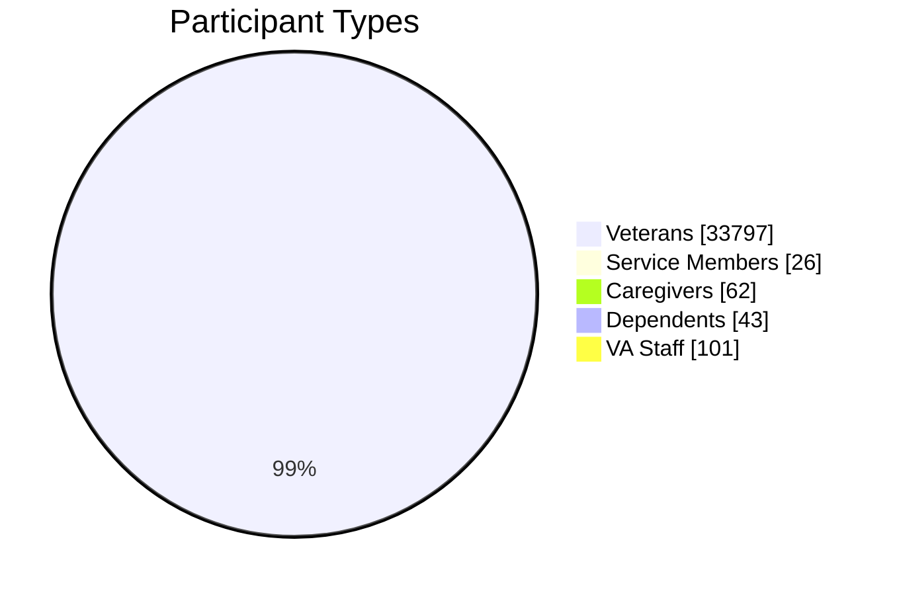
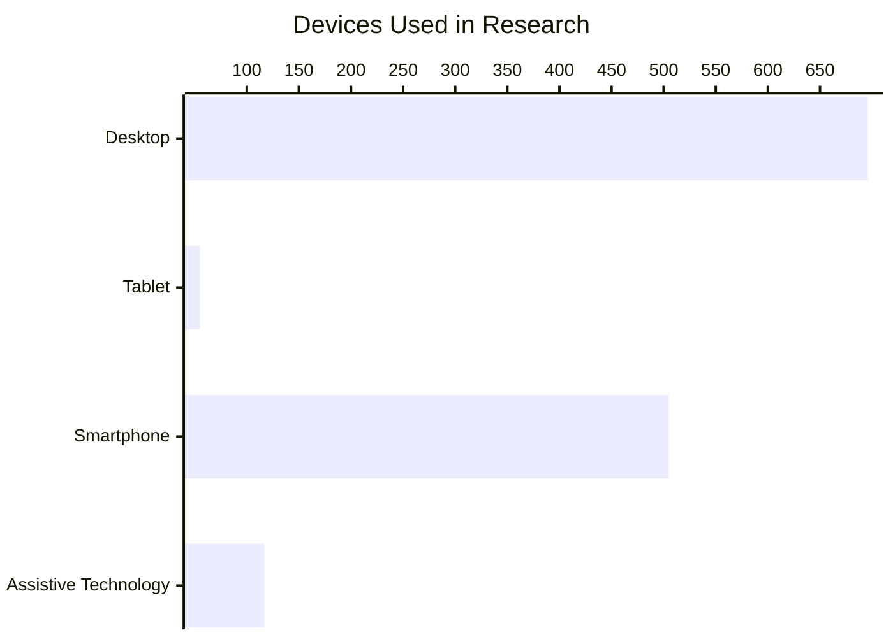
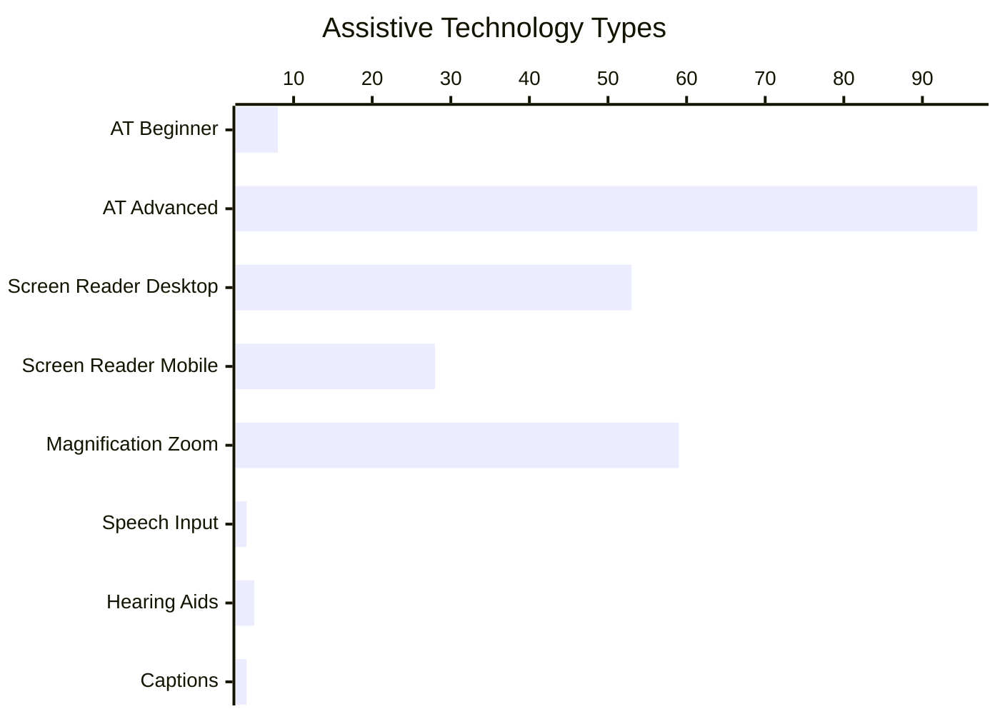
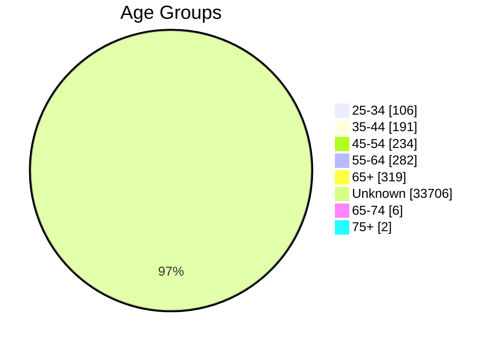
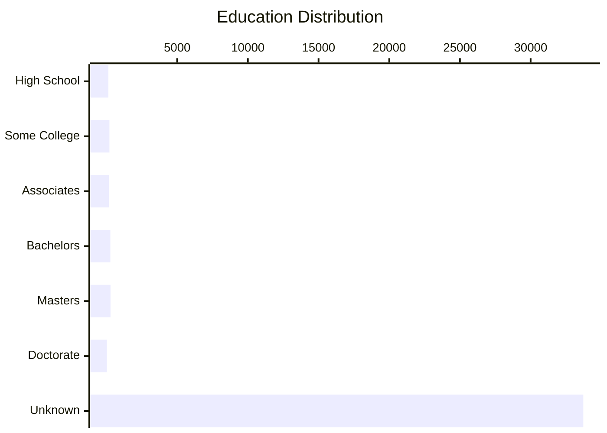
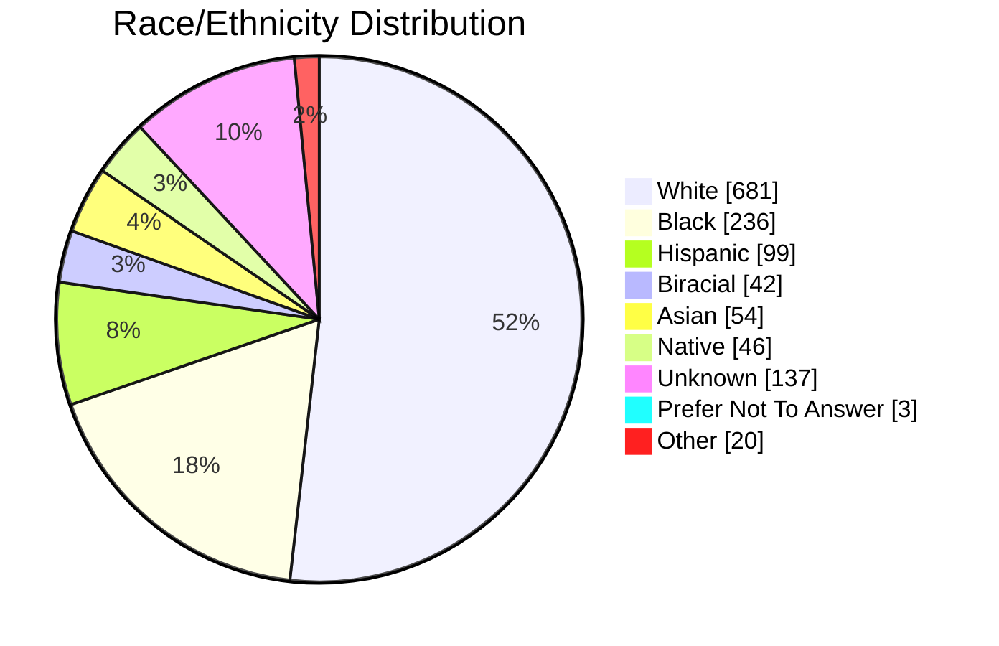

# 📊 Historical Participant Data Report (2017-2025)

> **Report Period:** 2017 - 2025 | **Total Years:** 9
> **Generated:** 2026-02-13T15:01:22.789Z
> 📖 **Purpose:** Comprehensive historical analysis of participant demographics from VA.gov research findings

## 📈 Overview Statistics

| Metric | Value |
|--------|-------|
| 📚 **Total Studies** | 124 |
| 👥 **Total Participants** | 34945 |
| 📅 **Years Covered** | 2017-2025 (9 years with data) |
| ♿ **AT Inclusion Rate** | 32/124 studies (25.8%) |

---
## 📅 Year-by-Year Breakdown

| Year | Studies | Participants | Studies with AT | AT Participants |
|------|---------|--------------|----------------|-----------------|
| 2017 | 2 | 8 | 0 | 0 |
| 2018 | 1 | 4 | 0 | 0 |
| 2019 | 3 | 16 | 0 | 0 |
| 2020 | 6 | 61 | 0 | 0 |
| 2021 | 13 | 31669 | 0 | 0 |
| 2022 | 18 | 236 | 7 | 19 |
| 2023 | 11 | 216 | 4 | 15 |
| 2024 | 44 | 1470 | 14 | 66 |
| 2025 | 26 | 1265 | 7 | 40 |

---
## 👥 Participant Types (Overall)

View detailed breakdown

| Type | Count | Percentage | Distribution |
|------|------:|------------|--------------|
| Veterans | 33797 | 99.3% | ███████████████ |
| Service Members | 26 | 0.1% | ░░░░░░░░░░░░░░░ |
| Caregivers | 62 | 0.2% | ░░░░░░░░░░░░░░░ |
| Dependents | 43 | 0.1% | ░░░░░░░░░░░░░░░ |
| VA Staff | 101 | 0.3% | ░░░░░░░░░░░░░░░ |

---
## 💻 Devices Used

| Device | Count | Percentage | Distribution |
|--------|------:|------------|--------------|
| Desktop | 696 | 50.7% | ████████░░░░░░░ |
| Tablet | 55 | 4.0% | █░░░░░░░░░░░░░░ |
| Smartphone | 505 | 36.8% | ██████░░░░░░░░░ |
| Assistive Technology | 117 | 8.5% | █░░░░░░░░░░░░░░ |

---
## ♿ Assistive Technology Inclusion

| Metric | Value |
|--------|-------|
| Studies with AT Users | **32** of 124 (25.8%) |
| Total AT Participants | **140** |

### AT Types Used

---
## 📅 Age Distribution

View detailed breakdown

| Age Group | Count | Percentage | Distribution |
|-----------|------:|------------|--------------|
| 25-34 | 106 | 0.3% | ░░░░░░░░░░░░░░░ |
| 35-44 | 191 | 0.5% | ░░░░░░░░░░░░░░░ |
| 45-54 | 234 | 0.7% | ░░░░░░░░░░░░░░░ |
| 55-64 | 282 | 0.8% | ░░░░░░░░░░░░░░░ |
| 65+ | 319 | 0.9% | ░░░░░░░░░░░░░░░ |
| unknown | 33706 | 96.7% | ███████████████ |
| 65-74 | 6 | 0.0% | ░░░░░░░░░░░░░░░ |
| 75+ | 2 | 0.0% | ░░░░░░░░░░░░░░░ |

---
## 🎓 Education Levels

View detailed breakdown

| Education Level | Count | Percentage | Distribution |
|-----------------|------:|------------|--------------|
| High School | 134 | 0.4% | ░░░░░░░░░░░░░░░ |
| Some College | 210 | 0.6% | ░░░░░░░░░░░░░░░ |
| Associates | 183 | 0.5% | ░░░░░░░░░░░░░░░ |
| Bachelors | 274 | 0.8% | ░░░░░░░░░░░░░░░ |
| Masters | 284 | 0.8% | ░░░░░░░░░░░░░░░ |
| Doctorate | 31 | 0.1% | ░░░░░░░░░░░░░░░ |
| Unknown | 33725 | 96.8% | ███████████████ |

---
## 🗺️ Geographic Location

| Location | Count | Percentage | Distribution |
|----------|------:|------------|--------------|
| 🏙️ Urban | 451 | 1.3% | ░░░░░░░░░░░░░░░░░░░░ |
| 🌾 Rural | 286 | 0.8% | ░░░░░░░░░░░░░░░░░░░░ |
| ❓ Unknown | 34100 | 97.9% | ████████████████████ |

---
## 🌍 Race/Ethnicity

View detailed breakdown

| Race/Ethnicity | Count | Percentage | Distribution |
|----------------|------:|------------|--------------|
| White | 681 | 51.7% | ████████░░░░░░░ |
| Black | 236 | 17.9% | ███░░░░░░░░░░░░ |
| Hispanic | 99 | 7.5% | █░░░░░░░░░░░░░░ |
| Biracial | 42 | 3.2% | ░░░░░░░░░░░░░░░ |
| Asian | 54 | 4.1% | █░░░░░░░░░░░░░░ |
| Native | 46 | 3.5% | █░░░░░░░░░░░░░░ |
| Unknown | 137 | 10.4% | ██░░░░░░░░░░░░░ |
| Prefer Not To Answer | 3 | 0.2% | ░░░░░░░░░░░░░░░ |
| Other | 20 | 1.5% | ░░░░░░░░░░░░░░░ |

---
## ♿ Disability & Accessibility Details

| Category | Count | Distribution |
|----------|------:|--------------|
| Cognitive | 203 | ███████████████ |
| AT Beginner | 8 | █░░░░░░░░░░░░░░ |
| AT Advanced | 97 | ███████░░░░░░░░ |
| Screen Reader Desktop | 53 | ████░░░░░░░░░░░ |
| Screen Reader Mobile | 28 | ██░░░░░░░░░░░░░ |
| Magnification Zoom | 59 | ████░░░░░░░░░░░ |
| Speech Input | 4 | ░░░░░░░░░░░░░░░ |
| Hearing Aids | 5 | ░░░░░░░░░░░░░░░ |
| Captions | 4 | ░░░░░░░░░░░░░░░ |
| Unknown | 58 | ████░░░░░░░░░░░ |

---
## 📋 Appendix: Studies Included

View all 124 studies

| Study | Date | Year | Participants |
|-------|------|------|-------------:|
| [FMP Claims Content Comprehension Study Research...](https://github.com/department-of-veterans-affairs/va.gov-team/blob/master/products/health-care/foreign-medical-program/10-7959f-2/research/2025-10-FMP-Claims-Direct-Deposit-Content-Study/research-findings.md) | 2025-12-04 | 2025 | 8 |
| [Veteran Onboarding Modal Research Findings](https://github.com/department-of-veterans-affairs/va.gov-team/blob/master/products/veteran-onboarding/research/2025-study/research-findings.md) | 2025-11-24 | 2025 | 16 |
| [Forms MVP Usability Study 2 - Assistive Technol...](https://github.com/department-of-veterans-affairs/va.gov-team/blob/master/products/va-mobile-app/research/Forms%20MVP%20Research/research-findings-AT-study2.md) | 2025-10-22 | 2025 | 10 |
| [Calculator Detail Page Line Chart Testing Resea...](https://github.com/department-of-veterans-affairs/va.gov-team/blob/master/products/health-care/clinical-decision-support/medical-calculators/research/2025-09-Calculator-Detail-Page-Line-Chart-Testing/research-findings.md) | 2025-10-02 | 2025 | 5 |
| [Intent to File Content Study Research Findings](https://github.com/department-of-veterans-affairs/va.gov-team/blob/master/products/pension/research/2025-09%20Intent%20to%20File%20Unmoderated%20Study/research-findings.md) | 2025-09-25 | 2025 | 20 |
| [Save in Progress Usability Research Findings](https://github.com/department-of-veterans-affairs/va.gov-team/blob/master/teams/digital-experience/ADE/research/2025-05-save-in-progress/research-findings.md) | 2025-09-15 | 2025 | 11 |
| [Forms MVP Usability Study Research Findings](https://github.com/department-of-veterans-affairs/va.gov-team/blob/master/products/va-mobile-app/research/Forms%20MVP%20Research/research-findings.md) | 2025-08-28 | 2025 | 11 |
| [Evidence Request Study Research Findings](https://github.com/department-of-veterans-affairs/va.gov-team/blob/master/products/identity-personalization/my-va/research/2025-08-myva3.0-phase1-usabilitytesting/research-findings.md) | 2025-08-28 | 2025 | 10 |
| [Copilot findings for Auth Experience, My VA 3.0...](https://github.com/department-of-veterans-affairs/va.gov-team/blob/master/products/identity-personalization/my-va/research/2025-08-myva3.0-phase1-usabilitytesting/copilot-findings.md) | 2025-08-28 | 2025 | 9 |
| [Your VA benefit letters and documents Research ...](https://github.com/department-of-veterans-affairs/va.gov-team/blob/master/products/benefit-letters/research/2025-06-Your-VA-benefit-letters-and-documents/research-findings.md) | 2025-08-25 | 2025 | 11 |
| [Continuous Discovery Pilot - Round 1 Research F...](https://github.com/department-of-veterans-affairs/va.gov-team/blob/master/products/dependents/research/2025-08-continuous-discovery-pilot/Round%201/findings.md) | 2025-08-25 | 2025 | 7 |
| [Veteran Transition Experience Research Findings](https://github.com/department-of-veterans-affairs/va.gov-team/blob/master/products/vet-transition-support/research/2025-07-generative-and-user-testing-study/research-findings.md) | 2025-08-15 | 2025 | 28 |
| [VA Form 21P-0969 Usability Study Research Findings](https://github.com/department-of-veterans-affairs/va.gov-team/blob/master/products/pension/research/2025-07%200969%20Usability%20Study/research-findings.md) | 2025-08-15 | 2025 | 7 |
| [Dependent Verification with Picklist Research F...](https://github.com/department-of-veterans-affairs/va.gov-team/blob/master/products/dependents/research/2025-08-dependent-verification-with-picklist/findings.md) | 2025-08-01 | 2025 | 10 |
| [2025-06 New/Increase at Condition Level: Toplin...](https://github.com/department-of-veterans-affairs/va.gov-team/blob/master/products/disability/526ez/research/CC-Team-Research/2025-06%20New%20or%20Increase%20at%20Condition%20Level/Preliminary%20findings%20%26%20Next%20Steps.md) | 2025-07-25 | 2025 | 7 |
| [Medications In Product Education (IPE) A/B/C St...](https://github.com/department-of-veterans-affairs/va.gov-team/blob/master/products/health-care/digital-health-modernization/mhv-to-va.gov/medications/research/2025-06-IPE-ABC-testing/research-findings.md) | 2025-07-10 | 2025 | 227 |
| [Secure Messages Curated List Usability Research...](https://github.com/department-of-veterans-affairs/va.gov-team/blob/master/products/health-care/digital-health-modernization/mhv-to-va.gov/secure-messaging/research/2025-06-curated-list-usability-testing/research-findings.md) | 2025-07-09 | 2025 | 9 |
| [2025-07 - CYOA Task List Early Exploration - Un...](https://github.com/department-of-veterans-affairs/va.gov-team/blob/master/products/health-care/application/va-application/research/2025-06-Task%20List%20and%20Traditional%20Form%20Unmoderated/research-findings.md) | 2025-07-01 | 2025 | 42 |
| [Medications on VA.gov IPE Study Research Findings](https://github.com/department-of-veterans-affairs/va.gov-team/blob/master/products/health-care/digital-health-modernization/mhv-to-va.gov/medications/research/2025-03-IPE-study/research-findings.md) | 2025-05-01 | 2025 | 6 |
| [Multistep task pattern Research Findings](https://github.com/department-of-veterans-affairs/va.gov-team/blob/master/products/health-care/supply-reordering-tool/research/2025-02%20Multistep%20task%20pattern%20research/research-findings.md) | 2025-04-22 | 2025 | 766 |
| [Facility Locator Mobile Map Research - Interim ...](https://github.com/department-of-veterans-affairs/va.gov-team/blob/master/products/facilities/facility-locator/initiatives/2023-2025-search-improvements/research/mobile-map/2025-03-interim-findings.md) | 2025-04-01 | 2025 | 5 |
| [2025-02 Dependent Verification MVP Research Fin...](https://github.com/department-of-veterans-affairs/va.gov-team/blob/master/products/dependents/research/2025-02-dependents-verification-mvp-research/2025-02-dependents-verification-mvp-research-findings.md) | 2025-03-13 | 2025 | 10 |
| [My VA Desk Research for the Authenticated Exper...](https://github.com/department-of-veterans-affairs/va.gov-team/blob/master/products/identity-personalization/my-va/research/2025-03-secondaryresearch/research-findings.md) | 2025-03-01 | 2025 | 0 |
| [My HealtheVet Email Appointment Reminder Conten...](https://github.com/department-of-veterans-affairs/va.gov-team/blob/master/products/vetext/research/2025-01-VEText-MyHealtheVet-email-appointment-reminder-content-research/research-findings.md) | 2025-02-05 | 2025 | 11 |
| [Medical Records on VA.gov Usability Study Round...](https://github.com/department-of-veterans-affairs/va.gov-team/blob/master/products/health-care/digital-health-modernization/mhv-to-va.gov/medical-records/research/2025-01-usability-testing-rd4-at/research-findings.md) | 2025-02-01 | 2025 | 11 |
| [Patient Details Research Findings](https://github.com/department-of-veterans-affairs/va.gov-team/blob/master/products/health-care/clinical-decision-support/platform/research/2025-12-Patient-Details-Testing/research-findings.md) | 2025-01-09 | 2025 | 8 |
| [Appointments Details Card Sort Research Findings](https://github.com/department-of-veterans-affairs/va.gov-team/blob/master/products/health-care/appointments/va-online-scheduling/research/2024-08-appointment-details-card-sort/research-findings.md) | 2024-12-18 | 2024 | 48 |
| [Veteran Transition Support Version 2 User Testi...](https://github.com/department-of-veterans-affairs/va.gov-team/blob/master/products/vet-transition-support/research/2024-10-user-testing-v2/research-findings.md) | 2024-12-12 | 2024 | 12 |
| [Burial VSOs Research Findings](https://github.com/department-of-veterans-affairs/va.gov-team/blob/master/products/burials-memorials/burial-allowance/research/2024-09-VSO-Research/research-findings.md) | 2024-12-09 | 2024 | 6 |
| [Medical Records, Secure Messages, and Medicatio...](https://github.com/department-of-veterans-affairs/va.gov-team/blob/master/products/health-care/digital-health-modernization/mhv-to-va.gov/medical-records/research/2024-11-MR-SM-RX-usability-study/research-findings.md) | 2024-12-09 | 2024 | 12 |
| [VSO Research Findings](https://github.com/department-of-veterans-affairs/va.gov-team/blob/master/products/pension/research/2024-09%20527EZ%20VSO%20Research/research-findings.md) | 2024-12-04 | 2024 | 6 |
| [Intent to File Comprehension - Research Findings](https://github.com/department-of-veterans-affairs/va.gov-team/blob/master/products/pension/research/2024-10%20Intent%20to%20File%20Comprehension/research-findings.md) | 2024-12-02 | 2024 | 7 |
| [Document Status Research Findings](https://github.com/department-of-veterans-affairs/va.gov-team/blob/master/products/claim-appeal-status/research/2024-11-Document-Status/research-findings.md) | 2024-11-20 | 2024 | 8 |
| [Discharge Upgrade Wizard Usability Testing Rese...](https://github.com/department-of-veterans-affairs/va.gov-team/blob/master/products/veteran-military-records/discharge-upgrade-wizard/research/2024-Review-Flow/research-findings.md) | 2024-11-14 | 2024 | 10 |
| [Historical Findings on 10-10CG Signatures and S...](https://github.com/department-of-veterans-affairs/va.gov-team/blob/master/products/caregivers/research/11-2024%20-%20Historical%20findings%20on%20Signature%20and%20Save%20In-progress.md) | 2024-11-01 | 2024 | 0 |
| [Version 1 User Testing Research Findings](https://github.com/department-of-veterans-affairs/va.gov-team/blob/master/products/vet-transition-support/research/2024-07-user-testing-v1/research-findings.md) | 2024-11-01 | 2024 | 12 |
| [2024-10 Caregiver Study Research Findings](https://github.com/department-of-veterans-affairs/va.gov-team/blob/master/products/caregivers/research/2024-09-%20Caregivers%20Study%20-%20form%20content%20and%20user%20interviews/research-findings.md) | 2024-11-01 | 2024 | 21 |
| [Medical Records on VA.gov Findability Study Res...](https://github.com/department-of-veterans-affairs/va.gov-team/blob/master/products/health-care/digital-health-modernization/mhv-to-va.gov/medical-records/research/2024-10-findability-study/research-findings.md) | 2024-11-01 | 2024 | 12 |
| [Benefits Discovery Tool V1 SME and VSO User Tes...](https://github.com/department-of-veterans-affairs/va.gov-team/blob/master/products/vet-transition-support/research/2024-07-user-testing-v1/v1-sme-vso-user-testing-research-findings.md) | 2024-10-31 | 2024 | 7 |
| [VHA Debt Portal Payment History Usability and C...](https://github.com/department-of-veterans-affairs/va.gov-team/blob/master/products/combined_va_debt_portal/payment-history/research/2024-9-copay-usability/research-findings.md) | 2024-10-11 | 2024 | 10 |
| [Community Care Self-Scheduling Research Present...](https://github.com/department-of-veterans-affairs/va.gov-team/blob/master/products/health-care/appointments/va-online-scheduling/initiatives/community-care-direct-scheduling/research/2024-06%20Community%20Care%20Self-Scheduling%20-%20Usability%20and%20Concept%20Testing/findings-presentation.md) | 2024-10-03 | 2024 | 0 |
| [Research Findings for AR Team, VSO - VA Benefit...](https://github.com/department-of-veterans-affairs/va.gov-team/blob/master/products/accredited-representation-management/research/2024-10-VSO-VAbenefits-interviews/research-findings.md) | 2024-10-01 | 2024 | 9 |
| [Development Letter Experience and 5103 Notice I...](https://github.com/department-of-veterans-affairs/va.gov-team/blob/master/products/claim-appeal-status/research/2024-07-Development-Letters/research-findings.md) | 2024-09-10 | 2024 | 13 |
| [Medical Records on VA.gov Usability Study Round...](https://github.com/department-of-veterans-affairs/va.gov-team/blob/master/products/health-care/digital-health-modernization/mhv-to-va.gov/medical-records/research/2024-08-usability-testing-rd3-at/research-findings.md) | 2024-09-01 | 2024 | 18 |
| [Community Care Self-Scheduling - Usability and ...](https://github.com/department-of-veterans-affairs/va.gov-team/blob/master/products/health-care/appointments/va-online-scheduling/initiatives/community-care-direct-scheduling/research/2024-06%20Community%20Care%20Self-Scheduling%20-%20Usability%20and%20Concept%20Testing/research-findings.md) | 2024-08-29 | 2024 | 15 |
| [Appointments Oracle Health Integration and Sche...](https://github.com/department-of-veterans-affairs/va.gov-team/blob/master/products/health-care/appointments/va-online-scheduling/research/2024-05-oh-scheduling/research-findings.md) | 2024-08-12 | 2024 | 13 |
| [ARM Team Appoint a Representative Cross-Accredi...](https://github.com/department-of-veterans-affairs/va.gov-team/blob/master/products/accredited-representation-management/research/2024-08-ARM-appointarep-crossaccreditedVSOR-usertest/research-findings.md) | 2024-08-01 | 2024 | 8 |
| [526 Submission Status Research Findings](https://github.com/department-of-veterans-affairs/va.gov-team/blob/master/products/disability/526ez/research/2024-07-Submission-Status/Research-findings.md) | 2024-07-29 | 2024 | 8 |
| [VBA Debt Portal Payment History Study - Usabili...](https://github.com/department-of-veterans-affairs/va.gov-team/blob/master/products/combined_va_debt_portal/payment-history/research/2024-6-overpayment-usability/research-findings.md) | 2024-07-16 | 2024 | 9 |
| [VA Mobile App Personalized Home Screen Evaluati...](https://github.com/department-of-veterans-affairs/va.gov-team/blob/master/products/va-mobile-app/research/ux/personalized-homescreen/2024-04%20evaluative%20research/personalized%20home%20screen%20-%20findings.md) | 2024-07-03 | 2024 | 13 |
| [June 2024 Medallia Findings Summary](https://github.com/department-of-veterans-affairs/va.gov-team/blob/master/products/home-page/research/2024-medallia-feedback/findings-summary.md) | 2024-06-30 | 2024 | 743 |
| [MHV on VA.gov Medications Usability Testing Rou...](https://github.com/department-of-veterans-affairs/va.gov-team/blob/master/products/health-care/digital-health-modernization/mhv-to-va.gov/medications/research/2024-05-medications-usability-testing-round3-AT/research-findings.md) | 2024-06-10 | 2024 | 13 |
| [Medical Records on VA.gov Usability Study Round...](https://github.com/department-of-veterans-affairs/va.gov-team/blob/master/products/health-care/digital-health-modernization/mhv-to-va.gov/medical-records/research/2024-03-usability-testing-rd2-at/research-findings.md) | 2024-06-10 | 2024 | 25 |
| [ARM Team Appoint a Representative Digital Submi...](https://github.com/department-of-veterans-affairs/va.gov-team/blob/master/products/accredited-representation-management/research/2024-06-ARM-appointarep-digitalsubmit-usertest/research-findings.md) | 2024-06-01 | 2024 | 7 |
| [2024 Medallia Feedback - Outreach and Events Fi...](https://github.com/department-of-veterans-affairs/va.gov-team/blob/master/products/outreach-events/research/2024-Medallia-feedback/findings-summary.md) | 2024-05-17 | 2024 | 189 |
| [Transition Experience Interview Research Findings](https://github.com/department-of-veterans-affairs/va.gov-team/blob/master/products/vet-transition-support/research/2024-02-discovery/research-findings.md) | 2024-05-15 | 2024 | 27 |
| [Unmoderated Content Evaluation for Multiple Fac...](https://github.com/department-of-veterans-affairs/va.gov-team/blob/master/products/health-care/checkin/research/2024-04%20Unmoderated%20Content%20Evaluation%20for%20Multiple%20Facilities%20Selection%20in%20BT%20Oracle%20Health%20App/research-findings.md) | 2024-04-30 | 2024 | 60 |
| [Accredited Representative Management - Veteran ...](https://github.com/department-of-veterans-affairs/va.gov-team/blob/master/products/accredited-representation-management/research/2024-04-ARM-veteran-representative-experience-interviews/research-findings.md) | 2024-04-01 | 2024 | 24 |
| [ARM Team - Find a Representative LIVE User Test...](https://github.com/department-of-veterans-affairs/va.gov-team/blob/master/products/accredited-representation-management/research/2024-03-ARM-findarep-live-usertest/research-findings.md) | 2024-04-01 | 2024 | 11 |
| [Research Findings for 10-10EZ Toxic Exposure Qu...](https://github.com/department-of-veterans-affairs/va.gov-team/blob/master/products/health-care/application/va-application/research/2024-04-ToxicExposure-UsabilityStudy/research-findings.md) | 2024-04-01 | 2024 | 7 |
| [Usability Test of VA Pension Benefits (527EZ) w...](https://github.com/department-of-veterans-affairs/va.gov-team/blob/master/products/pension/research/2024%2002%20Pension%20Usability%20Evaluation/research-findings.md) | 2024-03-24 | 2024 | 10 |
| [Federal Standardized Header/Footer Usability Te...](https://github.com/department-of-veterans-affairs/va.gov-team/blob/master/products/header-footer/initiatives/2024-federal-standardized-header-footer/research/research-findings-phases1%262.md) | 2024-03-06 | 2024 | 19 |
| [MHV on VA.gov Medications Findability Study Res...](https://github.com/department-of-veterans-affairs/va.gov-team/blob/master/products/health-care/digital-health-modernization/mhv-to-va.gov/medications/research/2024-02-findability-study/research-findings.md) | 2024-03-04 | 2024 | 18 |
| [ARM Team - Appoint a Representative Form User T...](https://github.com/department-of-veterans-affairs/va.gov-team/blob/master/products/accredited-representation-management/research/2024-02-appointarep-unauth-usertest/research-findings.md) | 2024-03-01 | 2024 | 8 |
| [Preliminary Form Improvements: Form 10-7959f-1 ...](https://github.com/department-of-veterans-affairs/va.gov-team/blob/master/products/health-care/foreign-medical-program/10-7959f-1/research/users/2024-03-preliminary-research-findings.md) | 2024-03-01 | 2024 | 0 |
| [Combined VA Debt Portal Exploratory Research Fi...](https://github.com/department-of-veterans-affairs/va.gov-team/blob/master/products/combined_va_debt_portal/research/exploratory-2024/research-findings.md) | 2024-02-28 | 2024 | 9 |
| [Claim Contextualization Research Findings](https://github.com/department-of-veterans-affairs/va.gov-team/blob/master/products/claim-appeal-status/research/2023-10-Claim-Contextualization/research-findings.md) | 2024-02-05 | 2024 | 15 |
| [Analytics Findings for ARM Team](https://github.com/department-of-veterans-affairs/va.gov-team/blob/master/products/accredited-representation-management/research/2023-12-ARM-analytics/research-findings.md) | 2024-02-01 | 2024 | 0 |
| [SEP Audit Findings - Current State Analysis](https://github.com/department-of-veterans-affairs/va.gov-team/blob/master/products/accredited-representative-facing/research/2024-01%20Current%20State%20Analysis/SEP-audit-findings.md) | 2024-01-01 | 2024 | 0 |
| [ARM Team - Authenticated Appoint a Representati...](https://github.com/department-of-veterans-affairs/va.gov-team/blob/master/products/accredited-representation-management/research/2024-01-ARM-appointarep-usertest/research-findings.md) | 2024-01-01 | 2024 | 8 |
| [Find a Representative User Test Research Findings](https://github.com/department-of-veterans-affairs/va.gov-team/blob/master/products/accredited-representation-management/research/2023-11-ARM-findarep-nav-usertest/research-findings.md) | 2023-12-01 | 2023 | 8 |
| [11-2023 Family benefit hub Research Findings](https://github.com/department-of-veterans-affairs/va.gov-team/blob/master/products/content/audience-hubs/family-member-hub/research/11-2023-family-hub-research-findings.md) | 2023-11-30 | 2023 | 41 |
| [PACT Act Wizard Usability Testing - Research Fi...](https://github.com/department-of-veterans-affairs/va.gov-team/blob/master/products/pact-act-wizard/research/2023-2024-launch/research-findings.md) | 2023-11-01 | 2023 | 9 |
| [MHV Secure Messaging - Accessibility Research F...](https://github.com/department-of-veterans-affairs/va.gov-team/blob/master/products/health-care/digital-health-modernization/mhv-to-va.gov/secure-messaging/research/2023-09-usability-round3-phase0/2023-Sept-Oct-Secure-Messaging-accessibility-findings.md) | 2023-10-31 | 2023 | 4 |
| [Patient Check In (PCI): Travel Reimbursement Re...](https://github.com/department-of-veterans-affairs/va.gov-team/blob/master/products/health-care/checkin/research/2022-12%20Patient%20Check%20In%20Travel%20Reimbursement%20Veteran%20Intercept%20at%20Wilkes-Barre/research-findings.md) | 2023-08-08 | 2023 | 41 |
| [Patient Check In (PCI): Travel Reimbursement Re...](https://github.com/department-of-veterans-affairs/va.gov-team/blob/master/products/health-care/checkin/research/2022-12%20Patient%20Check%20In%20Travel%20Reimbursement%20Staff%20Interviews%20at%20Wilkes-Barre/research-findings.md) | 2023-08-08 | 2023 | 41 |
| [Evidence Submission Usability Testing Research ...](https://github.com/department-of-veterans-affairs/va.gov-team/blob/master/products/claim-appeal-status/research/2023-05-Evidence-Submission/research-findings.md) | 2023-06-01 | 2023 | 10 |
| [CST Initial Decisions Research Findings](https://github.com/department-of-veterans-affairs/va.gov-team/blob/master/products/claim-appeal-status/research/2023-03-Initial-Decisions-CST/research-findings.md) | 2023-04-19 | 2023 | 16 |
| [My VA 2023 Audit Usability Testing Research Fin...](https://github.com/department-of-veterans-affairs/va.gov-team/blob/master/products/identity-personalization/my-va/2022-audit/research/MyVA-audit-research-findings.md) | 2023-03-03 | 2023 | 13 |
| [Decision Reviews Research Findings](https://github.com/department-of-veterans-affairs/va.gov-team/blob/master/products/claim-appeal-status/research/2022-11-Decision-Reviews/research-findings.md) | 2023-02-01 | 2023 | 25 |
| [VA Mobile App Blind and Low Vision Usability St...](https://github.com/department-of-veterans-affairs/va.gov-team/blob/master/products/va-mobile-app/research/ux/blind-low-vision/2022-11-Blind-Low-vision/Research-findings.md) | 2023-01-11 | 2023 | 8 |
| [VBA Public Contact Staff Research Findings](https://github.com/department-of-veterans-affairs/va.gov-team/blob/master/products/facilities/regional-offices/research/2022-9-public-contact/research-findings.md) | 2022-12-23 | 2022 | 12 |
| [Secure Messaging Round 2 Usability Testing Rese...](https://github.com/department-of-veterans-affairs/va.gov-team/blob/master/products/health-care/digital-health-modernization/mhv-to-va.gov/secure-messaging/research/2022-09-usability_testing_2/research-findings.md) | 2022-12-09 | 2022 | 17 |
| [Login.gov Adoption Discovery Research Findings](https://github.com/department-of-veterans-affairs/va.gov-team/blob/master/products/login.gov-adoption/discovery/research/2022-10-Login.gov-Adoption-Discovery-Research/login.gov%20adoption%20discovery%20research%20findings.md) | 2022-11-23 | 2022 | 36 |
| [VA.gov Home Page Redesign Round 2 Usability Tes...](https://github.com/department-of-veterans-affairs/va.gov-team/blob/master/products/home-page/research/2022-09-redesign-usability-round2/research-findings.md) | 2022-11-16 | 2022 | 11 |
| [How Disabled Veterans Provide Accessibility Fee...](https://github.com/department-of-veterans-affairs/va.gov-team/blob/master/teams/digital-experience/ADE/research/2022-10-a11y-feedback/research-findings.md) | 2022-10-31 | 2022 | 0 |
| [How Disabled Veterans Provide Accessibility Fee...](https://github.com/department-of-veterans-affairs/va.gov-team/blob/master/teams/_archive/shared-support/accessibility/research/2022-10-a11y-feedback/research-findings.md) | 2022-10-31 | 2022 | 0 |
| [Appointment List Usability Research Findings](https://github.com/department-of-veterans-affairs/va.gov-team/blob/master/products/health-care/appointments/va-online-scheduling/research/2022-09-appts-list-usability/research-findings.md) | 2022-10-31 | 2022 | 10 |
| [Patient Check In ID Verification - SSN4 Text In...](https://github.com/department-of-veterans-affairs/va.gov-team/blob/master/products/health-care/checkin/research/2022-10%20Patient%20Check%20In%20ID%20Verification%20-%20SSN4%20Text%20Input%20vs.%20Date%20of%20Birth%20(DoB)%20Memorable%20Date%20Comparison/research-findings.md) | 2022-10-21 | 2022 | 0 |
| [Veteran Facing VBA Research Findings](https://github.com/department-of-veterans-affairs/va.gov-team/blob/master/products/facilities/regional-offices/research/2022-8-veteran-facing/research-findings.md) | 2022-10-17 | 2022 | 12 |
| [Medical Records Discovery Research Findings](https://github.com/department-of-veterans-affairs/va.gov-team/blob/master/products/health-care/digital-health-modernization/mhv-to-va.gov/medical-records/research/2022-09-informational-interviews/research-findings.md) | 2022-10-03 | 2022 | 16 |
| [Decision Letter Download: Research Findings](https://github.com/department-of-veterans-affairs/va.gov-team/blob/master/products/claim-appeal-status/research/2022-08-Decision-Letter-Download/research-findings.md) | 2022-09-29 | 2022 | 10 |
| [Self-Service Login Tool Research Findings](https://github.com/department-of-veterans-affairs/va.gov-team/blob/master/products/platform/login-self-service-tool/research/2022-Q3/research-findings.md) | 2022-08-16 | 2022 | 12 |
| [Veteran Top Tasks Unmoderated Survey Findings](https://github.com/department-of-veterans-affairs/va.gov-team/blob/master/teams/digital-experience/public-websites-2020-2022/research/Veteran-tasks/unmoderated/research-findings.md) | 2022-07-08 | 2022 | 55 |
| [Combined Debt Portal Research Findings](https://github.com/department-of-veterans-affairs/va.gov-team/blob/master/products/combined_va_debt_portal/research/usability-apr-2022/research-findings.md) | 2022-07-07 | 2022 | 11 |
| [10-10 applications team, Usability research of ...](https://github.com/department-of-veterans-affairs/va.gov-team/blob/master/products/health-care/application/va-application/research/2022-06-Short%20form%20usability/research-findings.md) | 2022-06-23 | 2022 | 10 |
| [Veteran Top Tasks Moderated Research Findings](https://github.com/department-of-veterans-affairs/va.gov-team/blob/master/teams/digital-experience/public-websites-2020-2022/research/Veteran-tasks/moderated/research-findings.md) | 2022-06-03 | 2022 | 7 |
| [2022 VA Mobile Appointment Request Research Fin...](https://github.com/department-of-veterans-affairs/va.gov-team/blob/master/products/va-mobile-app/research/ux/appointments/2022-04-Appointment-Scheduling/research-findings.md) | 2022-05-31 | 2022 | 8 |
| [Appointments List Research Findings](https://github.com/department-of-veterans-affairs/va.gov-team/blob/master/products/health-care/appointments/va-online-scheduling/research/2022-01-mhv-and-vaos-appts-list-discovery/research-findings.md) | 2022-02-28 | 2022 | 9 |
| [Outreach & Events Usability Research Findings](https://github.com/department-of-veterans-affairs/va.gov-team/blob/master/products/outreach-events/research/2021-filtering-recurring-events/research-findings.md) | 2021-12-16 | 2021 | 8 |
| [Requests discovery - report Research Findings](https://github.com/department-of-veterans-affairs/va.gov-team/blob/master/products/health-care/appointments/va-online-scheduling/research/2021-11-request-clarification-research/research-findings.md) | 2021-11-01 | 2021 | 8 |
| [Usability research of shortened form based on d...](https://github.com/department-of-veterans-affairs/va.gov-team/blob/master/products/health-care/application/va-application/research/2021-11-short-form-usability/topline-summary-research%20findings.md) | 2021-11-01 | 2021 | 0 |
| [Search Design Concepts Usability Research Findings](https://github.com/department-of-veterans-affairs/va.gov-team/blob/master/products/on-site-search/research/user-research/2021-Aug-research-study/research-findings.md) | 2021-09-27 | 2021 | 7 |
| [Caregiver, Usability research of shortened form...](https://github.com/department-of-veterans-affairs/va.gov-team/blob/master/products/health-care/application/va-application/research/2021-09-Flow%20Research/research-findings.md) | 2021-09-17 | 2021 | 14 |
| [Facility Selection Variant Test - Research Find...](https://github.com/department-of-veterans-affairs/va.gov-team/blob/master/products/health-care/appointments/va-online-scheduling/research/2021-08-facilities-ab-test/research-findings.md) | 2021-08-23 | 2021 | 31572 |
| [Check-in MVP Usability Research Findings](https://github.com/department-of-veterans-affairs/va.gov-team/blob/master/products/health-care/checkin/research/veteran-facing/mvp-usability/research-findings.md) | 2021-07-01 | 2021 | 10 |
| [Caregiver, 10-10EZ Discovery research findings](https://github.com/department-of-veterans-affairs/va.gov-team/blob/master/products/health-care/application/va-application/research/april-may-2021/end-user-discovery/research%20findings.md) | 2021-05-20 | 2021 | 9 |
| [Profile Your VA Health Facilities Internal Usab...](https://github.com/department-of-veterans-affairs/va.gov-team/blob/master/products/identity-personalization/profile/preferred-facility/research/2021-05-preferred-facilities/internal-usability-study-findings.md) | 2021-05-10 | 2021 | 5 |
| [Check-in Remote Discovery Research Findings](https://github.com/department-of-veterans-affairs/va.gov-team/blob/master/products/health-care/checkin/research/remote-discovery/research-findings.md) | 2021-04-01 | 2021 | 11 |
| [Mobile Experience Research Findings](https://github.com/department-of-veterans-affairs/va.gov-team/blob/master/products/facilities/facility-locator/research/user-research/2021-mobile-experience-research/research-findings.md) | 2021-02-23 | 2021 | 10 |
| [VA.gov Search Research Findings](https://github.com/department-of-veterans-affairs/va.gov-team/blob/master/products/on-site-search/research/user-research/research-study-jan-2021/research-findings.md) | 2021-02-08 | 2021 | 10 |
| [January 2021 VAOS Appointments List Usability S...](https://github.com/department-of-veterans-affairs/va.gov-team/blob/master/products/health-care/appointments/va-online-scheduling/research/2021-01-appts-list-test/research-findings.md) | 2021-01-31 | 2021 | 5 |
| [CC Provider Selection Usability Study Research ...](https://github.com/department-of-veterans-affairs/va.gov-team/blob/master/products/health-care/appointments/va-online-scheduling/research/2020-10-cc-provider-selection-usability/research-findings.md) | 2020-10-31 | 2020 | 11 |
| [CC Provider Selection Usability Study Research ...](https://github.com/department-of-veterans-affairs/va.gov-team/blob/master/products/health-care/appointments/va-online-scheduling/initiatives/community-care-direct-scheduling/research/2020-10-cc-provider-selection-usability/research-findings.md) | 2020-10-31 | 2020 | 11 |
| [VA Online Scheduling: VAOSR and Express Care Re...](https://github.com/department-of-veterans-affairs/va.gov-team/blob/master/products/health-care/appointments/va-online-scheduling/research/2020-07-vaos-mvp-and-express-care-user-research/research-findings.md) | 2020-07-31 | 2020 | 15 |
| [VA Online Scheduling: Express Care Research Fin...](https://github.com/department-of-veterans-affairs/va.gov-team/blob/master/products/health-care/appointments/va-online-scheduling/research/2020-05-express-care-research/research-findings.md) | 2020-05-31 | 2020 | 11 |
| [Address Management Veteran Feedback Research Fi...](https://github.com/department-of-veterans-affairs/va.gov-team/blob/master/products/identity-personalization/profile/contact-information/research/2020-04-address-management/research-findings.md) | 2020-04-30 | 2020 | 8 |
| [Facility Locator Search Expectations Research F...](https://github.com/department-of-veterans-affairs/va.gov-team/blob/master/products/facilities/facility-locator/research/user-research/FL-Search-march2020/research-findings.md) | 2020-03-11 | 2020 | 5 |
| [Urgent Care Usability Study - Research Findings](https://github.com/department-of-veterans-affairs/va.gov-team/blob/master/products/health-care/community-care/urgent-care/research/jun-2019/findings.md) | 2019-06-01 | 2019 | 7 |
| [GI Bill Comparison Tool Non-Veteran Discovery I...](https://github.com/department-of-veterans-affairs/va.gov-team/blob/master/products/education-careers/school-comparison-tool/colmery-act-2019/research/apr-2019/ct-non-veteran-preliminary-findings.md) | 2019-04-01 | 2019 | 4 |
| [Local Nav Research Report - Research Findings](https://github.com/department-of-veterans-affairs/va.gov-team/blob/master/products/information-architecture/research-and-analytics/2019-vamc-navigation/left-nav/research/research-findings.md) | 2019-01-01 | 2019 | 5 |
| [Voc Rehab Usability Testing, Round 2 Research F...](https://github.com/department-of-veterans-affairs/va.gov-team/blob/master/products/education-careers/vocational-rehab/research/mar-2018/march-2018-usability-findings.md) | 2018-03-31 | 2018 | 4 |
| [Rx Tracking and Account Creation Research Findings](https://github.com/department-of-veterans-affairs/va.gov-team/blob/master/products/identity/login/mhv/mhv-account-creation_2017/research/research-findings2.md) | 2017-05-15 | 2017 | 5 |
| [MHV Account Creation Flow Research Findings](https://github.com/department-of-veterans-affairs/va.gov-team/blob/master/products/identity/login/mhv/mhv-account-creation_2017/research/researchfindings.md) | 2017-04-17 | 2017 | 3 |

---
_Historical report generated from research findings spanning 2017-2025_
_Generated on: 2026-02-13_