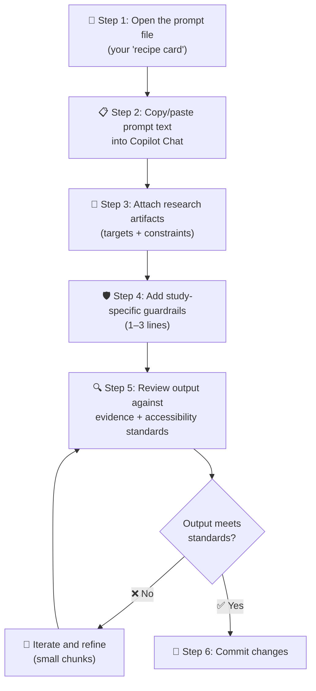
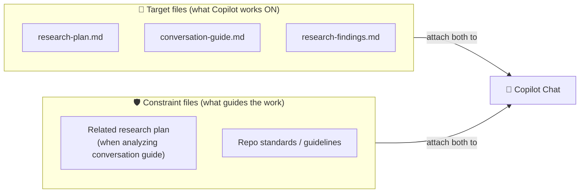
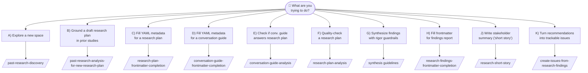
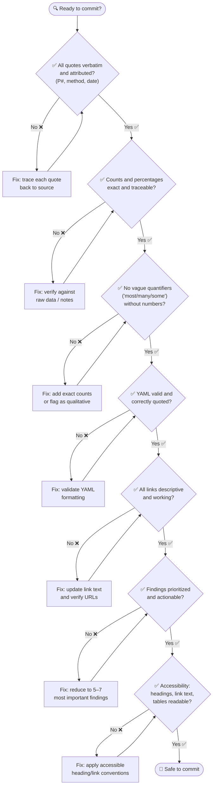

# How to use the VA.gov-team Copilot prompts (GitHub Copilot Chat in browser)

This guide explains how VA.gov researchers and designers can use the Copilot prompt library in **GitHub Copilot Chat (in the browser)** to speed up research discovery, planning, synthesis, reporting, and follow-up—**without compromising research integrity, accessibility, or traceability**.

---

## How to use Copilot Chat in the browser (practical workflow)

### **Default workflow (recommended): start from the prompt file, then attach your artifacts**

In GitHub Copilot Chat (browser), the most consistent way to use this prompt library is to begin at the **prompt location** (so you’re always using the canonical, up-to-date instructions), then attach the files Copilot should analyze.

*Workflow overview — the diagram below shows the recommended 6-step flow. Details for each step follow.*

*Diagram: Recommended 6-step workflow for using the Copilot prompt library. Steps 1–4 set up the session; Step 5 reviews the draft; Step 6 commits only after quality is confirmed. Loop back to Step 5 if the output needs refinement.*

### **Step 1: open the prompt file (your “recipe card”)**

Navigate to the prompt file you want to use (for example):

Research Prompts

#### Past Research
- [Past research analysis for new research plan](https://github.com/department-of-veterans-affairs/va.gov-team/blob/master/platform/research/copilot-prompts/research-discovery/past-research-analysis-for-new-research-plan-prompt.md)
- [Past research discovery](https://github.com/department-of-veterans-affairs/va.gov-team/blob/master/platform/research/copilot-prompts/research-discovery/past-research-discovery-prompt.md)

#### Front matter editing
- [Conversation guide frontmatter completion](https://github.com/department-of-veterans-affairs/va.gov-team/blob/master/platform/research/copilot-prompts/research-planning/conversation-guide-frontmatter-completion-prompt.md)
- [Research plan frontmatter completion](https://github.com/department-of-veterans-affairs/va.gov-team/blob/master/platform/research/copilot-prompts/research-planning/research-plan-frontmatter-completion-prompt.md)
- [Research findings front matter completion](https://github.com/department-of-veterans-affairs/va.gov-team/blob/master/platform/research/copilot-prompts/research-report/research-findings-frontmatter-completion-prompt.md)

#### Research plan & Conversation guide analysis
- [Research plan analysis](https://github.com/department-of-veterans-affairs/va.gov-team/blob/master/platform/research/copilot-prompts/research-review/research-plan-analysis-prompt.md) 
- [Conversation guide analysis](https://github.com/department-of-veterans-affairs/va.gov-team/blob/master/platform/research/copilot-prompts/research-review/conversation-guide-analysis-prompt.md)

#### Post-research
- [Research short story](https://github.com/department-of-veterans-affairs/va.gov-team/blob/master/platform/research/copilot-prompts/research-report/research-short-story-prompt.md)
- [Create issues from research findings](https://github.com/department-of-veterans-affairs/va.gov-team/blob/master/platform/research/copilot-prompts/research-report/create-issues-from-research-findings-prompt.md)
- [Synthesis guidelines](https://github.com/department-of-veterans-affairs/va.gov-team/blob/master/platform/research/synthesis/copilot-ux-research-synthesis-guidelines.md)  

Open Copilot Chat from that page.

### **Step 2: copy/paste the prompt text into Copilot Chat**

These prompt files are stored instructions. Copilot will not reliably “run” a prompt just because the file exists in the repo.

To use a prompt:

1. Scroll to the **Prompt** section in the prompt file  
2. Copy the full prompt text (often inside a fenced code block)  
3. Paste it into Copilot Chat

**Tip:** Paste the prompt first so you can see what inputs it expects before you attach files.

### **Step 3: attach the research artifacts Copilot should use (targets \+ constraints)**

Attach the file Copilot should operate on (the “target”), plus any related materials that should constrain the response.

**Common targets**

- Research plan (`research-plan.md`)  
- Conversation guide  
- Research findings report

**Common constraints (attach when the prompt calls for it)**

- Related research plan (when analyzing a conversation guide)  
- Any repo standards or guidelines that must be followed

**Rule of thumb:** If you want Copilot to use it, attach it. Don’t assume it will search or infer.

*Diagram: Attach a target file (what Copilot should work on) and one or more constraint files (what should guide the output). If you want Copilot to use a file, attach it explicitly.*

### **Step 4: add study-specific guardrails (1–3 lines)**

Even if the prompt already includes guardrails, add a few constraints specific to your study. For example:

- “Do not invent quotes, counts, or links. If missing, write `Not specified` and ask clarifying questions.”  
- “Use only evidence contained in the attached artifacts.”  
- “Use plain language and accessible headings; avoid jargon.”

### **Step 5: review the output against evidence \+ accessibility standards**

Copilot output is always a draft. Before committing or publishing, verify:

- quotes are verbatim and attributed  
- counts and percentages are exact and traceable  
- no fabricated links or “helpful guesses”  
- headings, link text, and tables are accessible and readable

### **Step 6: iterate in small chunks**

Instead of generating an entire deliverable in one go, run prompts section-by-section:

- frontmatter  
- goals/questions  
- methodology  
- key findings  
- details per finding  
- recommendations  
- outcomes/KPIs  
- next steps  
- research gaps  
- appendix/links

---

## Quick start decision tree (pick the right prompt)

Use this “if you are here, do this” flow to choose a prompt quickly.

*Diagram: Decision tree — find your current task on the left, then follow the arrow to the prompt file name on the right. Full details and attachment requirements for each option are in the sections below.*

### **1\) What are you trying to do right now?**

#### **A) “I’m new to this space and need to find what already exists.”**

Use:

- `research-discovery/past-research-discovery-prompt.md`

Then ask a follow-up:

- “List the top 5–10 most relevant links and explain why each is relevant.”

---

#### **B) “I already drafted a research plan and want it grounded in prior studies.”**

Use:

- `research-discovery/past-research-analysis-for-new-research-plan-prompt.md`

Attach:

- Your draft research plan file (required)

Then ask a follow-up:

- “Map each linked prior study to the research questions or hypotheses it supports.”

---

#### **C) “I’m writing a research plan and need the YAML metadata filled in consistently.”**

Use:

- `research-planning/research-plan-frontmatter-completion-prompt.md`

Attach:

- Your research plan file (required)

After it generates YAML, do:

- Validate YAML formatting  
- Manually verify dates, names, and *every* link

---

#### **D) “I’m writing a conversation guide and need the YAML metadata filled in consistently.”**

Use:

- `research-planning/conversation-guide-frontmatter-completion-prompt.md`

Attach:

- Conversation guide (required)  
- Research plan (recommended; improves tag alignment)

Then do:

- Sanity-check tags: do they reflect what participants will *actually* interact with?

---

#### **E) “I want to check if my conversation guide actually answers my research plan.”**

Use:

- `research-review/conversation-guide-analysis-prompt.md`

Attach:

- Conversation guide (required)  
- Research plan (required)

Accessibility-focused follow-up:

- “What tasks/questions should we add to better assess keyboard-only and screen reader flows?”

---

#### **F) “I want a quality check on my research plan before review / before recruiting.”**

Use:

- `research-review/research-plan-analysis-prompt.md`

Attach:

- Research plan (required)

Feasibility follow-up:

- “Identify top risks in recruitment inclusivity, timeline, and bias—then suggest mitigations.”

---

#### **G) “I’m synthesizing and need guardrails for rigor, prioritization, and evidence.”**

Use as your rubric (not a paste-in prompt):

- `synthesis/copilot-ux-research-synthesis-guidelines.md`

Best Copilot use here:

- prioritization help *after* you provide candidate findings \+ evidence  
- formatting help  
- QA checks (e.g., “flag vague quantifiers,” “check for unsupported claims”)

---

#### **H) “I’m drafting a findings report and need frontmatter metadata completed accurately.”**

Use:

- `research-report/research-findings-frontmatter-completion-prompt.md`

Attach:

- Findings report (required)  
- Research plan \+ conversation guide (recommended if you want consistency, but remember the prompt guardrails about links)

Then do:

- Double-check demographics and device counts (Copilot must not infer)

---

#### **J) “I need a stakeholder-friendly summary (‘short story’) of a report.”**

Use:

- `research-report/research-short-story-prompt.md`

Attach:

- Findings report (required)

Integrity guardrail to add:

- “Use only quotes that appear verbatim in the attached report; otherwise write ‘No direct quote available in report.’”

---

#### **K) “I want to turn recommendations into trackable work.”**

Use:

- `research-report/create-issues-from-research-findings-prompt.md`

Attach:

- Findings report (required)

Then do:

- Create issues **one at a time**  
- Review acceptance criteria for testability and scope

Model note:

- The prompt indicates Claude models may be required for direct issue creation in the workbench; otherwise copy/paste issue text manually.

---

## What these prompts are (and are not)

### **These prompts are good for**

- **Finding** relevant prior work in `va.gov-team` (and linking to it)  
- **Standardizing** metadata and formatting (especially YAML frontmatter)  
- **Converting** structured research outputs into consistent, scannable documentation  
- **Generating** issue drafts from recommendations (with human review)  

### **These prompts are not good for (and should not be used for)**

- Inventing or “filling in” missing data  
- Creating “representative quotes”  
- Estimating participant counts, percentages, or demographics  
- Making causal claims without evidence  
- Replacing synthesis judgment (prioritization, severity, “so what”)

---

## Non-negotiables: evidence \+ quotes \+ accessibility

Two repo docs set the standards you should enforce any time you use Copilot:

- `platform/research/synthesis/copilot-ux-research-synthesis-guidelines.md`  
- `platform/research/synthesis/copilot-ux-research-findings-template-completion-guide.md`

### **Evidence standards to keep top-of-mind**

- **Quotes must be exact, verbatim** and attributable (e.g., `P3`, method, date). No paraphrasing.  
- Track **frequency and severity** with exact counts/percentages where applicable.  
- Prefer **5–7 truly important findings** (or 5–10 in reporting contexts), not exhaustive lists.  
- Clearly separate:  
  - **Observation** (what happened / what participants said)  
  - **Interpretation** (why it might be happening)  
  - **Recommendation** (what to do next)

### **Accessibility standards for deliverables**

When Copilot drafts anything meant to be read by others:

- Use a logical heading hierarchy (`#`, `##`, `###`) for screen reader navigation.  
- Use descriptive link text (avoid “click here”).  
- Use plain language; avoid jargon.  
- If images are referenced, require meaningful alt text and confirm they are real artifacts.

---

## Prompting tips that reduce hallucinations (high value)

Add these lines to the top of prompts when appropriate:

- **Traceability requirement:** “For every claim, include a link or cite the exact section heading it came from.”  
- **Unknowns policy:** “If a field is missing, write `Not specified` and ask a clarification question.”  
- **Quote enforcement:** “Use only quotes that appear verbatim in the attached files; otherwise say ‘No direct quote available.’”  
- **No fabricated links:** “Only include links that already exist in the attached document(s).”

---

## Quick QA checklist (before you commit anything Copilot helped draft)

*Diagram: QA flow — work through each checkpoint top-to-bottom. If a check fails, apply the fix and re-check before moving on. Only commit after all seven checks pass.*

- [ ] All quotes are verbatim and attributed (P\#, method, date).  
- [ ] Counts and percentages are exact (not rounded; not inferred).  
- [ ] No “most/many/some” without numbers (unless explicitly qualitative).  
- [ ] YAML is valid and uses correct quoting/escaping.  
- [ ] Links are descriptive and work.  
- [ ] Findings are prioritized and actionable (not exhaustive).  
- [ ] Accessibility: headings, link text, and tables are readable and navigable.
