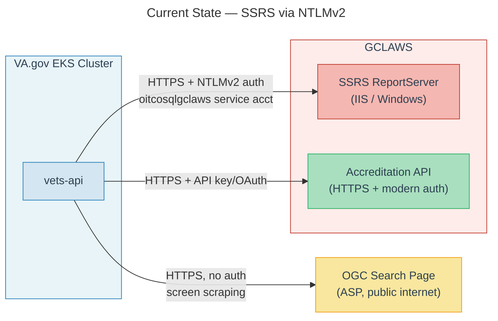
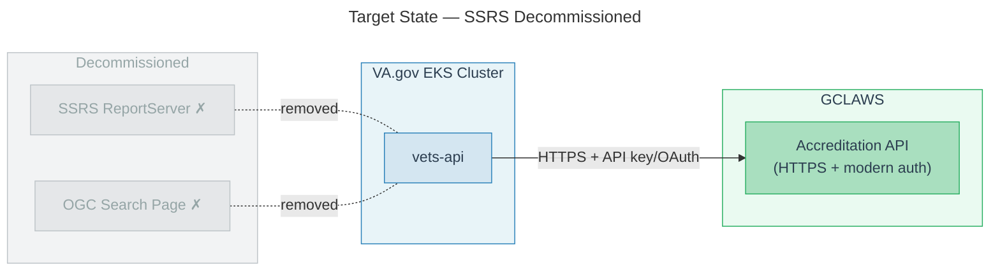

```mermaid
---
title: Current State — SSRS via NTLMv2
---
flowchart LR
    subgraph EKS["VA.gov EKS Cluster"]
        A["vets-api"]
    end

    subgraph GCLAWS["GCLAWS"]
        B["SSRS ReportServer<br>(IIS / Windows)"]
        D["Accreditation API<br>(HTTPS + modern auth)"]
    end

    E["OGC Search Page<br>(ASP, public internet)"]

    A -- "HTTPS + NTLMv2 auth<br>oitcosqlgclaws service acct" --> B
    A -- "HTTPS, no auth<br>screen scraping" --> E
    A -- "HTTPS + API key/OAuth" --> D

    style EKS fill:#e8f4f8,stroke:#2980b9,color:#2c3e50
    style GCLAWS fill:#fdecea,stroke:#c0392b,color:#2c3e50
    style A fill:#d4e6f1,stroke:#2980b9,color:#2c3e50
    style B fill:#f5b7b1,stroke:#c0392b,color:#2c3e50
    style D fill:#a9dfbf,stroke:#27ae60,color:#2c3e50
    style E fill:#f9e79f,stroke:#f39c12,color:#2c3e50
```

```mermaid
---
title: Target State — SSRS Decommissioned
---
flowchart LR
    subgraph EKS["VA.gov EKS Cluster"]
        A["vets-api"]
    end

    subgraph GCLAWS["GCLAWS"]
        D["Accreditation API<br>(HTTPS + modern auth)"]
    end

    subgraph Decommissioned["Decommissioned"]
        B["SSRS ReportServer ✗"]
        E["OGC Search Page ✗"]
    end

    A -- "HTTPS + API key/OAuth" --> D
    B -. "removed" .- A
    E -. "removed" .- A

    style EKS fill:#e8f4f8,stroke:#2980b9,color:#2c3e50
    style GCLAWS fill:#eafaf1,stroke:#27ae60,color:#2c3e50
    style Decommissioned fill:#f2f3f4,stroke:#bdc3c7,color:#95a5a6
    style A fill:#d4e6f1,stroke:#2980b9,color:#2c3e50
    style B fill:#e5e7e9,stroke:#bdc3c7,color:#95a5a6
    style E fill:#e5e7e9,stroke:#bdc3c7,color:#95a5a6
    style D fill:#a9dfbf,stroke:#27ae60,color:#2c3e50
```
