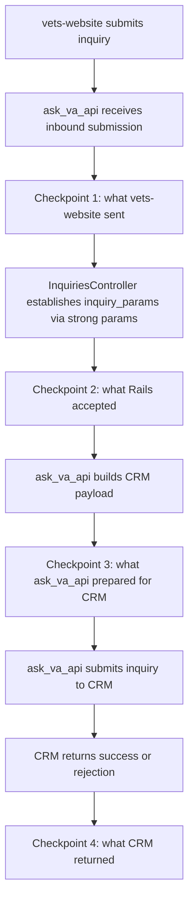

At minimum, this approach requires one checkpoint before CRM submission and the CRM response checkpoint.
Any one of checkpoints 1, 2, or 3 can create the At record, and checkpoint 4 is needed to update
that record with CRM outcome data for correlation and diagnostics. Aside from those required checkpoints,
any additional checkpoints are optional and can be implemented as part of this At effort or
at a later time.

## 🚫 Single Table Approach 🚫

| Field | Checkpoint | What is captured |
| --- | --- | --- |
| `id` | All checkpoints | Unique ID for the audit record |
| `raw_payload` | Raw inbound request | Submitted payload from frontend before strong params |
| `accepted_payload` | After strong params | Backend accepted payload after strong params |
| `crm_payload` | Outbound to CRM | Transformed payload prepared for CRM |
| `inquiry_number` | CRM success | Returned by CRM on success |
| `crm_message_id` | CRM rejection | Returned by CRM on success/rejection |
| `crm_response` | CRM response | CRM response body |
| `raw_received_at` | Raw inbound request | Timestamp for raw payload |
| `accepted_received_at` | After stron params | Timestamp for accepted payload |
| `crm_payload_prepared_at` | Outbound to CRM | Timestamp for outbound CRM payload |
| `crm_response_received_at` | CRM response | Timestamp for CRM response |
| `failed_at` | CRM response | Timestamp for failed CRM submission |

## ✅ Parent/Child Table Approach ✅

### Inquiry Submissions

| Field | Available | What is captured |
| --- | --- | --- |
| `id` | At record creation | Unique ID for the parent inquiry submission record |
| `crm_message_id` | CRM success/rejection | Returned CRM response |
| `inquiry_number` | CRM success | Returned by CRM on success |
| `created_at` | At record creation | When the record is first created |
| `updated_at` | On parent record update | When the record is last updated (e.g., after CRM response data is recorded) |

### Inquiry Submission Checkpoints

| Field | Available | What is captured |
| --- | --- | --- |
| `id` | At record creation | Unique ID for the checkpoint record |
| `inquiry_submission_id` | At record creation | Reference to the parent inquiry submission record |
| `checkpoint_type` | At record creation | Submission lifecycle checkpoint (e.g., inbound payload) |
| `payload_ciphertext` | At record creation | Encrypted checkpoint data |
| `created_at` | At record creation | When the checkpoint record is created |
| `updated_at` | On child record update | When the record is last updated |
