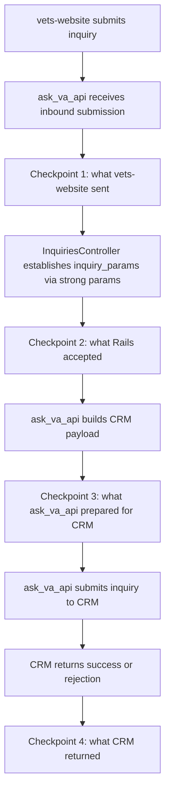

At minimum, this approach requires one checkpoint before CRM submission and the CRM response checkpoint.
Any one of checkpoints 1, 2, or 3 can create the initial record, and checkpoint 4 is needed to update
that record with CRM outcome data for correlation and diagnostics. Aside from those required checkpoints,
any additional checkpoints are optional and can be implemented as part of this initial effort or
at a later time.

