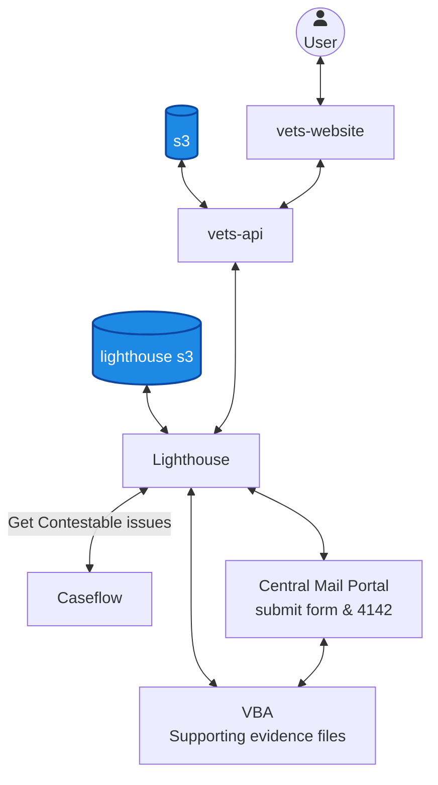

# Supplemental Claim architecture

## Components

- **Veteran** — End user submitting a Supplemental Claim via VA.gov.
- **vets-website** — VA.gov frontend where Veterans submit Supplemental Claims.
- **vets-api** — VA.gov backend; proxies requests to Lighthouse and uploads supporting documents.
- **s3** — vets-api S3 bucket for temporary storage of uploads.
- **Lighthouse** — Lighthouse Decision Reviews API; authoritative submission path.
- **lighthouse s3** — Lighthouse-managed S3 bucket used during submission.
- **Caseflow** — Source of contestable issues for a Veteran.
- **Central Mail Portal** — Receives the submitted form (20-0995) and 4142 authorizations.
- **VBA** — Receives supporting evidence files.
