# SC 995 Form Flow Diagram

**Form config:** [`form.js`](../../vets-website/src/applications/appeals/995/config/form.js)
**Gate function:** [`redesignActive()`](../../vets-website/src/applications/appeals/995/utils/index.js) — returns `formData?.showArrayBuilder`
**Date:** 2026-04-08

---

## Full Form Flow

### 1. Chapter: Veteran Information

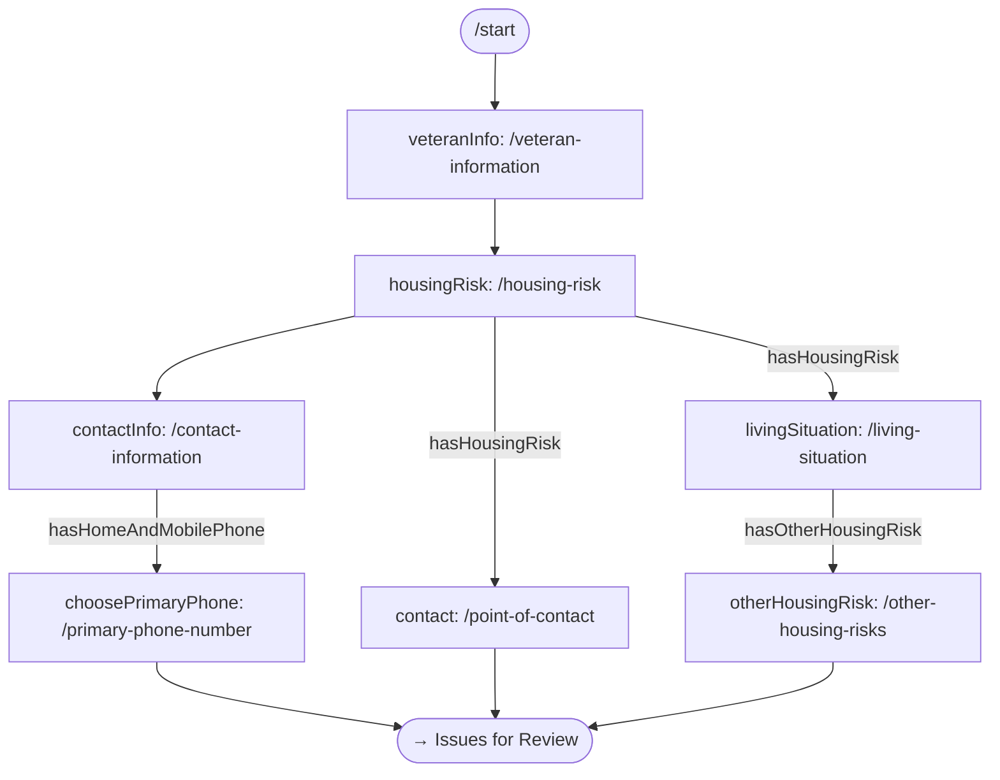

### 2. Chapter: Issues for Review

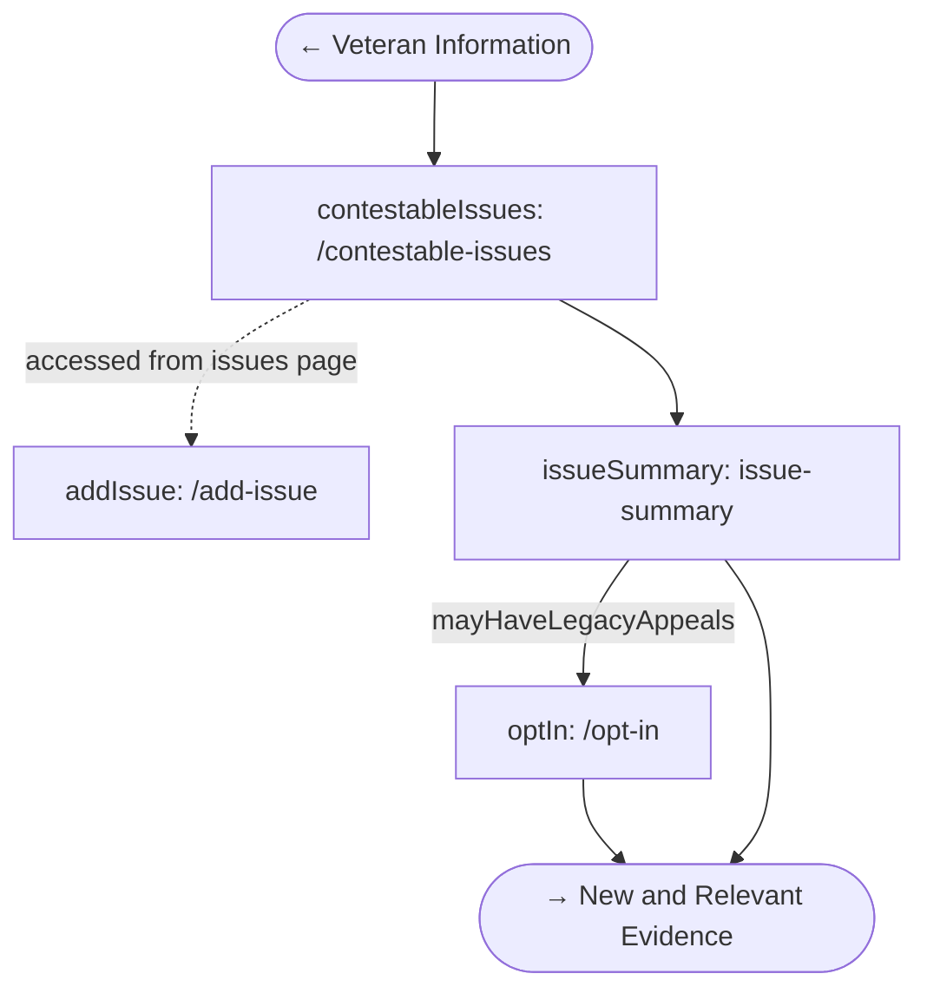

### 3. Chapter: New and Relevant Evidence

#### 3a. Notice & Facility Types

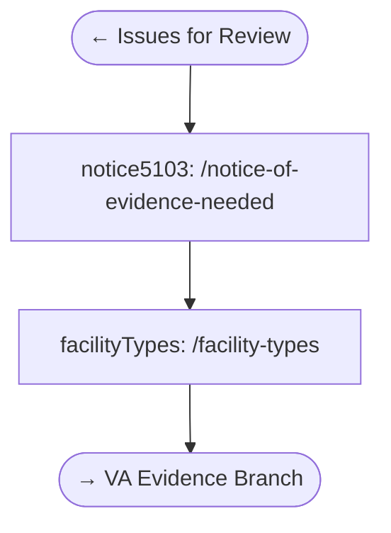

#### 3b. VA Evidence Branch

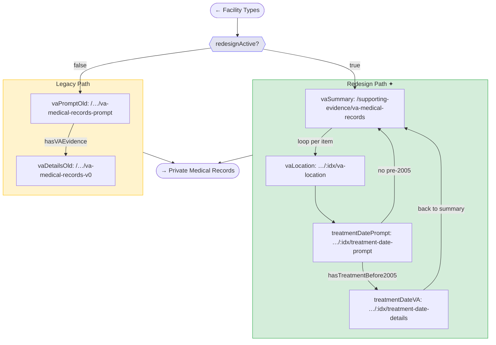

#### 3c. Private Medical Records & Consent

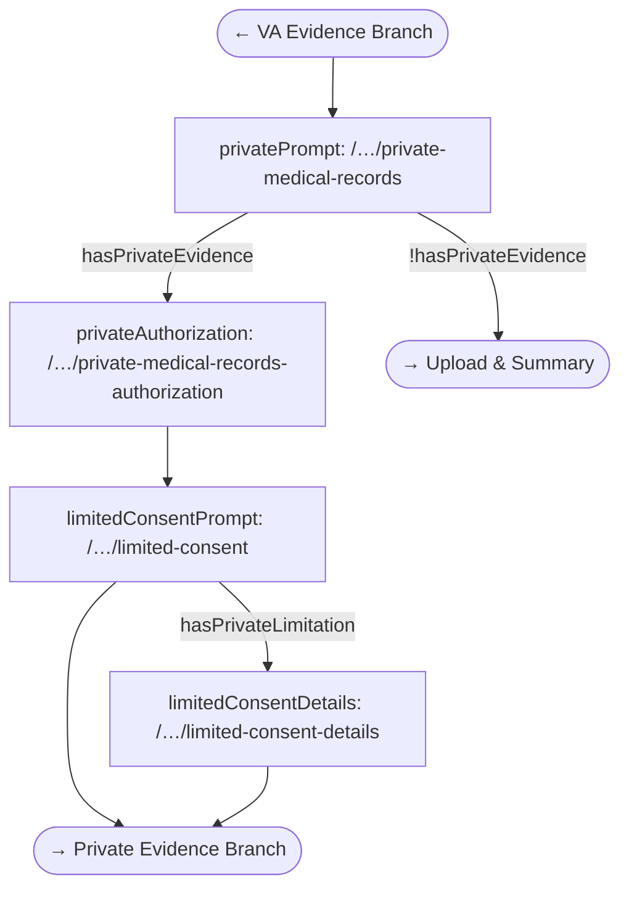

#### 3d. Private Evidence Branch

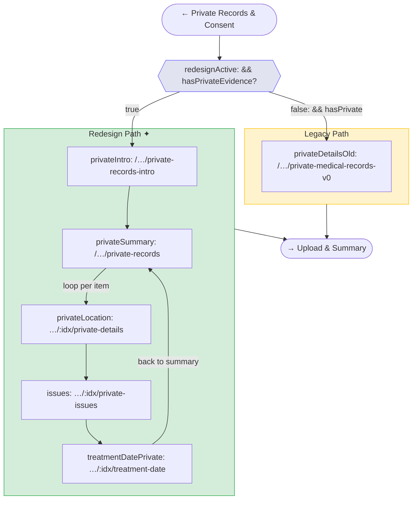

#### 3e. Upload & Summary

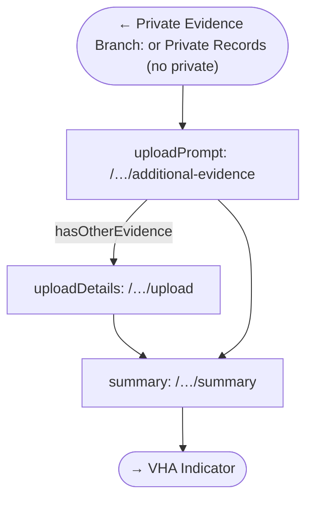

### 4. Chapter: VHA Indicator

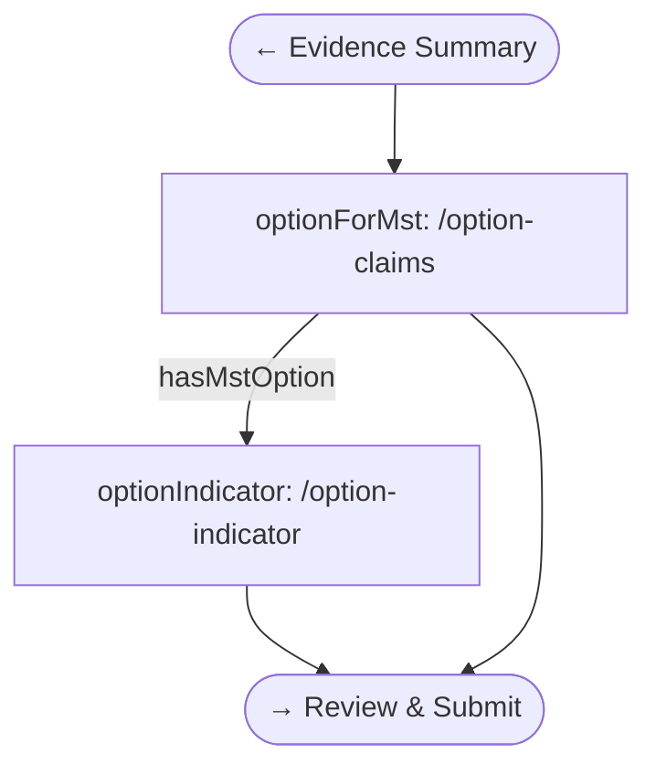

### 5. Review & Submit → Confirmation

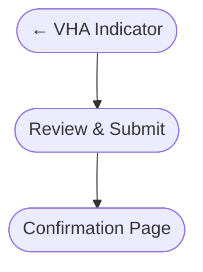

### Summary page visibility

The evidence `summary` page has its own conditional:

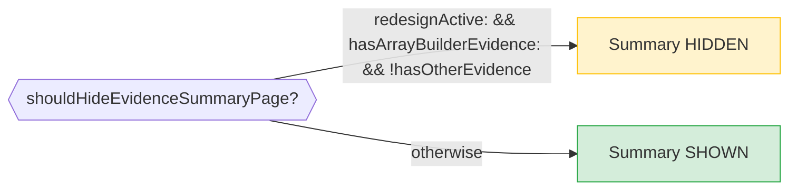

---

## Redesign Branch Detail

Focused view of the two `redesignActive` branching points:

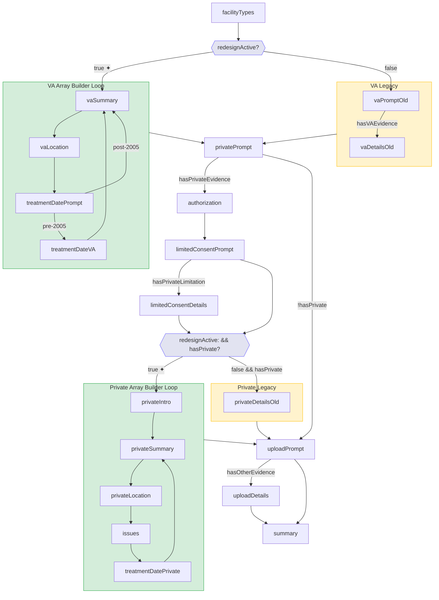

---

## Key Files

| Role | File |
|------|------|
| Form config | [`form.js`](../../vets-website/src/applications/appeals/995/config/form.js) |
| Gate function | [`utils/index.js`](../../vets-website/src/applications/appeals/995/utils/index.js) |
| Flag sync | [`App.jsx`](../../vets-website/src/applications/appeals/995/containers/App.jsx) |
| Form data checks | [`form-data-retrieval.js`](../../vets-website/src/applications/appeals/995/utils/form-data-retrieval.js) |
| VA array builder pages | [`vaEvidence.js`](../../vets-website/src/applications/appeals/995/pages/evidence/vaEvidence.js) |
| Private array builder pages | [`privateEvidence.jsx`](../../vets-website/src/applications/appeals/995/pages/evidence/privateEvidence.jsx) |
| Submit transformer | [`submit-transformer.js`](../../vets-website/src/applications/appeals/995/config/submit-transformer.js) |
| BE normalizer | [`request_body_normalizer.rb`](../../vets-api/modules/decision_reviews/app/services/decision_reviews/v1/supplemental_claims/request_body_normalizer.rb) |
| URL constants | [`constants/index.js`](../../vets-website/src/applications/appeals/995/constants/index.js) |

---

## Legend

| Symbol | Meaning |
|--------|---------|
| Green subgraph (`✦`) | Redesign path — gated by `redesignActive(formData)` |
| Yellow subgraph | Legacy path — gated by `!redesignActive(formData)` |
| Purple diamond | `redesignActive` decision point |
| Dashed arrow | Accessed indirectly (not linear flow) |
| `…/:idx/` | Array builder item index (loop) |
