# VA Form 20-0995 (Supplemental Claims) — Complete Logic Tree

**Generated:** 2026-03-13
**Source of truth:** `vets-website` repo, `main` branch (production code)
**Commit:** `84054aa759` (pulled 2026-03-13)
**Source code:** `src/applications/appeals/995/`
**Base URL:** `/decision-reviews/supplemental-claim/file-supplemental-claim-form-20-0995`

## Logic Tree (Mermaid)

```mermaid
flowchart TD
    classDef always fill:#d4edda,stroke:#28a745,stroke-width:2px,color:#000
    classDef conditional fill:#fff3cd,stroke:#ffc107,stroke-width:2px,color:#000
    classDef subpage fill:#e2e3e5,stroke:#6c757d,stroke-width:1px,color:#000,stroke-dasharray: 5 5
    classDef decision fill:#cce5ff,stroke:#007bff,stroke-width:2px,color:#000
    classDef terminal fill:#f8d7da,stroke:#dc3545,stroke-width:2px,color:#000

    START([Start / Introduction])

    subgraph CH1["Chapter 1: Veteran Information"]
        direction TB
        P_vetInfo["veteranInfo<br/><b>/veteran-information</b><br/>ALWAYS"]
        P_housingRisk["housingRisk<br/><b>/housing-risk</b><br/>ALWAYS"]
        D_housingRisk{{"housingRisk truthy?"}}
        P_livingSituation["livingSituation<br/><b>/living-situation</b><br/>CONDITIONAL"]
        D_otherHousing{{"hasHousingRisk AND<br/>livingSituation.other?"}}
        P_otherHousingRisk["otherHousingRisk<br/><b>/other-housing-risks</b><br/>CONDITIONAL"]
        P_contact["contact<br/><b>/point-of-contact</b><br/>CONDITIONAL: housingRisk"]
        P_contactInfo["confirmContactInfo<br/><b>/contact-information</b><br/>ALWAYS"]
        P_editAddress["editMailingAddress<br/><b>/contact-information/edit-mailing-address</b><br/>SUB-PAGE"]:::subpage
        P_editHome["editHomePhone<br/><b>/contact-information/edit-home-phone</b><br/>SUB-PAGE"]:::subpage
        P_editMobile["editMobilePhone<br/><b>/contact-information/edit-mobile-phone</b><br/>SUB-PAGE"]:::subpage
        P_editEmail["editEmailAddress<br/><b>/contact-information/edit-email-address</b><br/>SUB-PAGE"]:::subpage
        D_phones{{"Both home & mobile<br/>phone present?"}}
        P_primaryPhone["choosePrimaryPhone<br/><b>/primary-phone-number</b><br/>CONDITIONAL"]
    end

    subgraph CH2["Chapter 2: Issues for Review"]
        direction TB
        P_contestableIssues["contestableIssues<br/><b>/contestable-issues</b><br/>ALWAYS"]
        P_addIssue["addIssue<br/><b>/add-issue</b><br/>SUB-PAGE"]:::subpage
        P_issueSummary["issueSummary<br/><b>/issue-summary</b><br/>ALWAYS"]
        D_legacy{{"legacyCount > 0 OR<br/>additionalIssues OR<br/>decision before 2019-02-19?"}}
        P_optIn["optIn<br/><b>/opt-in</b><br/>CONDITIONAL"]
    end

    subgraph CH3["Chapter 3: New and Relevant Evidence"]
        direction TB
        P_notice5103["notice5103<br/><b>/notice-of-evidence-needed</b><br/>ALWAYS"]
        P_facilityTypes["facilityTypes<br/><b>/facility-types</b><br/>ALWAYS"]
        P_vaPrompt["vaPrompt<br/><b>/supporting-evidence/request-va-medical-records</b><br/>ALWAYS"]
        D_vaEvidence{{"hasVAEvidence?"}}
        P_vaDetails["vaDetails<br/><b>/supporting-evidence/va-medical-records</b><br/>CONDITIONAL"]
        P_privatePrompt["privatePrompt<br/><b>/supporting-evidence/request-private-medical-records</b><br/>ALWAYS"]
        D_privateEvidence{{"hasPrivateEvidence?"}}
        P_privateAuth["privateAuthorization<br/><b>/supporting-evidence/private-medical-records-authorization</b><br/>CONDITIONAL"]
        P_limitedConsentPrompt["limitedConsentPrompt<br/><b>/supporting-evidence/add-limitation</b><br/>CONDITIONAL: hasPrivateEvidence"]
        D_privateLimitation{{"hasPrivateLimitation?"}}
        P_limitedConsentDetails["limitedConsentDetails<br/><b>/supporting-evidence/limitation</b><br/>CONDITIONAL"]
        P_privateDetails["privateDetails<br/><b>/supporting-evidence/private-medical-records</b><br/>CONDITIONAL: hasPrivateEvidence"]
        P_uploadPrompt["uploadPrompt<br/><b>/supporting-evidence/will-add-supporting-evidence</b><br/>ALWAYS"]
        D_otherEvidence{{"hasOtherEvidence?"}}
        P_uploadDetails["uploadDetails<br/><b>/supporting-evidence/upload-evidence</b><br/>CONDITIONAL"]
        P_summary["summary<br/><b>/supporting-evidence/summary</b><br/>ALWAYS"]
    end

    subgraph CH4["Chapter 4: VHA Indicator"]
        direction TB
        P_optionForMst["optionForMst<br/><b>/option-claims</b><br/>ALWAYS"]
        D_mst{{"mstOption truthy?"}}
        P_optionIndicator["optionIndicator<br/><b>/option-indicator</b><br/>CONDITIONAL"]
    end

    REVIEW["Review & Submit"]
    CONFIRM([Confirmation])

    START --> P_vetInfo
    P_vetInfo --> P_housingRisk --> D_housingRisk
    D_housingRisk -- "Yes" --> P_livingSituation --> D_otherHousing
    D_housingRisk -- "No" --> P_contactInfo
    D_otherHousing -- "Yes" --> P_otherHousingRisk --> P_contact
    D_otherHousing -- "No" --> P_contact
    P_contact --> P_contactInfo
    P_contactInfo -. "edit" .-> P_editAddress & P_editHome & P_editMobile & P_editEmail
    P_contactInfo --> D_phones
    D_phones -- "Yes" --> P_primaryPhone --> P_contestableIssues
    D_phones -- "No" --> P_contestableIssues
    P_contestableIssues -. "add" .-> P_addIssue
    P_contestableIssues --> P_issueSummary --> D_legacy
    D_legacy -- "Yes" --> P_optIn --> P_notice5103
    D_legacy -- "No" --> P_notice5103
    P_notice5103 --> P_facilityTypes --> P_vaPrompt --> D_vaEvidence
    D_vaEvidence -- "Yes" --> P_vaDetails --> P_privatePrompt
    D_vaEvidence -- "No" --> P_privatePrompt
    P_privatePrompt --> D_privateEvidence
    D_privateEvidence -- "Yes" --> P_privateAuth --> P_limitedConsentPrompt --> D_privateLimitation
    D_privateEvidence -- "No" --> P_uploadPrompt
    D_privateLimitation -- "Yes" --> P_limitedConsentDetails --> P_privateDetails
    D_privateLimitation -- "No" --> P_privateDetails
    P_privateDetails --> P_uploadPrompt
    P_uploadPrompt --> D_otherEvidence
    D_otherEvidence -- "Yes" --> P_uploadDetails --> P_summary
    D_otherEvidence -- "No" --> P_summary
    P_summary --> P_optionForMst --> D_mst
    D_mst -- "Yes" --> P_optionIndicator --> REVIEW
    D_mst -- "No" --> REVIEW
    REVIEW --> CONFIRM

    class P_vetInfo,P_housingRisk,P_contactInfo,P_contestableIssues,P_issueSummary,P_notice5103,P_facilityTypes,P_vaPrompt,P_privatePrompt,P_uploadPrompt,P_summary,P_optionForMst always
    class P_livingSituation,P_otherHousingRisk,P_contact,P_primaryPhone,P_optIn,P_vaDetails,P_privateAuth,P_limitedConsentPrompt,P_limitedConsentDetails,P_privateDetails,P_uploadDetails,P_optionIndicator conditional
    class D_housingRisk,D_otherHousing,D_phones,D_legacy,D_vaEvidence,D_privateEvidence,D_privateLimitation,D_otherEvidence,D_mst decision
    class START,CONFIRM terminal
```

## Page Summary

### Always-Shown Pages (14)

| Page Key | URL Path |
|----------|----------|
| `veteranInfo` | `/veteran-information` |
| `housingRisk` | `/housing-risk` |
| `confirmContactInfo` | `/contact-information` |
| `contestableIssues` | `/contestable-issues` |
| `issueSummary` | `/issue-summary` |
| `notice5103` | `/notice-of-evidence-needed` |
| `facilityTypes` | `/facility-types` |
| `vaPrompt` | `/supporting-evidence/request-va-medical-records` |
| `privatePrompt` | `/supporting-evidence/request-private-medical-records` |
| `uploadPrompt` | `/supporting-evidence/will-add-supporting-evidence` |
| `summary` | `/supporting-evidence/summary` |
| `optionForMst` | `/option-claims` |
| Review & Submit | `/review-and-submit` |
| Confirmation | (post-submit) |

### Conditional Pages (12)

| Page Key | URL Path | Condition |
|----------|----------|-----------|
| `livingSituation` | `/living-situation` | `formData.housingRisk` is truthy |
| `otherHousingRisk` | `/other-housing-risks` | `hasHousingRisk AND formData.livingSituation.other` |
| `contact` | `/point-of-contact` | `formData.housingRisk` is truthy |
| `choosePrimaryPhone` | `/primary-phone-number` | Both home & mobile phone have areaCode + phoneNumber |
| `optIn` | `/opt-in` | `legacyCount > 0` OR `additionalIssues.length > 0` OR any contested issue decision date before `2019-02-19` |
| `vaDetails` | `/supporting-evidence/va-medical-records` | `formData['view:hasVaEvidence']` truthy |
| `privateAuthorization` | `/supporting-evidence/private-medical-records-authorization` | `formData['view:hasPrivateEvidence']` truthy |
| `limitedConsentPrompt` | `/supporting-evidence/add-limitation` | `formData['view:hasPrivateEvidence']` truthy |
| `limitedConsentDetails` | `/supporting-evidence/limitation` | `hasPrivateEvidence AND formData['view:hasPrivateLimitation']` |
| `privateDetails` | `/supporting-evidence/private-medical-records` | `formData['view:hasPrivateEvidence']` truthy |
| `uploadDetails` | `/supporting-evidence/upload-evidence` | `formData['view:hasOtherEvidence']` truthy |
| `optionIndicator` | `/option-indicator` | `formData.mstOption` truthy |

### Sub-Pages (accessed via links, `depends: () => false`)

| Page Key | URL Path | Accessed From |
|----------|----------|---------------|
| `confirmContactInfoEditMailingAddress` | `/contact-information/edit-mailing-address` | Contact info page |
| `confirmContactInfoEditHomePhone` | `/contact-information/edit-home-phone` | Contact info page |
| `confirmContactInfoEditMobilePhone` | `/contact-information/edit-mobile-phone` | Contact info page |
| `confirmContactInfoEditEmailAddress` | `/contact-information/edit-email-address` | Contact info page |
| `addIssue` | `/add-issue` | Contestable issues page |

## Path Lengths

- **Minimum path:** ~14 pages (no housing risk, no dual phones, no legacy appeals, no VA/private/upload evidence, no MST)
- **Maximum path:** ~27 pages (all conditional branches taken + edit sub-pages)

## Audit Status

Independently audited against source code on 2026-03-13. **All pages, paths, conditions, and ordering confirmed accurate.** One minor correction applied during audit: page key `contact` (not `pointOfContact`) for the point-of-contact page.

## Key Source Files

- `src/applications/appeals/995/config/form.js` — form config (chapters, pages, depends)
- `src/applications/appeals/995/utils/form-data-retrieval.js` — conditional logic functions
- `src/applications/appeals/995/constants/index.js` — path and field constants
- `src/applications/appeals/shared/utils/issues.jsx` — `mayHaveLegacyAppeals`
- `src/applications/appeals/shared/utils/contactInfo.js` — `hasHomeAndMobilePhone`
