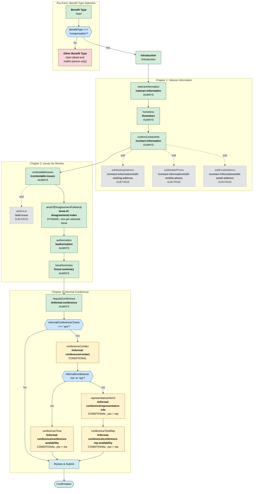

# VA Form 20-0996 (Higher Level Review) — Complete Logic Tree

**Generated:** 2026-03-13
**Source of truth:** `vets-website` repo, `main` branch (production code)
**Commit:** `84054aa759` (pulled 2026-03-13)
**Source code:** `src/applications/appeals/996/`
**Base URL:** `/decision-reviews/higher-level-review/request-higher-level-review-form-20-0996`

## Logic Tree (Mermaid)

## Page Summary

### Always-Shown Pages (9)

| Page Key | URL Path |
|----------|----------|
| Benefit Type (subtask) | `/start` |
| Introduction | `/introduction` |
| `veteranInformation` | `/veteran-information` |
| `homeless` | `/homeless` |
| `confirmContactInfo` | `/contact-information` |
| `contestableIssues` | `/contestable-issues` |
| `authorization` | `/authorization` |
| `issueSummary` | `/issue-summary` |
| `requestConference` | `/informal-conference` |

### Dynamic Pages

| Page Key | URL Path | Behavior |
|----------|----------|----------|
| `areaOfDisagreementFollowUp` | `/area-of-disagreement/:index` | `showPagePerItem: true` — renders one page per selected contestable issue |

### Conditional Pages (4)

| Page Key | URL Path | Condition |
|----------|----------|-----------|
| `conferenceContact` | `/informal-conference/contact` | `informalConferenceChoice === 'yes'` |
| `representativeInfoV2` | `/informal-conference/representative-info` | `informalConferenceChoice === 'yes' AND informalConference === 'rep'` |
| `conferenceTime` | `/informal-conference/conference-availability` | `informalConferenceChoice === 'yes' AND informalConference === 'me'` |
| `conferenceTimeRep` | `/informal-conference/conference-rep-availability` | `informalConferenceChoice === 'yes' AND informalConference === 'rep'` |

### Sub-Pages (accessed via links, `depends: () => false`)

| Page Key | URL Path | Accessed From |
|----------|----------|---------------|
| `confirmContactInfoEditMailingAddress` | `/contact-information/edit-mailing-address` | Contact info page |
| `confirmContactInfoEditMobilePhone` | `/contact-information/edit-mobile-phone` | Contact info page |
| `confirmContactInfoEditEmailAddress` | `/contact-information/edit-email-address` | Contact info page |
| `addIssue` | `/add-issue` | Contestable issues page |

**Note:** HLR has only 3 contact info edit sub-pages (address, mobile phone, email). Unlike SC (995), there is **no home phone edit page**.

## Informal Conference Branching (3 paths)

1. **No conference:** `requestConference` -> Review & Submit (skip all conference pages)
2. **Conference with veteran:** `requestConference` -> `conferenceContact` (choose "me") -> `conferenceTime` -> Review & Submit
3. **Conference with representative:** `requestConference` -> `conferenceContact` (choose "rep") -> `representativeInfoV2` -> `conferenceTimeRep` -> Review & Submit

## Path Lengths

- **Minimum path:** 10 pages (1 issue selected, no informal conference)
- **Maximum path:** 13+ pages (multiple issues, conference with representative)
- Page count scales with number of selected contestable issues (area of disagreement is per-issue)

## Audit Status

Independently audited against source code on 2026-03-13. **Zero discrepancies found.** All pages, paths, conditions, and ordering confirmed accurate.

## Key Source Files

- `src/applications/appeals/996/config/form.js` — form config (chapters, pages, depends)
- `src/applications/appeals/996/utils/helpers.js` — conditional logic (`showConferenceContact`, `showConferenceVeteranPage`, `showConferenceRepPages`)
- `src/applications/appeals/996/constants/index.js` — path constants
- `src/applications/appeals/996/subtask/` — pre-form benefit type selection pages
- `src/applications/appeals/shared/utils/contactInfo.js` — contact info page generation
