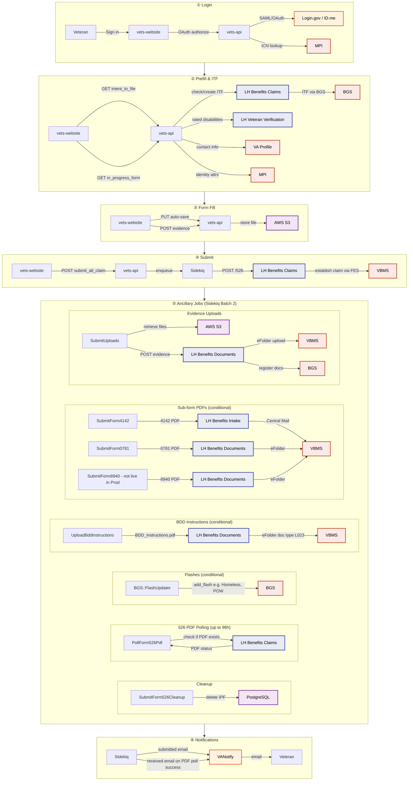

```mermaid
flowchart TB
    subgraph LOGIN ["① Login"]
        direction LR
        V1[Veteran] -->|Sign in| FE1[vets-website]
        FE1 -->|OAuth authorize| API1[vets-api]
        API1 -->|SAML/OAuth| IDP[Login.gov / ID.me]:::external
        API1 -->|ICN lookup| MPI1[MPI]:::vabackend
    end

    subgraph PREFILL ["② Prefill & ITF"]
        direction LR
        FE2[vets-website] -->|GET intent_to_file| API2[vets-api]
        API2 -->|check/create ITF| LH_BC1[LH Benefits Claims]:::lighthouse
        LH_BC1 -->|ITF via BGS| BGS1[BGS]:::vabackend
        FE2 -->|GET in_progress_form| API2
        API2 -->|rated disabilities| LH_VV[LH Veteran Verification]:::lighthouse
        API2 -->|contact info| VAP[VA Profile]:::vabackend
        API2 -->|identity attrs| MPI2[MPI]:::vabackend
    end

    subgraph FILL ["③ Form Fill"]
        direction LR
        FE3[vets-website] -->|PUT auto-save| API3[vets-api]
        FE3 -->|POST evidence| API3
        API3 -->|store file| S3[AWS S3]:::datastore
    end

    subgraph SUBMIT ["④ Submit"]
        direction LR
        FE4[vets-website] -->|POST submit_all_claim| API4[vets-api]
        API4 -->|enqueue| SK1[Sidekiq]
        SK1 -->|POST /526| LH_BC2[LH Benefits Claims]:::lighthouse
        LH_BC2 -->|establish claim via FES| VBMS1[VBMS]:::vabackend
    end

    subgraph ANCILLARY ["⑤ Ancillary Jobs (Sidekiq Batch 2)"]
        direction TB

        subgraph CLEANUP ["Cleanup"]
            direction LR
            SK_CL[SubmitForm526Cleanup] -->|delete IPF| PG[PostgreSQL]:::datastore
        end

        subgraph PDFPOLL ["526 PDF Polling (up to 96h)"]
            direction LR
            SK_PDF[PollForm526Pdf] -->|check if PDF exists| LH_BC3[LH Benefits Claims]:::lighthouse
            LH_BC3 -->|PDF status| SK_PDF
        end

        subgraph FLASHES ["Flashes (conditional)"]
            direction LR
            SK_FL[BGS::FlashUpdater] -->|add_flash e.g. Homeless, POW| BGS_FL[BGS]:::vabackend
        end

        subgraph BDD ["BDD Instructions (conditional)"]
            direction LR
            SK_BDD[UploadBddInstructions] -->|BDD_Instructions.pdf| LH_BD_BDD[LH Benefits Documents]:::lighthouse
            LH_BD_BDD -->|eFolder doc type L023| VBMS_BDD[VBMS]:::vabackend
        end

        subgraph SUBFORMS ["Sub-form PDFs (conditional)"]
            direction LR
            SK_4142[SubmitForm4142] -->|4142 PDF| LH_BI[LH Benefits Intake]:::lighthouse
            LH_BI -->|Central Mail| VBMS_SF[VBMS]:::vabackend
            SK_0781[SubmitForm0781] -->|0781 PDF| LH_BD2[LH Benefits Documents]:::lighthouse
            LH_BD2 -->|eFolder| VBMS_SF
            SK_8940[SubmitForm8940 - not live in Prod] -->|8940 PDF| LH_BD3[LH Benefits Documents]:::lighthouse
            LH_BD3 -->|eFolder| VBMS_SF
        end

        subgraph EVIDENCE ["Evidence Uploads"]
            direction LR
            SK_EV[SubmitUploads] -->|retrieve files| S3_2[AWS S3]:::datastore
            SK_EV -->|POST evidence| LH_BD1[LH Benefits Documents]:::lighthouse
            LH_BD1 -->|eFolder upload| VBMS_EV[VBMS]:::vabackend
            LH_BD1 -->|register docs| BGS_EV[BGS]:::vabackend
        end

        EVIDENCE ~~~ SUBFORMS ~~~ BDD ~~~ FLASHES ~~~ PDFPOLL ~~~ CLEANUP
    end

    subgraph NOTIFY ["⑥ Notifications"]
        direction LR
        SK3[Sidekiq] -->|submitted email| VAN1[VANotify]:::external
        VAN1 -->|email| V2[Veteran]
        SK3 -->|received email on PDF poll success| VAN1
    end

    LOGIN --> PREFILL --> FILL --> SUBMIT --> ANCILLARY --> NOTIFY

    classDef external fill:#FFF3E0,stroke:#E65100,stroke-width:2px,color:#000
    classDef lighthouse fill:#E8EAF6,stroke:#283593,stroke-width:2px,color:#000
    classDef vabackend fill:#FBE9E7,stroke:#BF360C,stroke-width:2px,color:#000
    classDef datastore fill:#F3E5F5,stroke:#6A1B9A,stroke-width:2px,color:#000
```
