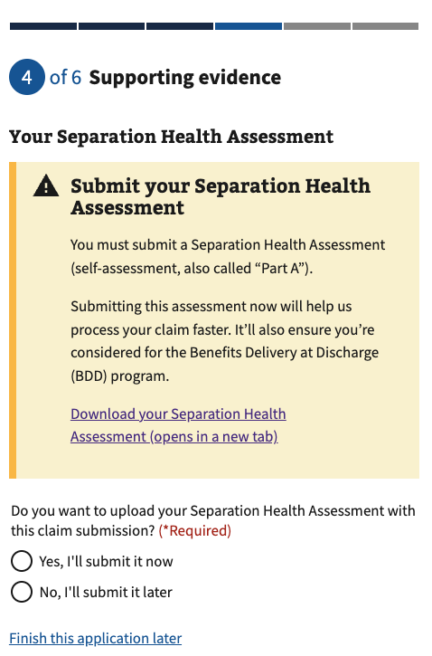
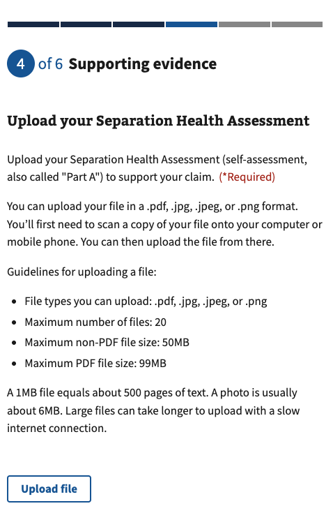
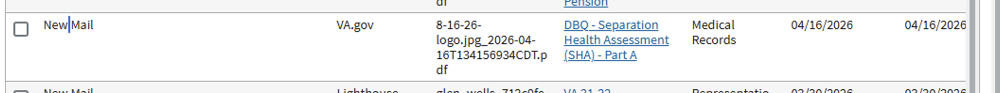
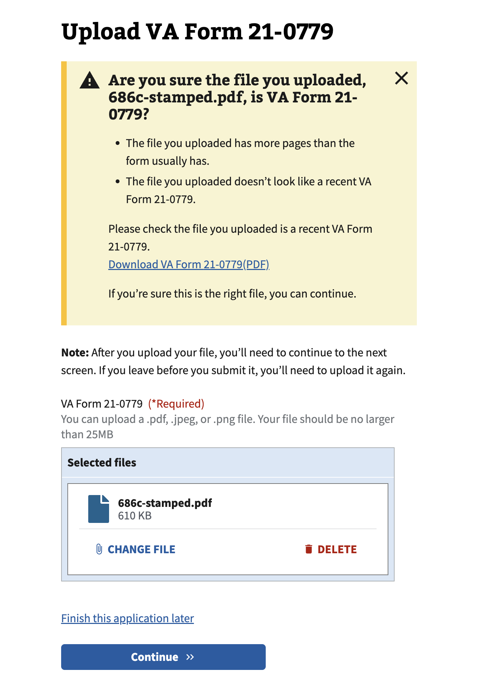

# BDD SHA Document Validation Technical Project Documentation

| Area                          | Description                                                                                        |
| ----------------------------- | -------------------------------------------------------------------------------------------------- |
| **Project Goal**              | Increase the number of uploads of the SHA Part A document for veterans who qualify for BDD program |
| **Super Epic**                | TODO                                                                                               |
| **Current State of Document** | In Progress                                                                                        |
| **Stakeholders**              | Daniel Vu, Eryn Sobing                                                                             |
| **Assigned Team**             | Team 5                                                                                             |

# **High Level Overview**

VA Form 21-526EZ allows veterans to apply for disability compensation through VA.gov. The form is active in the production environment and continues to receive updates.

The Benefits Delivery at Discharge program (“BDD”) allows veterans to apply for compensation benefits 180 to 90 days before discharge and allows for an expedited adjudication process. In addition to the timeframe condition, the veteran is expected to include a Separation Health Assessment (“SHA”, commonly referred to as “SHA Part A”) as part of their claim. 

Work was delivered in April 2026 to improve the overall UI/UX of uploading a SHA by ensuring that there is a dedicated
upload page for the SHA. The work being introduced here will build upon that work by adding "Document Validation", which
will warn the service member if they are potentially uploading an incorrect document.

# **Foundational Knowledge**

A new BDD SHA upload experience was delivered in April 2026. It includes two new pages dedicated to the SHA

1. An Intro Page

2. An Upload Page

Right now, the veteran can upload "any" document into the upload page and the system will assume that the document is a
SHA. It is submitted with an attachment id of "L1839", signifying it is a "DBQ - Separation Health Assessment (SHA) - Part A".

Here is screenshot of how the document will appear in VBMS in the veteran's eFolder.

Today, the "existence" or "non-existence" of a SHA does not impact technical systems. The service member is allowed to
choose to not upload a SHA. They are warned throughout the experience if they do not upload the SHA, but the claim type
or status does not change based on this. However, it can cause delay in their adjudication and impact their consideration
for the BDD program.

Likewise, uploading a document that is not actually a SHA can delay their adjudication and impact their consideration for
the BDD program.

There is another VA.gov tool called "Simple Form Upload" that demonstrates a document validation pattern that Form
21-526EZ can replicate. Upon uploading a document, if that document does not match expected criteria, the Simple Form
Upload will show an alert warning the user that this may be the incorrect document.

The solution used there is fairly simple: The uploaded file has all of its text extracted through an Optical Character
Recognition (OCR) library and then we check if the name of the form is included within that text. There is no pattern
recognition or machine-learning; it's just whether or not the name of the form / id of the form is detectable.

Fortunately, the SHA includes a footer which always includes the text "Separation Health Assessment (SHA) Disability
Benefits Questionnaire - Part A". An example of a blank SHA can be found [here](https://www.benefits.va.gov/compensation/docs/sha_dbq_part_a_self-assessment.pdf).

# **Anticipated Technical Challenges**

There are certain challenges that should be accounted for.

- **Meeting Baseline Levels of Submissions:** Although we want to increase form submissions for BDD-qualified veterans
  that include the SHA Part A document, we cannot “hard block” the veteran from submitting Form 21-526EZ and lowering
  our overall levels of submissions. Thus, a solution that guides the veteran through a “soft block” is advised.
- **Multiple Files Can Be Uploaded:** As part of the initial delivery of the new BDD SHA workflow, we allowed the
  veteran to upload up-to 20 files. Fortunately, the footer for the SHA is on every page so we should be good. But
  we should still ensure that our UX accounts for only showing one total warning and considering whether we want to
  reshow the warning if they've closed it but uploaded another potentially incorrect document
- **Differences in Upload Library for Simple Form Upload vs Form 21-526EZ:** The Simple Form Upload tool and Form 21-526
  utilizes fundamentally different attachment uploading libraries (Shrine vs CarrierWave, respectively). The underlying
  libraries for parsing the attachment and extracting the text can be reutilized, but the way that it is invoked will
  need to account for idioms of Shrine vs CarrierWave.

# **Proposed Solution**

By showing an alert on the SHA upload page when a potentially incorrect document is uploaded, we hypothesize that we
will increase the data quality of Form 21-526EZ submissions and make it easier for veterans to take the correct action.

- **Solution Summary:** Modify the existing Form 21-526EZ document upload endpoint to support validation and
  conditionally show an alert if it detects an erroneous document.
  - Change to vets-api public contract for the upload endpoint to support new form param to pass the expected form type ("SHA")
  - Change to vets-api to support OCR
  - Change to vets-website to render new alert based on result

# **Risks and Dependencies**

| Risk/Dependency                                                    | Impact | Mitigation/Contingency                                                                    |
| ------------------------------------------------------------------ | ------ | ----------------------------------------------------------------------------------------- |
| Change to public contract of vets-api                              | Medium | Reach out to leads, get their feedback. See if we need to do architecture intent for this |
| Dynamic content appearing on page; potential accessibility concern | Medium | Include accessibility specialists as part of SDLC.                                        |

# **Architecture and Design**

The technique used by the Simple Forms Upload tool is demonstrated [here](https://github.com/department-of-veterans-affairs/vets-api/blob/master/lib/shrine/plugins/validate_correct_form.rb). In there, they pass the uploaded document to MiniMagick, which converts the file to a jpg
with specific values to improve OCR. Then, that jpg is passed to RTesseract which can extract the text content of that
file. It then checks if the form id is present in that text content.

The jpg is a temporary file; it is always deleted afterwards.

We'll need to make sure the approach can be copied over from Shrine to CarrierWave, which are the libraries used to upload
the files.

# **Technical Breakdown**

The following table demonstrates a low-level breakdown of the work that should ultimately evolve into tickets that are workable by the team.

_Medium Confidence Anticipated Level of Effort: 2 Sprints, 2 engineers_

| Number | Title                                                                    | Description | Special Notes |
| ------ | ------------------------------------------------------------------------ | ----------- | ------------- |
| 1      | Prepare Security & Engineering Checklist                                 | --          | --            |
| 2      | Create feature flag - disability_526_bdd_sha_document_validation_enabled | --          |
| 3      | Update vets-json-schema for new form id parameter                        | --          | --            |
| 4      | Update vets-api to use new form id parameter to validate document        | --          | --            |
| 5      | Update vets-website to pass new form id and render alert - low-fidelity  | --          | --            |
| 6      | Update vets-website to utilize high-fidelity mockups                     | --          | --            |
| 7      | Bug bash                                                                 | --          | --            |
| 8      | Fixes from bug bash (Allocate 3 stories)                                 | --          | --            |

# **Out of Scope**

- This will only apply to the SHA Part A document; no other documents will be included.
- This will only apply to SHA Part A documents uploaded on the new BDD SHA flow; existing SHA's uploading on the
  additional evidence page will not be included.

# **Discussions / Frequently Asked Questions**

# **Glossary / Acronyms**

| Term                                     | Definition                                                                                                                                                                                                                                                                                                                                                                                                                                                                                                                                                                                                         |
| ---------------------------------------- | ------------------------------------------------------------------------------------------------------------------------------------------------------------------------------------------------------------------------------------------------------------------------------------------------------------------------------------------------------------------------------------------------------------------------------------------------------------------------------------------------------------------------------------------------------------------------------------------------------------------ |
| **Benefits Delivery at Discharge (BDD)** | Service members who are separating and plan to file for disability compensation can file their claim before separation through the Benefits Delivery at Discharge (BDD) program. The BDD program allows Service members to apply for VA disability compensation benefits between 180 to 90 days prior to separation. This timeframe permits VA to review Service Treatment Records (STRs), schedule needed exams and evaluate the claim before separation. BDD's goal is to deliver a decision within 30 days after separation. [Source](https://benefits.va.gov/BENEFITS/benefits-delivery-discharge-program.asp) |
| **Separation Health Assessment (SHA)**   | A medical assessment document completed during military service that provides clinical information for disability claims evaluation. SHA Part A is commonly referenced in the BDD process and corresponds to the DBQ (Disability Benefits Questionnaire) document type L702 in VA systems.                                                                                                                                                                                                                                                                                                                         |

# **References**

- [Form 21-526EZ](https://www.va.gov/disability/file-disability-claim-form-21-526ez/introduction)
- [New (v3) file upload component code](https://github.com/department-of-veterans-affairs/vets-website/blob/712ab3d6cbcc07a449019d2d734ef37b758240db/src/platform/forms-system/src/js/web-component-patterns/fileInputPattern.jsx)
- [Old (v1) file upload component code](https://github.com/department-of-veterans-affairs/vets-website/blob/712ab3d6cbcc07a449019d2d734ef37b758240db/src/platform/forms-system/src/js/definitions/file.js)
- [Simple Form Upload Example](https://github.com/department-of-veterans-affairs/vets-api/blob/master/lib/shrine/plugins/validate_correct_form.rb)

# **Appendix**

## Initial Implementation Plan

  Initial Implementation Plan

# Plan: BDD SHA Document Validation Implementation

## TL;DR

Add OCR-based document validation to the Form 21-526EZ BDD SHA upload flow. When a veteran uploads a file to the dedicated SHA upload page, synchronously validate it by extracting text and checking for both "Separation Health Assessment" AND "Part A". Return validation status in the response. Show a dismissible alert on invalid uploads but don't block submission. Gradually rollout via Flipper feature flag.

---

## Steps

### **Phase 1: Backend Preparation** (Sprint 1, Week 1)

1. **Create feature flag**
   - Flag name: `disability_526_bdd_sha_document_validation_enabled`
   - Percentage-based rollout (default: 0%)
   - Set in `config/features.yml`

2. **Update vets-json-schema + API request contract**
   - Add optional `form_id` parameter to the `attachments` items schema
   - Path: `src/schemas/21-526EZ-allclaims/schema.js` - extend the attachment object with new field
   - This parameter is backward-compatible (optional)
   - Update tests in `test/schemas/21-526EZ/schema.spec.js` to cover the new parameter
   - Document naming contract: client sends `form_id` (same convention as Simple Form Upload)

3. **Create DocumentValidator service**
   - Location: `lib/disability_compensation/validators/document_validator.rb`
   - Methods:
     - `initialize(file_path, form_id)`
     - `validate!` → returns `{ valid: boolean, warning_code: string }`
   - Reuses pattern from `lib/shrine/plugins/validate_correct_form.rb`:
     - Convert PDF first page to JPG (MiniMagick, 150 DPI, quality 100)
     - Extract text via RTesseract
     - Check for BOTH "Separation Health Assessment" AND "Part A" (case-insensitive)
     - Delete temp JPG in ensure block
   - Behavior: Return `{ valid: true }` if both found; `{ valid: false, type: 'potentially_incorrect_document' }` otherwise
   - Log extraction attempts but pass silently on validation failures (no exceptions)

4. **Update upload endpoint param handling + controller behavior**
   - Modify `POST /v0/upload_supporting_evidence` endpoint
   - Update strong params in `FormAttachmentCreate#extract_params_from_namespace` to permit new optional param (`form_id`) so it is not dropped
   - When `form_id` parameter is present AND feature flag enabled:
     - Call `DocumentValidator` after file upload succeeds
     - Append validation result to response JSON: `{ data: {...}, validationResult: { passed: boolean, type: string } }`
   - If validation fails, still return 200 (don't block upload) - warning delivered client-side only

### **Phase 2: Schema & Integration** (Sprint 1, Week 2)

5. **Update SupportingEvidenceAttachmentUploader**
   - No OCR logic here (lives in controller for synchronous response handling)
   - Ensure CarrierWave validation still works (file format, size, etc.)

6. **Verify downstream impact**
   - Confirm `LighthouseSupplementalDocumentUploadProvider` still works with existing flow
   - Ensure `L1839` is correctly passed to Lighthouse
   - No changes needed to form submission logic; validation is UI-only

### **Phase 3: Frontend Implementation** (Sprint 1-2)

7. **Update BDD SHA upload component**
   - File: `src/applications/disability-benefits/all-claims/pages/separationHealthAssessmentUploadV1.jsx`
   - Send `form_id: 'L1839'` in upload request when feature flag enabled
   - Use FormData/multipart request without manually setting `Content-Type` (browser must set boundary)
   - Add state tracking:
     - `invalidFileAlertShown` (boolean) - prevent re-showing unless new invalid file
     - `invalidFileCount` (number) - track how many invalid files cumulative
   - Alert behavior:
     - Show `VaAlert` on upload completion if `validationResult.passed === false`
     - Alert content: "This document may not be a Separation Health Assessment. Please double-check before submitting your form."
     - Include dismissible close button
     - If another invalid file is uploaded after dismissal, re-show alert with updated count
   - Do NOT block form progression (veteran can submit despite warning)

### **Phase 4: Testing & Bug Fixes** (Sprint 2)

8. **Backend tests**
   - Unit spec for `DocumentValidator`:
     - Test with valid SHA PDF (both keywords present)
     - Test with invalid PDF (missing keywords)
     - Test with scanned low-quality PDFs
     - Test with word-wrapped variations ("Separation\nHealth Assessment")
     - Test error handling (missing file, invalid format, MiniMagick failure)
   - Integration spec for `UploadSupportingEvidencesController`:
     - POST multipart with `form_id='L1839'` and valid SHA → returns `validationResult.passed: true`
     - POST multipart with `form_id='L1839'` and invalid PDF → returns `validationResult.passed: false` with 200 status
   - POST without `form_id` parameter → skips validation (backward compatible)
     - Feature flag off → skips validation regardless of param
   - Request where extra param is unpermitted (negative test) confirms `form_id` is now explicitly permitted

9. **Frontend tests**
   - Alert shows/hides based on `validationResult`
   - Alert persists across multiple invalid uploads
   - Alert can be dismissed and reshown
   - Feature flag controls whether `form_id` is sent

10. **VCR Cassettes**
    - Record OCR extraction from test SHA documents
    - Store in `spec/support/vcr_cassettes/document_validation/`

11. **Manual QA / Bug Bash**
    - Upload valid SHA PDF → no alert
    - Upload non-SHA PDF (W&P, disability letter, etc.) → alert shown
    - Upload scanned PDF with poor quality → alert shown OR silent (per decision: pass silently with logging)
    - Upload 3 invalid files → alert shows all 3 times or counts up to 3? (clarify with your answer on persistence)
    - Dismiss alert, upload another invalid file → alert reshows

### **Phase 5: Rollout & Monitoring** (Post-Sprint 2)

12. **Feature flag rollout**
    - Day 1: 0% (off)
    - Day 3: 10% (validation on for 10% of requests)
    - Day 7: 50% (validation on for 50% of requests)
    - Day 14: 100% (validation on for all requests)
    - Monitor metrics: upload failure rate, form abandonment impact, OCR performance

13. **Documentation**
    - Add endpoint documentation to OpenAPI spec (if applicable)
    - Document `DocumentValidator` usage for future form integrations
    - Update `CONTRIBUTING.md` if OCR dependencies are new

---

## Relevant Files

**Backend Files to Create/Modify:**

- `lib/disability_compensation/validators/document_validator.rb` — New validator service (reuse patterns from `lib/shrine/plugins/validate_correct_form.rb`)
- `app/controllers/v0/upload_supporting_evidences_controller.rb` — Modify to call validator, normalize param names, and include result in response
- `app/controllers/concerns/form_attachment_create.rb` — Permit optional expected form param in strong params
- `config/features.yml` — Add feature flag
- `spec/lib/disability_compensation/validators/document_validator_spec.rb` — New test file
- `spec/requests/v0/upload_supporting_evidences_spec.rb` — Update to test new validation response

**Schema/Contract Files:**

- `src/schemas/21-526EZ-allclaims/schema.js` (vets-json-schema) — Add optional `form_id` param to attachment items
- `test/schemas/21-526EZ/schema.spec.js` (vets-json-schema) — Add test cases

**Frontend Files:**

- `src/applications/disability-benefits/all-claims/pages/separationHealthAssessmentUploadV1.jsx` — Add validation logic and alert rendering
- Consider: `src/platform/forms-system/src/js/web-component-patterns/fileInputPattern.jsx` (if creating reusable alert component; defer to post-MVP)

**Reference Implementation:**

- `lib/shrine/plugins/validate_correct_form.rb` — Document validation pattern (Shrine version; adjust for CarrierWave context)
- `modules/ivc_champva/lib/ivc_champva/supporting_document_validator.rb` — Another OCR example

---

## Verification

1. **Unit Test Verification:**
   - Run: `bundle exec rspec spec/lib/disability_compensation/validators/document_validator_spec.rb` → All green
   - Run: `bundle exec rspec spec/requests/v0/upload_supporting_evidences_spec.rb` → All green, including backward-compatibility tests

2. **Integration Test Verification:**
   - Run: `bundle exec rspec modules/my_health/spec/` (if applicable) or related 526EZ specs → No regressions
   - Flipper flag logic verified: flag off → validation skipped; flag on → validation runs

3. **Manual Testing (QA/Bug Bash):**
   - Upload valid SHA Part A PDF to staging (feature flag: 100%) → No alert
   - Upload random PDF, disability letter, or incomplete SHA → Alert renders with correct message
   - Dismiss alert, upload another invalid PDF → Alert reshows (or persists count as per your decision on `invalidFileCount`)
   - Feature flag turned to 0% → Upload endpoint ignores `form_id` param, no validation response included

4. **Frontend Rendering Verification:**
   - Open dev tools: Network tab → request is multipart/form-data with browser-generated boundary
   - Open dev tools: Network tab → payload includes expected form param and POST response includes `validationResult` when flag on
   - React component state correctly tracks alert visibility and dismissal state
   - Console logs: No errors; feature flag check logs appropriately

5. **Downstream Integration Check:**
   - Form submission with L1839 attachment still works (validate in staging with form-submitted job)
   - Lighthouse receives document with correct attachment ID despite validation warning

---

## Decisions

- **Validation Criteria**: Check for BOTH "Separation Health Assessment" AND "Part A" (case-insensitive). Pass silently with logging if either is missing.
- **Response Architecture**: Include validation result in upload endpoint response as an additive field; treat as a potential contract risk for strict consumers and cover with request/response contract tests.
- **Synchronous Validation**: OCR runs during request/response cycle; veteran waits ~1-5 seconds for upload confirmation + validation result.
- **Alert Behavior**: Dismissible alert on invalid upload; reshown if new invalid file uploaded after dismissal. No form submission blocking.
- **Scope**: BDD SHA uploads only initially (L1839 + optional `form_id` parameter). Optional param allows future extension to other forms.
- **Param Contract**: Canonical API parameter is `form_id`, matching Simple Form Upload naming.
- **Multipart Handling**: Frontend must submit multipart via FormData and not manually set `Content-Type` so the browser can set boundary correctly.
- **Implementation in Controller**: Validation logic invoked synchronously in `UploadSupportingEvidencesController`, not in uploader. Simpler response handling.
- **Flipper Rollout**: Percentage-based gradual rollout (0% → 10% → 50% → 100%) to monitor performance and adoption.
- **Backward Compatibility**: `form_id` parameter is optional; existing clients unaffected.

---

## Further Considerations

1. **OCR Reliability & False Positives**
   - Decision: Pass silently with logging if validation fails (don't warn if text extraction misses "Part A" on poor-quality scans)
   - Implies: Some invalid uploads may slip through without warning
   - Mitigation: Log all failures for analytics; monitor claim adjudication feedback loop; consider feedback signal in future iterations

2. **Performance & Scaling**
   - RTesseract via Tesseract CLI adds latency; carving up to 5 seconds per upload is acceptable but limits peak throughput
   - If traffic spikes, consider async validation (background job) in future; current plan is synchronous per your preference
   - Monitoring: Track p95/p99 upload response times; set alert if validation adds >3 seconds overhead

3. **Accessibility & Dynamic Content**
   - Alert (VaAlert component) is rendering dynamically on page; verify it has proper ARIA labels
   - Decision made: Use standard VaAlert (no live region requirement); confirm with accessibility specialist during PR review per risk table

---

## Timeline & Effort

**Estimate: 2 Sprints, 2 Engineers**

- Sprint 1: Backend (validator service, controller updates, schema changes) + frontend foundation
- Sprint 2: Frontend alert integration, comprehensive testing, bug fixes, rollout prep
- Buffer: ~20% time for OCR reliability issues, edge cases, accessibility review

---

  

