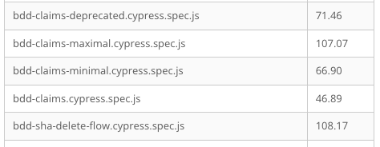
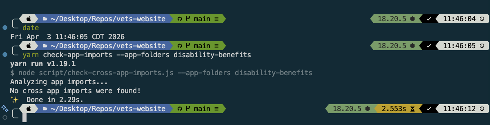

# QA Artifacts

## Introduction

This page provides evidence required as part of the Collaboration Cycle process for the Digital BDD project.

[Collaboration Cycle Ticket](https://github.com/department-of-veterans-affairs/va.gov-team/issues/134254)

## Regression Test Plan

Our test plans are hosted in TestRails. The "BDD SHA Upload" section was created to group our tests.

- [526 / Disability Experience: BDD SHA Upload](https://dsvavsp.testrail.io/index.php?/suites/view/2552&group_id=46311&group_by=cases:section_id&group_order=asc&display=tree&display_deleted_cases=0)

Specific to "Regression" testing, the following test case was added to ensure the new changes do not break existing
features.

- [(C166096) BDD User Can Upload SHA Part A - Existing Supporting Evidence Flow](https://dsvavsp.testrail.io/index.php?/cases/view/166096)
- [(C166101) Non-BDD User Does Not See SHA Upload UI](https://dsvavsp.testrail.io/index.php?/cases/view/166101&group_id=46311&group_by=cases:section_id&group_order=asc&display=tree&display_deleted_cases=0)

## Test Plan

Our test plans are hosted in TestRails. The "BDD SHA Upload" section was created to group our tests.

- [526 / Disability Experience: BDD SHA Upload](https://dsvavsp.testrail.io/index.php?/suites/view/2552&group_id=46311&group_by=cases:section_id&group_order=asc&display=tree&display_deleted_cases=0)

Specific to "Test Plan" testing, the following test case was added to ensure the new changes work as expected.

- [(C166099) BDD User Can Upload SHA Part A - Enhanced Supporting Evidence Flow](https://dsvavsp.testrail.io/index.php?/cases/view/166096)
- [(C166100) BDD User Can Upload SHA Part A - Warned when opting to not upload](https://dsvavsp.testrail.io/index.php?/cases/view/166100)
- [(C244338) BDD User Can Upload SHA Part A - Maximum Upload Limit](https://dsvavsp.testrail.io/index.php?/cases/view/244338)
- [(C244341) BDD User Can Upload SHA Part A - Warned before destructive action](https://dsvavsp.testrail.io/index.php?/cases/view/244341)
- [(C244342) BDD User Can Upload SHA Part A - Warned before destructive action from Review and Submit page](https://dsvavsp.testrail.io/index.php?/cases/view/244342)

## Traceability Reports - Coverage for References

Here is how our user stories map to test requirements. We should have 100% coverage based on this.

| Ticket name                                                                                                                | Test Case |
| -------------------------------------------------------------------------------------------------------------------------- | --------- |
| Create new SHA Part A Upload Page                                                                                          | C166099   |
| Add confirmation of SHA upload on supporting evidence summary page                                                         | C244345   |
| Add confirmation of SHA upload on Review & Submit and CoS page                                                             | C166100   |
| Remove SHA warning from additional evidence page if BDD SHA feature flag on                                                | C244345   |
| Remove SHA references from evidence types BDD page                                                                         | C244345   |
| Add warning message to review and submit page if SHA document was not uploaded                                             | C166100   |
| On new SHA Page, show destructive modal if "No, I do not want to upload my SHA" is selected and a SHA was already uploaded | C244342   |
| When SHA Flag is Turned Off and Veteran is on new SHA page, redirect to Supporting Evidence Orientation                    | C244344   |
| Ensure Enhanced Evidence Flow and BDD SHA Feature Flags route correctly                                                    | C166099   |
| Remove dropdown from V1 File Input for BDD SHA pages                                                                       | C244345   |
| Update submit-transformer to copy SHA into attachments if BDD flag is disabled                                             | C244343   |
| Remove the SHA reminder in the confirmation page if the user already uploaded a SHA                                        | C244345   |
| BDD SHA destructive modal should return focus to triggering button                                                         | C244341   |
| Enforce a minimum number of files required on BDD SHA Upload page                                                          | C244338   |
| Correct BDD SHA warning text on separation-health-assessment page                                                          | C244345   |
| Text correction needed on /separation-health-assessment-file-upload-v1                                                     | C244345   |

## Traceability Reports - Summary (Defects)

Team 5 utilized the following Google Sheet to track issues found during testing.

[BDD SHA Launch Issue Tracker](https://docs.google.com/spreadsheets/d/1N8ovqzhgeCGXJwaSZYWLoO-Ng1Yg9CtGoVCmVkCTuCo/edit?gid=0#gid=0)

## E2E Test Report

Cypress test for BDD SHA delete flow:

- [bdd-sha-delete-flow.cypress.spec.js](https://github.com/department-of-veterans-affairs/vets-website/blob/main/src/applications/disability-benefits/all-claims/tests/bdd-sha-delete-flow.cypress.spec.js)

Full e2e test with BDD SHA feature flag enabled

- [bdd-claims.cypress.spec.js](https://github.com/department-of-veterans-affairs/vets-website/blob/main/src/applications/disability-benefits/all-claims/tests/bdd-claims.cypress.spec.js)

Cypress helper file with new BDDA SHA workflow feature flag:

- [supporting-evidence/separation-health-assessment](https://github.com/department-of-veterans-affairs/vets-website/blob/main/src/applications/disability-benefits/all-claims/tests/cypress.helpers.js#L782)
- [supporting-evidence/summary](https://github.com/department-of-veterans-affairs/vets-website/blob/main/src/applications/disability-benefits/all-claims/tests/cypress.helpers.js#L832)

## E2E Tests - Best Practice Adherence

See tests listed above. We leverage stubbed endpoints for consistency and the platform provided `createTestConfig` helper for form testing.

## E2E Test Execution Time

Here are the Cypress Test Execution Times for the BDD Project, as gathered from the [E2E Domo Dasboard](https://va-gov.domo.com/page/604433393/kpis/details/1741293742).

As we see, there are some times that extend beyond the recommended 60 second limit. Team 5 is building on top of some
existing testing capabilities for Form 21-526EZ, which is a complex and long form, but the DBC engineers have committed
to evaluating existing test performance and findings ways to reduce the test execution time in the following ticket:

[#138130 - Investigate current E2E testing performance to share with DBC Engineering All-Hands](https://github.com/department-of-veterans-affairs/va.gov-team/issues/138130)

## Unit Test Coverage

[Report](https://github.com/user-attachments/files/26462188/index.html) generated by `yarn test:coverage-app --app-folder disability-benefits/all-claims`

### Test Files Touched or Added

- `tests/config/supportingEvidenceRouting.unit.spec.jsx`: added routing coverage across BDD SHA and supporting-evidence toggle combinations
- `tests/onFormLoaded.unit.spec.jsx`: added redirect coverage for hidden BDD SHA pages when the workflow is off
- `tests/pages/evidenceTypesBDD.unit.spec.jsx`: added flag-driven coverage for labels, help text, and submit-later behavior
- `tests/pages/additionalDocuments.unit.spec.jsx`: added coverage for the legacy self-assessment alert behavior
- `tests/components/CustomReviewTopContent.unit.spec.jsx`: added coverage for the review alert display conditions
- `tests/pages/summaryOfEvidence.unit.spec.jsx`: added coverage for summary behavior with SHA uploads and toggle state
- `tests/components/SeparationHealthAssessment.unit.spec.jsx`: added coverage for the SHA delete modal and related form-state changes
- `tests/pages/separationHealthAssessmentUploadV1.unit.spec.jsx`: added coverage for the V1 upload page contract and required logic
- `tests/submit-transformer.unit.spec.jsx`: added coverage for SHA upload attachment transformation and normalization
- `tests/utils/submit.unit.spec.jsx`: added coverage for merging SHA uploads into final attachments

## Unit Tests - Best Practice Adherence

- [x] Overview: Broad unit coverage exists across the main BDD SHA workflow paths
- [x] Unit Testing: Current app-level assertions are acceptable, and toggle-sync coverage is not required for this review
- [x] Dates and Time: Relative date usage is acceptable here because the values are generated and consumed immediately
- [x] Async Testing: Async form behavior and the SHA delete flow are covered in unit tests
- [x] Testing Tools: Existing Enzyme usage is legacy here, and no new Enzyme files were added for BDD SHA work
- [x] Compatibility: No clear BDD SHA-specific Node 22 or `window` mocking gap surfaced in the review

## Endpoint Monitoring

**Changes are primarily frontend-based and does not impact architecture. Listing existing solutions that Form 21-526EZ utilizes for mitigating issues.**

Form 21-526EZ endpoints have monitoring enabled through this dashboard.

[Dashboard - Benefits - Form 526 Disability Compensation Product Insights](https://vagov.ddog-gov.com/dashboard/ygg-v6d-nza/benefits-form-526-disability-compensation-product-insights?fromUser=false&refresh_mode=sliding&from_ts=1774969452129&to_ts=1775142252129&live=true)

The monitors for this dashboard get sent to the [#benefits-disability-notifications](https://dsva.slack.com/archives/C05URMLM09Z) Slack channel.

## Logging Silent Failures

**Changes are primarily frontend-based and does not impact architecture. Listing existing solutions that Form 21-526EZ utilizes for mitigating issues.**

Form 21-526EZ utilizes the Lighthouse `/synchronous` endpoint for the actual claim submission. If the claim submission
fails, the veteran is sent on a "backup" path that still shows their claim as being submitted successfully, but their
confirmation will just omit the claim id. This backup path will utilize an async job through SideKiq to submit their
claim to Lighthouse.

In addition to the claim submission, the "supporting evidence" is first stored in S3 and then when a claim is fully
submitted, a SideKiq job kicks off to upload that evidence to LightHouse.

The following dashboard provides monitoring for our SideKiq jobs, covering both of these use cases.

[Dashboard - vets-api-sidekiq](https://vagov.ddog-gov.com/apm/resource/vets-api-sidekiq/sidekiq.job/72c3579499cb45e6?query=env%3Aeks-prod%20operation_name%3Asidekiq.job%20service%3Avets-api-sidekiq&env=eks-prod&fromUser=false&summary=qson%3A%28data%3A%28visible%3A%21t%2Cchanges%3A%28%29%2Cerrors%3A%28selected%3Acount%2CgroupBy%3A%5B%5D%29%2Chits%3A%28selected%3Acount%2CgroupBy%3A%5B%5D%29%2Clatency%3A%28selected%3Alatency%2Cslot%3A%28agg%3A95%29%2Cdistribution%3A%28isLogScale%3A%21f%29%2CshowTraceOutliers%3A%21t%2CgroupBy%3A%5B%5D%29%2Csublayer%3A%28slot%3A%28layers%3AserviceAndInferred%29%2Cselected%3Apercentage%29%2ClagMetrics%3A%28selectedMetric%3A%21s%2CselectedGroupBy%3A%21s%29%29%2Cversion%3A%211%29&start=1775140623252&end=1775144223252&paused=false)

The monitors for this dashboard get sent to the [#benefits-disability-notifications](https://dsva.slack.com/archives/C05URMLM09Z) Slack channel.

## PDF Form Validation

Changes are purely frontend and do not involve PDF Form Generation.

## No Cross App Dependency

There are no cross-app dependencies as demonstrated through the script that audits for this.

