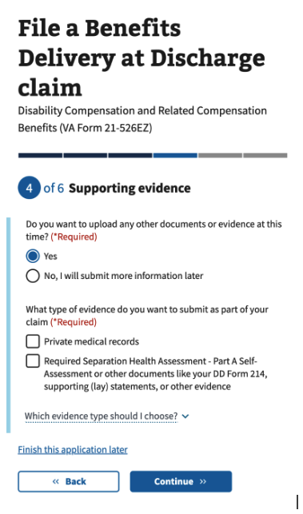
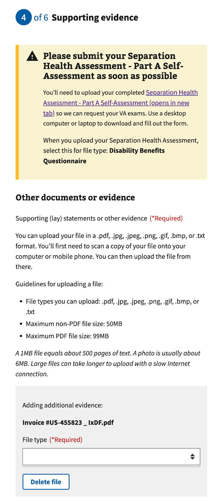
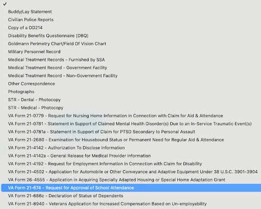
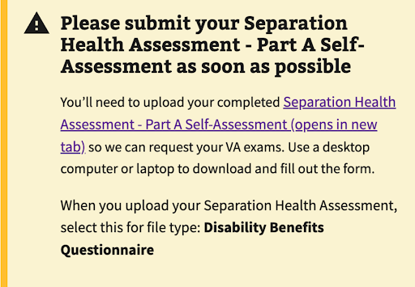
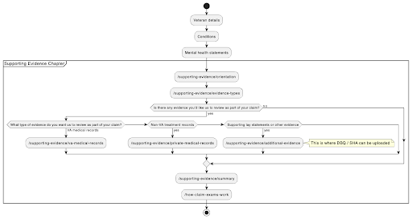
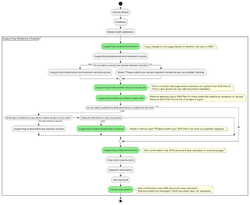
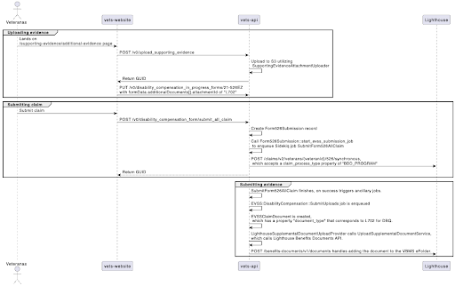
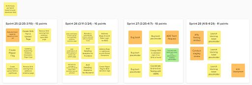

# BDD - SHA Part A Technical Project Documentation

| Area                          | Description                                                                                        |
| ----------------------------- | -------------------------------------------------------------------------------------------------- |
| **Project Goal**              | Increase the number of uploads of the SHA Part A document for veterans who qualify for BDD program |
| **Super Epic**                | [#125577](https://github.com/department-of-veterans-affairs/va.gov-team/issues/125577)             |
| **Current State of Document** | Complete                                                                                        |
| **Stakeholders**              | Daniel Vu, Oren Mittman, Eryn Sobing                                                               |
| **Assigned Team**             | Team 5                                                                                             |

# **High Level Overview**

VA Form 21-526EZ allows veterans to apply for disability compensation through VA.gov. The form is active in the production environment and continues to receive updates.

The Benefits Delivery at Discharge program (“BDD”) allows veterans to apply for compensation benefits 180 to 90 days before discharge and allows for an expedited adjudication process. In addition to the timeframe condition, the veteran is expected to include a Separation Health Assessment (“SHA”, commonly referred to as “SHA Part A”) as part of their claim. 

The work here is to improve the quality of Form 21-526EZ submissions by ensuring veterans are aware of the impact of the SHA on their submission and making it easier for veterans to upload the SHA.

# **Foundational Knowledge**

While the SHA document can be uploaded as part of Form 21-526EZ today, it is not necessarily obvious to the veteran on how to upload the SHA successfully.

In the Additional Evidence chapter, if the veteran qualifies for the BDD program, they are asked if they would like to upload additional documents. They are presented with two checkboxes, one which refers to the SHA Part A document but also to other documents.

If the bottom checkbox is selected, the next screen provides a file upload option, as well as a dropdown to select the type of document uploaded.

When the dropdown is selected, these options are shown.

In order to submit a SHA Part A document, the user should select the “Disability Benefits Questionnaire (DBQ)”. For those who are not familiar with the process, it isn’t obvious that this is the correct document type for the SHA Part A. As we review the page, the alert at the top provides some guidance.

SHA is just one type of DBQ document; there are other DBQ documents. The “Disability Benefits Questionnaire” downstream corresponds to the “L702” document type. 

Whether or not a submission is considered a “BDD” submission for LightHouse is controlled by an enum property. The LH Benefits Claim API takes in a property called "claim_process_type" that determines whether it's a BDD claim. It takes 3 values:

- STANDARD_CLAIM_PROCESS
- FDC_PROGRAM
- BDD_PROGRAM

Lighthouse does some of its [own date validation](https://github.com/department-of-veterans-affairs/vets-api/blob/e7339889bf26b78f16839b9cff343590148234a2/modules/claims_api/app/controllers/concerns/claims_api/v2/disability_compensation_validation.rb#L1145-L1163), but they don't make their own "determination". It seems like it's all driven on this claim_process_type.

vets-website [translates to populate the claim_process_type here](https://github.com/department-of-veterans-affairs/vets-api/blob/e7339889bf26b78f16839b9cff343590148234a2/lib/evss/disability_compensation_form/form526_to_lighthouse_transform.rb#L152-L160). That property comes from the [logic here](https://github.com/department-of-veterans-affairs/vets-api/blob/e7339889bf26b78f16839b9cff343590148234a2/lib/evss/disability_compensation_form/data_translation_all_claim.rb#L805-L815) based on days until the anticipated release date.

# **Anticipated Technical Challenges**

Although creating a new flow for the SHA document does not seem terribly challenging at surface level, there are certain challenges that should be accounted for.

- **Deadline established by mandate:** This project must be delivered by early April in order to help new policies with the VBA. This means that we should try to derisk the project delivery by being conscientious of project scope and being self-critical about all of the steps required to get a project to production.
- **Meeting Baseline Levels of Submissions:** Although we want to increase form submissions for BDD-qualified veterans that include the SHA Part A document, we cannot “hard block” the veteran from submitting Form 21-526EZ and lowering our overall levels of submissions. Thus, a solution that guides the veteran through a “soft block” is advised.
- **Risks around In-Progress Forms:** In-progress Forms (“IPF”) is a continual risk for Disability Benefit Compensation (DBC) teams as they evolve Form 21-526EZ. If users are in a chapter of Form 21-526EZ that is beyond the Additional Evidence chapter, then we’ll have to consider how to encourage the user to go back and submit their SHA Part A document.
- **Risks around In-Progress Forms and Feature Flags:** There have been reported bugs where returning a user to a page that is only conditionally available due to feature flags caused negative experiences for the veteran. We should be careful to design our solution to be resilient to transitions in the feature flag, both from off-to-on and on-to-off.
- **Ongoing Changes to the Form Flow and File Uploader**: Other teams are actively making changes to both the file uploader and the overall flow of Form 21-526EZ. To account for this, Team 5 will need to collaborate with the Core Team and the Pathways Team to ensure our changes align with the overall goals of all DBC teams.

# **Proposed Solution**

By separating out the SHA workflow to its own workflow, we hypothesize that we will increase the data quality of Form 21-526EZ submissions and make it easier for veterans to take the correct action.

- **Solution Summary:** Create a set of new dedicated pages for BDD-qualified veterans to submit their SHA Part A document. Modify existing pages to account for new flow. Place behind the work behind a new  “Enforce New BDD SHA Workflow” (disability_526_new_bdd_sha_enforcement_workflow_enabled) feature flag.
- **Key Deliverables:** 
  - New page utilizing new file uploader component

One thing that was discussed was the use of Optical Character Recognition (OCR) to validate if the user actually uploaded a SHA Part A document or if they mistakenly uploaded something else. Due to the hard deadline requirement, we are de-scoping this for the April deadline. More information can be found in the FAQ section down below.

# **Risks and Dependencies**

| Risk/Dependency                 | Impact | Mitigation/Contingency                                                                                                                                                                                                                                                                                                                                                                                                                                                                                                                                                                                                                                                                                |
| ------------------------------- | ------ | ----------------------------------------------------------------------------------------------------------------------------------------------------------------------------------------------------------------------------------------------------------------------------------------------------------------------------------------------------------------------------------------------------------------------------------------------------------------------------------------------------------------------------------------------------------------------------------------------------------------------------------------------------------------------------------------------------- |
| **Dependency on Core Team**     | Medium | **Contact**: Kyle Soskin  **Status** (Feb 11, 2026): Oren and Daniel reached out to discuss: • File validation implementation and public contract • Kyle flagged potential scope expansion; patterns exist in Simple Form Upload but require careful integration • Document type assignment without dropdown UI • Kyle recommended PUT request to `/21-526EZ` with hardcoded L702 type (pattern used for 0781, 4142)  **Action**: Follow up on implementation approach                                                                                                                                                                                                        |
| **Dependency on Pathways Team** | Medium | **Action**: Schedule kickoff with Pathways team  **Status** (Feb 11, 2026): Pathways released 0781 research findings (link below) • Kevin summarized applicability to SHA BDD work • Current solution aligns with their findings • Recommendation: Adopt patterns from new 0781 changes for SHA workflow  **Resources**: [0781 Evidence Upload Research Report](https://github.com/department-of-veterans-affairs/va.gov-team/blob/master/products/disability/526ez/research/2025-10-0781-EvidenceUpload/0781%20Evidence%20Upload%20Research%20Report.md) • [Summary Document](https://docs.google.com/document/d/1L6rzSUA568Y3Vc-QIKzG3sFEqvbfZENT7NPOcry11AM/edit?usp=sharing) |
| **Dependency on VBMS**          | Medium | **Contact**: Gabrielle Deabreu (Gabrielle.Deabreu@va.gov)                                                                                                                                                                                                                                                                                                                                                                                                                                                                                                                                                                                                                                             |

# **Architecture and Design**

The existing user flow for a non-BDD user is captured by this activity diagram below.

The BDD flow alters the flow by adding an additional stage. The first stage asks if service treatment records should be uploaded. Then the second stage asks if there are other documents to be uploaded, with altered choices of Private Medical Records and Other documents (which includes SHA Part A)

For our proposed solution, the pages that need to change are highlighted in green with additional notes to explain the change.

The technical flow for uploading a document is shown in the sequence diagram below.

The fastest implementation to meet our April deadline is to utilize the existing /v0/uploading_supporting_evidence endpoint along with the PUT with a hardcoded document type of L702 to /21-526EZ. This seems like a clean and sufficient solution but could lead to some rework as we begin the work to add file validation. However, it does not feel like so much rework that it would warrant starting with a different approach.

# **Technical Breakdown**

The following table demonstrates a low-level breakdown of the work that should ultimately evolve into tickets that are workable by the team.

**Milestone 1: Improve UI that Leads to an Increase of BDD Submissions with SHA Attached**

_What does this enable: Improved user clarity for a high-priority document_

_Medium Confidence Anticipated Level of Effort: 2 Sprints_

| Number | Title                                                                          | Description                                                                                                                                                                                                                    | Special Notes                                                                                                                                                                                                                                                                                                                                                                                                                 |
| ------ | ------------------------------------------------------------------------------ | ------------------------------------------------------------------------------------------------------------------------------------------------------------------------------------------------------------------------------ | ----------------------------------------------------------------------------------------------------------------------------------------------------------------------------------------------------------------------------------------------------------------------------------------------------------------------------------------------------------------------------------------------------------------------------- |
| 1.1    | Create Flipper Flag                                                            | Update vets-api and vets-website to create a new “Enforce New BDD SHA Workflow” feature flag.                                                                                                                                  |                                                                                                                                                                                                                                                                                                                                                                                                                               |
| 1.2    | Updating Supporting Evidence Orientation Page Copy                             | Conditionally flexing the text on the orientation page to describe                                                                                                                                                             |                                                                                                                                                                                                                                                                                                                                                                                                                               |
| 1.3    | Create SHA Part A Upload Page                                                  | Create a new page to upload the SHA document utilizing v3 file input component.  Account for error scenarios What if file uploading doesn’t work right now? Can they proceed?  What file types are allowed?     | The v3 components continue to receive updates. Because it is a shared component, the team may need to allocate extra time for addressing any issues we might find.                                                                                                                                                                                                                                                            |
| 1.4    | Remove SHA warning from evidence types BDD page                                | If the veteran selects “No” on whether there are additional documents they want to upload, we should no longer show a warning about SHA if the Enforce New BDD SHA Workflow” feature flag is enabled.                          |                                                                                                                                                                                                                                                                                                                                                                                                                               |
| 1.5    | Remove SHA warning from additional evidence page                               | We should no longer show a warning about SHA if the "Enforce New BDD SHA Workflow” feature flag is enabled and the veteran qualifies for BDD.                                                                                  |                                                                                                                                                                                                                                                                                                                                                                                                                               |
| 1.6    | Add confirmation of SHA upload on supporting evidence summary page             | Add a line item indicating that a document was uploaded for SHA                                                                                                                                                                |                                                                                                                                                                                                                                                                                                                                                                                                                               |
| 1.7    | Add confirmation of SHA upload on review and submit page                       | Add a line item indicating that a document was uploaded for SHA                                                                                                                                                                |                                                                                                                                                                                                                                                                                                                                                                                                                               |
| 1.8    | Add warning message to review and submit page if SHA document was not uploaded | If there is no SHA by the time the veteran gets to the Review & Submit page, we should show a warning.                                                                                                                         |                                                                                                                                                                                                                                                                                                                                                                                                                               |
| 1.9    | Manually redirect veterans with in-progress forms                              | If the veteran returns to an in-progress form and has progressed further than where we collect the SHA, provide a mechanism that redirects them back to the SHA upload page so their submission ultimately has a SHA included. |                                                                                                                                                                                                                                                                                                                                                                                                                               |
| 1.1    | Add DataDog Analytics for Frontend                                             | Add touchpoints for… New page  Review and Summary Redirect to New Page  Review and Summary Warning if no SHA has been uploaded                                                                                  | Work with UX to find any other touchpoints                                                                                                                                                                                                                                                                                                                                                                                    |
| 1.11   | Add DataDog Analytics for Backend                                              | Add touchpoints for… BDD submission  BDD submission with L702 attachment                                                                                                                                              | Work with UX to find any other touchpoints  Kyle mentioned Oren was working on some of this. He mentioned a recommendation to add the BDD status to the metadata of an In-Progress Form, which would avoid us needing to decrypt the form data to analyze this in the future.  Context: [Slack thread](https://dsva.slack.com/archives/C05QMQHQHKK/p1771010121379769?thread_ts=1771009259.460399&cid=C05QMQHQHKK) |
| 1.12   | Address Bugs Around Date Logic for BDD                                         | Current logic bases the BDD calculation on the date of the most recent application deployment rather than some attribute of the submission itself.                                                                             | Context:[Slack thread](https://dsva.slack.com/archives/C09EX6CDS3A/p1770656858166389)                                                                                                                                                                                                                                                                                                                                         |
| 1.13   | Address Bugs in Lighthouse around Raised Exceptions                            | Lighthouse seems to be “rejecting” BDD claims erroneously rather than demoting them in certain situations                                                                                                                      | Context: [Slack thread 1](https://dsva.slack.com/archives/C09EX6CDS3A/p1770675088352049?thread_ts=1770656858.166389&cid=C09EX6CDS3A)  [Slack thread 2](https://dsva.slack.com/archives/C09EX6CDS3A/p1770673463485139?thread_ts=1770671269.544359&cid=C09EX6CDS3A)                                                                                                                                                    |

# **Out of Scope**

The following potentially follow-up milestones are out of scope. 

**Milestone 2: Demotion of BDD to Pre-Discharge or Standard if SHA is not included**

_What does this enable: Improved upfront submission classification that reduces denied claims due to insufficient evidence for higher standard process_

_Medium Confidence Anticipated Level of Effort: 1 Sprint_

| Number | Title                                           | Description                                                                                                                                                                                                                 | Special Notes                                                                                                       |
| ------ | ----------------------------------------------- | --------------------------------------------------------------------------------------------------------------------------------------------------------------------------------------------------------------------------- | ------------------------------------------------------------------------------------------------------------------- |
| 2.1    | Create Flipper Flag                             | Update vets-api and vets-website to create a new “Enforce New BDD SHA Workflow” feature flag.                                                                                                                               |                                                                                                                     |
| 2.2    | Change BDD to standard claim if no SHA is found | Update the conditional for determining BDD status to include SHA check                                                                                                                                                      | Update EVSS::DisabilityCompensationForm::DataTranslationAllClaim  This might require a separate feature flag. |
| 2.3    | Coordinate End-to-End Testing with VBMS         | Now that the condition is changing as it is sent to Lighthouse, we will want to collaborate with others to validate end-to-end correctness. VBMS can be a bit of a black box, though we have accounts in a UAT environment. |                                                                                                                     |

**Milestone 3: Document Validation Utilizing OCR for SHA**

_**What does this enable**\_\_:_ Improved submission data quality by monitoring for potential human error

**Medium Confidence Anticipated Level of Effort**: 1 Sprint

_**Why is this out of scope**\_\_:_ The use of optical character recognition to validate that the user actually uploaded a SHA Part A document is a significant lift that could risk on-time delivery. Thus, we are treating this as a separate milestone.

| Number | Title                                                                                       | Description                                                                                                                                                                                                      | Special Notes                                                                                                                                                                                                                                                                                                                       |
| ------ | ------------------------------------------------------------------------------------------- | ---------------------------------------------------------------------------------------------------------------------------------------------------------------------------------------------------------------- | ----------------------------------------------------------------------------------------------------------------------------------------------------------------------------------------------------------------------------------------------------------------------------------------------------------------------------------- |
| 3.1    | Create an endpoint for allowing Form 526 Evidence Upload that includes document validation. | This creates a new endpoint that utilizes similar patterns to the Simple Form Upload tool.                                                                                                                       | Not all of the validation code from Simple Form Upload can be copied; Simple Form Upload utilizes the Shrine gem while Form 526 utilizes CarrierWave. But some of the internal implementation of the validation can be lifted.                                                                                                      |
| 3.2    | Update frontend to utilize new endpoint for document validation                             | With the new above endpoint, the UI will need to call this new endpoint and flex validation errors based on the results of the endpoint.                                                                         |                                                                                                                                                                                                                                                                                                                                     |
| 3.3    | Create configuration-driven workflow for supporting future evidence types.                  | The Simple Form Upload tool provides ways of adding new supported forms without code changes. Replicating this pattern ensures that we don’t need heavy development lift every time we want a new evidence type. | Refer to the following: [Vets-API Guide](https://github.com/department-of-veterans-affairs/vets-website/blob/main/src/applications/simple-forms/form-upload/README.md)  [Vets-Website Guide](https://github.com/department-of-veterans-affairs/vets-website/blob/main/src/applications/simple-forms/form-upload/README.md) |

**Milestone X: Establishing Participant ID, EDIPI, and BIRLS ID to ensure all applicants can start Form 21-526EZ**

_**What does this enable**\_\_:_ Improved top-of-the-funnel experience by ensuring more veterans in general are able to start Form 21-526EZ.

_**Low Confidence Anticipated Level of Effort**\_\_: 2 Sprints_

_**Why is this out of scope**\_\_:_ Further investigation needs to occur in order to scope this work. Because the first two milestones will already push the team to the April deadline, adding this work could risk on-time delivery. Thus, we are resting this as a separate milestone. 

| Number | Title              | Description | Special Notes |
| ------ | ------------------ | ----------- | ------------- |
| x.1    | Investigate effort |             |               |
| x.2    | Placeholder        |             |               |
| x.3    | Placeholder        |             |               |
| x.4    | Placeholder        |             |               |

**Milestone X: Modification of End Product Code to Enable Automation Down Stream**

_**What does this enable**\_\_:_ Reduction in average days to completion for BDD submissions through downstream automation benefits

_**Low Confidence Anticipated Level of Effort**\_\_:_ 2 Sprints

_**Why is this out of scope**\_\_:_ Further investigation needs to occur in order to scope this work. Because the first two milestones will already push the team to the April deadline, adding this work could risk on-time delivery. Thus, we are resting this as a separate milestone. 

| Number | Title              | Description | Special Notes |
| ------ | ------------------ | ----------- | ------------- |
| x.1    | Investigate effort |             |               |
| x.2    | Placeholder        |             |               |
| x.3    | Placeholder        |             |               |
| x.4    | Placeholder        |             |               |

# **Discussions / Frequently Asked Questions**

Maintain a current list of common questions, decisions, and clarifications for the project team and stakeholders.

| Question                                                                                                                                                                            | Answer                                                                                                                                                                                                                                                                                                                                                                                                                                                                                                                                                                                                                                                                                                                                                                                                                                                                                                                                                                                                                                                                                                                                                                                                                                                                                                                                                                                                                                                                                                                                                                                                                                                                                                                                |
| ----------------------------------------------------------------------------------------------------------------------------------------------------------------------------------- | ------------------------------------------------------------------------------------------------------------------------------------------------------------------------------------------------------------------------------------------------------------------------------------------------------------------------------------------------------------------------------------------------------------------------------------------------------------------------------------------------------------------------------------------------------------------------------------------------------------------------------------------------------------------------------------------------------------------------------------------------------------------------------------------------------------------------------------------------------------------------------------------------------------------------------------------------------------------------------------------------------------------------------------------------------------------------------------------------------------------------------------------------------------------------------------------------------------------------------------------------------------------------------------------------------------------------------------------------------------------------------------------------------------------------------------------------------------------------------------------------------------------------------------------------------------------------------------------------------------------------------------------------------------------------------------------------------------------------------------- |
| Will the April deadline include the use of Optical Character Recognition (OCR), similar to the Form Upload tool, to validate that the user actually uploaded a SHA Part A document? | No; in order to de-risk the April deadline, Team 5 discussed with Alejandro that this will not be part of the first milestone. However, we are planning to scope this as a fast follow-up milestone.                                                                                                                                                                                                                                                                                                                                                                                                                                                                                                                                                                                                                                                                                                                                                                                                                                                                                                                                                                                                                                                                                                                                                                                                                                                                                                                                                                                                                                                                                                                                  |
| Is it sufficient for SHA Part A to continue using L702 as a document type? This would ensure passivity but does it solve the data quality issue end-to-end?                         |                                                                                                                                                                                                                                                                                                                                                                                                                                                                                                                                                                                                                                                                                                                                                                                                                                                                                                                                                                                                                                                                                                                                                                                                                                                                                                                                                                                                                                                                                                                                                                                                                                                                                                                                       |
| Should the SHA uploaded through the new experience show up in the /supporting-evidence/additional-evidence page?                                                                    | Right now, all the changes would be in the frontend. This means there is nothing in the database that distinguishes a SHA uploaded as part of the new experience versus a SHA uploaded on the additional evidence page.  This could mean as they navigate from the new experience into the additional evidence page, they would see a document already uploaded, corresponding to the SHA the veteran uploaded earlier. This certainly isn’t ideal, but the team may want to discuss the tradeoffs and what we consider as acceptable behavior as we work towards the April deadline.                                                                                                                                                                                                                                                                                                                                                                                                                                                                                                                                                                                                                                                                                                                                                                                                                                                                                                                                                                                                                                                                                                                                           |
| Are there edge cases with the feature flag and in-progress forms?                                                                                                                   | Turning off-to-on  New veterans will see a new step, no issue  Existing in-progress forms that have not gotten to the Additional Evidence chapter will have no issue  Existing in-progress forms that have passed the Additional Evidence chapter should eventually see on Review & Submit that their SHA has not been included via the new UI  There is potential that veterans would have uploaded their SHA as part of existing flow with DBQ. The UI should probably provide guidance that this may be the case and is worth the veteran double checking.  Turning on-to-off  New veterans will not see the new step, no issue.  Existing in-progress forms that have not gotten to the Additional Evidence chapter will have no issue  Existing in-progress forms that have passed the Additional Evidence chapter will have a SHA uploaded through the new experience but have no way to return to that experience.  This means they cannot delete the SHA. While this is not an ideal experience, due to existing technical capabilities around uploaded documents, the document wouldn’t actually be deleted anyways.  Perhaps a bigger issue is that the veteran would have uploaded something, but the UI might reflect that a document is missing. This may depend on how conversations with the above question go; if SHA’s uploaded using the new experience also appear on the additional-evidence page, then there would be no issue and also give them a way to delete the SHA.  If we don’t show it on the additional-evidence page, the veteran may unintentionally upload two SHA’s, which could lead to data quality issues downstream in VBMS. |
| Are there edge cases with expiring BDD submissions?                                                                                                                                 | If a submission no longer qualifies for BDD but a SHA is already attached, it should not be an issue that a SHA is included. SHA’s can be included even for non-BDD submissions as a form of DBQ.  If a submission no longer qualifies for BDD but a SHA is not attached, the UI may reflect that a document is required when in reality, it isn’t. The likelihood of this seems low; the wizard appears every time the veteran opens Form 21-526EZ, which provides an opportunity to re-evaluate whether a submission qualifies for BDD and thus flex what fields are required.                                                                                                                                                                                                                                                                                                                                                                                                                                                                                                                                                                                                                                                                                                                                                                                                                                                                                                                                                                                                                                                                                                                                                |

# **Glossary / Acronyms**
| Term | Definition |
| --- | --- |
| **Benefits Delivery at Discharge (BDD)** | Service members who are separating and plan to file for disability compensation can file their claim before separation through the Benefits Delivery at Discharge (BDD) program. The BDD program allows Service members to apply for VA disability compensation benefits between 180 to 90 days prior to separation. This timeframe permits VA to review Service Treatment Records (STRs), schedule needed exams and evaluate the claim before separation. BDD's goal is to deliver a decision within 30 days after separation. [Source](https://benefits.va.gov/BENEFITS/benefits-delivery-discharge-program.asp) |
| **Fully Developed Claim (FDC)** | The Fully Developed Claims program allows veterans to get decisions on disability benefit claims faster by allowing the veteran to upload evidence along with their claims. This typically involves all evidence being uploaded and an additional certification that all required evidence has been uploaded, as well as a willingness to go to any VA medical exams scheduled as part of the claims process. [Source](https://www.va.gov/disability/how-to-file-claim/evidence-needed/fully-developed-claims/) |
| **Separation Health Assessment (SHA)** | A medical assessment document completed during military service that provides clinical information for disability claims evaluation. SHA Part A is commonly referenced in the BDD process and corresponds to the DBQ (Disability Benefits Questionnaire) document type L702 in VA systems. |
| **Service Treatment Records (STRs)** | Military medical records and health documentation created during active service that support disability compensation claims. |

# **References**

- [Form 21-526EZ](https://www.va.gov/disability/file-disability-claim-form-21-526ez/introduction)
- [New (v3) file upload component code](https://github.com/department-of-veterans-affairs/vets-website/blob/712ab3d6cbcc07a449019d2d734ef37b758240db/src/platform/forms-system/src/js/web-component-patterns/fileInputPattern.jsx)
- [Old (v1?) file upload component code](https://github.com/department-of-veterans-affairs/vets-website/blob/712ab3d6cbcc07a449019d2d734ef37b758240db/src/platform/forms-system/src/js/definitions/file.js)
- [Example on uploading with hardcoded attachmentId](https://github.com/department-of-veterans-affairs/vets-website/blob/ec7190a3c3e8b310afe1d143cd7dc156a2605c96/src/applications/disability-benefits/all-claims/pages/uploadPersonalPtsdDocuments.jsx#L6-L22)
  - May need to verify if this is using the v3 or v1 file uploader.

- [Example on submission of Form 0781 with specific attachment id](https://github.com/department-of-veterans-affairs/vets-api/blob/2b8a20e589c5e7d730744d470c067293ad3dec81/app/sidekiq/evss/disability_compensation_form/submit_form0781.rb#L37)
- [Attachment Key List that determines which files are uploaded](https://github.com/department-of-veterans-affairs/vets-website/blob/ec7190a3c3e8b310afe1d143cd7dc156a2605c96/src/applications/disability-benefits/all-claims/constants.js#L256-L268)
- [Gist: Subset of the form config with mapping between 526 form pages and allowed document upload types](https://gist.github.com/nihil2501/ee182d544a4d49dee3402762ea3fc0d9)
  - Context: [Slack Conversation](https://dsva.slack.com/archives/C09EX6CDS3A/p1770848472614369)

- [Conversation about the number of in-progress BDD forms](https://dsva.slack.com/archives/C05QMQHQHKK/p1771009259460399)

# **Appendix**

**Consideration with toggling feature flags**

The following scenario can lead to negative experiences occurring when working with feature flags.

1. Turn on the feature toggle for a new page
2. User proceeds up to the new page and then invokes the "finish application later" UX and leaves
3. Turn off the feature toggle for the a new page
4. User returns and then invokes the "continue where I left off" UX
5. The user's situation and navigability within the form degrades (clarified below)

There are multiple variants of this issue but a recent experiment shows this:

1. User lands on the page that should be feature-toggled off
2. Forward and back buttons both take user back to /introduction with an option to continue or start over
3. Continue loops back to step 1 here, causing an infinite loop and forcing the user to start over

**Example Sprint Planning Exercise**

Below is an example of how the tickets may get assigned to each sprint. It aims to account for dependencies between tickets, show the overall point allocation against sprints, and show where certain ceremonies occur.

