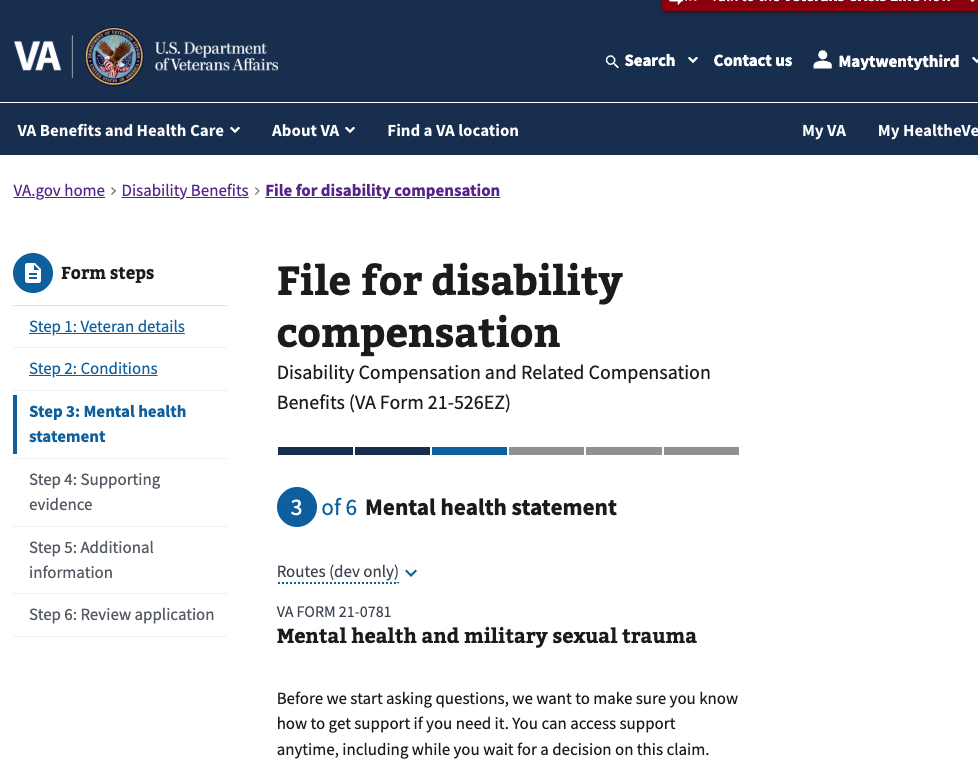
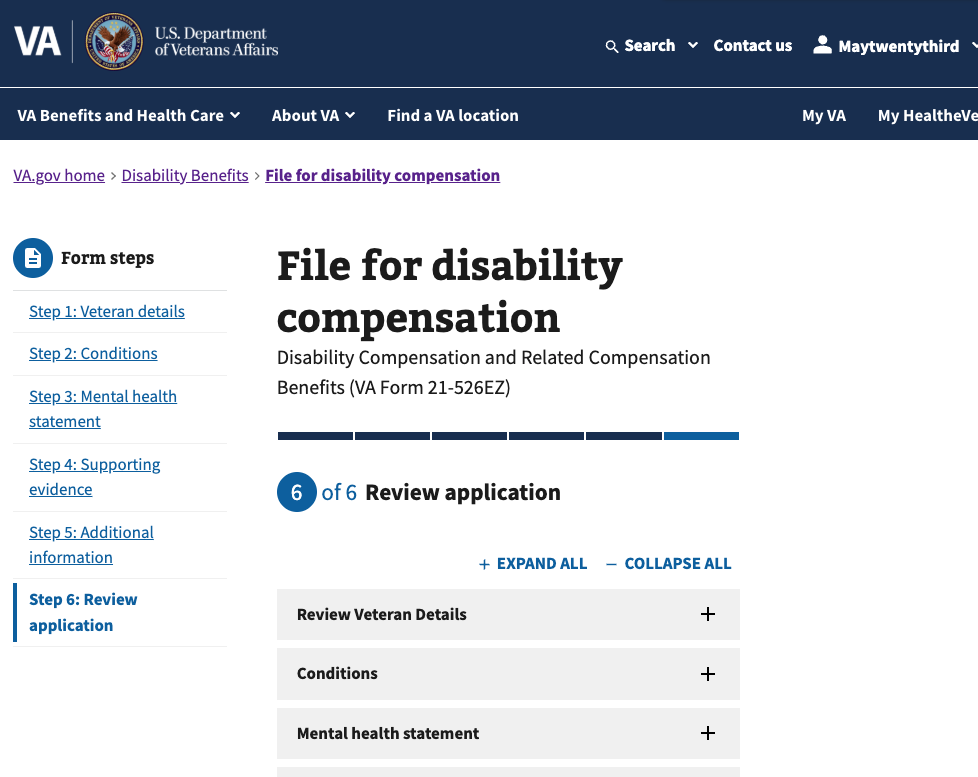
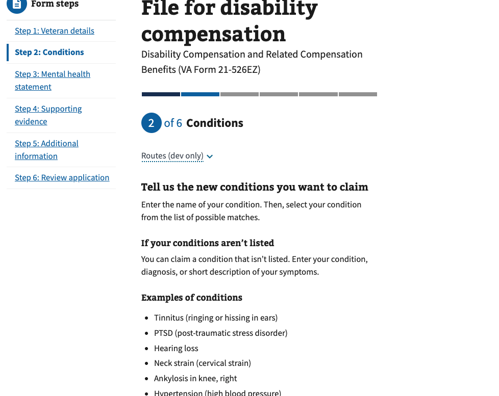
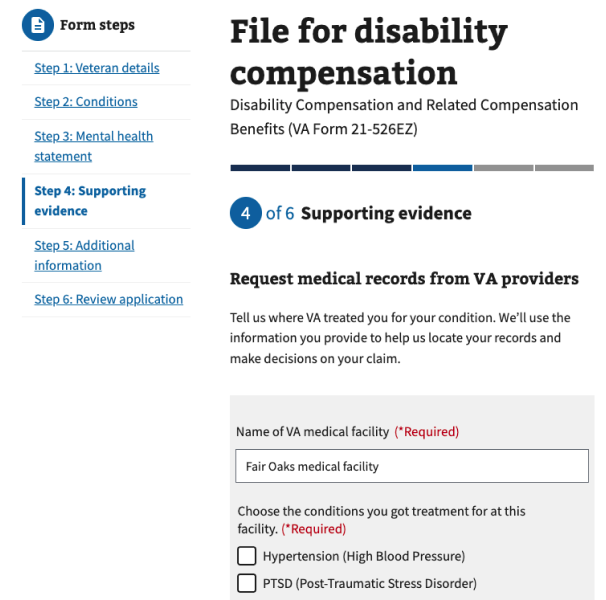

# Side Nav Reset Technical Project Documentation

| Area                          | Description                                                                                  |
| ----------------------------- | -------------------------------------------------------------------------------------------- |
| **Project Goal**              | Prevent issues in Form 21-526EZ that may occur by skipping through chapters via the Side Nav |
| **Super Epic**                | TODO                                                                                         |
| **Current State of Document** | In-Progress                                                                                  |
| **Stakeholders**              | Daniel Vu, Eryn Sobing, Bianca Rivera Alvelo                                                 |
| **Assigned Team**             | Team 5                                                                                       |

# **High Level Overview**

VA Form 21-526EZ allows veterans to apply for disability compensation through VA.gov. The form is active in the production environment and continues to receive updates.

Recently, Team 5 introduced a new Side Navigation component that allows veterans to visit previously visited chapters.
While this greatly improves overall ease of use for the form, it can lead to scenarios where veterans are skipping
questions that could improve the quality of their submission and ultimately impact their adjudication.

The Side Nav component has not been released to production and is awaiting coordination from several teams for
fixes that will improve the stability of the Side Nav launch.

The work here is to improve the quality of Form 21-526EZ submissions by ensuring the Side Nav "resets" to prevent
forward navigation through important and required questions.

# **Foundational Knowledge**

The Side Nav looks like this today. Initially, unvisited steps are disabled and veterans can only visit past steps.



Once the veteran finishes filling out all steps of Form 21-526EZ, they are able to visit all steps utilizing the side
navigation.



They can navigate back and in its current state, the Side Nav has all links enabled.



---

There are various points in Form 21-526EZ where there are inter-step question & answer dependencies. Team has done
various exercises to audit these inter-step dependencies, which can be found below.

[Engineering Audit on Complete Form 21-526EZ Flow](https://github.com/department-of-veterans-affairs/va.gov-team/issues/131893#issuecomment-4042227138)
[UX Audit Focussed on Addition Conditions](https://github.com/department-of-veterans-affairs/va.gov-team/issues/131087)
[FigJam Demonstrating Various Considerations](https://www.figma.com/board/XAQ24YZZFD9Vqi1lII8f7Q/526---Team5---Side-Navigation---Flows?node-id=416-4939&p=f&t=f9Kox5Fj1B62YhBb-0)

For convenience, here is a single example extracted and summarized from those findings:

- Conditions actions such as adding new, updating existing, removing existing
  - The answers to the conditions questions show up as changed questions and options in the Mental Health Statement and Supporting Evidence steps.

Here is an example where the conditions previously added in the form show up in later steps (Supporting Evidence).



Because of situations like this, it is important to...

1. Reduce mechanisms that lead the veteran to missing important questions
2. Guide the veteran as they make changes that have downstream impacts

This body of work focuses purely on #1. Team 5 will collaborate with other teams to improve the user experience around
#2 as part of a separate effort.

# **Anticipated Technical Challenges**

These are the following hurdles the team will have to consider while implementing this feature.

- **"Over Resetting":** "Over Resetting" refers to when the Side Nav resets progress when no high-impact change has occurred.
  One example is resetting the Side Nav when no change has been made. Another example is resetting the Side Nav when an
  answer is changed but nothing in the rest of the form references that answer. This poses a user experience problem; the
  original goal of the Side Nav is to improve flexibility of navigation throughout the form. Disabling navigation without
  justification can lead to negatively surprising the veteran and frustrating them as part of the process.
- **"Under Resetting":** "Under Resetting" refers to failing to reset the Side Nav when a high-impact change occurs. For
  example, if the conditions for a veteran are changed, this impacts the Supporting Evidence step. Under resetting can
  affect submission quality and potentially the adjudication of the claim.
- **Solution Scaling for Future Teams and Features:** Side Nav is a global feature in a complex form. In order
  for the development of this feature to scale, we either need to (1) ensure the correct abstractions are in place for other teams to
  "self-service" the resetting of the form or we need to (2) ensure our abstraction internally handles global use cases
  that scale for current and future use cases.
- **Communicating the Justification of a Reset to Veterans:** The act of disabling a Side Nav is a pattern that will
  likely be new and foreign to veterans. The pattern isn't prevalent across any industries the team has worked in before,
  so special care will have to be taken into how this is presented to prevent frustration.
- **Saved In Progress Forms & Return URL's:** The veteran may opt to select "Save & Finish Later". The solution must be
  able to store the latest state and be able to disambiguate between (1) the experience of going through a question
  initially, (2) the experience of returning to a question but not having made a high-impact change, and (3) the experience
  of returning to a question but a high-impact changed occurred necessitating the need for a Side Nav reset.

# **Proposed Solution**

There are two solutions that immediately come to mind, but through collaboration, there may be other options discovered.

- **Solution "A" Summary:** Create a selective "High Impact Questions" registry that track all questions whose change in
  answer would necesitate a reset.
- **Key Deliverables:** 
  - A programmatic map of all the "High Impact" questions, containing how to determine a "changed" answer as well as
    metadata on where to reset the side nav to.
  - Documentation for future teams on how to update this map.
  - An event listener that tracks previous form data and incoming form data and compares it against this high-impact map.
  - Changes to Side Nav to disable links on reset
  - A UI Component for signifying the justification for the reset.

- **Solution "B" Summary:** "Always" reset on Side Nav navigation
- **Key Deliverables:** 
  - An event listener that tracks clicks on the Side Nav.
  - Changes to Side Nav to disable links on reset
  - Handle situations utilizing back button.
  - A UI Component for signifying the justification for the reset.

We see commonalities between the deliverables of both solution. In some ways, Solution "B" could be a iterative stepping
stone towards Solution "A", and follows the MVP analogy of "delivering the skateboard first, then a bicycle, then the
car".

Here is a more in-depth comparison of the two solutions:

| Factor                        | Approach A (Selective)                          | Approach B (Immediate)                            |
| ----------------------------- | ----------------------------------------------- | ------------------------------------------------- |
| **User Experience**           | Better — only resets when truly needed          | Worse — forces re-navigation even for minor edits |
| **Implementation Complexity** | Higher — field registry, change detection       | Lower — simple index comparison                   |
| **Files Modified**            | 3-5 files (new utils + ClaimFormSideNav)        | 1 file (ClaimFormSideNav)                         |
| **Maintenance**               | Higher — all teams must maintain field registry | Lower — no field tracking needed                  |
| **Risk of Over-Reset**        | Low                                             | High                                              |
| **Risk of Under-Reset**       | Medium (if field registry incomplete)           | None                                              |
| **Testing Effort**            | Higher — many field scenarios                   | Lower — fewer scenarios                           |

# **Risks and Dependencies**

| Risk/Dependency | Impact | Mitigation/Contingency |
| Veterans may still "gloss over" downstream questions, even after blocking side navigation progress and providing warning that progress was reset. | Medium | Accepting risk; future initiatives can improve question-specific alerting. |

# **Architecture and Design**

For demonstrative purposes, here is what a theoretical "High-Impact Questions" registry may look like.

The code was generated by AI utilizing Claude Opus 4.5 in context of vets-website but has been reviewed for general feasibility.

This example is built on the following prompt:

"For the example, we can utilize the cross dependency between the Conditions chapter and the Supporting Evidence chapter. The conditions added show up as individual checkboxes in the Supporting Evidence chapter. This means adding, removing, or modifying the conditions in the Conditions chapter can cause a semantic change in the previous answers of the Supporting Evidence chapter."

```javascript
// src/applications/disability-benefits/all-claims/utils/highImpactFields.js

import { sippableId } from "./index";

/**
 * @typedef {Object} HighImpactField
 * @property {string} path - Dot-notation path to the field in formData
 * @property {number} resetToChapter - Chapter index to reset to when this field changes
 * @property {function} hasImpactfulChange - Comparator function to detect meaningful changes
 * @property {string} description - Human-readable description for debugging/logging
 */

/**
 * Registry of fields that impact downstream form chapters.
 * When these fields change, chapters after `resetToChapter` should be disabled.
 *
 * Chapter indices:
 *   0 - Veteran details
 *   1 - Conditions (disabilities)
 *   2 - Mental health statement
 *   3 - Supporting evidence
 *   4 - Additional information
 */
export const HIGH_IMPACT_FIELDS = [
  {
    path: "newDisabilities",
    resetToChapter: 1, // Reset from Conditions forward (affects Supporting Evidence)
    description:
      "Conditions appear as checkboxes in VA/private treatment facility pages",
    hasImpactfulChange: (oldValue, newValue) => {
      // Compare sippable IDs of conditions - these are what appear as checkboxes
      const oldIds = (oldValue || [])
        .map((d) => sippableId(d?.condition || ""))
        .filter(Boolean)
        .sort();
      const newIds = (newValue || [])
        .map((d) => sippableId(d?.condition || ""))
        .filter(Boolean)
        .sort();

      // Change is impactful if the set of condition IDs changed
      if (oldIds.length !== newIds.length) return true;
      return oldIds.some((id, i) => id !== newIds[i]);
    },
  },
  {
    path: "ratedDisabilities",
    resetToChapter: 1,
    description:
      "Rated disabilities also appear as checkboxes in treatment facility pages",
    hasImpactfulChange: (oldValue, newValue) => {
      // Only care about disabilities user selected for increase
      const getSelectedIds = (disabilities) =>
        (disabilities || [])
          .filter((d) => d["view:selected"])
          .map((d) => sippableId(d.name || ""))
          .sort();

      const oldIds = getSelectedIds(oldValue);
      const newIds = getSelectedIds(newValue);

      if (oldIds.length !== newIds.length) return true;
      return oldIds.some((id, i) => id !== newIds[i]);
    },
  },
  {
    path: "view:selectableEvidenceTypes",
    resetToChapter: 3, // Reset Supporting Evidence chapter only
    description: "Evidence type selection controls which upload pages appear",
    hasImpactfulChange: (oldValue, newValue) => {
      const keys = [
        "view:hasVaMedicalRecords",
        "view:hasPrivateMedicalRecords",
        "view:hasOtherEvidence",
      ];
      return keys.some((key) => oldValue?.[key] !== newValue?.[key]);
    },
  },
];

/**
 * Detects if any high-impact field changed between old and new form data.
 * Returns the lowest chapter index that should be reset, or null if no reset needed.
 *
 * @param {Object} oldData - Previous form data snapshot
 * @param {Object} newData - Current form data
 * @param {number} currentChapterIdx - User's current chapter index
 * @returns {number|null} - Chapter index to reset to, or null if no reset needed
 */
export function detectHighImpactChange(oldData, newData, currentChapterIdx) {
  let lowestResetChapter = null;

  for (const field of HIGH_IMPACT_FIELDS) {
    // Only check fields in chapters the user has already visited
    // (changes to future chapters don't matter yet)
    if (field.resetToChapter > currentChapterIdx) {
      continue;
    }

    const oldValue = getNestedValue(oldData, field.path);
    const newValue = getNestedValue(newData, field.path);

    if (field.hasImpactfulChange(oldValue, newValue)) {
      // Track the lowest (earliest) chapter that needs reset
      if (
        lowestResetChapter === null ||
        field.resetToChapter < lowestResetChapter
      ) {
        lowestResetChapter = field.resetToChapter;
      }
    }
  }

  return lowestResetChapter;
}

/**
 * Helper to get nested value from object using dot-notation path
 * @param {Object} obj - Object to traverse
 * @param {string} path - Dot-notation path (e.g., 'view:claimType.view:claimingNew')
 * @returns {*} - Value at path or undefined
 */
function getNestedValue(obj, path) {
  if (!obj || !path) return undefined;
  return path.split(".").reduce((current, key) => current?.[key], obj);
}
```

From there, the consumption in `ClaimFormSideNav.jsx` would look like the following:

```javascript
// Add import
import { detectHighImpactChange } from "../utils/highImpactFields";

// Inside component, add ref to track previous form data
const previousFormDataRef = useRef(formData);

// Add useEffect to detect high-impact changes
useEffect(() => {
  const prevData = previousFormDataRef.current;

  // Only check if user is on an earlier chapter than their max visited
  if (currentChapter?.idx < maxChapterIndex) {
    const resetTo = detectHighImpactChange(prevData, formData, maxChapterIndex);

    if (resetTo !== null && resetTo < maxChapterIndex) {
      // Reset to the affected chapter index
      setFormData({
        ...formData,
        "view:sideNavChapterIndex": Math.max(resetTo, currentChapter.idx),
      });
    }
  }

  // Update ref for next comparison
  previousFormDataRef.current = formData;
}, [formData]);
```

---

Comparatively, the solution for Solution B is a simpler. `ClaimFormSideNav.jsx` can add the following to the click
handler.

The code was generated by AI utilizing Claude Opus 4.5 in context of vets-website but has been reviewed for general feasibility.

```javascript
function handleClick(e, pageData) {
  e.preventDefault();
  const destination = pageData.path;

  // Detect backward navigation and reset
  const isBackwardNavigation = pageData.idx < maxChapterIndex;
  const updatedFormData = isBackwardNavigation
    ? { ...formData, "view:sideNavChapterIndex": pageData.idx }
    : formData;

  setFormData(updatedFormData);
  router.push(destination);
}
```

There would have to be additional code to handle back navigation but compared to Solution A, this should be
comparatively simple.

# **Technical Breakdown**

TODO

# **Out of Scope**

The following items are out of scope. 

- **Disabling backwards navigation**: It is important to call out that this body of work is focussed on preventing
  "forward" navigation. Preventing backwards navigation for any reason, such as an error on the current question, could
  unintentionally soft-lock a veteran in the form and is ill-advised.
  **Handling Side Nav Reset Due to In-line Review & Submit Edits**: There are existing validation concerns with Review &
  Submit that require their own focus. This body of work focuses on purely the Side Navigation as veterans navigate back
  through the original pages of the form. Once on the Review & Submit page, we should "lock" the state of the
  Side Nav so that in-line edits do not cause extra alerting to appear.

# **Discussions / Frequently Asked Questions**

Maintain a current list of common questions, decisions, and clarifications for the project team and stakeholders.

| Question | Answer | Date Answered |
| -------- | ------ | ------------- |

# **Glossary / Acronyms**

| Term | Definition |
| ---- | ---------- |

# **References**

- [Form 21-526EZ](https://www.va.gov/disability/file-disability-claim-form-21-526ez/introduction)
- [Engineering Audit on Complete Form 21-526EZ Flow](https://github.com/department-of-veterans-affairs/va.gov-team/issues/131893#issuecomment-4042227138)
- [UX Audit Focussed on Addition Conditions](https://github.com/department-of-veterans-affairs/va.gov-team/issues/131087)
- [FigJam Demonstrating Various Considerations](https://www.figma.com/board/XAQ24YZZFD9Vqi1lII8f7Q/526---Team5---Side-Navigation---Flows?node-id=416-4939&p=f&t=f9Kox5Fj1B62YhBb-0)
