# BDD SHA Document Validation Technical Project Documentation

| Area                          | Description                                                                            |
| ----------------------------- | -------------------------------------------------------------------------------------- |
| **Project Goal**              | Increase service member or veteran confidence as they start Form 21-526EZ.             |
| **Super Epic**                | [#108100](https://github.com/department-of-veterans-affairs/va.gov-team/issues/108100) |
| **Current State of Document** | In Progress                                                                            |
| **Stakeholders**              | Daniel Vu, Eryn Sobing                                                                 |
| **Assigned Team**             | Team 5                                                                                 |

# **High Level Overview**

VA Form 21-526EZ allows veterans to apply for disability compensation through VA.gov. The form is active in the
production environment and continues to receive updates.

Upon starting the form, veterans are shown a “wizard” that shows them a series of questions that determine if Form 21-526EZ is applicable to them. This helps them avoid unneeded paperwork, but it reappears every time they open the form, creating a point of friction. The wizard also poses an accessibility concern; there is no clear end point with its series of nested fields and the pattern has never been tested with a screen reader.

This epic encompasses the work to create a more cohesive experience for the veteran when they start Form 526 that utilizes modern patterns approved by the platform team.

# **Foundational Knowledge**

To begin the Form 526 process, the veteran begins on the unauthenticated landing page.

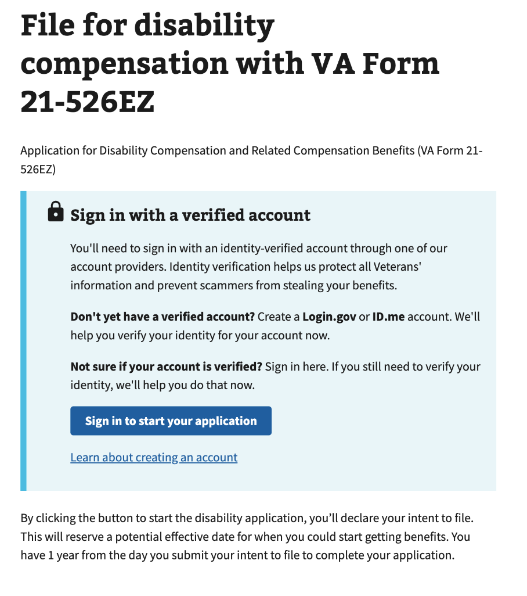

Once the veteran has logged in, they are navigated to the start page.

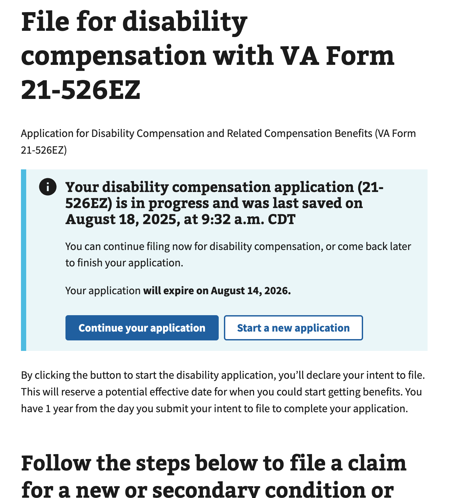

The start page utilizes a “wizard” pattern, which guides the veteran through a series of questions to determine if the 526EZ form is applicable to the veteran.

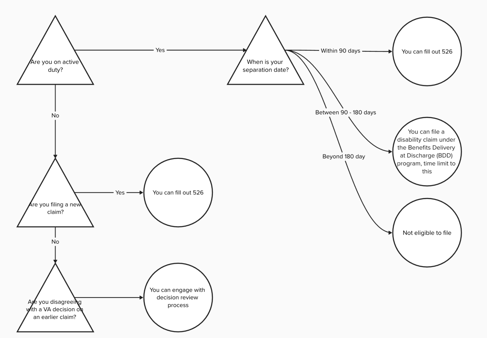

This wizard helps the system classify the veteran. Some veterans may still be on active duty. If they are filling the form out between 90 to 180 days before their discharge date, they are eligible to fill the form out as part of the “Benefits Delivery at Discharge” (BDD) program. The experience of Form 526, as well as some of the data that is submitted to the backend, changes based on whether they qualify for BDD or not.

| Differences in User Interface between Non-BDD and BDD Submissions   |                           |                           |
| :------------------------------------------------------------------ | :------------------------ | :------------------------ |
| **Description**                                                     | **Non-BDD Submissions**   | **BDD Submissions**       |
| Header changes                                                      | 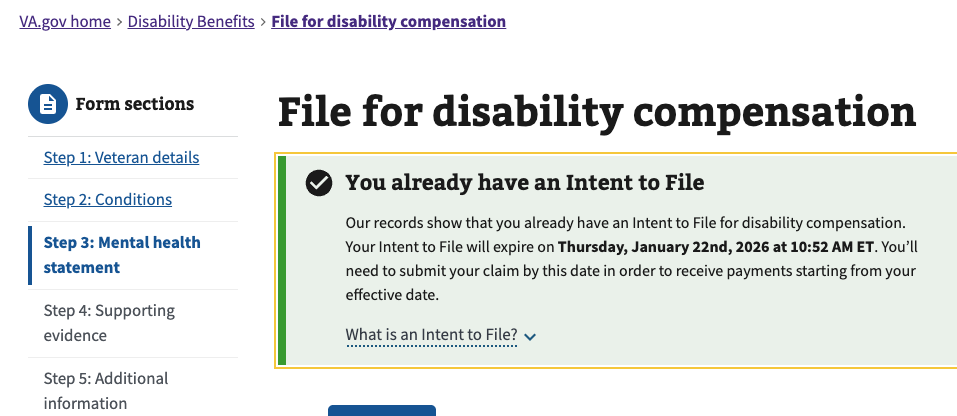 | 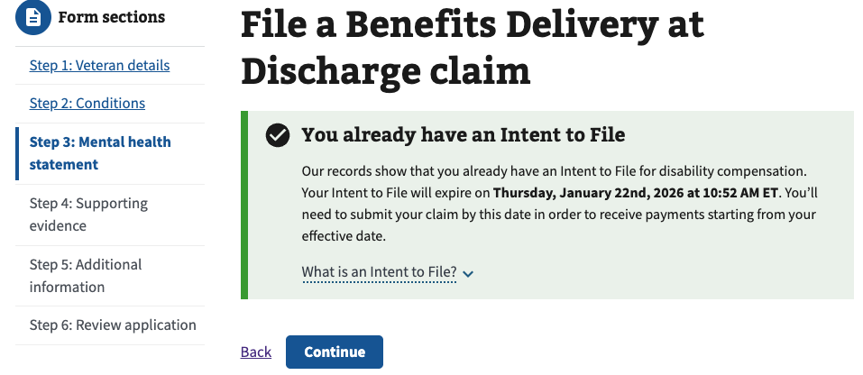  |
| Submission Confirmation Page \- Reminder for Self-Health Assessment | 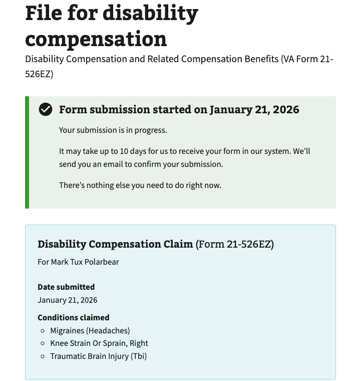 | 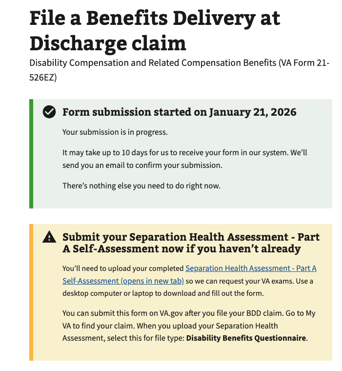  |
| Introduction Page                                                   |   | 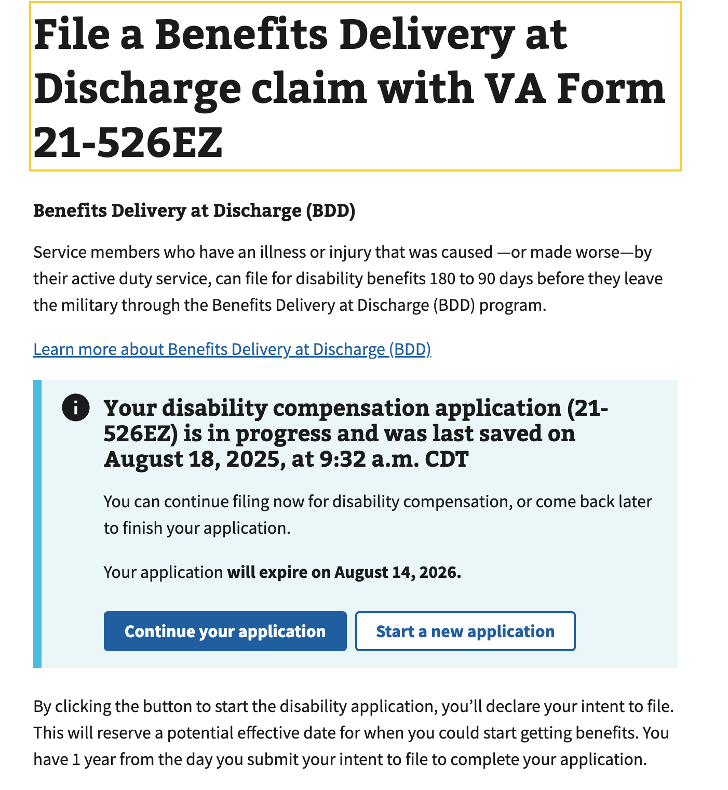 |
| Conditions Question                                                 | 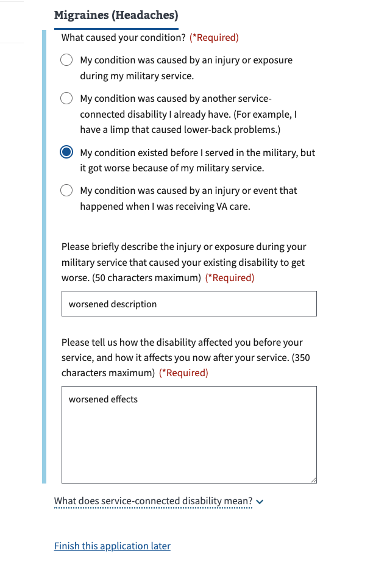 | 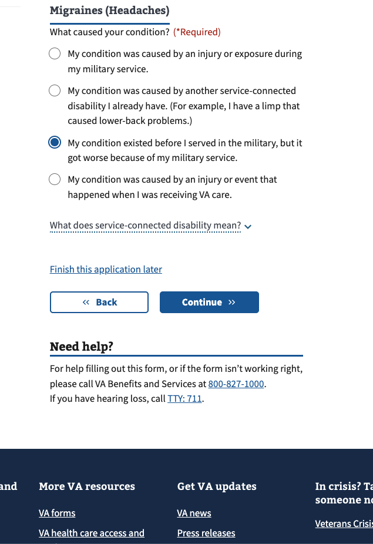  |

The wizard also has an end destination that allows them to dispute claims. This takes them to this static content hosted here:

[https://www.va.gov/decision-reviews/](https://www.va.gov/decision-reviews/)

Once the wizard is complete, the system checks whether an “Intent to File” (ITF) has been submitted. The ITF stores the date at which the form was first opened. A veteran has 1 year from the ITF date to submit the form. In the situation where an existing ITF is not found, the alert states “Your Intent to File request has been submitted”. This ITF interface is shown every time the form is started, even on subsequent visits.

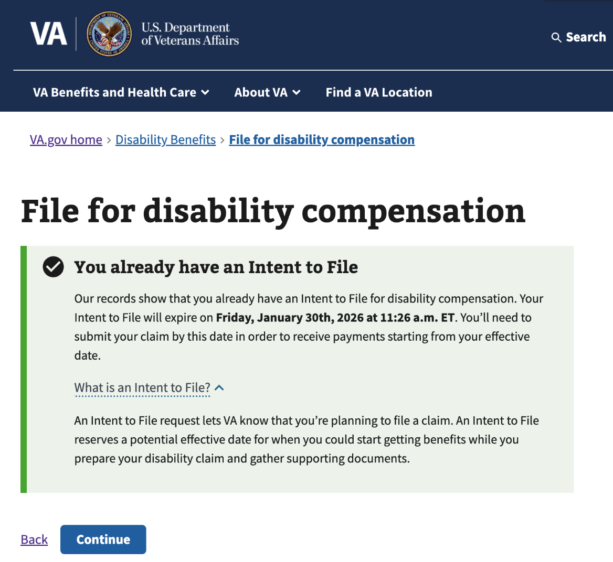

Once they click continue, the veteran is taken to the main content of Form 526\.

# **Anticipated Technical Challenges**

**Based on prior technical decisions, it is crucial that BDD designation is determined up-front for Form 526\.** Here are a list of code changes that utilize the BDD status to adjust various parts of the form.

| Functionality                                                                                                                                                                                                                                                                                                                                                                                                                            | Code                                                                                                                                                                                                                                                                                                                                                                                          |
| :--------------------------------------------------------------------------------------------------------------------------------------------------------------------------------------------------------------------------------------------------------------------------------------------------------------------------------------------------------------------------------------------------------------------------------------- | :-------------------------------------------------------------------------------------------------------------------------------------------------------------------------------------------------------------------------------------------------------------------------------------------------------------------------------------------------------------------------------------------- |
| Page header                                                                                                                                                                                                                                                                                                                                                                                                                              | [https://github.com/department-of-veterans-affairs/vets-website/blob/bd8d34e06cd9fdda180ba77b19db5fddfaaa65ce/src/applications/disability-benefits/all-claims/Form526EZApp.jsx\#L117-L120](https://github.com/department-of-veterans-affairs/vets-website/blob/bd8d34e06cd9fdda180ba77b19db5fddfaaa65ce/src/applications/disability-benefits/all-claims/Form526EZApp.jsx#L117-L120)           |
| Form submission transformer \- Required Descriptions Utilized to “default” some answers for BDD veterans. [From a previous merge request](https://github.com/department-of-veterans-affairs/vets-website/pull/14675): “In the BDD flow for all-claims, we want to hide the description fields on the new disability follow up page. These fields are still required though, so we need to add default values in the submit transformer.” | [https://github.com/department-of-veterans-affairs/vets-website/blob/bd8d34e06cd9fdda180ba77b19db5fddfaaa65ce/src/applications/disability-benefits/all-claims/submit-transformer.js\#L148-L181](https://github.com/department-of-veterans-affairs/vets-website/blob/bd8d34e06cd9fdda180ba77b19db5fddfaaa65ce/src/applications/disability-benefits/all-claims/submit-transformer.js#L148-L181) |
| Form submission transformer \- Fully Developed Claim The standard claim property is set to false, making it a "fully developed claim" submission. This value is usually ignored in the BDD flow. However, if the submission falls out of BDD status, we want it to be a fully developed claim.                                                                                                                                           | [https://github.com/department-of-veterans-affairs/vets-website/blob/bd8d34e06cd9fdda180ba77b19db5fddfaaa65ce/src/applications/disability-benefits/all-claims/submit-transformer.js\#L296-L305](https://github.com/department-of-veterans-affairs/vets-website/blob/bd8d34e06cd9fdda180ba77b19db5fddfaaa65ce/src/applications/disability-benefits/all-claims/submit-transformer.js#L296-L305) |

---

In addition to determining BDD status, the wizard asks the veteran for their separation date. This is saved in session storage and utilized to prepopulate some of the data used in the Military History question.

| Area             | Code                                                                                                                                                                                                                                                                                                                                                                                                                    |
| :--------------- | :---------------------------------------------------------------------------------------------------------------------------------------------------------------------------------------------------------------------------------------------------------------------------------------------------------------------------------------------------------------------------------------------------------------------- |
| Military History | [https://github.com/department-of-veterans-affairs/vets-website/blob/bd8d34e06cd9fdda180ba77b19db5fddfaaa65ce/src/applications/disability-benefits/all-claims/components/UpdateMilitaryHistory.jsx\#L46-L59](https://github.com/department-of-veterans-affairs/vets-website/blob/bd8d34e06cd9fdda180ba77b19db5fddfaaa65ce/src/applications/disability-benefits/all-claims/components/UpdateMilitaryHistory.jsx#L46-L59) |

# **Proposed Solution**

An initial recommendation is to break up the end goal into smaller milestones. While each milestone may not fully achieve the desired effect on its own, an iterative approach allows us to make progress and continue to discuss and learn about future goals.

- **Milestone 1.1: Convert the “Wizard” design pattern to the “Complete a Sub Task” design pattern**
  - Improves screen reader accessibility and overall cognitive load.
- **Milestone 1.2: Improve static content on the Introduction page**
  - Better help veterans prepare for filling out Form 21-526EZ.
- **Milestone 2: Improve persistence/retention of answers from Wizard / Sub Task**
  - Reduces friction upon returning to the form.

Although these are separate milestones, they are most effective when paired with each other. Therefore, my recommendation
is to utilize a single feature flag for all of this called `disability_526_new_start_experience_enabled`.

# **Risks and Dependencies**

| Risk/Dependency                                 | Mitigation/Contingency                                                                                   | Impact |
| :---------------------------------------------- | :------------------------------------------------------------------------------------------------------- | :----- |
| Form 526 is reachable from both VA.gov and MyVA | Ensure test plans include reference to both flows. Ensure accounts are available in both VA.gov and MyVA | Medium |

# **Architecture and Design**

Robin (Rob) Garrison had previously done work to convert the Wizard into the Sub-task pattern but it was left as
"commented-out-dead-code" [here](https://github.com/department-of-veterans-affairs/vets-website/blob/main/src/applications/disability-benefits/all-claims/routes.jsx#L9).
This means the pattern is set but we'd probably need to update for modern standards, both coding and content-wise.

Rob's original implementation utilizes client-side state to handle the routing; the URL in the browser does not change
as questions are answered.

Based on discussion with Rob, it sounds like he did this work to assist the original 526 team migrate, but the team
prioritized making parallel changes to the Wizard and then carrying the changes over to the sub-task pattern was never
resumed.

---

Improving the static content should not be a huge lift but it should accompany the migration to the Sub-task pattern.
We can utilize a feature flag but we'll want to be careful if we choose to make changes to the "unauthenticated"
experience. We typically do a progressive rollout based on "user", but if the changes occur on the unauthenticated page,
we'll need to do a progressive rollout based on "session". Conversation around this was held [here](https://dsva.slack.com/archives/C05QMQHQHKK/p1775853108263249).

---

Improving the retention of the Wizard / Sub-task answers is the most difficult portion of this work. One of the
technical difficulties with this requirement is the over-reliance on “session storage” within the Form 526 code base to
store form data. Session storage is a capability of a web browser to store data while the web application is open for a
user. While this is sufficient in storing the BDD status while the veteran is initially filling out the form, if they
choose to close the browser, this data is then lost. Because of this, we effectively “lose” whether or not the veteran
is a BDD veteran.

Remediation of this issue would typically involve storing this data on the server rather than in the browser. This would
allow longer-term storage of the BDD status. However, this greatly increases the overall scope and complexity of the
project.

We could technically attempt to store this information in "local storage". However, we would have to be much more
deliberate where we "unset" these stored values, as local storage could be unsuitable if multiple veterans use a shared
computer. Therefore, utilizing a new server API would be a more ideal, secure implementation.

# **Technical Breakdown**

**Milestone 1.1: Convert the “Wizard” design pattern to the “Complete a Sub Task” design pattern**

_Medium Confidence Anticipated Level of Effort: 2 Sprints, 1 engineer_

| Title                                                                                     | Description | Special Notes |
| ----------------------------------------------------------------------------------------- | ----------- | ------------- |
| Create Feature Flag                                                                       | --          | --            |
| Update existing implementation to link end of sub-task flow into authenticated start page | --          | --            |
| Update content in Sub-task flow                                                           | --          | --            |
| Update to high-fidelity implementation                                                    | --          | --            |
| Bug bash                                                                                  | --          | --            |
| Fix issues                                                                                | --          | --            |
| Add DataDog RUM events                                                                    | --          | --            |
| Create DataDog Dashboard                                                                  | --          | --            |

**Milestone 1.2: Improve static content on the Introduction page**

_Medium Confidence Anticipated Level of Effort: 1 Sprints, 1 engineer_

Assumes building on top of work in Milestone 1.1.

| Title                        | Description | Special Notes |
| ---------------------------- | ----------- | ------------- |
| Update static content        | --          | --            |
| Add DataDog RUM events       | --          | --            |
| Update DataDog RUM dashboard | --          | --            |

**Milestone 2: Improve persistence/retention of answers from Wizard / Sub Task**

_Medium Confidence Anticipated Level of Effort: 2 Sprints, 1 engineer_

Assumes building on top of work in Milestone 1.1.

| Title                                                     | Description | Special Notes |
| --------------------------------------------------------- | ----------- | ------------- |
| Create feature flag                                       | --          | --            |
| Fill out Security & Engineering Checklist                 | --          | --            |
| Architecture Intent                                       | --          | --            |
| Create new endpoint for storing Sub-task answers          | --          | --            |
| Add DataDog logging to backend                            | --          | --            |
| Update frontend to call new endpoint for Sub-task answers | --          | --            |
| Update DataDog dashboard                                  | --          | --            |
| Bug Bash                                                  | --          | --            |
| Fix bugs                                                  | --          | --            |
| Staging Review                                            | --          | --            |
| Staggered Rollout                                         | --          | --            |

# **Out of Scope**

The “Intent to File” banner appears every time you open the form. This is helpful in reminding the veteran how long they have to finish Form 526\. While this is potentially more useful to the veteran than the wizard, it still conflicts with the ideal goal of “resuming the form exactly where the veteran left off”.

The ITF status is fetched via an API call to GET `/intent_to_file` . This happens every time the veteran first enters the form and does not utilize session storage. The client-side JavaScript stores this data, so if the page is refreshed or if the veteran exits the application, then this data is lost.

This might be one way of creating milestones of this work:

1. **New UI for new ITF vs existing ITF**
   1. We should only need to see a banner for ITF the “first” time it is created.
   2. On subsequent visits, we should not need a blocking banner that is acknowledged every time. It may be useful to surface this as extra context throughout the form or as part of the “Finish this application later” flow.

# **Discussions / Frequently Asked Questions**

| Question | Answer | Date Clarified |
| :------- | :----- | :------------- |
|          |        |                |

# **Glossary / Acronyms**

| Term                                 | Definition                                                                                                                                                                                                                                                                                                                                                                                                                                                                                                                                                                                                                                                                                                          |
| :----------------------------------- | :------------------------------------------------------------------------------------------------------------------------------------------------------------------------------------------------------------------------------------------------------------------------------------------------------------------------------------------------------------------------------------------------------------------------------------------------------------------------------------------------------------------------------------------------------------------------------------------------------------------------------------------------------------------------------------------------------------------ |
| Benefits Delivery at Discharge (BDD) | [Source](https://benefits.va.gov/BENEFITS/benefits-delivery-discharge-program.asp) “Service members who are separating and plan to file for disability compensation can file their claim before separation through the Benefits Delivery at Discharge (BDD) program. The BDD program allows Service members to apply for VA disability compensation benefits between 180 to 90 days prior to separation. This timeframe permits VA to review Service Treatment Records (STRs), schedule needed exams and evaluate the claim before separation. BDD’s goal is to deliver a decision within 30 days after separation.”                                                                                                |
| Intent to File (ITF)                 | [Source](https://www.va.gov/disability/how-to-file-claim/) “If you plan to file for disability compensation using a paper form, you may want to submit an intent to file form first. This can give you the time you need to gather your evidence while avoiding a later potential start date (also called an effective date). When you notify us of your intent to file, you may be able to get retroactive payments (compensation that starts at a point in the past). Note: If you file for disability compensation online, then you don’t need to notify us of your intent to file. This is because your effective date gets set automatically when you start filling out the form online—before you submit it.” |
| Fully Developed Claim                | [Source](https://www.va.gov/disability/how-to-file-claim/evidence-needed/fully-developed-claims/)The Fully Developed Claims program allows veterans to get decisions on disability benefit claims faster by allowing the veteran to upload evidence along with their claims. This typically involves all evidence being uploaded and an additional certification that all required evidence has been uploaded, as well as a willingness to go to any VA medical exams scheduled as part of the claims process.                                                                                                                                                                                                      |

# **References**

[Form 21-526EZ](https://www.va.gov/disability/file-disability-claim-form-21-526ez/introduction)

[VA Design Patterns \- Wizard](https://design.va.gov/patterns/wizards)

[VA Design Patterns \- Complete a Sub Task](https://design.va.gov/patterns/help-users-to/complete-a-sub-task)

[Deprecation of the Wizard Pattern](https://github.com/department-of-veterans-affairs/vets-design-system-documentation/issues/399)
