# 526EZ Detailed Architecture Diagrams by Phase

## Phase 1: Authentication & Application Entry

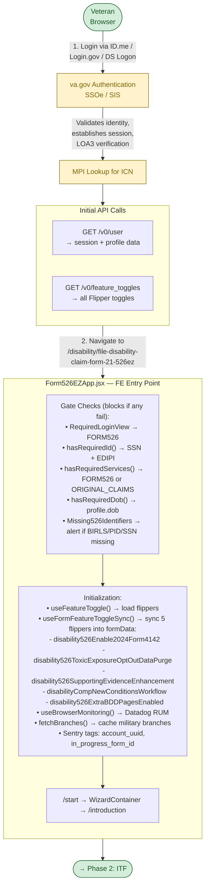

## Phase 2: Intent to File

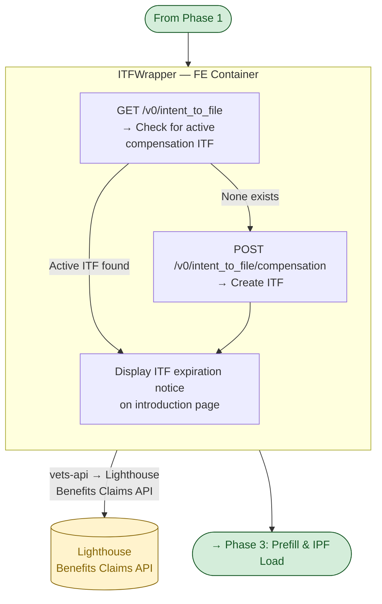

## Phase 3: Prefill & IPF Load

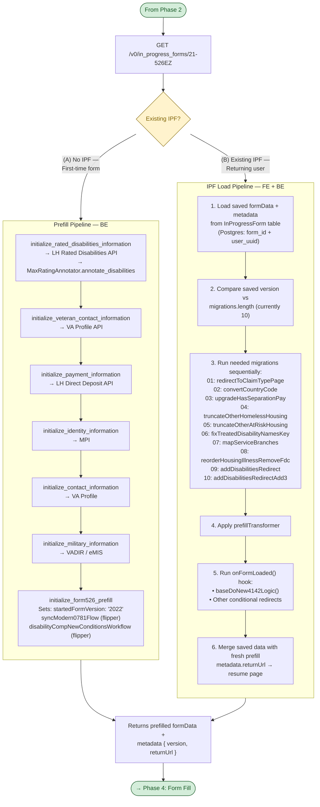

## Phase 4: Form Fill

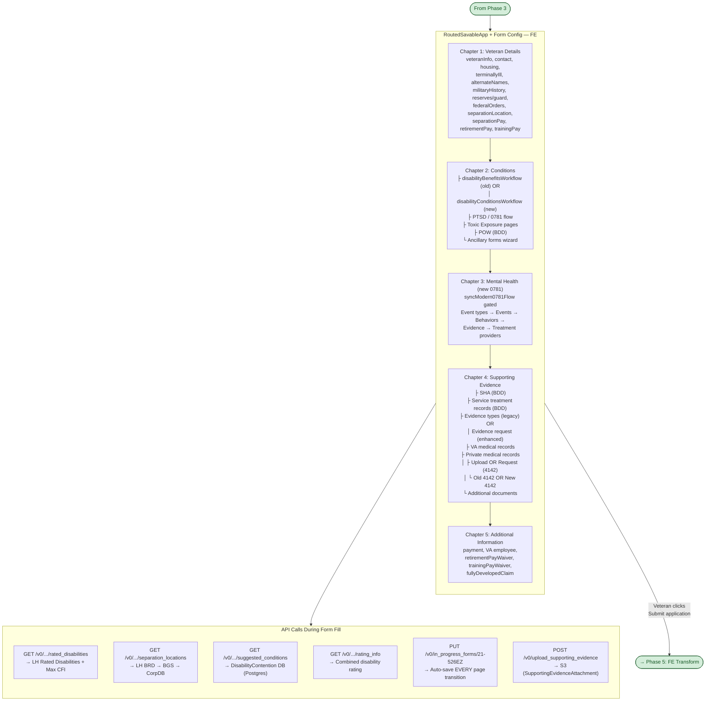

## Phase 5: Frontend Transform

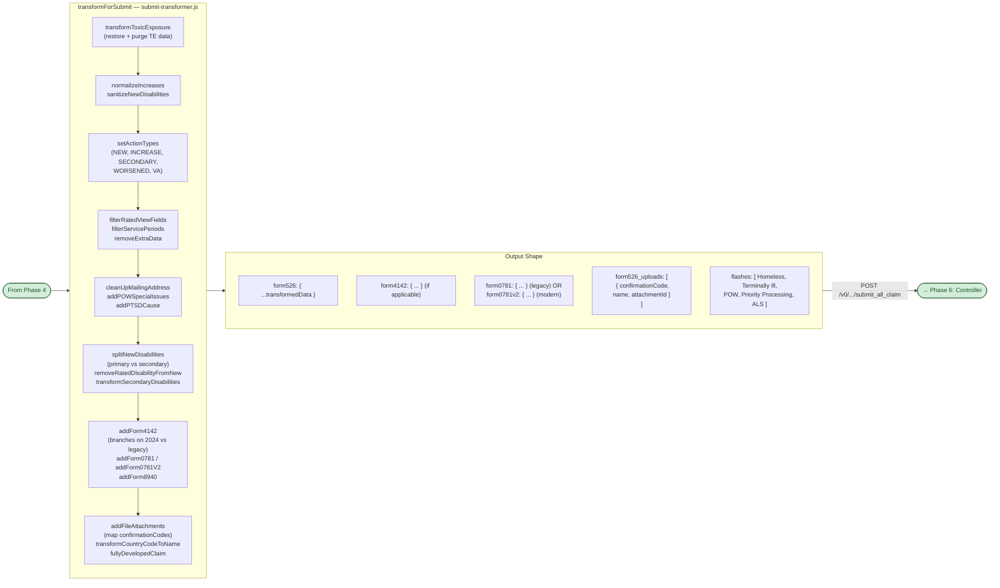

## Phase 6: Controller / Synchronous Actions

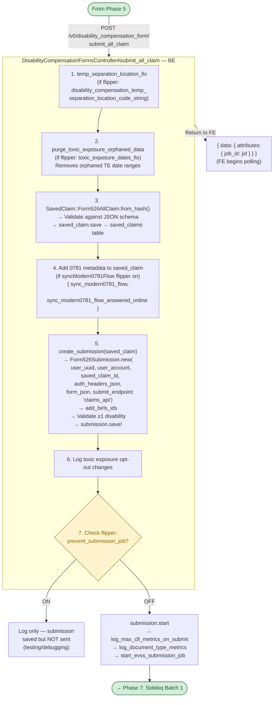

## Phase 7: Sidekiq Batch 1 — Primary 526 Submission

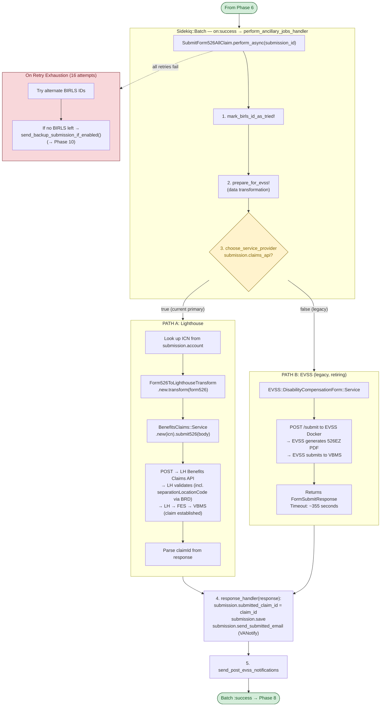

## Phase 8: Sidekiq Batch 2 — Ancillary Jobs

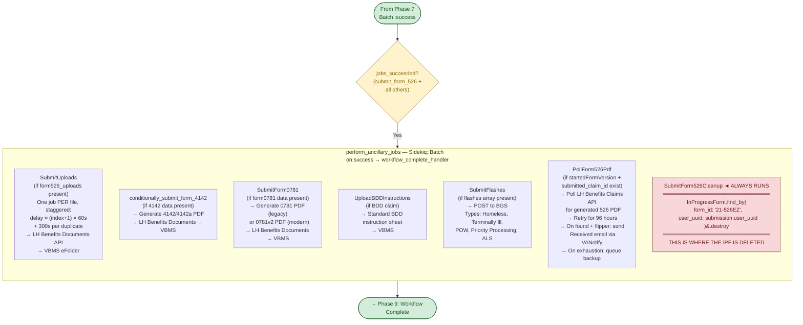

## Phase 9: Workflow Complete

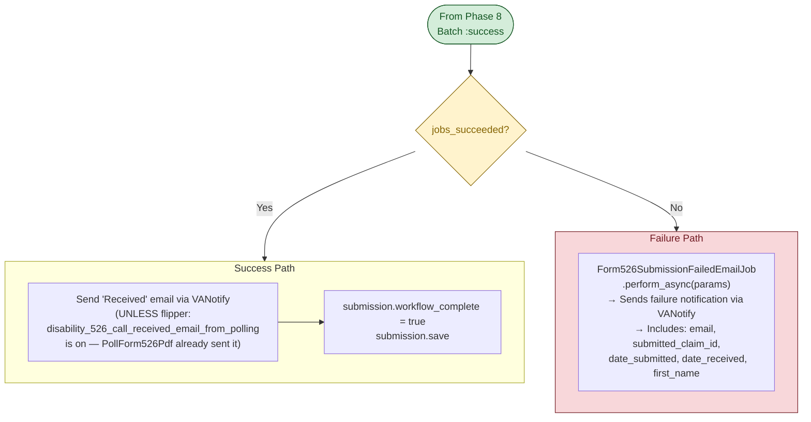

## Phase 10: Backup Submission Path

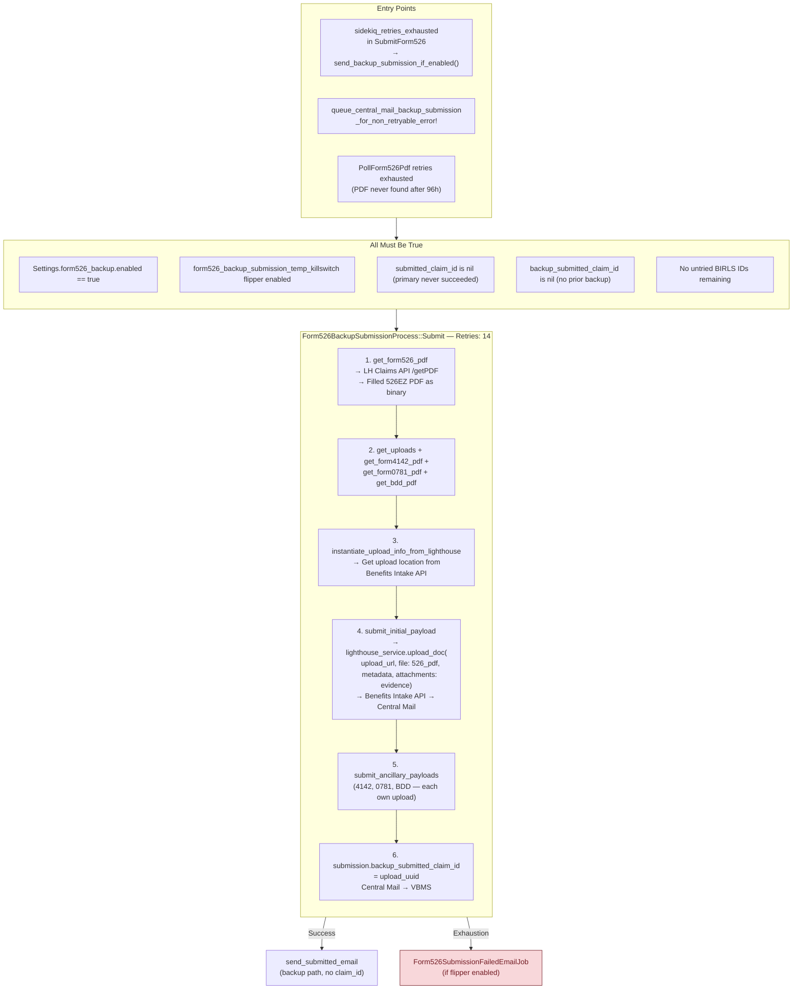

## Confirmation Page (Frontend, concurrent with Phases 7–9)

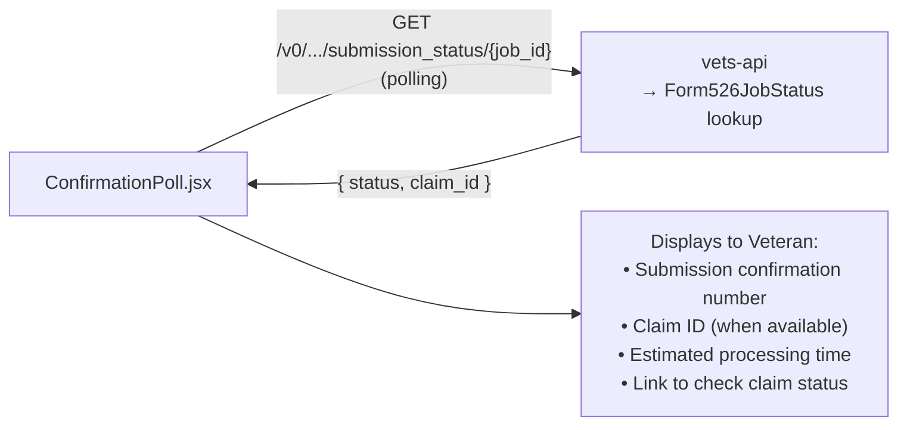

## Separation Location Code Validation Chain

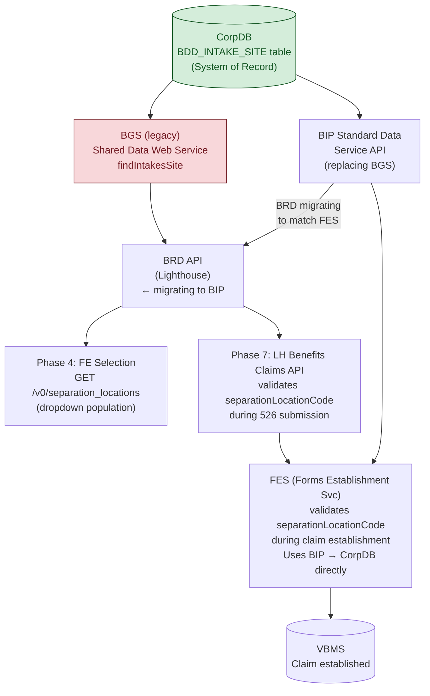

## External Services Reference

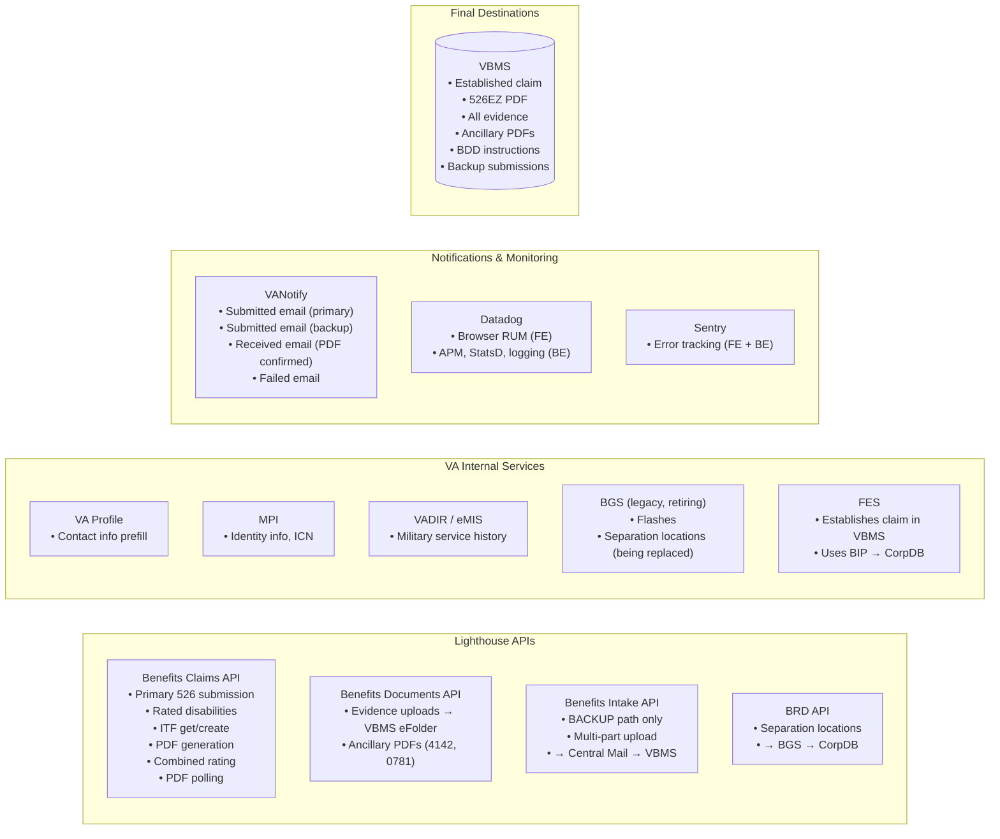

## Data Stores

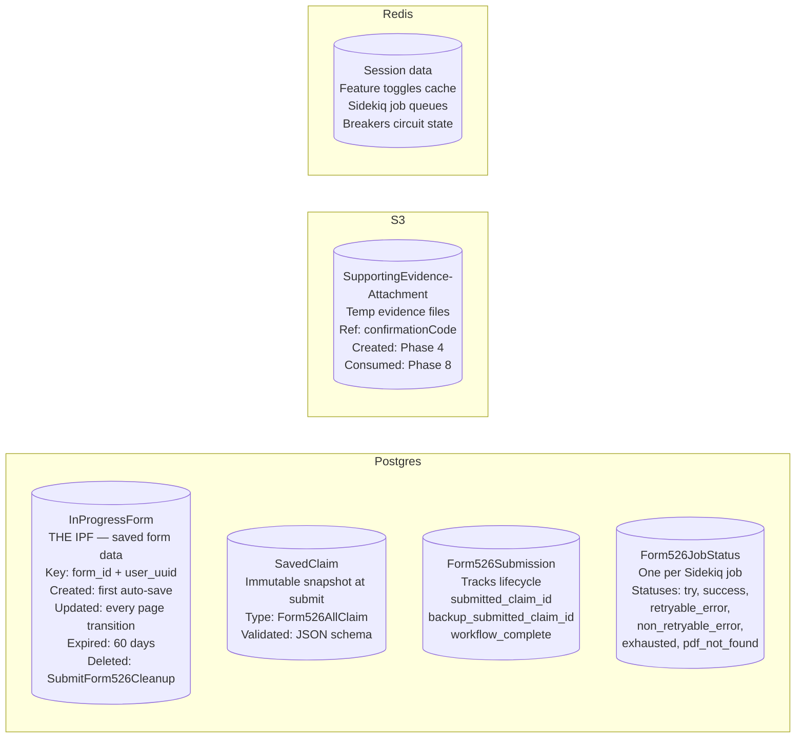

## Happy Path Sequence

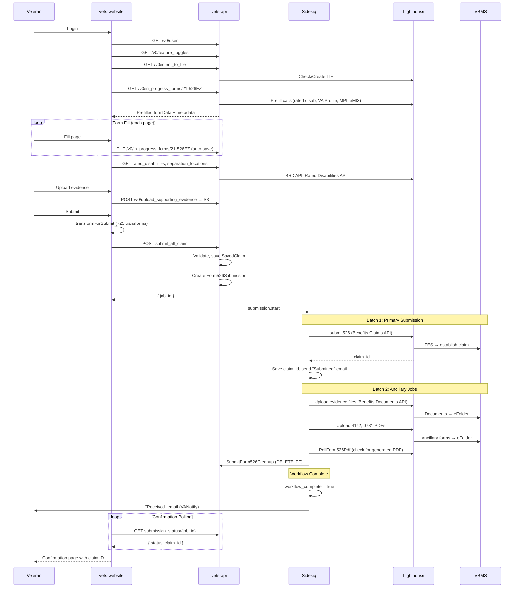
