# 526EZ Disability Benefits Application — Complete Architecture Diagram (v3)

**Last updated:** 2026-03-13 (v3)
**Sources:** vets-website (0d0c531), vets-api (00bbe4a)

## v3 Changes
- Phase 1: Corrected `useFormFeatureToggleSync` toggle list; added toggle entry path annotations
- Phase 3: Added backend IPF controller reconciliation pipeline, expanded `onFormLoaded`, added `normalizeReturnUrlForResume`
- Phase 4: Added `gatePages` dual-config pattern to disabilities chapter
- Phase 5: Added `purgeToxicExposureData` and save/restore pattern
- Phase 6: Expanded `log_toxic_exposure_changes` to show IPF→claim comparison
- Feature Flippers: Added missing flippers, annotated entry paths

---

## Phase 1: Authentication & Application Entry

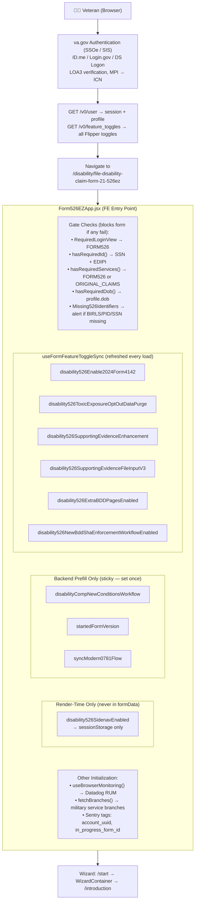

---

## Phase 2: Intent to File (ITF)

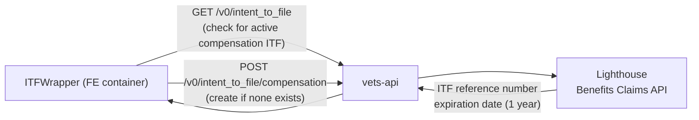

---

## Phase 3: Prefill & In-Progress Form (IPF) Load

### Scenario A: First-Time Form (No IPF)

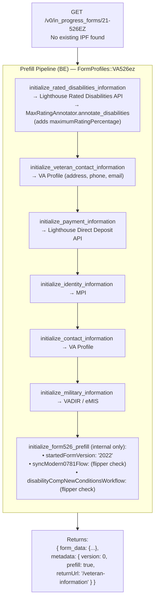

### Scenario B: Returning User (Existing IPF)

```mermaid
flowchart TD
    Request["GET /v0/in_progress_forms/21-526EZ<br/>Existing IPF found"]

    subgraph BE["Step 0: Backend IPF Controller Reconciliation"]
        direction TB
        URD["0a. update_rated_disabilities<br/>→ Re-fetch from Lighthouse<br/>→ If changed: set updatedRatedDisabilities,<br/>  redirect returnUrl to /disabilities/rated-disabilities<br/>  (or /conditions/summary if new conditions workflow)"]
        SFV["0b. set_started_form_version<br/>→ If BOTH keys blank: set '2019'<br/>→ Preserves existing values"]
        FIX["0c. fix_new_conditions_workflow_flag<br/>🛡️ Poisoned IPF fix (gated by Flipper)<br/>→ If flag=true AND returnUrl is old-flow page:<br/>  /claim-type, /disabilities/orientation,<br/>  /disabilities/rated-disabilities,<br/>  /new-disabilities/follow-up, /new-disabilities/add<br/>→ RESET flag to false in DB<br/>→ Prevents RJSF crash + redirect loops"]
        DUP["0d. purge_duplicate_additional_information<br/>→ Fixes IPFs created 2/3–2/9/2026<br/>→ TODO: Remove after 2/9/2027"]
        URD --> SFV --> FIX --> DUP
    end

    subgraph FE["Steps 1–7: Frontend IPF Processing"]
        direction TB
        Load["1. Load saved formData + metadata<br/>from InProgressForm table"]
        Version["2. Compare saved version vs<br/>migrations.length (currently 10)"]
        Migrate["3. Run needed migrations sequentially:<br/>01–08: legacy migrations<br/>09: /new-disabilities-revised/add → /new-disabilities/add<br/>10: /new-disabilities/add-3 → /new-disabilities/add"]
        Transform["4. Apply prefillTransformer"]

        subgraph OFL["5. onFormLoaded() — Resume-Time Redirect Logic"]
            direction TB
            B1["baseDoNew4142Logic?<br/>Legacy 4142 auth but not new auth, flipper ON"]
            B2["redirectWhenFlipperOff?<br/>returnUrl → modern 4142 page, flipper OFF"]
            B3["redirectWhenNoEvidence?<br/>No evidence, returnUrl is 4142 page"]
            B4["redirectLegacyToEnhancement?<br/>returnUrl → legacy evidence, enhancement ON"]
            B5["redirectEnhancementToLegacy?<br/>returnUrl → enhancement page, flipper OFF"]
            B6["default:<br/>router.push(returnUrl)"]

            B1 -- "true → set alertNeedsShown4142<br/>redirect to /supporting-evidence/<br/>private-medical-records" --> Done["done"]
            B1 -- "false" --> B2
            B2 -- "true → redirect to<br/>private-medical-records" --> Done
            B2 -- "false" --> B3
            B3 -- "true → redirect to<br/>/evidence-types" --> Done
            B3 -- "false" --> B4
            B4 -- "true → redirect to<br/>/evidence-request" --> Done
            B4 -- "false" --> B5
            B5 -- "true → redirect to<br/>/evidence-types" --> Done
            B5 -- "false" --> B6
        end

        Merge["6. Merge saved data with fresh prefill"]

        Normalize["7. normalizeReturnUrl(returnUrl)<br/>→ Registered as formConfig.normalizeReturnUrl<br/>→ Runs at REDIRECT TIME only (IPF unchanged)<br/>→ Rewrites array-builder item pages to summary:<br/>  /conditions/:n/* → /conditions/summary<br/>  /mental-health-form-0781/:n/* → events-summary<br/>→ Prevents loops (item pages need ?add=true)"]

        Load --> Version --> Migrate --> Transform --> OFL --> Merge --> Normalize
    end

    Resume["Veteran resumes at<br/>resolved returnUrl"]

    Request --> BE --> FE --> Resume
```

---

## Phase 4: Form Fill

```mermaid
flowchart TD
    subgraph Chapters["Form Chapters (formConfig)"]
        direction TB

        subgraph VD["veteranDetails"]
            VD1["veteranInformation · contactInformation<br/>homelessOrAtRisk · terminallyIll<br/>alternateNames · militaryHistory<br/>reservesNationalGuardService · federalOrders"]
            VD2["separationLocation ← showSeparationLocation<br/>separationPay · retirementPay · trainingPay<br/>← !hasRatedDisabilities"]
        end

        subgraph DIS["disabilities (Conditions chapter)"]
            direction TB
            subgraph Gate["gatePages — Dual Page Config Pattern"]
                direction LR
                V1["Legacy V1 (disabilityBenefitsWorkflow)<br/>gated by isNewConditionsOff<br/>• Add Conditions (Autocomplete)<br/>• showPagePerItem follow-ups<br/>• Summary of Disabilities"]
                V2["New V2 (disabilityConditionsWorkflow)<br/>gated by isNewConditionsOn<br/>• arrayBuilderPages: intro,<br/>  per-item (condition, side-of-body,<br/>  cause, cause details, date),<br/>  summary with YesNo schema"]
            end
            Note["Only ONE set visible at a time<br/>based on disabilityCompNewConditionsWorkflow"]
            PTSD["PTSD / 0781 flow:<br/>Legacy (hasNewPtsdDisability) OR<br/>Modern (syncModern0781Flow)"]
        end

        subgraph SE["supportingEvidence"]
            VA["VA medical records"]
            PMR["Private medical records:<br/>Legacy 4142 ← !isCompletingModern4142<br/>2024 4142 ← isCompletingModern4142<br/>  • standalone auth page<br/>  • recordsConfirmAlertBanner<br/>    (alertNeedsShown4142 for IPF Veterans)"]
            TE["Toxic Exposure section:<br/>• TE conditions (checkbox)<br/>• Per-location details (checkbox-and-loop)<br/>• Summary pages<br/>depends: showToxicExposurePages<br/>= hasRealNewDisabilities (post-cleanup)"]
            EV["Additional evidence uploads"]
        end

        AI["additionalInformation:<br/>Aid & Attendance · IU (8940/4192)<br/>Summary of conditions"]

        Review["Review & Submit:<br/>CustomReviewTopContent:<br/>if startedFormVersion==='2019' + isClaimingNew:<br/>info alert → link to TE questions<br/>⚠️ TODO: remove after 11/18/2025 (PAST DUE)"]
    end

    subgraph APICalls["API Calls During Form Fill"]
        direction TB
        API1["GET rated_disabilities → LH Rated Disabilities<br/>(maximumRatingPercentage for Max CFI)"]
        API2["GET separation_locations → LH BRD → BGS → CorpDB"]
        API3["GET suggested_conditions → local Postgres lookup"]
        API4["GET rating_info → combined disability rating %"]
        API5["PUT /v0/in_progress_forms/21-526EZ<br/>→ auto-save EVERY page transition<br/>→ BE also syncs 0781 + new_conditions metadata"]
        API6["POST upload_supporting_evidence<br/>→ S3 (SupportingEvidenceAttachment)<br/>→ returns confirmationCode (GUID)"]
    end
```

---

## Phase 5: Frontend Transform

```mermaid
flowchart TD
    subgraph PrePipeline["Pre-Pipeline: Save Before filterEmptyObjects"]
        Save["savedToxicExposure = _.cloneDeep(toxicExposure)<br/>savedToxicExposurePurgeFlag = disability526ToxicExposure...<br/><br/>Why: filterEmptyObjects strips empty nested TE objects.<br/>Purge needs original structure to distinguish<br/>'never entered' vs 'entered then opted out'"]
    end

    subgraph Pipeline["Submit Transformer Pipeline (.reduce())"]
        direction TB
        T1["transformToxicExposure:<br/>1. RESTORE savedToxicExposure<br/>2. RESTORE purge flag<br/>3. purgeToxicExposureData (if flag on):<br/>   • No conditions → remove all exposure data<br/>   • conditions.none=true → remove all<br/>   • Unchecked location → filter details<br/>   • none:true on section → remove section<br/>   • otherKey w/ description → preserve<br/>   • otherKey w/o description → remove<br/>4. STRIP purge flag from output"]
        T2["normalizeIncreases (V2 only):<br/>Move rated disability placeholders<br/>from newDisabilities → ratedDisabilities"]
        T3["sanitizeNewDisabilities (V2 only):<br/>Filter entries missing condition or cause"]
        T4["setActionTypes → filterRatedViewFields<br/>→ filterServicePeriods → removeExtraData<br/>→ cleanUpMailingAddress → addPOWSpecialIssues<br/>→ addPTSDCause → splitNewDisabilities<br/>→ transformSecondaryDisabilities<br/>→ stringifyRelatedDisabilities<br/>→ transformSeparationPayDate<br/>→ sanitizeHomelessnessContact"]
        T5["addForm4142 (branches: 2024 vs legacy)<br/>addForm0781 · addForm0781V2<br/>addForm8940 · addFileAttachments<br/>transformCountryCodeToName<br/>fullyDevelopedClaim"]
        T1 --> T2 --> T3 --> T4 --> T5
    end

    Output["Output: JSON.stringify({<br/>  form526: {...},<br/>  form4142: {...},<br/>  form0781: {...} / form0781v2: {...},<br/>  form8940: {...},<br/>  form526_uploads: [...],<br/>  flashes: [...]<br/>})"]

    PrePipeline --> Pipeline --> Output
```

---

## Phase 6: Controller / Synchronous Actions

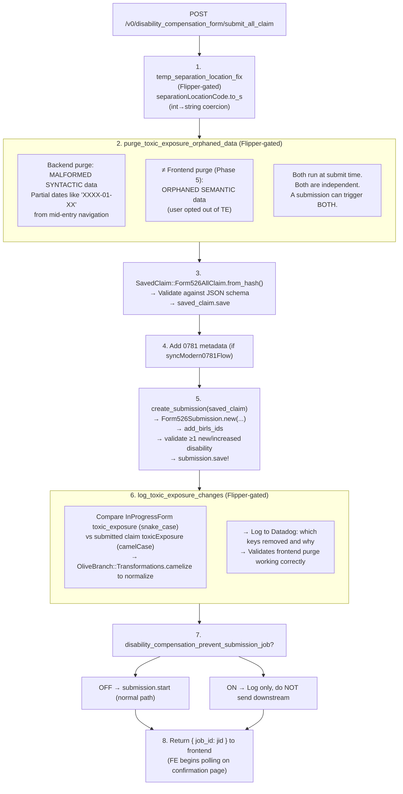

---

## Phase 7: Sidekiq Batch 1 — Primary 526 Submission

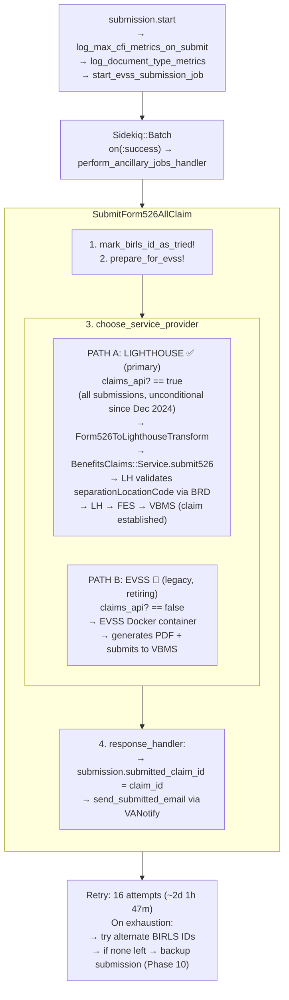

---

## Phase 8: Sidekiq Batch 2 — Ancillary Jobs

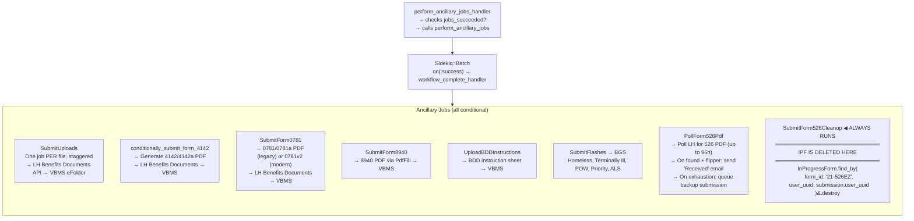

---

## Phase 9: Workflow Complete

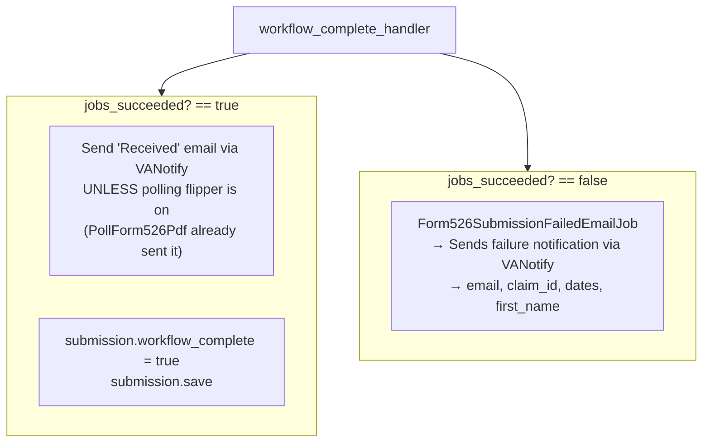

---

## Phase 10: Backup Submission Path

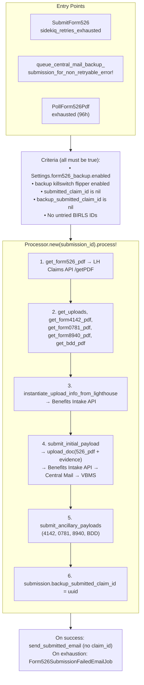

---

## Confirmation Page (Frontend)

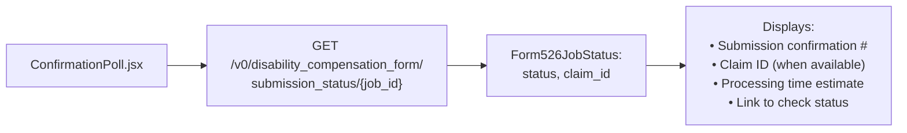

---

## Separation Location Code Validation Chain

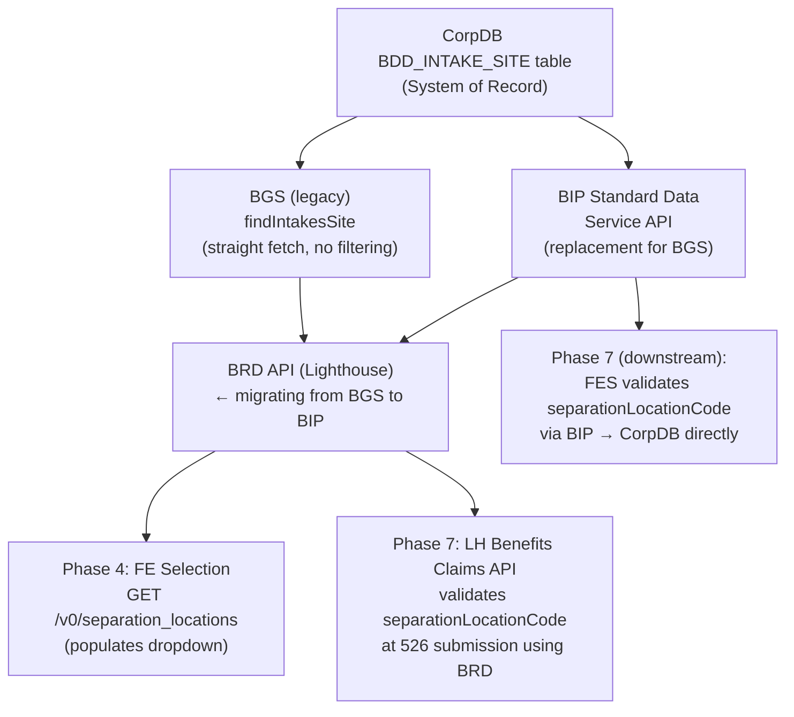

---

## Environment Mapping (Lower Environments)

| GW Env | LHDI Env | BGS Env | Notes |
|---|---|---|---|
| Dev | dev | linktest | |
| Staging | qa | linktestbepbenefits | UPDATED: was prepbepbenefits; caused code mismatch with FES/BIP |
| Sandbox | sandbox | mock-bgs (internal) | No real BGS; BRD returns internal mock data |
| Prod | prod | bepbenefits | prod == prod |

⚠️ Each BGS environment has similar entries but uses DIFFERENT IDs. BRD Sandbox does NOT use BGS — it returns mock data.

---

## Data Stores

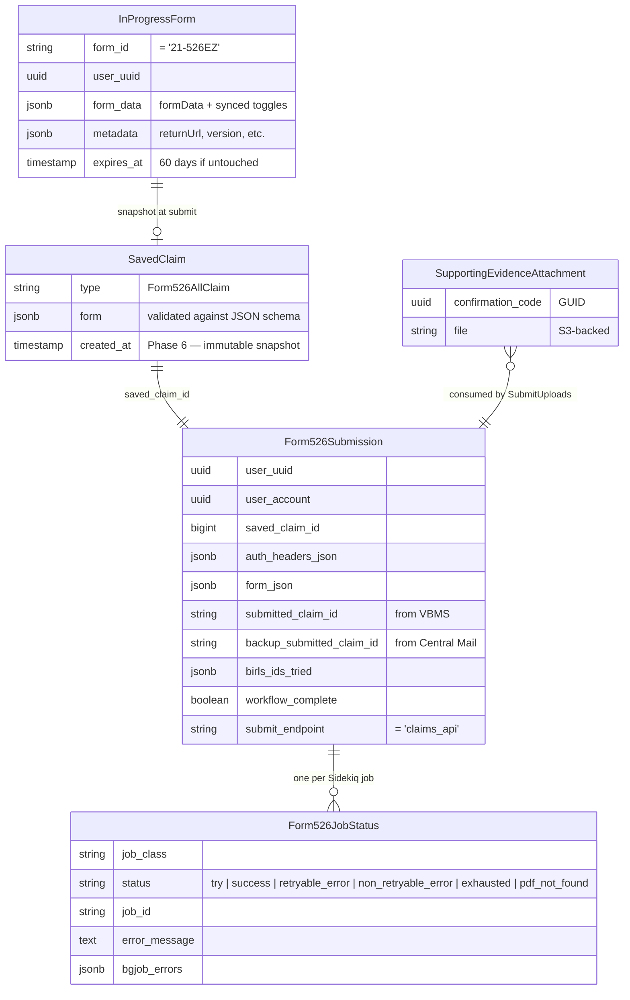

---

## External Services Reference

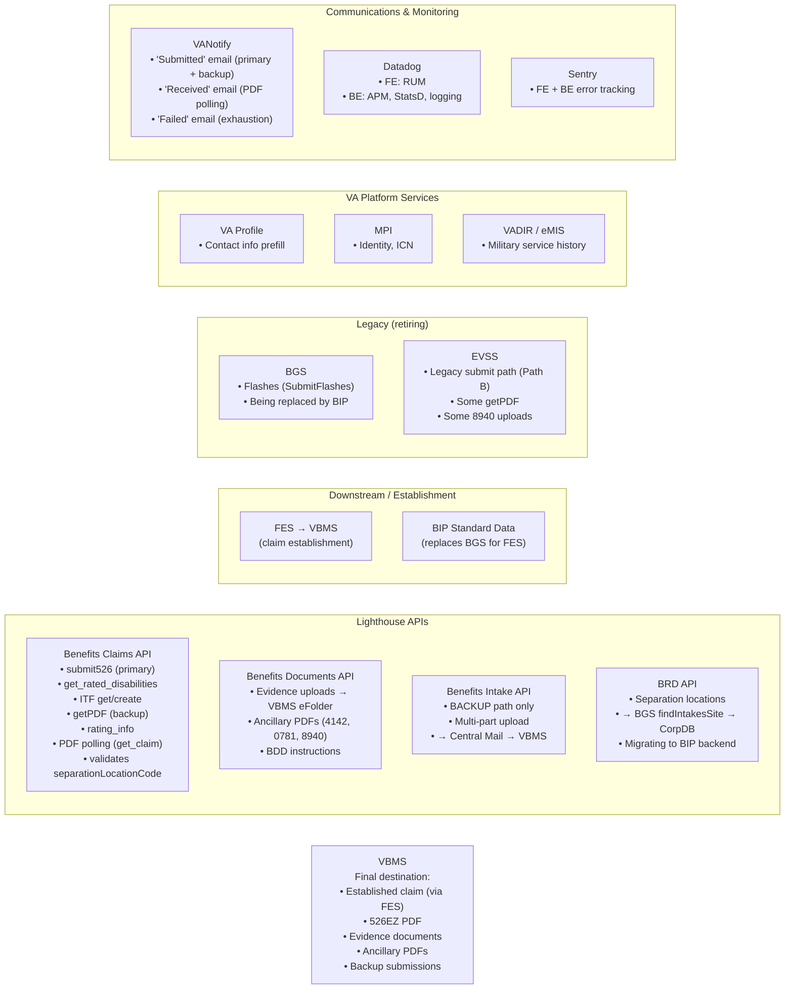

---

## Key Feature Flippers (active as of March 2026)

| Flipper | Entry Path | Effect |
|---|---|---|
| `disability526Enable2024Form4142` | `useFormFeatureToggleSync` | Shows 2024 version of 4142 pages |
| `disability526ToxicExposureOptOutDataPurge` | `useFormFeatureToggleSync` | Purges TE data on opt-out (FE + BE logging) |
| `disability526SupportingEvidenceEnhancement` | `useFormFeatureToggleSync` | Enhanced evidence upload UI |
| `disability526SupportingEvidenceFileInputV3` | `useFormFeatureToggleSync` | File input V3 component |
| `disability526ExtraBDDPagesEnabled` | `useFormFeatureToggleSync` | Shows 5 extra BDD pages |
| `disability526NewBddShaEnforcementWorkflowEnabled` | `useFormFeatureToggleSync` | BDD SHA enforcement workflow |
| `disabilityCompNewConditionsWorkflow` | Backend prefill only | New conditions chapter (arrayBuilder V2) |
| `startedFormVersion` | Backend prefill only | TE rollout tracking / review alert |
| `syncModern0781Flow` | Backend prefill only | Modern 0781 PTSD flow |
| `disability526SidenavEnabled` | Render-time only | Side navigation in form |
| `disability_compensation_prevent_submission_job` | Backend only | Blocks downstream submission (debug) |
| `disability_compensation_fail_submission` | Backend only | Forces submission failure (testing) |
| `disability_compensation_production_tester` | Backend only | Skips notifications (production test) |
| `disability_526_call_received_email_from_polling` | Backend only | Send "Received" email from PDF poll |
| `form526_backup_submission_temp_killswitch` | Backend only | Enables/disables backup submission |
| `disability_compensation_temp_separation_location_code_string` | Backend only | Fixes separationLocationCode type |
| `disability_compensation_temp_toxic_exposure_optional_dates_fix` | Backend only | Backend TE date purge |
| `disability_compensation_fix_poisoned_ipf` | Backend only | Corrects poisoned new-conditions flag |
| `disability_compensation_fix_duplicate_key_ipf` | Backend only | Removes duplicate additionalInformation |
| `disability_compensation_sync_modern0781_flow_metadata` | Backend only | Syncs 0781 flow into IPF metadata on save |
| `disability_compensation_new_conditions_workflow_metadata` | Backend only | Syncs new conditions flag into IPF metadata on save |

---

## Simplified Sequence Diagram (Happy Path)

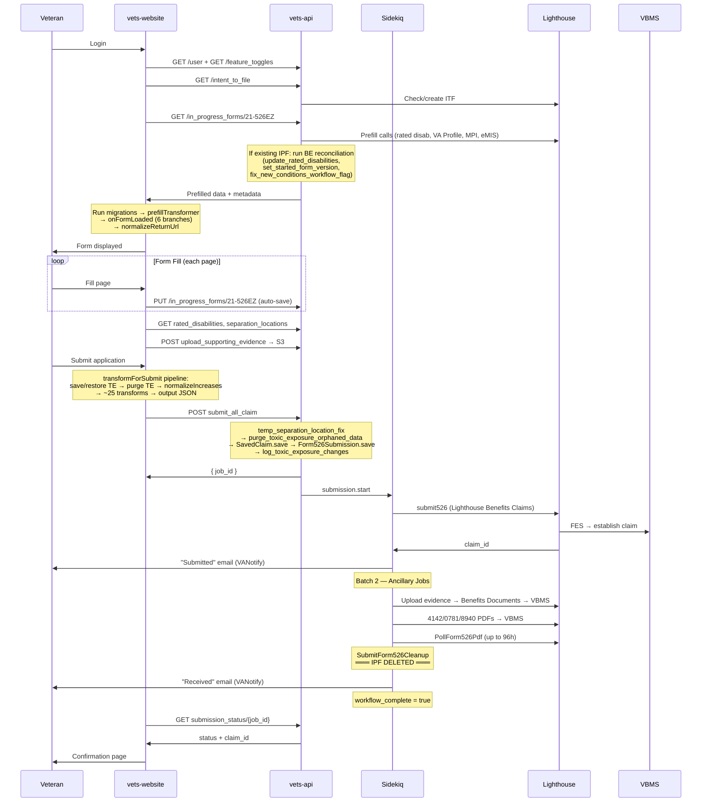
