# Veteran Readiness & Employment (VR&E) Claims Code Path Explainer

## Overview

This document provides a comprehensive analysis of the Veteran Readiness & Employment (VR&E) claims submission flow, starting from the API controller through all external service integrations, error handling, and potential failure points.

**Form Type:** 28-1900 (Veteran Readiness & Employment Application)

---

## Table of Contents

1. [High-Level Flow](#high-level-flow)
2. [Detailed Component Breakdown](#detailed-component-breakdown)
3. [External Services](#external-services)
4. [Code Flow Paths](#code-flow-paths)
5. [Error Handling & Failures](#error-handling--failures)
6. [Retry Logic & Recovery](#retry-logic--recovery)
7. [Monitoring & Observability](#monitoring--observability)

---

## High-Level Flow

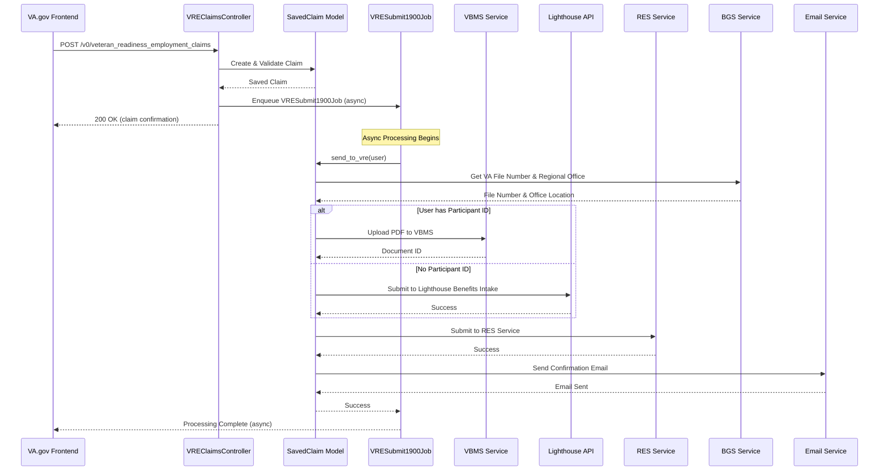

---

## Detailed Component Breakdown

### 1. Controller Layer
**File:** `app/controllers/v0/veteran_readiness_employment_claims_controller.rb`

***Note:** This file will be replaced by `modules/vre/app/controllers/vre/v0/claims_controller.rb`*

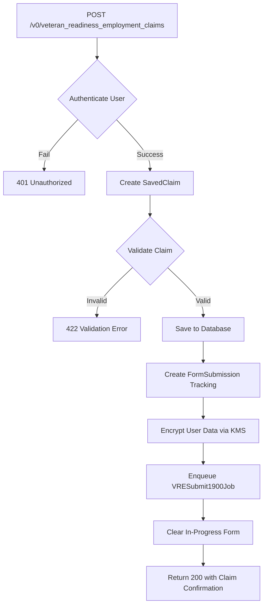

**Key Responsibilities:**
- Authenticates the user (`before_action :authenticate`)
- Creates and validates `SavedClaim::VeteranReadinessEmploymentClaim`
- Sets up form submission tracking for observability
- Encrypts sensitive user data using AWS KMS
- Enqueues background job for async processing (passing in encrypted user data)
- Returns immediately to client with confirmation number

**Encrypted User Data:**
```ruby
{
  participant_id, pid, edipi, vet360_id,
  birth_date, ssn, loa3?, uuid, icn,
  first_name, va_profile_email
}
```

---

### 2. Model Layer
**File:** `app/models/saved_claim/veteran_readiness_employment_claim.rb`

***Note:** this file will be replaced by `modules/vre/app/models/vre/veteran_readiness_employment_claim.rb`*

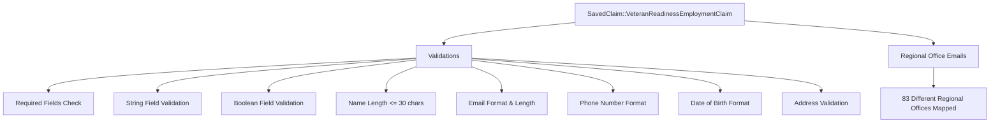

**Validation Rules:**
- **Required Fields:** email, isMoving, yearsOfEducation, veteranInformation (name, DOB), privacyAgreementAccepted
- **String Fields:** Must be strings (name parts, contact info, DOB)
- **Boolean Fields:** isMoving, privacyAgreementAccepted must be true/false
- **Name Length:** First, middle, last names max 30 characters
- **Email:** Max 256 characters, valid email format
- **Phone Numbers:** Exactly 10 digits, no formatting characters
- **Date of Birth:** YYYY-MM-DD format
- **Addresses:** Required fields (street, city), max 100 characters for city/state

**Regional Office Mapping:**
The model contains 83 regional office email addresses mapped by office code (301-463, plus 000 default). These are used for routing notifications.

---

### 3. Background Job
**File:** `modules/vre/app/jobs/vre/vre_submit1900_job.rb`

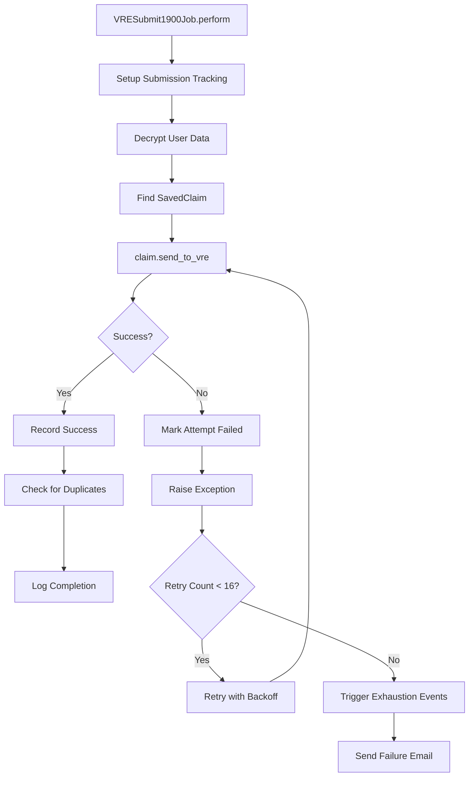

**Retry Configuration:**
- **Retries:** 16 attempts.  See [Sidekiq Documentation](https://github.com/sidekiq/sidekiq/wiki/Error-Handling)
- **Total Duration:** Maximum ~2 days, 1 hour, 47 minutes, 12 seconds
- **Backoff:** Exponential (Sidekiq default)

**Duplicate Detection:**
- Queries form submissions by user within configurable threshold (default 24 hours)
- Logs warning if duplicates detected (count > 1)
- Does not block submission, only monitors/alerts

---

### 4. Main Processing Flow
**Method:** `SavedClaim::VeteranReadinessEmploymentClaim#send_to_vre`

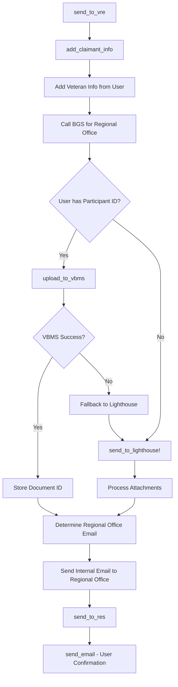

**Decision Point: VBMS vs Lighthouse**
- **With Participant ID:** Attempts VBMS upload first, falls back to Lighthouse on error
- **Without Participant ID:** Goes directly to Lighthouse Benefits Intake API

---

## External Services

### 1. BGS (Benefits Gateway Service)

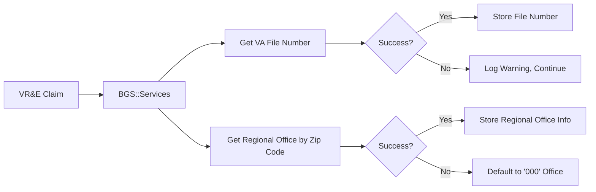

**Purpose:**
- Retrieve veteran's VA file number using participant ID
- Determine regional office routing based on veteran's address (zip, state, country)

**Endpoints Called:**
1. `BGS::People::Request.find_person_by_participant_id`
2. `service.routing.get_regional_office_by_zip_code(zip, country, state, 'VRE', ssn)`

**Error Handling:**
- File number fetch failure: Logs warning, continues without file number
- Regional office lookup failure: Defaults to office '000' (Pittsburgh)

**Configuration:**
- Uses `external_uid` (veteran email) and `external_key` (veteran first name or email)

---

### 2. VBMS (Veterans Benefits Management System, aka "eFolder")

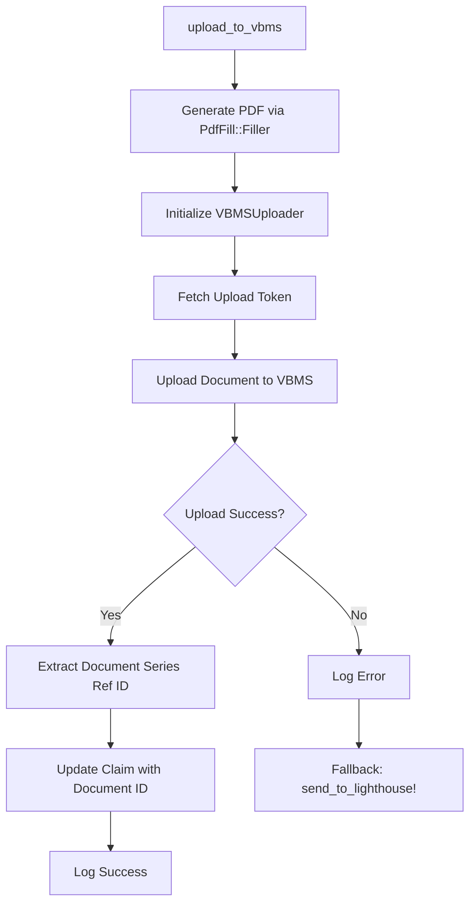

**Purpose:**
- Direct upload of VR&E claim PDF to VBMS document management system
- Provides document series reference ID for tracking

**Implementation:**
- Uses `ClaimsApi::VBMSUploader`
- Document type: '1167' (configurable)
- File number: Uses VA file number or SSN fallback

**Upload Process:**
1. `VBMS::Requests::InitializeUpload` - Get upload token
2. `VBMS::Requests::UploadDocument` - Upload PDF with token

**Metrics:**
- `api.1900.vbms.response_time` - StatsD timing metric

**Error Handling:**
- Any exception during VBMS upload triggers fallback to Lighthouse
- Errors logged but processing continues

---

### 3. Lighthouse Benefits Intake API

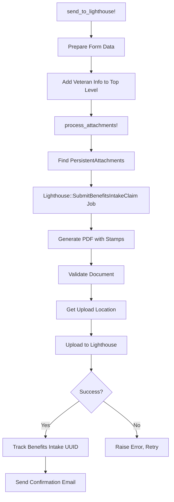

**Purpose:**
- Alternative submission path when participant ID unavailable
- Also serves as a fallback mechanism, should `upload_to_vbms` fail
- Handles attachments via Lighthouse Benefits Intake API
- PDF submission to Central Mail Portal (CMP)

**Job:** `Lighthouse::SubmitBenefitsIntakeClaim`
- **Retries:** 16 attempts
- **Duration:** ~2 days, 1 hour, 47 minutes

**Document Processing:**
1. Generate PDF from claim data
2. Add timestamp watermarks:
   - Bottom left: "VA.GOV" with timestamp
   - Top right: "FDC Reviewed - va.gov Submission"
3. Validate PDF (max 100MB, dimension checks, encryption checks)
4. Upload main document and attachments

**Metadata Generated:**
```ruby
{
  veteranFirstName, veteranLastName, fileNumber,
  zipCode, source: "SavedClaim::VeteranReadinessEmploymentClaim va.gov",
  form_id: "28-1900", businessLine: "VRE"
}
```

**Error Handling:**
- Document validation failures raise `InvalidDocumentError`
- Upload failures trigger Sidekiq retry with exponential backoff
- Exhaustion triggers failure metrics and logging

---

### 4. RES Service (Chapter 31 Form Service)

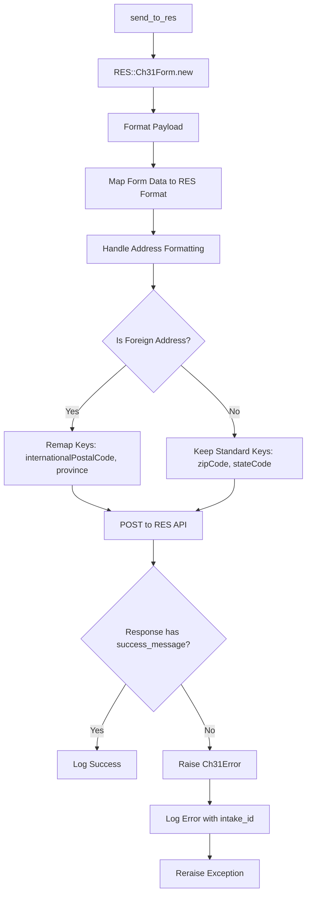

**Purpose:**
- Submit VR&E application data to Readiness & Employment System (RES)
- Handles Chapter 31 benefit processing
- Provides application intake tracking

**Endpoint:**
- `POST {Settings.res.base_url}/suite/webapi/form281900`

**Authentication:**
- Header: `Appian-API-Key: {Settings.res.api_key}`

**Payload Mapping:**
```ruby
{
  useEva, receiveElectronicCommunication, useTelecounseling,
  appointmentTimePreferences, privacyStatementAcknowledged,
  yearsOfEducation, isMoving, mainPhone, cellNumber,
  internationalNumber, email, documentId,
  receivedDate (ISO8601 timestamp),
  veteranAddress, veteranInformation, newAddress (optional)
}
```

**Special Handling:**
- Foreign addresses require key remapping
- `internationalPostalCode`
- `province` instead of `stateCode`
- ICN included when feature flag `:vre_send_icn_to_res` enabled - scheduled for 3/2026?

**Error Response:**
```ruby
{
  ApplicationIntake: <intake_id>,
  ErrorMessage: <error_details>
}
```

---

### 5. Email Services

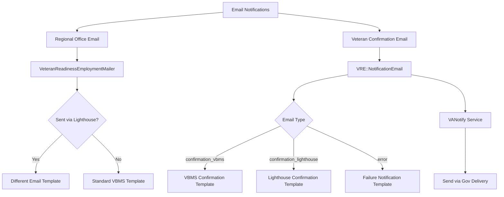

**Two Email Types:**

#### A. Internal Regional Office Email
**Sent via:** `VeteranReadinessEmploymentMailer.build(participant_id, email_addr, sent_to_lighthouse).deliver_later`

**Recipients:**
- Determined by regional office code (83 different offices)
- Falls back to 'VRE.VBACO@va.gov' if office not found

**Content:**
- Veteran information
- Application details
- Submission method indicator (VBMS vs Lighthouse)

#### B. Veteran Confirmation Email
**Sent via:** `VRE::NotificationEmail.deliver(email_type)`

**Email Types:**
1. `:confirmation_vbms` - Successful submission via VBMS
2. `:confirmation_lighthouse` - Successful submission via Lighthouse
3. `:error` - All retries exhausted, submission failed

**Personalization:**
```ruby
{
  first_name: veteran.first_name,
  date: formatted_submission_date,
  confirmation_number: claim.confirmation_number  # error emails only
}
```

**Service:** VANotify (Gov Delivery integration)

---

## Code Flow Paths

### Path 1: Successful VBMS Submission (Happy Path)

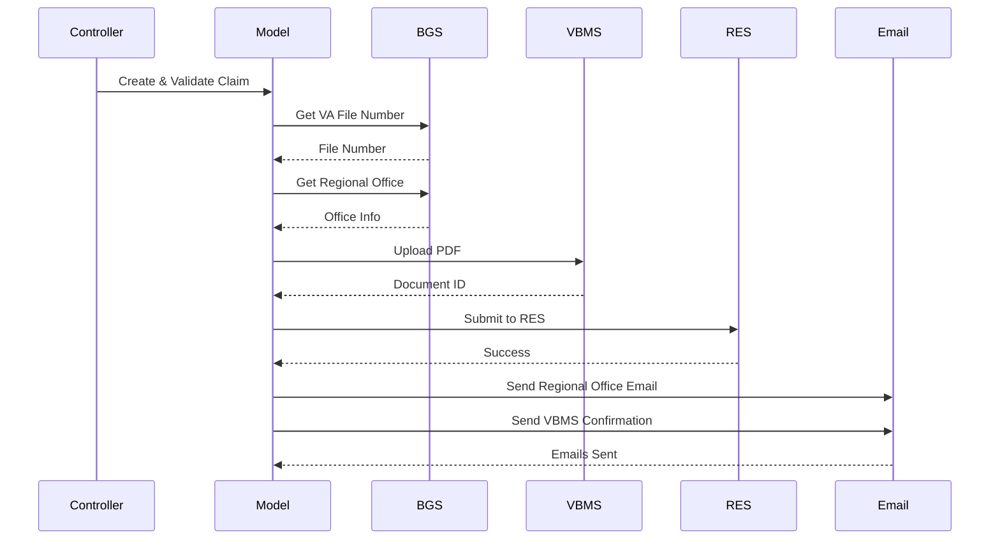

**Characteristics:**
- User has participant ID
- VBMS upload succeeds
- All services respond successfully
- Total time: ~30-60 seconds

---

### Path 2: Lighthouse Fallback (Participant ID Missing)

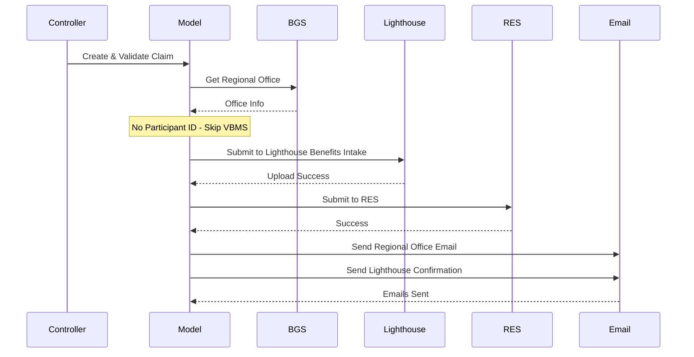

**Characteristics:**
- User lacks participant ID (LOA1 or incomplete account)
- Goes directly to Lighthouse
- Skips VBMS entirely
- Total time: ~45-90 seconds

---

### Path 3: VBMS Failure with Lighthouse Fallback

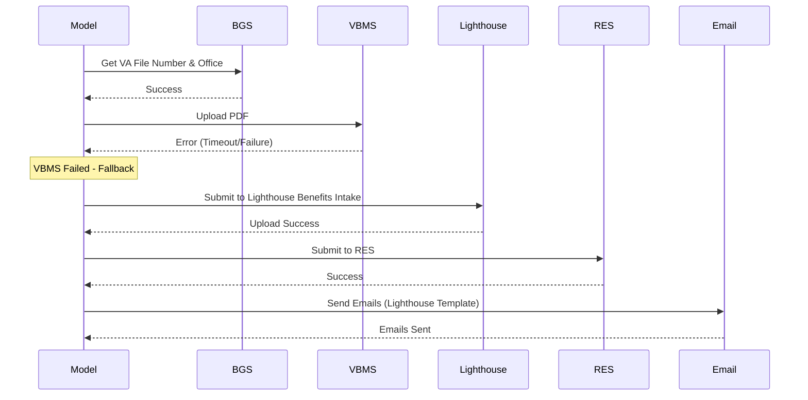

**Characteristics:**
- Initial VBMS attempt fails
- Automatic fallback to Lighthouse
- User unaware of fallback
- Slight delay due to VBMS timeout
- Total time: ~90-120 seconds

---

### Path 4: Complete Failure (All Retries Exhausted)

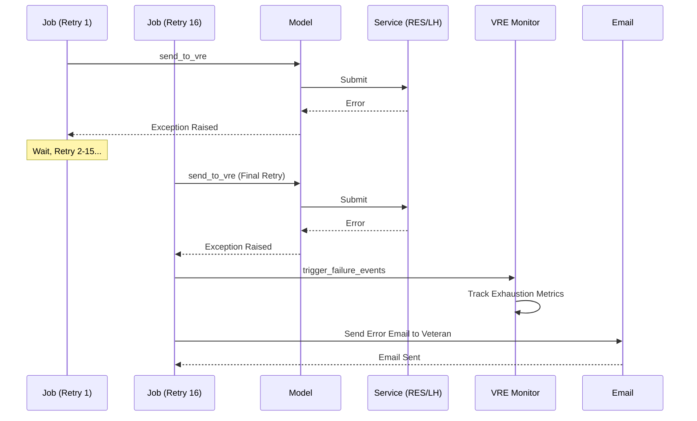

**Characteristics:**
- All 16 retry attempts fail
- ~2 days of retry attempts
- Triggers failure monitoring
- Veteran receives error notification
- Requires manual intervention

---

## Error Handling & Failures

### Failure Points & Recovery Mechanisms

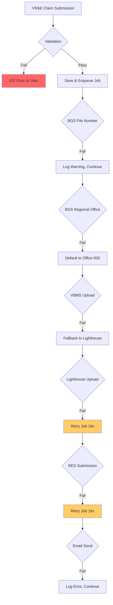

### Error Categories

#### 1. Validation Errors (Immediate Failure)
**Status:** 422 Unprocessable Entity  
**Recovery:** None - user must fix and resubmit

**Common Issues:**
- Missing required fields
- Invalid email format
- Phone number not 10 digits
- Invalid date format
- Address fields missing

**Response:**
```json
{
  "errors": [
    {
      "title": "Validation error",
      "detail": "/email is required",
      "status": "422"
    }
  ]
}
```

---

#### 2. BGS Service Errors (Non-Fatal)
**Recovery:** Degraded operation, continues processing

**Scenarios:**

**A. VA File Number Fetch Failure**
```ruby
# Error logged, processing continues without file number
rescue => e
  Rails.logger.warn('VRE claim unable to add VA File Number.', { user_uuid: user&.uuid })
  nil
end
```
**Impact:** Uses SSN instead of file number for VBMS

**B. Regional Office Lookup Failure**
```ruby
rescue => e
  Rails.logger.warn(e.message)
  ['000', 'Not Found']  # Default Pittsburgh office
end
```
**Impact:** Routes to default regional office

---

#### 3. VBMS Upload Errors (Fallback Available)
**Recovery:** Automatic fallback to Lighthouse

**Error Types:**
- Connection timeout
- Authentication failure
- Document validation failure
- Service unavailable

**Fallback Logic:**
```ruby
rescue => e
  Rails.logger.error('Error uploading VRE claim to VBMS.', { user_uuid: user&.uuid, message: e.message })
  send_to_lighthouse!(user)  # Automatic fallback
end
```

**Metrics:**
- `api.1900.vbms.response_time` - Tracks VBMS performance
- No explicit failure metric (relies on timing)

---

#### 4. Lighthouse Benefits Intake Errors (Retryable)
**Recovery:** Sidekiq retry (16 attempts)

**Error Types:**

**A. Document Validation Errors**
```ruby
raise InvalidDocumentError, "Invalid Document: #{result.errors}"
```
- PDF too large (>100MB)
- Invalid page dimensions (>78" wide or >101" tall)
- Encrypted PDF
- Corrupted file

**B. Upload Errors**
```ruby
raise BenefitsIntakeClaimError, response.body unless response.success?
```
- Network timeout
- Service unavailable (503)
- Authentication failure

**Retry Schedule:**
- Attempt 1: Immediate
- Attempt 2: ~20 seconds
- Attempt 3: ~1 minute
- Attempt 4: ~5 minutes
- ...
- Attempt 16: ~12 hours later

**Metrics:**
- `worker.lighthouse.submit_benefits_intake_claim.success`
- `worker.lighthouse.submit_benefits_intake_claim.failure`
- `worker.lighthouse.submit_benefits_intake_claim.exhausted`
- `worker.lighthouse.submit_benefits_intake_claim.document_upload_error`

---

#### 5. RES Service Errors (Retryable)
**Recovery:** Job-level retry (16 attempts via VRESubmit1900Job)

**Error Detection:**
```ruby
raise Ch31Error if response_body['success_message'].blank?
```

**Error Response Format:**
```ruby
{
  ApplicationIntake: <intake_id>,
  ErrorMessage: <error_details>
}
```

**Logging:**
```ruby
Rails.logger.error({
  intake_id: response_body['ApplicationIntake'],
  error_message: response_body['ErrorMessage']
})
```

**Retry Behavior:**
- Part of main job retry loop
- Same 16-attempt schedule as Lighthouse
- Both services must succeed for job to complete

**Metrics:**
- `api.res` - Response timing via Common::Client::Concerns::Monitoring

---

#### 6. Email Failures (Non-Fatal)
**Recovery:** Logs error, processing completes

**Confirmation Email Failure:**
```ruby
rescue => e
  Rails.logger.warn('Lighthouse::SubmitBenefitsIntakeClaim send_confirmation_email failed', generate_log_details(e))
  StatsD.increment("#{STATSD_KEY_PREFIX}.send_confirmation_email.failure")
end
```
**Impact:** Claim still processed successfully, veteran doesn't receive confirmation

**Regional Office Email:** (No explicit error handling shown)
**Impact:** Routing delay if regional office doesn't receive notification

---

## Retry Logic & Recovery

### Sidekiq Job Retry Configuration

```ruby
# VRESubmit1900Job
RETRY = 16
sidekiq_options retry: RETRY

# Lighthouse::SubmitBenefitsIntakeClaim  
RETRY = 16
sidekiq_options retry: RETRY
```

### Retry Timeline

```mermaid
gantt
    title VR&E Job Retry Timeline
    dateFormat X
    axisFormat %H:%M
    
    section Attempts 1-4
    Attempt 1           :0, 1
    Attempt 2 (~20s)    :20, 1
    Attempt 3 (~1m)     :60, 1
    Attempt 4 (~5m)     :300, 1
    
    section Attempts 5-8
    Attempt 5 (~15m)    :900, 1
    Attempt 6 (~45m)    :2700, 1
    Attempt 7 (~2h)     :7200, 1
    Attempt 8 (~5h)     :18000, 1
    
    section Attempts 9-16
    Attempt 9 (~12h)    :43200, 1
    Attempts 10-16      :43201, 1
```

**Total Duration:** ~2 days, 1 hour, 47 minutes, 12 seconds

### Exhaustion Handling

```ruby
sidekiq_retries_exhausted do |msg, _ex|
  VRE::VRESubmit1900Job.trigger_failure_events(msg)
  StatsD.increment("#{STATSD_KEY_PREFIX}.failure")
end
```

**Actions on Exhaustion:**
1. Call `VRE::VREMonitor.track_submission_exhaustion(msg, claim)`
2. Increment failure metric
3. Trigger error email to veteran via `NotificationEmail.deliver(:error)`

**Error Email Personalization:**
```ruby
{
  'first_name' => claim.parsed_form.dig('veteranInformation', 'fullName', 'first'),
  'date_submitted' => Time.zone.today.strftime('%B %d, %Y'),
  'confirmation_number' => claim.confirmation_number
}
```

---

## Monitoring & Observability

### Metrics Tracked

#### Controller Metrics
```ruby
# Success/Failure at submission
StatsD.increment("api.veteran_readiness_employment_claim.success")
StatsD.increment("api.veteran_readiness_employment_claim.failure")
```

#### Job Metrics
```ruby
# Job outcomes
StatsD.increment("worker.vre.vre_submit_1900_job.success")
StatsD.increment("worker.vre.vre_submit_1900_job.failure")
StatsD.increment("worker.vre.vre_submit_1900_job.duplicate_submission")
```

#### VBMS Metrics
```ruby
# Response time tracking
StatsD.measure("api.1900.vbms.response_time", elapsed_time, tags: {})
```

#### Lighthouse Metrics
```ruby
StatsD.increment("worker.lighthouse.submit_benefits_intake_claim.success")
StatsD.increment("worker.lighthouse.submit_benefits_intake_claim.failure")
StatsD.increment("worker.lighthouse.submit_benefits_intake_claim.exhausted")
StatsD.increment("worker.lighthouse.submit_benefits_intake_claim.document_upload_error")
StatsD.increment("worker.lighthouse.submit_benefits_intake_claim.send_confirmation_email.failure")
```

### Logging Strategy

#### Structured Logging
All logs include contextual information:
```ruby
{
  user_uuid: user&.uuid,
  claim_id: claim.id,
  user_account_id: user_account&.id,
  confirmation_number: claim.confirmation_number,
  form_id: claim.form_id
}
```

#### Key Log Events

**1. Submission Start**
```ruby
Rails.logger.info "Begin ClaimGUID=#{claim.guid} Form=#{claim.class::FORM} UserID=#{user_uuid}"
```

**2. Submission Success**
```ruby
Rails.logger.info "ClaimID=#{claim.confirmation_number} Form=#{claim.class::FORM}"
```

**3. Job Processing**
```ruby
Rails.logger.info('VRE::VRESubmit1900Job - Submission Attempt Created', {
  claim_id:, submission_id:, submission_attempt_id: attempt.id
})
```

**4. Service-Specific Events**
```ruby
Rails.logger.info('Uploading VRE claim to VBMS', { user_uuid: user&.uuid })
Rails.logger.info('VRE claim sending to RES service', { user_uuid:, was_sent: @sent_to_lighthouse })
```

**5. Errors & Warnings**
```ruby
Rails.logger.error('VR&E claim was not saved', {
  error_messages: claim.errors,
  user_logged_in: current_user.present?,
  current_user_uuid: current_user&.uuid
})

Rails.logger.warn('VRE::VRESubmit1900Job failed, retrying...', {
  claim_id:, submission_id:, error_class: e.class.name, error_message: e.message
})
```

### Tracking Database Tables

#### FormSubmission
Tracks each form submission:
```ruby
{
  id: <uuid>,
  form_type: '28-1900',
  form_data: <claim_json>,
  saved_claim_id: <claim_id>,
  user_account_id: <user_id>,
  created_at: <timestamp>
}
```

#### FormSubmissionAttempt
Tracks each processing attempt:
```ruby
{
  id: <uuid>,
  form_submission_id: <submission_id>,
  benefits_intake_uuid: <lighthouse_uuid>,  # For Lighthouse submissions
  aasm_state: 'pending' | 'success' | 'failure',
  created_at: <timestamp>
}
```

### Duplicate Detection

Monitors submissions within 24-hour window (configurable):
```ruby
threshold_hours = Settings.veteran_readiness_and_employment.duplicate_submission_threshold_hours.to_i
submissions = user_account.form_submissions.where(
  form_type: FORM_TYPE,
  created_at: threshold_hours.hours.ago..
)
```

**Metrics:**
- `worker.vre.vre_submit_1900_job.duplicate_submission` - Incremented when count > 1

**Log Output:**
```ruby
{
  user_account_id: <id>,
  submissions_count: <count>,
  duplicates_detected: true/false,
  threshold_hours: 24,
  submissions_data: [{ id:, created_at: }, ...]
}
```

---

## Failure Scenarios & Impact

### Scenario Matrix

| Failure Point | Impact | Recovery | User Notified? | Data Loss Risk |
|--------------|--------|----------|----------------|----------------|
| **Validation Error** | Immediate rejection | User resubmits | Yes (422 error) | None - never saved |
| **BGS File Number** | Degraded (uses SSN) | Automatic | No | None |
| **BGS Regional Office** | Wrong routing | Defaults to 000 | No | None |
| **VBMS Upload** | Delayed processing | Lighthouse fallback | No | None |
| **Lighthouse Upload** | Delayed processing | 16 retries (~2 days) | Yes (after exhaustion) | Low - saved to DB |
| **RES Service** | Not registered in RES | 16 retries (~2 days) | Yes (after exhaustion) | Medium - requires manual intervention |
| **Confirmation Email** | No confirmation | None (logged only) | No | None - claim processed |
| **Regional Office Email** | Delayed routing | None | No (veteran unaware) | None - claim processed |

---

## Feature Flags

### Current Feature Flag
```ruby
if Flipper.enabled?(:vre_send_icn_to_res)
  vet_info['icn'] = @user&.icn.present? ? @user.icn : nil
end
```

**Purpose:** Controls whether ICN (Integration Control Number) is sent to RES service

**Impact:** Additional veteran identifier for RES processing

---

## Configuration Dependencies

### Settings Required

```ruby
# RES Service
Settings.res.base_url          # RES API endpoint
Settings.res.api_key           # Appian API key for authentication

# VBMS
Settings.vbms.env              # VBMS environment name

# VR&E
Settings.veteran_readiness_and_employment.duplicate_submission_threshold_hours  # Default: 24
```

### External Service URLs

- **VBMS:** Configured via `VBMS::Client.from_env_vars`
- **Lighthouse Benefits Intake:** Via `BenefitsIntakeService::Configuration`
- **BGS:** Via `BGS::Services` configuration
- **RES:** `{Settings.res.base_url}/suite/webapi/form281900`

---

## Security Considerations

### Sensitive Data Handling

**Encrypted in Transit:**
```ruby
encrypted_user = KmsEncrypted::Box.new.encrypt(user_struct.to_h.to_json)
```

**Contains:**
- SSN
- Birth date
- Participant ID
- EDIPI
- ICN

**Decrypted in Job:**
```ruby
user = OpenStruct.new(JSON.parse(KmsEncrypted::Box.new.decrypt(encrypted_user)))
```

### PII in Logs

**Should NOT be logged:**
- SSN (only reference as exists/missing)
- Birth date
- Full address details
- Phone numbers
- Email addresses (except in structured PII fields)

**Safe to log:**
- User UUID
- Claim ID
- Confirmation number
- Regional office code
- Service response codes

---

## Summary

The VR&E claims submission flow is a robust, multi-stage process with multiple fallback mechanisms:

1. **Immediate validation** catches user errors before processing
2. **Asynchronous processing** prevents user-facing timeouts
3. **Multiple submission paths** (VBMS primary, Lighthouse fallback)
4. **Extensive retry logic** (16 attempts over ~2 days)
5. **Comprehensive monitoring** via metrics and structured logging
6. **Graceful degradation** for non-critical failures (BGS, emails)
7. **User notification** for terminal failures

**Most Common Path:** VBMS → RES → Email (successful within 60 seconds)

**Most Common Failure Recovery:** VBMS timeout → Lighthouse fallback → Success

**Rare but Monitored:** Complete exhaustion requiring manual intervention
