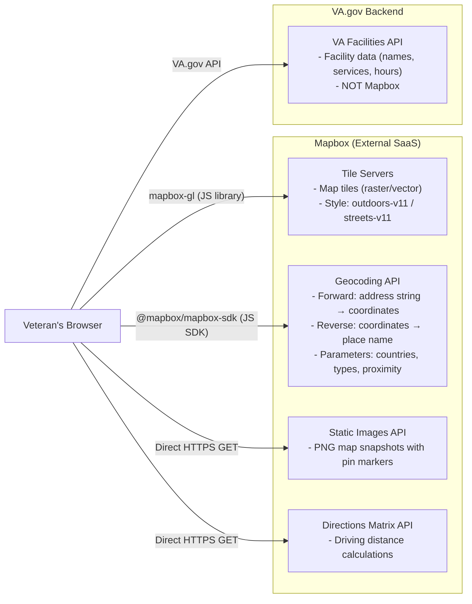

# Mapbox Data and Structure

## Overview

Mapbox is a third-party geospatial platform used across the VA.gov frontend (vets-website) to provide interactive maps, static map images, and geocoding (address-to-coordinate and coordinate-to-address conversion). It is integrated **purely on the client side** — the veteran's browser communicates directly with Mapbox APIs. There is no VA backend proxy or API gateway sitting between the frontend and Mapbox. The only VA service on the backend that we know of that uses Mapbox is CMS/Drupal (and only uses it when coordinate data changes on a facility) **TODO**: verify with CMS

---

## Applications That Use Mapbox

| Application                     | Path                                        | Capabilities Used                                                         |
| ------------------------------- | ------------------------------------------- | ------------------------------------------------------------------------- |
| Facility Locator                | `src/applications/facility-locator/`        | Interactive map (mapbox-gl), forward/reverse geocoding, static map images |
| GI Bill Search                  | `src/applications/gi/`                      | Interactive map, forward geocoding, location-based search results         |
| Representative Search           | `src/applications/representative-search/`   | Forward geocoding, Directions Matrix API (driving distances)              |
| Ask VA                          | `src/applications/ask-va/`                  | Forward/reverse geocoding for facility lookup                             |
| Caregivers Program              | `src/applications/caregivers/`              | Forward geocoding for facility search                                     |
| Static Pages (Facility Details) | `src/applications/static-pages/facilities/` | Static map images, nearby facility search                                 |

---

## Mapbox APIs and Services Consumed

### 1. Forward Geocoding (Address to Coordinates)

Converts a user-typed search string (address, city, ZIP code) into geographic coordinates.

- **SDK method:** `mbxClient.forwardGeocode()`
- **Endpoint:** `https://api.mapbox.com/geocoding/v5/mapbox.places/{query}.json`
- **Used by:** Facility Locator, GI Bill Search, Representative Search, Ask VA, Caregivers

<details>
<summary>Sample response (query: "austin, texas")</summary>

```json
{
  "type": "FeatureCollection",
  "query": ["austin", "texas"],
  "features": [
    {
      "id": "place.15042796",
      "type": "Feature",
      "place_type": ["place"],
      "relevance": 1,
      "properties": {
        "mapbox_id": "dXJuOm1ieHBsYzo1WWpz",
        "wikidata": "Q16559"
      },
      "text": "Austin",
      "place_name": "Austin, Texas, United States",
      "bbox": [-98.065361, 30.061613, -97.541556, 30.519669],
      "center": [-97.742806, 30.268072],
      "geometry": {
        "type": "Point",
        "coordinates": [-97.742806, 30.268072]
      },
      "context": [
        {
          "id": "district.23095020",
          "wikidata": "Q110426",
          "text": "Travis County"
        },
        { "id": "region.181484", "short_code": "US-TX", "text": "Texas" },
        { "id": "country.8940", "short_code": "us", "text": "United States" }
      ]
    },
    {
      "id": "place.166480108",
      "type": "Feature",
      "place_type": ["place"],
      "relevance": 0.968333,
      "properties": {
        "mapbox_id": "dXJuOm1ieHBsYzpDZXhJN0E",
        "wikidata": "Q979539"
      },
      "text": "Justin",
      "place_name": "Justin, Texas, United States",
      "bbox": [-97.410946, 33.016051, -97.255896, 33.167128],
      "center": [-97.295453, 33.08657],
      "geometry": {
        "type": "Point",
        "coordinates": [-97.295453, 33.08657]
      },
      "context": [
        {
          "id": "district.6276844",
          "wikidata": "Q109265",
          "text": "Denton County"
        },
        { "id": "region.181484", "short_code": "US-TX", "text": "Texas" },
        { "id": "country.8940", "short_code": "us", "text": "United States" }
      ]
    }
    // ... additional results: Astin TX (relevance: 0.958), West Austin TX (0.9), Austin's Estates TX (0.867)
  ],
  "attribution": "NOTICE: © 2026 Mapbox and its suppliers. All rights reserved. ..."
}
```

Key observations:

- The `query` array splits "austin, texas" into `["austin", "texas"]`
- The exact match ("Austin, Texas") has `relevance: 1`; fuzzy matches like "Justin" score lower (0.968)
- Results include multiple `place_type` values: `place`, `locality`, and `neighborhood`
- The `context` array provides the geographic hierarchy (county, state, country) with optional `wikidata` IDs

</details>

<details>
<summary>Sample response (query: "43231" — ZIP code)</summary>

```json
{
  "type": "FeatureCollection",
  "query": ["43231"],
  "features": [
    {
      "id": "postcode.144060140",
      "type": "Feature",
      "place_type": ["postcode"],
      "relevance": 1,
      "properties": { "mapbox_id": "dXJuOm1ieHBsYzpDSll1N0E" },
      "text": "43231",
      "place_name": "Columbus, Ohio 43231, United States",
      "bbox": [-82.956874, 40.055186, -82.918292, 40.110748],
      "center": [-82.952944, 40.060533],
      "geometry": {
        "type": "Point",
        "coordinates": [-82.952944, 40.060533]
      },
      "context": [
        { "id": "place.68643052", "wikidata": "Q16567", "text": "Columbus" },
        {
          "id": "district.7931628",
          "wikidata": "Q113237",
          "text": "Franklin County"
        },
        { "id": "region.140524", "short_code": "US-OH", "text": "Ohio" },
        { "id": "country.8940", "short_code": "us", "text": "United States" }
      ]
    }
  ],
  "attribution": "NOTICE: © 2026 Mapbox and its suppliers. All rights reserved. ..."
}
```

Note: ZIP code queries return `place_type: ["postcode"]` and typically a single result. The `place_name` combines the city, state, and ZIP into a readable string.

</details>

### 2. Reverse Geocoding (Coordinates to Address)

Converts map coordinates (after panning/dragging or from browser geolocation) into a human-readable place name.

- **SDK method:** `mbxClient.reverseGeocode()`
- **Endpoint:** `https://api.mapbox.com/geocoding/v5/mapbox.places/{lng},{lat}.json`
- **Used by:** Facility Locator, Ask VA, Representative Search

<details>
<summary>Sample response (query: [-118.148, 34.145] — Pasadena, CA)</summary>

The response structure is the same `FeatureCollection` as forward geocoding, but the `query` is coordinates and results can include `address`-level detail:

```json
{
  "type": "FeatureCollection",
  "query": [-118.14770613252539, 34.14476545625694],
  "features": [
    {
      "id": "address.822394681335686",
      "type": "Feature",
      "place_type": ["address"],
      "relevance": 1,
      "properties": { "accuracy": "rooftop" },
      "text": "South Arroyo Parkway",
      "place_name": "45 South Arroyo Parkway, Pasadena, California 91105, United States",
      "address": "45",
      "center": [-118.14777, 34.144734],
      "geometry": {
        "type": "Point",
        "coordinates": [-118.14777, 34.144734]
      },
      "context": [
        { "id": "neighborhood.468888812", "text": "Old Pasadena" },
        { "id": "postcode.822394681335686", "text": "91105" },
        { "id": "place.462588140", "wikidata": "Q485176", "text": "Pasadena" },
        { "id": "district.14051052", "wikidata": "Q104994", "text": "Los Angeles County" },
        { "id": "region.419052", "short_code": "US-CA", "text": "California" },
        { "id": "country.8940", "short_code": "us", "text": "United States" }
      ]
    }
  ],
  "attribution": "NOTICE: © 2026 Mapbox and its suppliers. All rights reserved. ..."
}
```

Key differences from forward geocoding:
- The `query` is a coordinate pair `[lng, lat]` instead of a string array
- Results can include `place_type: ["address"]` with rooftop-level `accuracy` and a street `address` field
- The `context` array includes `neighborhood` and `postcode` levels not always present in forward geocoding
- The code typically extracts `features[0].place_name` and looks for a `postcode` entry in `features[0].context`

</details>

### 3. Interactive Map Rendering (GL JS)

Renders a full interactive map with zoom/pan controls and clickable markers.

- **Library:** `mapbox-gl` v1.12.0 (with `mapbox-gl-v3` aliased at v3.9.4 for future migration - but currently not used)
- **Map style:** `mapbox://styles/mapbox/outdoors-v11`
- **Used by:** Facility Locator, GI Bill Search

> No JSON API response — `mapbox-gl` streams vector/raster tile data directly to an HTML canvas element. The browser requests tiles as the user pans and zooms. Each tile request is an image or protobuf binary, not a JSON payload.

### 4. Static Map Images

Generates a PNG image of a map centered on a facility location.

- **Endpoint:** `https://api.mapbox.com/styles/v1/mapbox/streets-v11/static/pin-l+d83933({lng},{lat})/{lng},{lat},16/500x300?access_token={token}`
- **Used by:** Static Pages (facility detail pages)

> No JSON API response — the endpoint returns a **500x300 PNG image** with a red pin marker at the specified coordinates. The URL encodes all parameters (pin color `d83933`, coordinates, zoom level `16`, and image dimensions).
>
> Example constructed URL:
>
> ```
> https://api.mapbox.com/styles/v1/mapbox/streets-v11/static/pin-l+d83933(-97.742805,30.268072)/-97.742805,30.268072,16/500x300?access_token=pk.eyJ1...
> ```

### 5. Directions Matrix API

Calculates driving distances between a set of coordinates.

- **Endpoint:** `https://api.mapbox.com/directions-matrix/v1/mapbox/driving/{coordinates}?sources={sources}&destinations=0&annotations=distance,duration&access_token={token}`
- **Used by:** Representative Search, Static Pages (nearby vet centers)

<details>
<summary>Sample response (2 sources to 1 destination near Austin, TX)</summary>

```json
{
  "code": "Ok",
  "distances": [
    [43183.1],
    [47359.5]
  ],
  "durations": [
    [2553],
    [3179.8]
  ],
  "sources": [
    {
      "distance": 172.226443247,
      "name": "Jenkins Road",
      "location": [-97.501298, 30.101068]
    },
    {
      "distance": 250.604101986,
      "name": "",
      "location": [-97.898668, 30.498056]
    }
  ],
  "destinations": [
    {
      "distance": 0.096221101,
      "name": "West 6th Street",
      "location": [-97.742806, 30.268072]
    }
  ]
}
```

- `distances` — meters between each source and the destination (converted to miles via `convertMetersToMiles()` in `facilityUtilities.js`; e.g. 43183.1m ≈ 27 miles)
- `durations` — seconds of driving time (e.g. 2553s ≈ 43 minutes)
- Each inner array has one entry because `destinations=0` requests distances to a single origin point
- `sources[].distance` / `destinations[].distance` — meters from the input coordinate to the nearest routable road (snapping distance)
- `sources[].name` — nearest road name at the snapped location

</details>

---

## Data Sent to Mapbox

### What IS sent

| Data                            | Description                                                                                       | Sent By                                                    |
| ------------------------------- | ------------------------------------------------------------------------------------------------- | ---------------------------------------------------------- |
| Search query strings            | User-typed addresses, city names, ZIP codes                                                       | All 6 applications via forward geocoding                   |
| Coordinates (lat/lng)           | Map center after pan/drag, facility locations, browser geolocation                                | Reverse geocoding, static maps, markers, Directions Matrix |
| IP-derived approximate location | `proximity: 'ip'` parameter tells Mapbox to infer approximate user location from their IP address | Facility Locator, shared utilities                         |
| Country filters                 | Restrict results to US territories: `['us', 'pr', 'ph', 'gu', 'as', 'mp', 'vi']`                  | All geocoding calls                                        |
| Place type filters              | `['place', 'region', 'postcode', 'locality', 'country', 'neighborhood']`                          | All geocoding calls                                        |
| Access token                    | Public API key (`pk.` prefix) identifying the VA.gov Mapbox account                               | Every API call and map tile request                        |

### What is NOT sent

| Data                                        | Status   |
| ------------------------------------------- | -------- |
| Veteran names                               | Not sent |
| Social Security numbers                     | Not sent |
| Dates of birth                              | Not sent |
| Phone numbers or email addresses            | Not sent |
| VA medical record numbers or ICNs           | Not sent |
| Authentication tokens or session data       | Not sent |
| Any data from authenticated VA.gov sessions | Not sent |

**Summary:** Mapbox receives geographic search context only — location strings, coordinates, and IP-derived proximity. No veteran PII or authenticated user data is transmitted. Also no search related information is sent to Mapbox (e.g. we do not reference what facility or type of facility the user is searching for. All related searches for what a user is searching for is )

---

## Architecture Diagram



[Link to graph if not appearing](https://mermaid.ai/d/13f5bd9c-ddb5-4753-a275-debd656d3e40)

---

## Token Errors or Errors accessing Mapbox services

The Facility Locator performs a **token health check** before rendering the map.

If the token is invalid or the Mapbox API is unreachable, the Facility Locator displays a **maintenance message** instead of the map. There is no alternative map provider or text-only fallback — Mapbox is a hard dependency for all map features.

Static facility detail pages link to Google Maps for directions, providing partial resilience if the static map image fails to load.

---

## npm Packages

| Package                                           | Version    | Purpose                                                                |
| ------------------------------------------------- | ---------- | ---------------------------------------------------------------------- |
| `@mapbox/mapbox-sdk`                              | ~0.13.2    | Geocoding and other service API calls                                  |
| `mapbox-gl`                                       | ^1.12.0    | Interactive map rendering (current)                                    |
| ~~`mapbox-gl-v3` (alias for `mapbox-gl@^3.9.4`)~~ | ~~^3.9.4~~ | ~~Interactive map rendering~~ (future migration - not used in bundles) |

---

## Key Files

| File                                                                     | Role                                                                         |
| ------------------------------------------------------------------------ | ---------------------------------------------------------------------------- |
| `src/platform/utilities/facilities-and-mapbox/index.js`                  | Shared token, client, geocoding utilities, static map URL builder            |
| `src/applications/facility-locator/containers/FacilitiesMap.jsx`         | Main interactive map component (mapbox-gl initialization, markers, controls) |
| `src/applications/facility-locator/actions/mapbox.js`                    | Redux actions for forward/reverse geocoding, geolocation                     |
| `src/applications/facility-locator/utils/mapHelpers.js`                  | Bounding box calculation, reverse geocoding helpers                          |
| `src/applications/gi/containers/search/LocationSearchResults.jsx`        | GI Bill interactive map with search results                                  |
| `src/applications/representative-search/utils/representativeDistance.js` | Directions Matrix API for driving distances                                  |
| `config/webpack.config.js`                                               | Token injection into build, Mapbox noParse config                            |
