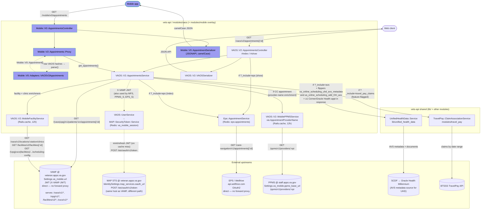
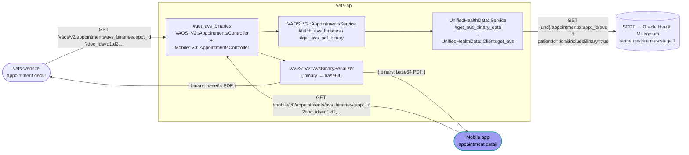

# VAOS v2 appointments read (GET) paths

Data flow for `GET /vaos/v2/appointments` (index) and `GET /vaos/v2/appointments/:id` (show), in `vets-api/modules/vaos/`:

You'd see the `#index` route on
- https://staging.va.gov/my-health/appointments
- https://staging.va.gov/my-health/appointments/past
- https://staging.va.gov/my-health/appointments/pending or /my-health/appointments/referrals-requests
- The VAHB mobile app -> Health tab -> Appointments or the Past Appointments toggle

You'd see the `#show` route on a details page:
- Any of the routes above and add the appointment id `.../{apptid}`
- The VAHB mobile app doesn't really call this one so much (I don't think you can directly link to a mobile apps details page). You generally get them from the main appointments list, I think.

**Past / upcoming / pending semantics:** Whether an appointment is "past" vs "upcoming" is decided in four places, in order:

1. **Client-supplied date range.** `?start=ISO8601&end=ISO8601` is forwarded to VAMF, which only returns appointments that overlap the window. Anything outside the range never arrives.
2. **Server classification.** After fetch, `AppointmentsService#classify_appointment` (`modules/vaos/app/services/vaos/v2/appointments_service.rb:1480-1482`) stamps every appointment with three booleans: `appt[:past]`, `appt[:future]`, `appt[:pending]`. **Telehealth has a special `past` calculation** (line 1247) — a telehealth visit stays "current" for a grace period after its start so the user can still click through to join.
3. **Presentation filter.** `VAOS::V2::AppointmentsPresentationFilter#user_facing?` drops appointments the UI shouldn't show: keeps anything with a concrete `start`; keeps requests (those with `requested_periods`) only when `status ∈ {proposed, cancelled}` **and** `created` falls inside a 120-day lookback + 1-day lookahead window. This filter is gated by the `appointments_consolidation` flipper (AS#152).
4. **Mobile-only overlay.** `Mobile::V0::AppointmentsController` filters out pending appointments unless `?include_pending=true`, and computes the `upcomingAppointmentsCount` / `travelPayEligibleCount` meta fields using a **30-day forward window** from now (not the client's `start`/`end`).

So the user-visible "past vs upcoming" is a product of the query-range ∩ the VAMF response ∩ the boolean flags ∩ the presentation filter, plus — on mobile — the pending toggle and 30-day meta window. When debugging a missing or unexpected-visibility appointment, walk the list in this order.

**Query-parameter contract:** The conditional edges labeled `?_include=<name>` come from a single comma-separated query-string parameter: `?_include=avs,eps,travel_pay_claims,clinics,facilities` (note the **leading underscore**). The controller splits it on commas in `include_index_params` / `include_show_params` (`modules/vaos/app/controllers/vaos/v2/appointments_controller.rb:397-413`) and hands the resulting hash to `AppointmentsService`, which internally references it as `include[:avs]`, `include[:eps]`, etc. — that's why Ruby-side code and the diagram labels both look natural. Index supports `clinics`, `facilities`, `travel_pay_claims`, `avs`, `eps`; show supports `avs`, `travel_pay_claims`, `eps`.

**External upstream notes:**

- **VAMF (`veteran.apps.va.gov`)** — single gateway fronting multiple internal APIs (`/vaos/v1`, `/vpg/v1`, `/facilities/v2`, `/cscs/v1`). Both `AppointmentsService` and `MobileFacilityService` hit it; MFS just uses different path prefixes. (**MFS naming gotcha:** `VAOS::V2::MobileFacilityService` / "MFS" in the diagram is *not* a service for the mobile app. It's named after the VAMF — "VA Mobile Framework" — facilities endpoints it consumes, and is used by both the web and mobile appointment paths.) Authenticated per-request with a user-scoped JWT in `X-VAMF-JWT` (session token issued by `VAOS::UserService`). **Direct — not behind `vsp-platform-fwdproxy`.** The staging counterpart is `veteran.apps-staging.va.gov` (used in `config/settings/staging.yml` and the `identity_settings` non-prod configs); prod/dev/test defaults all point at `veteran.apps.va.gov` per `config/settings/development.yml:1473` and `test.yml:1472`.
- **MAP STS (`veteran.apps.va.gov/sts/oauth/v1/token`)** — **M**obile **A**pplication **P**latform Security Token Service. Not a data upstream — this is the auth hop that mints the `X-VAMF-JWT` every other VAMF-adjacent call uses. Invoked via `MAP::SecurityToken::Service` (`lib/map/security_token/`) from `VAOS::UserService`, which is itself called by `VAOS::SessionService` (parent of `AppointmentsService`, `MobileFacilityService`, `MobilePPMSService`, `Eps::AppointmentService`). Tokens cached in Redis (`SessionStore` / `va_mobile_session` namespace); MAP only hit on miss/refresh. Config lives in `IdentitySettings.map_services` (separate namespace from `Settings.va_mobile`). Shares the VAMF host but uses `/sts/oauth/v1/*` path prefix (prod `veteran.apps.va.gov`, staging `veteran.apps-staging.va.gov`).
- **EPS (Wellhive, `api.wellhive.com`)** — OAuth2 token cached in Redis (`eps-appointments` namespace). **Direct — not behind the forward proxy.**
- **PPMS (`staff.apps.va.gov`)** — the VA's Provider Profile Management System, hosted on the "staff" apps gateway (distinct from the `veteran.apps.va.gov` VAMF gateway). Base URL is `Settings.va_mobile.ppms_base_url`. `AppointmentsService` enriches each **community-care** appointment with provider display names via `VAOS::V2::AppointmentProviderName`, which calls `VAOS::V2::MobilePPMSService.get_provider_with_cache(npi)` → `GET /ppms/v1/providers/:npi`. Results are cached in Rails.cache for 12 hours (`vaos_ppms_provider_<npi>`). Skipped entirely for VA and telehealth appointments.
- **SCDF → Oracle Health Millennium** — accessed via `UnifiedHealthData::Service`. Source of AVS metadata and documents. The AVS flow is **two-stage**: the list endpoint only pulls *metadata* (doc IDs, encounter refs, titles — no bytes); the detail page fetches the actual PDF bytes via a separate endpoint. The diagram above covers **stage 1** (metadata). **Stage 1 is gated four ways**: (1) client sent `?_include=avs`; (2) `Flipper.enabled?(:va_online_scheduling_uhd_avs_metadata, user)`; (3) `Flipper.enabled?(:va_online_scheduling_add_OH_avs, user)`; (4) the VAMF response contains **at least one Cerner (Oracle Health) appointment** per `VAOS::AppointmentsHelper.cerner?` — so a pure community-care or legacy-VistA-only response never touches SCDF. Logic lives in `AppointmentsService#fetch_all_avs_metadata` (`modules/vaos/app/services/vaos/v2/appointments_service.rb:523-528`). See stage 2 below, and <https://docs.oracle.com/en/industries/health/millennium-platform-apis>.
- **BTSSS TravelPay** — this upstream is chatty. For a page of appointments, the naive serial flow issues one BTSSS claim lookup per appointment, which can dominate total request time. The `va_online_scheduling_parallel_travel_claims` feature flag was added specifically to fetch the appointment list and the associated travel claims concurrently, and `TravelPay::ClaimAssociationService` batches the per-appointment claim associations. Treat BTSSS as the likely bottleneck when diagnosing slow `get_appointments` responses.

Feature flags that alter this path: `va_online_scheduling_use_vpg` (VAOS vs VPG routing), `va_online_scheduling_cscs_migration` (scheduling-configs to CSCS), `travel_pay_view_claim_details`, `va_online_scheduling_parallel_travel_claims`, `va_online_scheduling_uhd_avs_metadata` and `va_online_scheduling_add_OH_avs` (both required for the AVS/UHD call), `appointments_consolidation` (presentation filter), `mhv_oh_unique_user_metrics_logging_appt` (OH metrics logging).

### AVS binary fetch (stage 2 — detail page)

The list/show endpoints return AVS *metadata* (document IDs + encounter refs + titles). To render an appointment's After Visit Summary PDF, the client makes a **second request** when the user opens the appointment detail page. Both web and mobile frontends do this lazily — the binary is only pulled when it's about to be displayed.

Key points:

- **Two routes, same handler.** `GET /vaos/v2/appointments/avs_binaries/:appointment_id` (`modules/vaos/config/routes.rb:8`, handler `VAOS::V2::AppointmentsController#get_avs_binaries`) and `GET /mobile/v0/appointments/avs_binaries/:appointment_id` (`modules/mobile/config/routes.rb:12`, handler `Mobile::V0::AppointmentsController#get_avs_binaries`). Both accept `?doc_ids=<comma-separated>` and both funnel into `VAOS::V2::AppointmentsService#fetch_avs_binaries`.
- **Same upstream as stage 1.** `UnifiedHealthData::Service#get_avs_binary_data` (`lib/unified_health_data/service.rb:321`) → `UnifiedHealthData::Client#get_avs` (`lib/unified_health_data/client.rb:66`) hits `GET {uhd_base}/appointments/:appt_id/avs?patientId=:icn&includeBinary=true` on the same SCDF / Oracle Health Millennium host as the metadata call. The `includeBinary=true` flag is what causes the response to carry PDF bytes.
- **Transport is base64.** `VAOS::V2::AvsBinarySerializer` (`modules/vaos/app/serializers/vaos/v2/avs_binary_serializer.rb:17`) puts the PDF on the `binary` attribute as base64. Clients decode on their side before rendering or offering a download. No signed URLs, no separate storage hop — the PDF travels through vets-api inline.
- **Client-side callers:**
  - Web: `vets-website/src/applications/vaos/services/avs/index.js` — `fetchAvsPdfBinaries(appointmentId, docIds)` issues `GET /vaos/v2/appointments/avs_binaries/:id?doc_ids=...` and merges the decoded binary back into the metadata object already held in Redux state.
  - Mobile: `~/Workspace/mobile/vaapp/VAMobile/src/api/appointments/getAvsBinaries.tsx` — `useAvsBinaries` React Query hook. Filters to supported note types before requesting, and uses a stale-time so reopening the same detail page doesn't refetch needlessly.
- **Because stage 1 is Cerner-only**, stage 2 only ever fires for appointments that came from Oracle Health (community-care appointments don't carry `doc_ids`, so clients don't call this endpoint for them).

### Mobile overlay notes

The VA.gov native mobile app uses the `MobClient → MobCtrl → Proxy → AS` branch of the diagram above. It reuses the same VAOS v2 service — no upstream calls are duplicated. Key points:

- **No duplicated upstream I/O.** `Mobile::V2::Appointments::Proxy` (`modules/mobile/app/services/mobile/v2/appointments/proxy.rb`) constructs an `include_params` hash and calls `VAOS::V2::AppointmentsService#get_appointments` directly. The mobile path inherits all VAMF / EPS / UHD / BTSSS behavior from the diagram above.
- **The adapter does field reshaping only.** `Mobile::V0::Adapters::VAOSV2Appointments` (`modules/mobile/app/models/mobile/v0/adapters/vaos_v2_appointments.rb`) delegates to `VAOSV2Appointment.build_appointment_model`, which handles appointment-type mapping (va / cc / request / telehealth with atlas/gfe/home/onsite variants), timezone resolution (via `Mobile::VA_FACILITIES_BY_ID` fallback), phone-number normalization, cancellation-reason mapping, travel-pay eligibility flagging, and the `facility_id;fileman_date.time` VetExt ID format downstream systems expect.
- **Mobile-only response shaping happens in the controller, not the service.** `reverse_sort`, `page_size` / `page_number` pagination (`Mobile::PaginationHelper`), `include_pending` filtering, and the `upcomingAppointmentsCount` / `travelPayEligibleCount` meta fields are all added after the adapter. Partial upstream failures return `207 Multi-Status`.
- **No mobile-layer caching.** Caching is still upstream (Rails.cache inside `MobileFacilityService`, Redis inside `Eps::AppointmentService`, `Memoist` inside `AppointmentsService`). When debugging a stale response seen in the mobile app, look there first.
- **Out of scope for this diagram:** mobile's `cancel`, and `create`. Those involve `Mobile::Shared::AppointmentCreator` and additional `MobileFacilityService` eligibility calls elsewhere.

### Notes about running vets-api locally

**Needs:** AWS access with forward proxy port forwarding access

1. Currently appointments cannot run vets-api locally in any useful way to see lower environment data because several services are not behind forward proxy
2. If we wanted to run them locally we would need to:
     1. Put the services behind [forward proxy](https://github.com/department-of-veterans-affairs/vsp-platform-fwdproxy) by assigning the unproxied services a port
         1. VAMF
         2. PPMS
         3. Wellhive
     3. Find a way to get lower environment certificates for MAP/STS (I think you can create your own somehow), Wellhive, PPMS locally (or mount them somehow from AWS - doubtfully possible

People to follow or discuss this issue with are: 
- Ryan McNeil @ryan-mcneil who created the script/service on vets-api called `upstream-connect` to simplify getting tokens and might eliminate the need for the MAP cert.
- Adrian Rollett @acrollett who help improve [review instances](http://jenkins.vfs.va.gov/job/deploys/job/vets-review-instance-deploy/) (a slight alternative to running locally but currently are not prioritized by platform)
