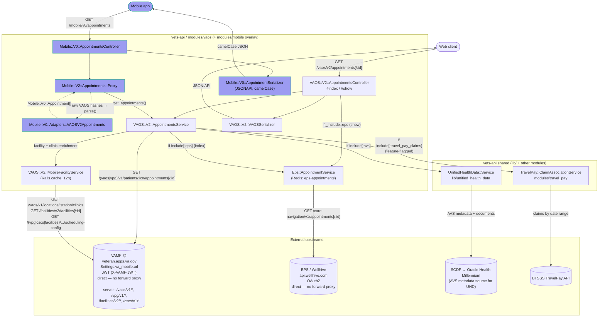

Data flow for `GET /vaos/v2/appointments` (index) and `GET /vaos/v2/appointments/:id` (show), in `vets-api/modules/vaos/`:

**External upstream notes:**

- **VAMF (`veteran.apps.va.gov`)** — single gateway fronting multiple internal APIs (`/vaos/v1`, `/vpg/v1`, `/facilities/v2`, `/cscs/v1`). Both `AppointmentsService` and `MobileFacilityService` hit it; MFS just uses different path prefixes. Authenticated per-request with a user-scoped JWT in `X-VAMF-JWT` (session token issued by `VAOS::UserService`). **Direct — not behind `vsp-platform-fwdproxy`.**
- **EPS (Wellhive, `api.wellhive.com`)** — OAuth2 token cached in Redis (`eps-appointments` namespace). **Direct — not behind the forward proxy.**
- **SCDF → Oracle Health Millennium** — accessed via `UnifiedHealthData::Service`. Source of AVS metadata and documents. Only called when `include[:avs]` is set. See <https://docs.oracle.com/en/industries/health/millennium-platform-apis>.
- **BTSSS TravelPay** — this upstream is chatty. For a page of appointments, the naive serial flow issues one BTSSS claim lookup per appointment, which can dominate total request time. The `va_online_scheduling_parallel_travel_claims` feature flag was added specifically to fetch the appointment list and the associated travel claims concurrently, and `TravelPay::ClaimAssociationService` batches the per-appointment claim associations. Treat BTSSS as the likely bottleneck when diagnosing slow `get_appointments` responses.

Feature flags that alter this path: `va_online_scheduling_use_vpg` (VAOS vs VPG routing), `va_online_scheduling_cscs_migration` (scheduling-configs to CSCS), `travel_pay_view_claim_details`, `va_online_scheduling_parallel_travel_claims`, `va_online_scheduling_add_OH_avs`, `appointments_consolidation`.

### Mobile overlay notes

The VA.gov native mobile app uses the `MobClient → MobCtrl → Proxy → AS` branch of the diagram above. It reuses the same VAOS v2 service — no upstream calls are duplicated. Key points:

- **No duplicated upstream I/O.** `Mobile::V2::Appointments::Proxy` (`modules/mobile/app/services/mobile/v2/appointments/proxy.rb`) constructs an `include_params` hash and calls `VAOS::V2::AppointmentsService#get_appointments` directly. The mobile path inherits all VAMF / EPS / UHD / BTSSS behavior from the diagram above.
- **The adapter does field reshaping only.** `Mobile::V0::Adapters::VAOSV2Appointments` (`modules/mobile/app/models/mobile/v0/adapters/vaos_v2_appointments.rb`) delegates to `VAOSV2Appointment.build_appointment_model`, which handles appointment-type mapping (va / cc / request / telehealth with atlas/gfe/home/onsite variants), timezone resolution (via `Mobile::VA_FACILITIES_BY_ID` fallback), phone-number normalization, cancellation-reason mapping, travel-pay eligibility flagging, and the `facility_id;fileman_date.time` VetExt ID format downstream systems expect.
- **Mobile-only response shaping happens in the controller, not the service.** `reverse_sort`, `page_size` / `page_number` pagination (`Mobile::PaginationHelper`), `include_pending` filtering, and the `upcomingAppointmentsCount` / `travelPayEligibleCount` meta fields are all added after the adapter. Partial upstream failures return `207 Multi-Status`.
- **No mobile-layer caching.** Caching is still upstream (Rails.cache inside `MobileFacilityService`, Redis inside `Eps::AppointmentService`, `Memoist` inside `AppointmentsService`). When debugging a stale response seen in the mobile app, look there first.
- **Out of scope for this diagram:** mobile's `cancel`, `create`, and `avs_binaries` actions. Those involve `Mobile::Shared::AppointmentCreator` and additional `MobileFacilityService` eligibility calls, and are worth their own diagram if/when we touch them.
