# External Referral Appointment Scheduling System
## Better known as the Community Care system or CC

## Goals
1. Streamline the process of scheduling external referral appointments for veterans
2. Reduce manual intervention in the referral and appointment scheduling process
3. Improve veteran experience by providing easy access to referral information and appointment scheduling
4. Ensure data security and privacy throughout the referral and appointment process
5. Integrate with existing VA systems (MAP, EPS, Vista) to provide a seamless experience

## Overview
The External Referral Appointment Scheduling System is designed to automate and simplify the process of managing external referrals and scheduling appointments for veterans.  The system integrates with VA Notify for communications and EPS for appointment management.

## Scope
- Integration with VA Notify for sending referral notifications to veterans
- Development of a frontend interface for veterans to view referrals and schedule appointments
- Integration with the External Provider Services (EPS) system for appointment management
- Integration with the CCRA (VA referrals and other info) via the MAP services as a pass through service
- Ensuring compliance with VA accessibility standards

## Assumptions
1. Referral data through MAP services which references CCRA (which is built within HSRM, a 3rd party cloud system)
2. Veterans have access to either SMS or email for receiving notifications
3. The EPS system is available and can be integrated for appointment scheduling
4. Staff members will continue to manually synchronize appointment data between EPS and Vista systems
5. The system will operate within the VA's existing authentication framework

## Design Decisions
1. Utilization of Redux for state management in the frontend
2. Integration with VA Notify for sending notifications to veterans
3. Use of the existing vets-api encryption library for securing referral data
4. Implementation of a two-tier approach for referral data retention
5. Daily checks for appointment synchronization between EPS and Vista

## System Architecture

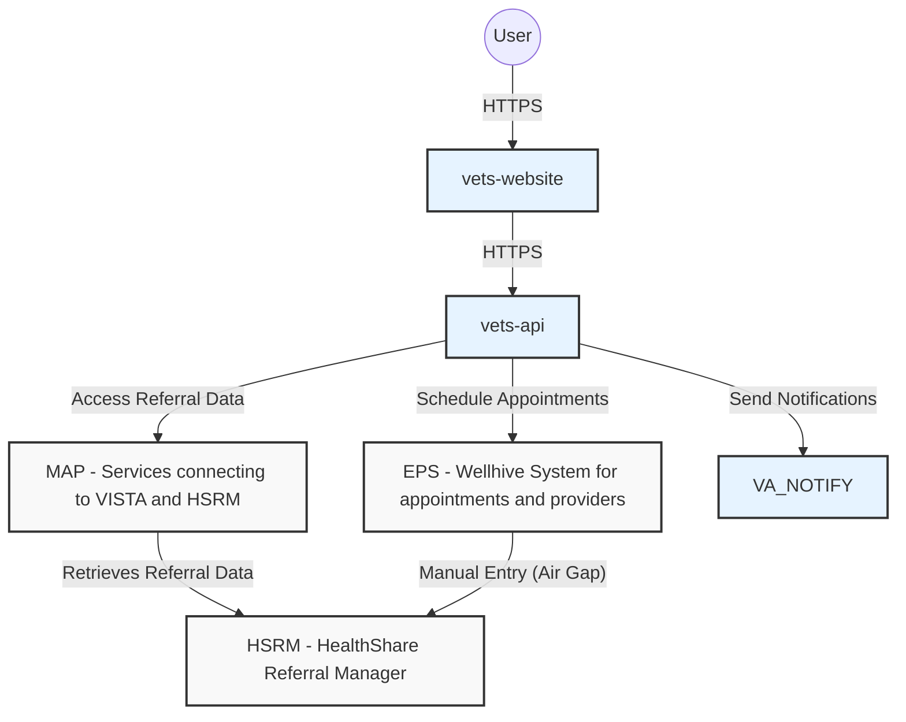

### Unified Scheduling System Architecture (Expansion)

The following diagram extends the existing architecture to include the unified scheduling flow. This expansion adds the Lighthouse Facilities API for VA facility discovery by location, the VAOS upstream service for VA direct scheduling (clinics, slots, eligibility, and appointment creation), and a unified orchestration layer within vets-api that merges both VA and EPS providers into a single provider list for the veteran. The flow remains referral-driven — the veteran's referral determines the category of care and the primary matched provider, while the unified list surfaces additional VA facilities and CC providers nearby that offer the same service. All existing CC/referral paths remain as documented for reference, but the unified provider list replaces the previous EPS-only provider display.

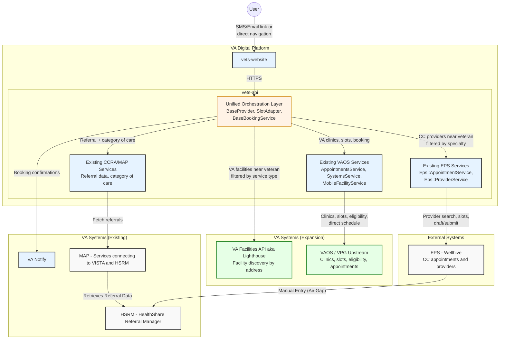

**Legend:**
- Blue = existing VA systems
- Green = new VA integrations (expansion)
- Orange = new unified orchestration layer (expansion)
- Gray = external systems

## Referral Data Model

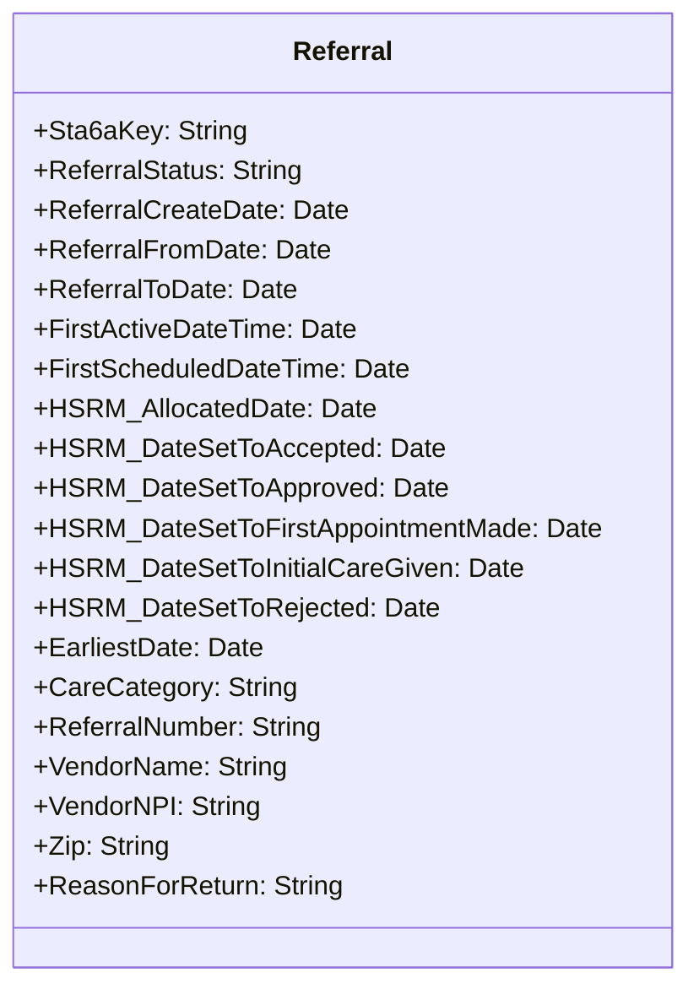

## Unified Provider & Booking Data Models (Expansion)

The following class diagrams describe the new shared abstraction layer that allows VA facilities and EPS community care providers to be treated uniformly throughout the unified scheduling flow. These are new additions and do not modify any existing VAOS or EPS models.

### Provider Model Hierarchy

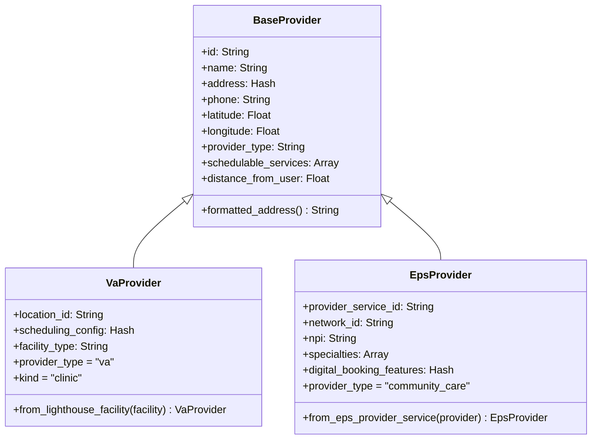

### Slot Model Hierarchy

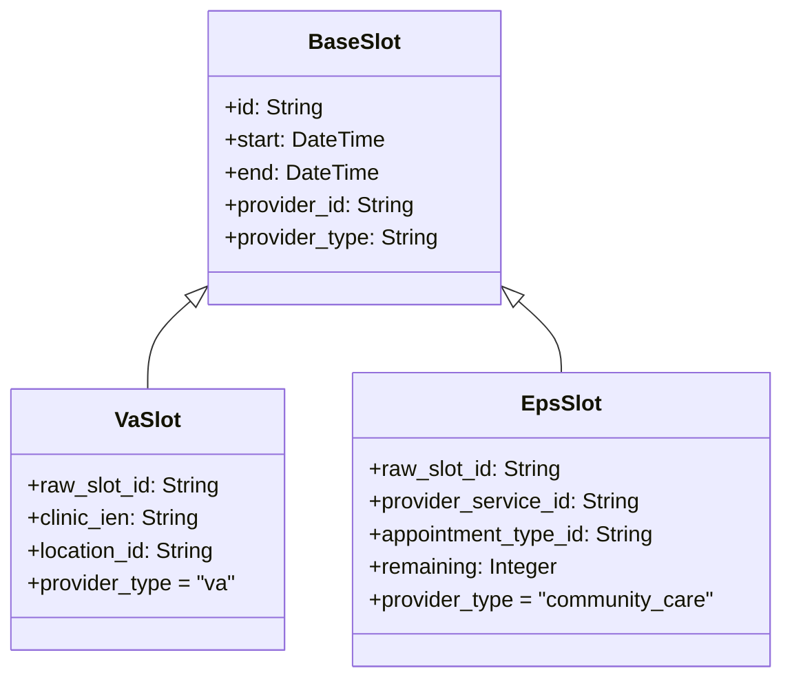

### Booking Service Hierarchy

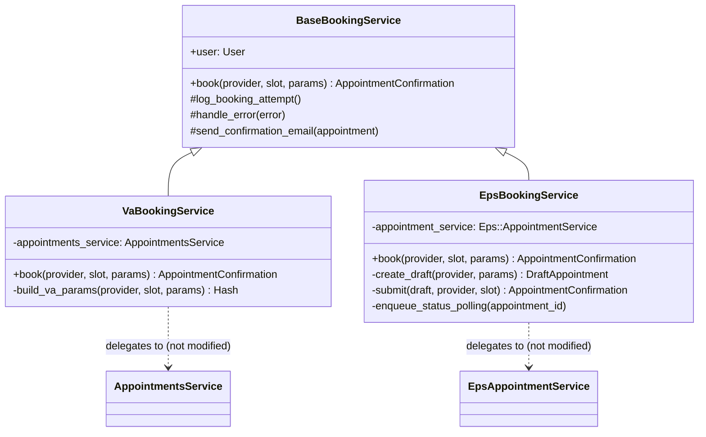

**Note:** Both booking services send confirmation emails via VA Notify through the base class. For VA bookings this happens immediately after the synchronous booking succeeds. For EPS bookings this happens via the existing Sidekiq polling job after async confirmation.

## Sequence Diagrams

### Workflow for booked vs not booked

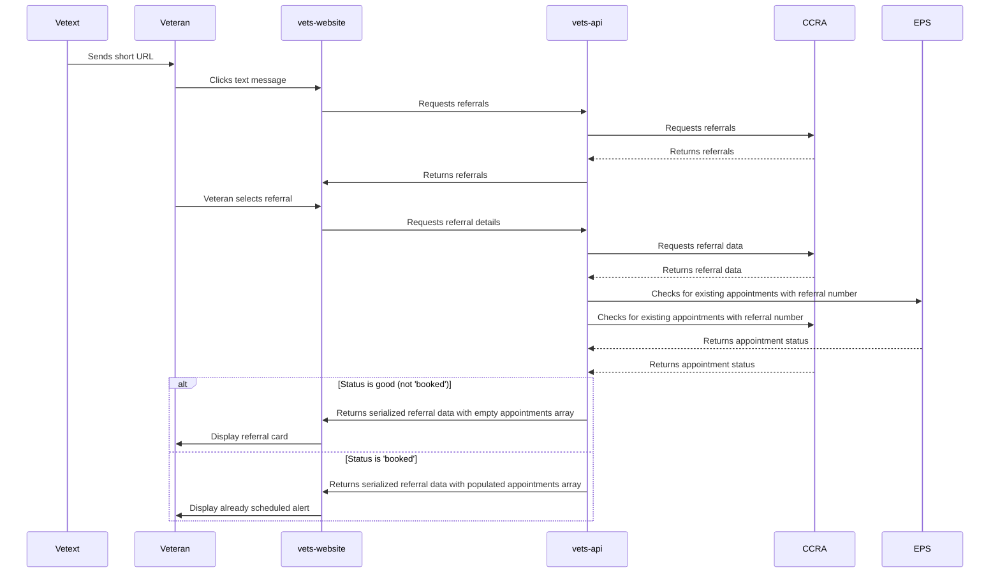

### Scheduling flow
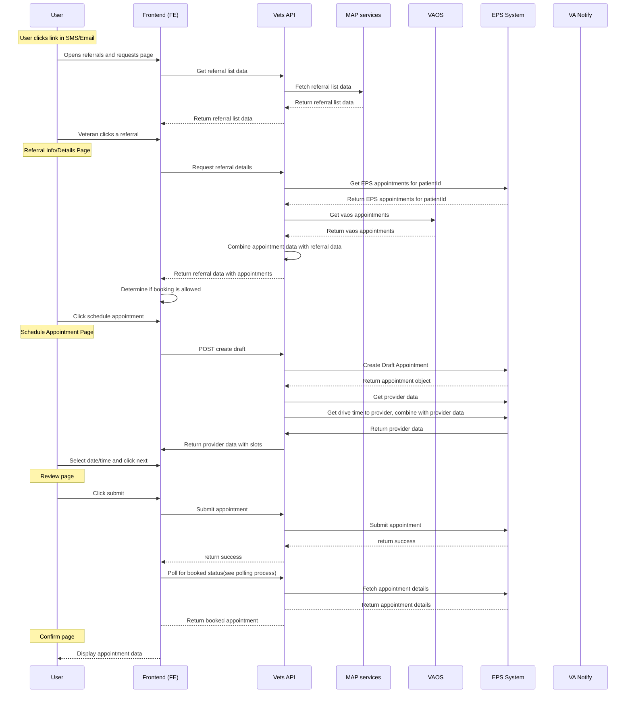

### Unified Provider Search & Booking Flow (Expansion)

This sequence diagram describes the unified scheduling flow that replaces the EPS-only provider display. The veteran still enters through the same referral-driven path (SMS/email notification or direct navigation to the Referrals and Requests page). When the veteran selects a referral and begins scheduling, the system uses the referral's category of care and the veteran's residential address (from their profile) to search for both the referral's matched CC provider (pinned to the top), additional CC providers with the same specialty, and VA facilities offering the same service type — all within a 25-mile radius. The veteran selects a provider, picks a time slot, and books. The backend routes to the correct booking path (VA direct schedule or EPS draft/submit) transparently.

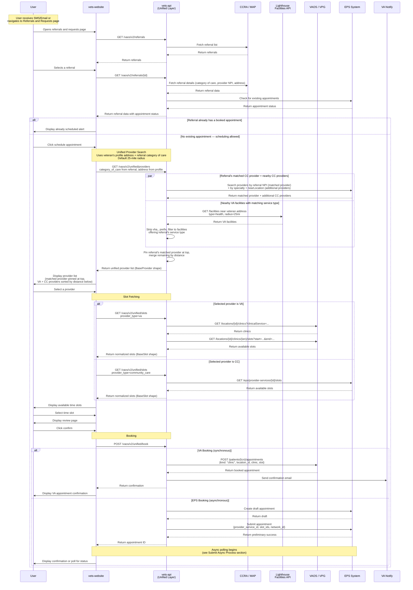

### Unified Booking — VA vs EPS Path Comparison (Expansion)

This diagram highlights the key differences between the two booking paths that the unified orchestration layer handles transparently. Both paths are in-person appointments only.

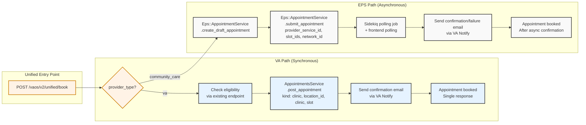

## Key Processes

### Referral Appointment Scheduling Flow

1. The user receives an SMS or email notification indicating that they can self-schedule an appointment for a referral.  
2. The notification directs the user to the **Referrals and Requests** page on **vets-website**, which lists all active referrals.  
3. The user selects the relevant referral from the list.  
4. **vets-website** retrieves the referral details and displays them to the user.  
5. If no appointment exists for that referral, the user can begin the scheduling process.  
6. The user navigates to the **Scheduling View**, where a draft appointment is created and available time slots are displayed.  
7. After selecting a time slot, the user reviews the appointment details on a **Final Verification** page.  
8. When the user clicks **Confirm**, the appointment is successfully booked.  
9. At a later point, the booked appointment is manually synced to external systems by staff.

### Unified Provider Search & Booking Flow (Expansion)

This flow replaces the EPS-only provider display within the existing referral-driven scheduling path. The entry point remains the same — the veteran receives an SMS/email or navigates directly to the Referrals and Requests page.

1. The user receives an SMS or email notification, or navigates directly to the **Referrals and Requests** page on **vets-website**.
2. The user selects a referral from the list. **vets-api** retrieves referral details including the category of care, matched provider NPI, and checks for existing appointments.
3. If no appointment exists, the user clicks **Schedule Appointment**.
4. **vets-api** uses the veteran's residential address from their profile and the referral's category of care to search for providers within a **25-mile radius**:
   - The referral's **matched CC provider** (by NPI via EPS) is pinned to the top of the list.
   - Additional **CC providers** with the same specialty are fetched from EPS via geographic search.
   - **VA facilities** offering the same service type are fetched from the Lighthouse Facilities API.
5. The combined provider list is displayed with the matched provider pinned at the top and remaining providers sorted by distance.
6. The user selects a provider. **vets-api** fetches available time slots from the appropriate source:
   - **VA provider**: existing VAOS clinics endpoint → existing VAOS slots endpoint
   - **CC provider**: existing EPS provider slots endpoint
7. The user selects a time slot and reviews the appointment details.
8. On confirmation, **vets-api** routes to the correct booking path:
   - **VA provider**: `VaBookingService` calls existing `AppointmentsService#post_appointment` with `kind: "clinic"` (synchronous, in-person only). A confirmation email is sent via VA Notify immediately.
   - **CC provider**: `EpsBookingService` calls existing `Eps::AppointmentService` draft + submit flow (asynchronous). The existing polling process handles status confirmation and VA Notify email.
9. The user sees a confirmation screen with appointment details.


## Resources

Since we already have 'Appointment' resource under VAOS (VA Online Scheduling) service, we're going to use that resource. We have discussed this with the VAOS backend engineering team and they are in agreement with this approach. This avoids any confusion for the Appointment resource and object. However the downside is that we're going to have to add logic to retrieve the appointments from EPS and dedupe those within the existing appointments service code, which is going to add complexity and latency for existing consumers.

## Referral Appointments API Specifications

This document describes the API specifications for VAOS referral appointments, defining the request/response structures between vets-website and vets-api.

### API Endpoints

#### GET /vaos/v2/referrals

Retrieves a list of referrals for the current user.

**Response:**
```json
{
  "data": [
    {
      "id": "6cg8T26YivnL68JzeTaV0w==00",
      "type": "referrals",
      "attributes": {
        "stationId": "659",
        "categoryOfCare": "CHIROPRACTIC",
        "referralNumber": "VA0000007241",
        "uuid": "6cg8T26YivnL68JzeTaV0w==00",
        "expirationDate": "2026-04-09"
      }
    }
  ]
}
```

#### GET /vaos/v2/referrals/{referralId}

Retrieves detailed information about a specific referral.

**Response** (when no appointments have been booked for this referral):
```json
{
  "data": {
    "id": "6cg8T26YivnL68JzeTaV0w==00",
    "type": "referrals",
    "attributes": {
      "uuid": "6cg8T26YivnL68JzeTaV0w==00",
      "categoryOfCare": "CHIROPRACTIC",
      "status": "ACTIVE",
      "referralNumber": "VA0000007241",
      "referralConsultId": "659_646907"
      "expirationDate": "2025-06-02",
      "serviceName": "Referral",
      "hasAppointments": false,
      "referralDate": "2023-01-01",
      "stationId": "659",
      "facilityName": "VAMC Facility",
      "facilityPhone": "555-555-5555",
      "preferredTimesForPhoneCall": [],
      "timezone": "America/New_York",
      "provider": {
        "name": "Dr. Moreen S. Rafa",
        "npi": "1346206547",
        "phone": "(937) 236-6750",
        "facilityName": "fake facility name",
        "address": {
          "street1": "76 Veterans Avenue",
          "city": "BATH",
          "state": null,
          "zip": "14810"
        }
      },
      "referringFacility": {
        "name": "Batavia VA Medical Center",
        "phone": "(585) 297-1000",
        "code": "528A4",
        "address": {
          "street1": "222 Richmond Avenue",
          "city": "BATAVIA",
          "state": null,
          "zip": "14020"
        }
      },
      "providerId": null,
      "receivingStaffName": null,
      "receivingStaffPhone": null,
      "referredToName": null,
      "sendingStaffEmail": null,
      "sendingStaffName": null
    },
    "relationships": {}
  }
}
```

**Note**: When appointments exist for a referral, the `hasAppointments` field will be `true` and appointment data may be included in the response.

#### POST /vaos/v2/appointments/draft

Creates a draft appointment for a referral with available providers and time slots.

**Request:**
```json
{
  "referral_number": "VA0000007241",
  "referral_consult_id": "984_646907"
}
```

**Response:**
```json
{
  "data": {
    "id": "appointment-for-VA0000007241",
    "type": "draft_appointment",
    "attributes": {
      "referralNumber": "VA0000007241",
      "provider": {
        "id": "9mN718pH",
        "name": "Dr. Bones @ FHA South Melbourne Medical Complex",
        "isActive": true,
        "individualProviders": [
          {
            "name": "Dr. Bones",
            "npi": "91560381x"
          }
        ],
        "providerOrganization": {
          "name": "Meridian Health (Sandbox 5vuTac8v)"
        },
        "location": {
          "name": "FHA South Melbourne Medical Complex",
          "address": "1105 Palmetto Ave, Melbourne, FL, 32901, US",
          "latitude": 28.08061,
          "longitude": -80.60322,
          "timezone": "America/New_York"
        },
        "networkIds": ["sandboxnetwork-5vuTac8v"],
        "schedulingNotes": "New patients need to send their previous records to the office prior to their appt.",
        "appointmentTypes": [
          {
            "id": "ov",
            "name": "Office Visit",
            "isSelfSchedulable": true
          }
        ],
        "specialties": [
          {
            "id": "208800000X",
            "name": "Urology"
          }
        ],
        "visitMode": "phone",
        "features": {
          "isDigital": true,
          "directBooking": {
            "isEnabled": true,
            "requiredFields": ["phone", "address", "name", "birthdate", "gender"]
          }
        }
      },
      "slots": [
        {
          "id": "5vuTac8v-practitioner-1-role-2|e43a19a8-b0cb-4dcf-befa-8cc511c3999b|2025-01-02T15:30:00Z|30m0s|1736636444704|ov0",
          "providerServiceId": "9mN718pH",
          "appointmentTypeId": "ov",
          "start": "2025-01-02T15:30:00Z",
          "remaining": 1
        }
      ],
      "drivetime": {
        "origin": {
          "latitude": 40.7128,
          "longitude": -74.006
        },
        "destination": {
          "distanceInMiles": 313,
          "driveTimeInSecondsWithoutTraffic": 19096,
          "driveTimeInSecondsWithTraffic": 19561,
          "latitude": 44.475883,
          "longitude": -73.212074
        }
      }
    }
  }
}
```


#### GET /vaos/v2/eps_appointments/{appointmentId}

Retrieves details for a specific EPS (Community Care) appointment.

**Response:**
```json
{
  "data": {
    "id": "EEKoGzEf",
    "type": "epsAppointment",
    "attributes": {
      "id": "EEKoGzEf",
      "status": "booked",
      "start": "2024-12-05T18:00:00Z",
      "isLatest": true,
      "lastRetrieved": "2025-11-05T15:15:07Z",
      "referralId": "123abc",
      "past": false,
      "modality": "communityCareEps",
      "provider": {
        "id": "test-provider-id",
        "name": "Dr. Smith @ Acme Cardiology - Anywhere, USA",
        "practice": "Acme Cardiology",
        "phone": "555-555-0001",
        "location": {
          "name": "Meridian Health",
          "address": "7500 CENTRAL AVE, STE 108, PHILADELPHIA, PA 19111-2430",
          "latitude": 40.06999282694126,
          "longitude": -75.08769957031448,
          "timezone": "America/New_York"
        }
      },
      "location": {
        "id": "test-location-id",
        "type": "appointments",
        "attributes": {
          "name": "Meridian Health",
          "timezone": {
            "timeZoneId": "America/New_York"
          }
        }
      }
    }
  }
}
```
#### POST /vaos/v2/appointments/submit

Submits a referral appointment for booking.

**Request:**
```json
{
  "id": "EEKoGzEf",
  "referralNumber": "VA0000007241",
  "slotId": "5vuTac8v-practitioner-1-role-2|e43a19a8-b0cb-4dcf-befa-8cc511c3999b|2025-01-02T15:30:00Z|30m0s|1736636444704|ov0",
  "networkId": "sandboxnetwork-5vuTac8v",
  "providerServiceId": "9mN718pH"
}
```

**Response:**
```json
{
  "data": {
    "id": "EEKoGzEf"
  }
}
```
### Error Responses

All endpoints may return error responses in the following format:

**404 Not Found:**
```json
{
  "errors": [
    {
      "title": "Referral not found",
      "detail": "Referral with ID {referralId} was not found",
      "code": "404",
      "status": "404"
    }
  ]
}
```

**500 Internal Server Error:**
```json
{
  "errors": [
    {
      "title": "Internal Server Error",
      "detail": "An error occurred while processing the request",
      "code": "500",
      "status": "500"
    }
  ]
}
```


## Unified Scheduling API Specifications (Expansion)

These endpoints are new additions for the unified scheduling flow. They replace the EPS-only provider display within the referral scheduling path. All existing referral and appointment endpoints continue to function as documented above. The flow remains referral-driven — the referral's category of care and the veteran's profile address are used to drive the provider search.

### API Endpoints

#### GET /vaos/v2/unified/providers

Searches for both VA facilities and EPS community care providers near the veteran's residential address, filtered by the referral's category of care. The referral's matched CC provider (by NPI) is pinned to the top of the results. Additional CC providers with the same specialty and VA facilities offering the same service type are returned below, sorted by distance.

**Request Parameters:**

| Parameter | Type | Required | Description |
|-----------|------|----------|-------------|
| referral_id | String | Yes | Referral ID — used to determine category of care and matched provider NPI |
| radius | Integer | No | Search radius in miles (default: 25) |

**Note:** The veteran's residential address is retrieved from their authenticated profile — it is not passed as a request parameter.

**Response:**
```json
{
  "data": [
    {
      "id": "9mN718pH",
      "type": "unified_provider",
      "attributes": {
        "name": "Dr. Bones @ FHA South Melbourne Medical Complex",
        "providerType": "community_care",
        "isReferralProvider": true,
        "address": {
          "street1": "1105 Palmetto Ave",
          "city": "Melbourne",
          "state": "FL",
          "zip": "32901"
        },
        "phone": "555-555-0001",
        "latitude": 28.08061,
        "longitude": -80.60322,
        "distanceInMiles": 2.1,
        "schedulableServices": ["urology"]
      }
    },
    {
      "id": "983",
      "type": "unified_provider",
      "attributes": {
        "name": "Cheyenne VA Medical Center",
        "providerType": "va",
        "isReferralProvider": false,
        "address": {
          "street1": "2360 East Pershing Boulevard",
          "city": "Cheyenne",
          "state": "WY",
          "zip": "82001"
        },
        "phone": "307-778-7550",
        "latitude": 41.1456,
        "longitude": -104.7892,
        "distanceInMiles": 3.2,
        "schedulableServices": ["urology", "primaryCare", "audiology"]
      }
    },
    {
      "id": "xK7mP2qR",
      "type": "unified_provider",
      "attributes": {
        "name": "Dr. Smith @ Acme Urology - Melbourne, FL",
        "providerType": "community_care",
        "isReferralProvider": false,
        "address": {
          "street1": "7500 Central Ave",
          "city": "Melbourne",
          "state": "FL",
          "zip": "32901"
        },
        "phone": "555-555-0002",
        "latitude": 28.09123,
        "longitude": -80.61456,
        "distanceInMiles": 5.7,
        "schedulableServices": ["urology"]
      }
    }
  ]
}
```

#### GET /vaos/v2/unified/slots

Fetches available time slots for a provider from the unified list. Routes internally to VAOS (for VA) or EPS (for CC) based on `provider_type`.

**Request Parameters:**

| Parameter | Type | Required | Description |
|-----------|------|----------|-------------|
| provider_id | String | Yes | Provider ID from unified list |
| provider_type | String | Yes | "va" or "community_care" |
| service_type | String | Yes (VA) | Clinical service (e.g. "urology"); required for VA path to filter clinics |
| start | DateTime | Yes | Slot search window start (ISO8601) |
| end | DateTime | Yes | Slot search window end (ISO8601) |

**Response:**
```json
{
  "data": [
    {
      "id": "3230323231313330323034353A323032323131333032313030",
      "type": "unified_slot",
      "attributes": {
        "start": "2026-04-01T09:00:00Z",
        "end": "2026-04-01T09:30:00Z",
        "providerId": "983",
        "providerType": "va"
      }
    }
  ]
}
```

#### POST /vaos/v2/unified/book

Books an in-person appointment with the selected provider and slot. Routes internally to the VA direct-schedule path or EPS draft/submit path based on `provider_type`. Both paths send a confirmation email via VA Notify.

**Request:**
```json
{
  "referralId": "6cg8T26YivnL68JzeTaV0w==00",
  "providerId": "983",
  "providerType": "va",
  "slotId": "3230323231313330323034353A323032323131333032313030",
  "serviceType": "urology",
  "contact": {
    "phone": "555-555-1234",
    "email": "veteran@example.com"
  }
}
```

**Response (VA — synchronous):**
```json
{
  "data": {
    "id": "appointment-id-12345",
    "type": "unified_appointment",
    "attributes": {
      "status": "booked",
      "providerType": "va",
      "start": "2026-04-01T09:00:00Z",
      "locationName": "Cheyenne VA Medical Center",
      "clinicName": "Urology Clinic 1",
      "kind": "clinic"
    }
  }
}
```

**Response (EPS — returns ID for async polling):**
```json
{
  "data": {
    "id": "EEKoGzEf",
    "type": "unified_appointment",
    "attributes": {
      "status": "submitted",
      "providerType": "community_care",
      "pollUrl": "/vaos/v2/eps_appointments/EEKoGzEf"
    }
  }
}
```

**Note:** For EPS bookings, the existing asynchronous polling process applies. The frontend should poll via the existing `GET /vaos/v2/eps_appointments/{appointmentId}` endpoint as described in the Submit Asynchronous Process section. VA bookings return a final `"booked"` status immediately with no polling required. A confirmation email is sent via VA Notify for both paths.


## Removing duplicates and preventing duplicates of referrals
- A duplicate referral refers to a referral that has already been entered into our system. The incoming referral ID will match an existing referral ID in our postgress DB. This is likely a referral that hasn't been scheduled into an appointment yet. See blow for existing appointment
- An existing appointment refers to an appointment that has been made with a referral ID, that referral ID matches to a "new" referral, which means it was already made. We can also possibly hold referrals in our DB and mark them as "completed" or "referral made" in the same manner, after the user has completed making an appointment with a referral
- Expired referrals are referrals whose end date has expired, regardless of if an appointment exists or not

## Submit Asynchronous Process

This diagram illustrates the dual polling mechanism that occurs when a veteran submits an appointment booking:

### 1. Initial Submission
- User clicks submit to book the appointment through the frontend
- **vets-website** calls `POST /vaos/v2/appointments/submit` to **vets-api**
- **vets-api** forwards the booking request to **EPS**
- **EPS** returns a preliminary success/failure response with an appointment ID
- This initial response does **not** mean the appointment is fully booked yet

### 2. EPS Async Validation
- After returning the preliminary response, **EPS** begins its own asynchronous validation process
- This process checks availability, eligibility, provider capacity, and other booking requirements
- The appointment status will be updated once this validation completes

### 3. Parallel Polling (Dual Process)

Two simultaneous polling processes begin to monitor the appointment status:

#### Frontend Polling (30 seconds)
- **vets-website** repeatedly calls `GET /vaos/v2/eps_appointments/{appointmentId}` every few seconds
- **vets-api** fetches the current appointment status from **EPS**
- This continues for 30 seconds maximum
- **Three possible outcomes:**
  - **Status is "booked"**: Display success confirmation to the user
  - **Status is error/rejected**: Display error alert instructing user to call for help
  - **Timeout (30 seconds elapsed)**: Display timeout alert instructing user to refresh the page or call

#### Backend Polling (4 attempts over ~3 minutes)
- **vets-api** enqueues a **Sidekiq background job** immediately after the initial submission
- The job polls the appointment status 4 times spread across approximately 3 minutes
- This longer polling window ensures the backend captures the final status even if the frontend times out
- **Three possible outcomes:**
  - **Status is "booked"**: Send success email to veteran via **VA Notify**
  - **Status is error/rejected**: Send failure email to veteran via **VA Notify**
  - **Timeout (4 attempts completed without success)**: Send failure/timeout email to veteran via **VA Notify**

### 4. User Experience

The dual approach provides:
- **Immediate feedback**: User sees status updates in real-time for up to 30 seconds
- **Email notification**: User receives a follow-up email if the process fails
- **Graceful degradation**: If the frontend times out, the user still gets notified via email if it failed
- **Clear guidance**: Users know whether to refresh, or call for assistance

> **Expansion note:** The Submit Asynchronous Process above applies only to EPS (community care) bookings. VA direct-schedule appointments made through the unified booking endpoint (`POST /vaos/v2/unified/book`) return a final `"booked"` status synchronously and do not require polling or async status checks. A confirmation email is sent via VA Notify immediately upon successful VA booking.

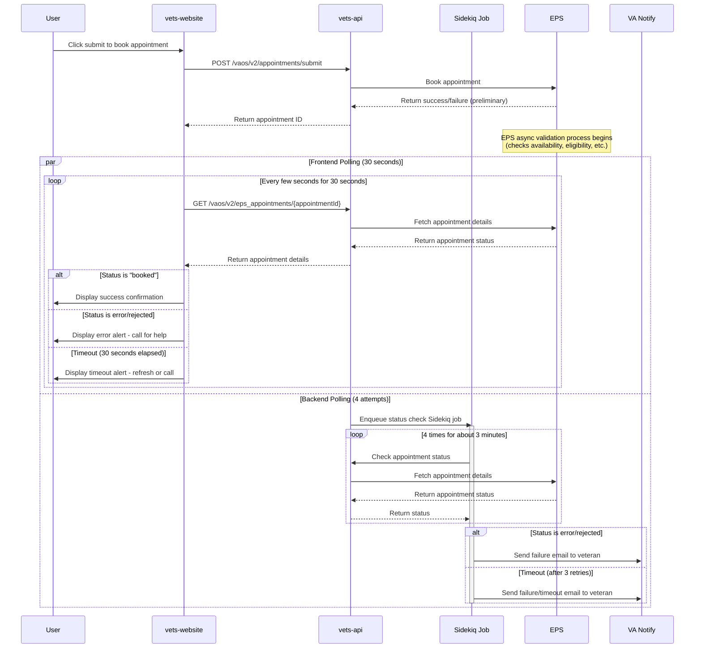

## Integration Points
1. CCRA: Source of referral data 
2. VA Notify: For sending notifications to veterans
3. EPS (External Provider Services): For appointment management (Wellhive)
    - https://wellhive.github.io/api-docs/

### Additional Integration Points (Expansion)
4. VA Facilities API (Lighthouse): For VA facility discovery by veteran's residential address within 25-mile default radius (used by unified provider search)
    - https://developer.va.gov/explore/api/va-facilities
5. VAOS / VPG Upstream: For VA clinic listings, slot availability, eligibility checks, and direct appointment creation (called via existing VAOS services, not modified)

## Performance Considerations
- Drive time seems to take a long time to retrieve results
- Async process in the confirmation

### Additional Performance Considerations (Expansion)
- The unified provider search calls Lighthouse and EPS in parallel to minimize latency. Combined response time is bounded by the slower of the two.
- VA slot fetching requires two sequential calls (clinics then slots); this adds latency compared to the single EPS slots call. Consider caching clinic IDs per facility.
- The service type mapping (Lighthouse → VAOS) should be a static constant lookup, not an API call.

## Accessibility
- The frontend interface will comply with existing VA accessibility standards.
- No additional accessibility requirements specific to this project.

## Open Questions and Future Considerations
1. Need to get what will be referred to as the providerID for the EPS system that matches to what's in the CCRA object. Refer to EPS document/yaml/json for the call `provider-services/{providerServiceId}`
2. Get user data from full auth user object in vets-api to get address and phone and email

### Additional Open Questions (Expansion)
3. Confirm the full set of Lighthouse `serviceId` values and verify which ones map to VAOS `SCHEDULABLE_SERVICE_TYPES` — any that don't match need to be excluded or a new mapping agreed upon with the VAOS team.
4. Determine whether the unified endpoints live under `/vaos/v2/unified/` or a different namespace.
5. Determine the source of the veteran's residential address — profile object, referral data, or both (with priority/fallback logic).
6. Two VA pilot sites will be used initially. Determine how to restrict the unified provider list to only those sites during the pilot phase (feature toggle, allowlist, or configuration), while ensuring the full architecture supports all VA facilities for general rollout.

## Proposed Cancellation Feature

moved to separate doc file:
https://github.com/department-of-veterans-affairs/va.gov-team/blob/master/products/health-care/appointments/va-online-scheduling/engineering/architecture/community-care-appts-cancellation.md
