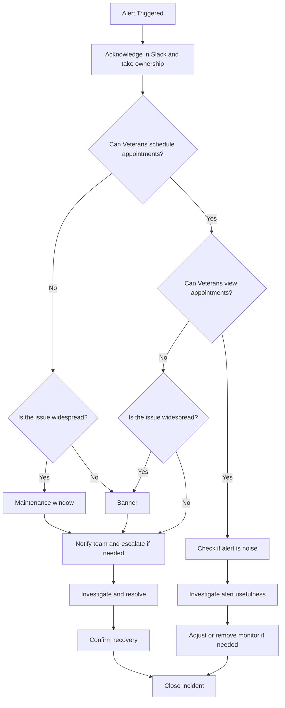

# MHV Appointments Incident Response Playbook

The on-call developer is responsible for acknowledging alerts, taking ownership, and driving the incident to resolution.

## Objective

Provide a consistent approach to identifying, investigating, and resolving incidents affecting MHV Appointments, with a focus on veteran impact and clear guidance for response.

---

## Incident Response Decision Flow

## Acknowledgement of the Incident

Acknowledgement is the first step in incident response.

When an alert is triggered, assume the issue has already persisted long enough to require investigation and begin response immediately.

As soon as an alert is triggered, acknowledge that an incident may be in progress and that you are investigating. Do not wait for full confirmation before acknowledging.

This ensures:
- The team knows the issue is being handled
- There is clear ownership of the investigation
- Duplicate efforts are avoided

### Expected Behavior

When you receive an alert:

1. Acknowledge in the [#appointments-alerts](https://dsva.slack.com/archives/C016QB6T340) Slack channel that you are investigating

Example:

`We are seeing elevated error rates for the slots endpoint. Acknowledging and starting investigation now.`

If the issue resolves quickly, follow up and confirm that no further action is needed.

---

## Investigation

### Step 1: Determine Veteran Impact

Start by reproducing or reasoning through the user flow to confirm what the veteran can and cannot do.

#### High Impact: Actions Blocked

Failures that prevent veterans from completing scheduling actions:

- Creating an appointment
- Cancelling an appointment
- Rescheduling an appointment
- Inability to load slots required to proceed with scheduling
- Inability to fetch facilities required to proceed with scheduling
- Inability to fetch clinics required to proceed with scheduling
- Inability to fetch eligibility required to proceed with scheduling
- Inability to fetch scheduling configurations required to proceed with scheduling
- Inability to fetch relationships required to proceed with scheduling

Impact:
Veterans cannot schedule or cancel appointments.

---

#### Lower Impact: Viewing Appointments Restricted

Failures that affect visibility but do not fully block actions:

- Intermittent appointment fetch failures
- Partial appointment data returned due to one or more upstream systems being unavailable

Impact:
Veterans may have a degraded experience but may still be able to proceed.

These issues should only be treated as high impact if they prevent the veteran from completing scheduling.

---

### Step 2: Scope the Issue

Determine:
- Which endpoints are affected
- Which facilities are impacted
- Whether the issue is isolated or widespread
- Determine whether the issue originates from our application or an upstream service

If upstream:
- Notify the backend team in #appointments-alerts and begin escalation

If internal:
- Continue investigation and implement a fix or mitigation

---

### Step 3: Investigate

Use:
- [Datadog metrics](https://vagov.ddog-gov.com/dashboard/7t4-7fw-pgj/vaos-alerts?fromUser=false&refresh_mode=sliding&from_ts=1775066590313&to_ts=1775152990313&live=true) to understand failure rates and trends
- Logs to identify error patterns and upstream signals
- [APM](https://vagov.ddog-gov.com/apm/entity/service%3Amhv-appointments?env=eks-prod) to trace failures and identify latency or dependency issues

---

## Monitoring and Alerts

Alerts are configured based on predefined thresholds and sustained failure conditions.

If an alert is triggered, assume:
- The issue has already met the threshold for impact
- The issue has persisted long enough to require investigation

Do not spend time determining whether the issue is significant enough to act.

Focus on:
- Determining veteran impact
- Taking appropriate action (banner or maintenance window)
- Investigating root cause

## Action

Actions should be based on veteran impact.

- If veterans are unable to submit or manage appointments → initiate maintenance window  
- If veterans can still proceed but experience degradation → display banner  

General rule:
- Banner = degraded experience
- Maintenance window = core functionality unavailable

---

## Communication

Communicate early and clearly.

Include:
- What is happening
- Veteran impact
- What you are doing next

Example:

`We are seeing elevated failures impacting appointment scheduling. Veterans may be unable to complete scheduling actions. Investigating upstream dependencies.`

---

## Escalation

If the issue is upstream (vaos-service, VistA, VPG, HSRM):
- Notify the BE team / tag Nicholas Daily or Ryan Lemire in the #appointments-alerts Slack channel

If there is no response or the issue persists:
- Escalate to VA stakeholders (Kay or Mark)

---

## Resolution

- Apply fix or mitigation
- Confirm recovery in Datadog
- Communicate resolution
- Update the 'Appointments Outages' canvas in the #appointments-alerts channel

---

## Post-Incident

After resolution:

- Was the alert useful?
- Was this noise?
- Should thresholds or monitors be adjusted?

---

## Endpoint Impact Reference for Appointments

Critical endpoints are those that directly block scheduling and should be prioritized for alerting and investigation.

Impact type depends on how the endpoint is used in the user flow.

If the failure prevents the veteran from completing scheduling, treat it as "Actions blocked".

| Endpoint | Impact Type | Critical |
|----------|------------|----------|
| **POST** `/v2/appointments` | Appointment scheduling blocked | Yes |
| **PUT** `/v2/appointments/:id` | Appointment scheduling blocked | Yes |
| **GET** `/v2/locations/:location_id/clinics/:clinic_id/slots` | Appointment scheduling blocked | Yes |
| **GET** `/v2/locations/:location_id/slots` | Appointment scheduling blocked | Yes |
| **GET** `/v2/scheduling/configurations` | Appointment scheduling blocked | Yes |
| **GET** `/v2/eligibility` | Appointment scheduling blocked | Yes |
| **GET** `/v2/community_care/eligibility/:service_type` | Appointment scheduling blocked | Yes |
| **GET** `/v2/relationships` | Appointment scheduling blocked | Yes |
| **GET** `/v2/appointments` | Appointment scheduling blocked (if required for scheduling flow for patient history), otherwise viewing restricted | No |
| **GET** `/v2/facilities` | Appointment scheduling blocked (if required for scheduling flow), Appointment viewing restricted | Yes |
| **GET** `/v2/locations/:location_id/clinics` | Appointment scheduling blocked (if required for scheduling flow), Appointment viewing restricted | Yes |
| **GET** `/v2/appointments/:appointment_id` | Appointment viewing restricted | No |
| **GET** `/v2/appointments/avs_binaries/:appointment_id` | Appointment viewing restricted | No |
| **GET** `/v2/facilities/:facility_id` | Appointment viewing restricted | No |
---

## Key Principles

- Always communicate in terms of veteran impact
- Focus on whether actions are blocked or degraded
- Alerts indicate thresholds have already been met
- Take ownership immediately upon alert
