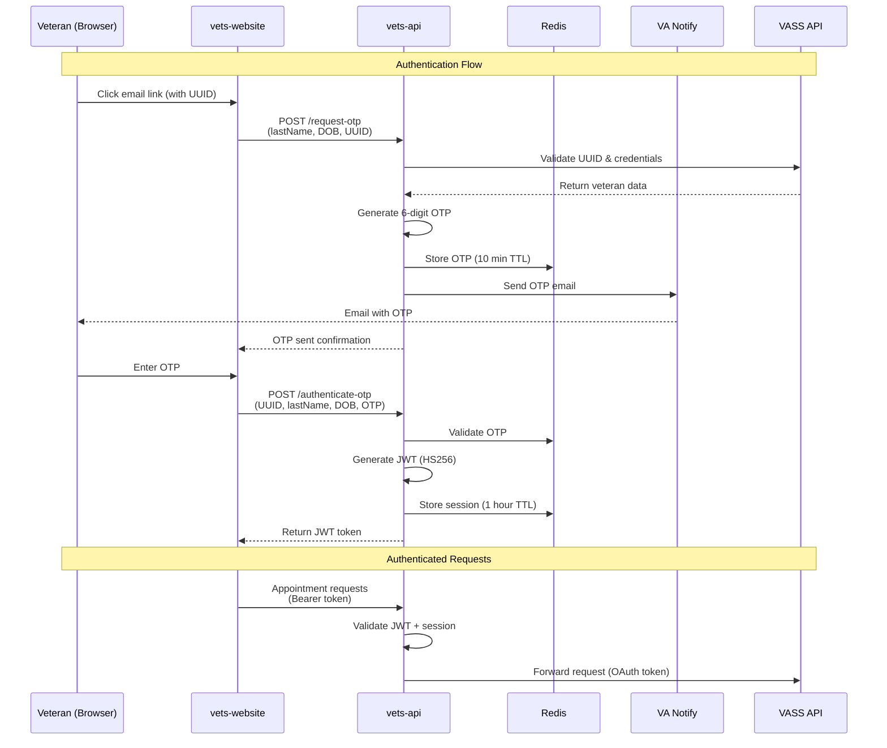
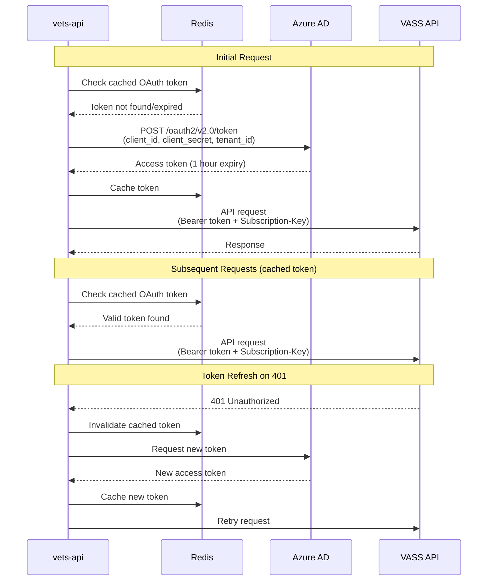

## API Authentication:  OTP Flow Authentication with VETS API

The One-Time Passcode (OTP) flow is designed for scenarios where users access VA scheduling services through a direct invitation—not via a full va.gov sign-in. Instead of authenticating with standard SSO. 

**How the OTP flow works with VASS API:**

1. **Invitation:**  
   The VASS backend system emails an invitation to the user, containing a unique scheduling link (with UUID).  

2. **Identity Validation:**  
   When the user clicks the scheduling link, they're prompted to enter their last name and date of birth.  
   VASS and Vets API coordinate to confirm these details and validate the last name, date of birth, and UUID.

3. **One-Time Code Generation:**  
   After initial validation, the Vets API generates an OTP and sends it to the user's email via VANotify. 

4. **Authentication and Appointment Access:**  
   The user enters the OTP in the browser. 
   Vets API verifies the code.   
   Upon successful verification, the user can access appointment scheduling features (view availability, book/cancel, etc.) without needing full SSO.

5. **Scoped Access:**  
   The OTP is single-use and grants time-limited, purpose-specific access for scheduling activities, ensuring security without requiring session tokens from va.gov's Sign-In Service.  
   All subsequent API calls to VASS for scheduling actions are authorized based on this OTP validation.

---

## Vets API to VASS API Authentication

While the OTP flow handles **veteran authentication** (user → Vets API), the **Vets API must also authenticate itself** when making calls to the VASS API backend. This is a separate, server-to-server authentication layer. 

**How Vets API authenticates to VASS API:**

1. **OAuth 2.0 Client Credentials Flow:**  
   The Vets API uses the OAuth 2.0 client credentials grant type to authenticate with Microsoft Azure AD (the identity provider for VASS).

2. **Service Account Configuration:**  
   Vets API is configured with: 
   - `client_id` - Application ID registered in Azure AD
   - `client_secret` - Secret credential for the application
   - `tenant_id` - Azure AD tenant identifier
   - `scope` - Requested permissions (typically `https://api.va.gov/. default`)
   - `subscription_key` - Azure API Management subscription key

3. **Token Acquisition:**  
   - When Vets API needs to call VASS, it first requests an OAuth access token from Microsoft's token endpoint:  `https://login.microsoftonline.com/{tenant_id}/oauth2/v2.0/token`
   - The token is cached in Redis to avoid requesting a new token for every API call
   - Tokens are automatically refreshed when they expire

4. **Authenticated API Requests:**  
   Every request to VASS API includes: 
   - **Authorization header:** `Bearer {access_token}` - The OAuth token from Azure AD
   - **Subscription key header:** `Ocp-Apim-Subscription-Key: {subscription_key}` - Azure API Management key
   - **Correlation ID:** Unique identifier for request tracing and logging

5. **Token Refresh & Retry:**  
   If VASS returns a 401 Unauthorized response, Vets API automatically: 
   - Invalidates the cached token
   - Requests a new OAuth token
   - Retries the original request once

**Implementation Details:**
- All OAuth logic is encapsulated in the `Vass::Client` class in the vets-api codebase
- The `with_auth` method wraps API calls and handles token management transparently
- Configuration is managed through `config/settings.yml` under the `vass:` section

This service-to-service authentication is completely separate from and transparent to the veteran using the OTP flow. 

### vets-api-to-VASS API Authentication (OAuth 2.0 Client Credentials)

