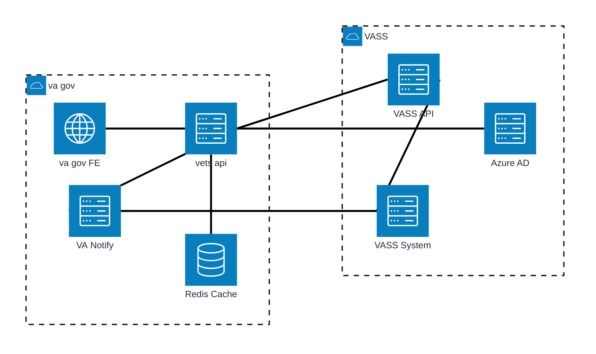
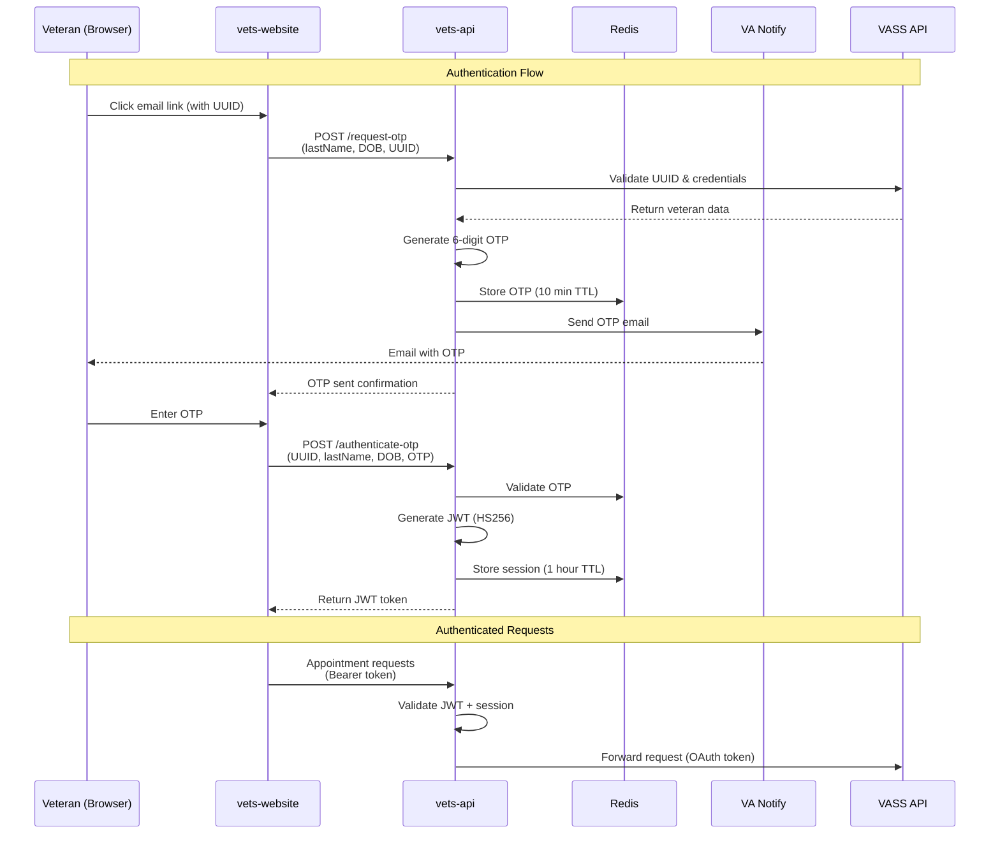
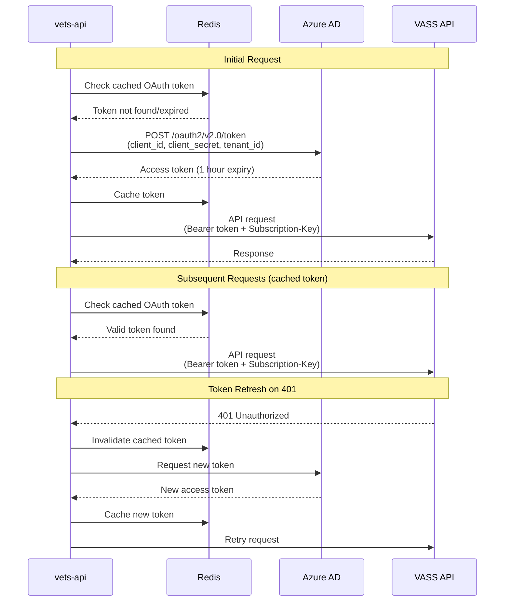

# Architecture

## High-Level System Architecture

**Email Delivery via VA Notify:**
- **VASS System → VA Notify**: Sends invitation emails (with UUID link) and appointment confirmation/cancellation emails
- **vets-api → VA Notify**: Sends OTP (one-time passcode) emails for veteran authentication

## Authentication Architecture

### Veteran-to-vets-api Authentication (OTP Flow)

### vets-api-to-VASS API Authentication (OAuth 2.0 Client Credentials)

## Scope and Boundaries

### In-Scope Components (VASS Scheduling Module)

| Component | Technology | Purpose | Ownership |
|-----------|-----------|---------|-----------|
| **vets-website VASS module** | React, TypeScript | Veteran-facing UI for scheduling | UAE Team |
| **vets-api VASS module** | Ruby on Rails | Backend API, authentication orchestration | UAE Team |
| **OTP Service** | Ruby, Redis | One-time passcode generation/validation | UAE Team |
| **JWT Session Management** | Ruby JWT gem, Redis | Token issuance and validation | UAE Team |
| **VASS API Client** | Ruby Faraday, OAuth2 gem | HTTP client with OAuth 2.0 authentication | UAE Team |

### Product Dependencies (Existing VA.gov Infrastructure)

| Component | Technology | Purpose | Owner |
|-----------|-----------|---------|-------|
| **Redis** | Redis 6.x | Session storage, OTP storage, OAuth token caching | Platform |
| **VA Notify** | REST API | Email delivery (OTP, invitations, confirmations) | VA Notify Team |
| **Datadog** | APM, Logging | Metrics, logs, alerts | Platform |
| **vets-api framework** | Ruby on Rails 7.x | Request handling, authentication, logging | Platform |
| **vets-website framework** | React 18.x | Frontend routing, state management | Platform |

### External Dependencies (Outside VA.gov)

| Component | Technology | Purpose | Owner |
|-----------|-----------|---------|-------|
| **VASS API** | REST API (Azure APIM) | Appointment data, veteran cohort info | VASS Team (NCC) |
| **VASS System** | Backend system | Data storage for appointments, veteran records | VASS Team (NCC) |
| **Azure AD** | OAuth 2.0 provider | Service-to-service authentication | VASS Team (NCC) |

## Security Approaches Considered

### Veteran Authentication: OTP vs. LoROTA

**Approaches Evaluated:**

| Approach | Description | Pros | Cons |
|----------|-------------|------|------|
| **LoROTA (Low-Risk One-Time Authentication)** | Serverless AWS Lambda architecture with dedicated datastore, used by check-in | - Proven in check-in experience - Supports 7-day data persistence | - Adds infrastructure complexity - Requires separate AWS resources - Overkill for 1-hour session requirement |
| **OTP Flow (Selected)** | One-time passcode sent via email, validated against Redis cache | - Leverages existing Redis infrastructure - Simpler architecture - 1-hour session matches requirement - No new infrastructure provisioning | - Requires email delivery - 10-minute OTP window |

**Decision Rationale:**

LoROTA was initially proposed to reuse the check-in experience architecture. However, the check-in flow requires persistent data storage for up to 7 days (pre-check-in window), while VASS scheduling only needs 1-hour sessions. 

**Chosen Approach:** OTP flow using Redis for temporary storage. This eliminates the need for serverless infrastructure and a dedicated datastore while meeting functional requirements.

**Documentation:** See [ADR: Authentication Approach](./adr-authentication-approach.md)

### Service-to-Service Authentication: OAuth 2.0 Client Credentials

**Approaches Evaluated:**

| Approach | Description | Selected |
|----------|-------------|----------|
| **API Key Only** | Static subscription key for VASS API | ❌ No - insufficient security for PHI/PII |
| **OAuth 2.0 Client Credentials** | Token-based authentication via Azure AD | ✅ Yes - industry standard, automatic rotation |
| **Mutual TLS (mTLS)** | Certificate-based authentication | ❌ No - more complex certificate management |

**Decision Rationale:**

VASS API is protected by Azure API Management and Azure AD. OAuth 2.0 client credentials flow is the standard pattern for service-to-service authentication in Azure environments, providing:

- Automatic token expiration and rotation
- Centralized credential management in Azure AD
- Industry-standard protocol (RFC 6749)
- Token caching to minimize overhead

**Implementation Details:**

- `client_id`, `client_secret`, `tenant_id` stored in vets-api encrypted configuration
- Access tokens cached in Redis with 1-hour TTL
- Automatic retry on 401 responses with token refresh
- Subscription key header (`Ocp-Apim-Subscription-Key`) required for Azure APIM

**Documentation:** See [API Authentication](./api-authenticate.md#vets-api-to-vass-api-authentication)

## Dependencies and Libraries

### New Dependencies (Added for VASS Module)

| Library | Version | Purpose | Selection Rationale |
|---------|---------|---------|---------------------|
| **oauth2** | ~> 2.0 | OAuth 2.0 client implementation | - Ruby standard for OAuth flows - Mature library (10+ years) - Active maintenance - Supports client credentials grant |
| **jwt** | ~> 2.7 | JWT encoding/decoding for veteran sessions | - Ruby standard for JWT - HS256 signing algorithm - Already used in vets-api for other modules |

### Existing Dependencies (Leveraged from vets-api)

| Component | Version | Purpose | Already in Code Base |
|-----------|---------|---------|----------------------|
| **redis** | 4.x | Session storage, caching | ✅ Yes - used across vets-api |
| **faraday** | 2.x | HTTP client for VASS API | ✅ Yes - standard HTTP client |
| **statsd-instrument** | 3.x | Datadog metrics | ✅ Yes - platform standard |
| **Rails.logger** | 7.x | Structured JSON logging | ✅ Yes - framework default |

**Why These Libraries:**

- **oauth2 gem**: Industry standard for Ruby OAuth implementations. Supports client credentials flow required by Azure AD. Handles token refresh logic automatically.
  
- **jwt gem**: De facto Ruby standard for JWT. Used elsewhere in vets-api (e.g., mobile authentication). Supports HS256 algorithm for session tokens.

- **Redis**: Already provisioned and managed by Platform team. No additional infrastructure needed. Supports TTL expiration for OTP (10 min) and sessions (1 hour).

- **Faraday**: Standard HTTP client in vets-api ecosystem. Supports middleware for logging, retries, and correlation ID injection.

**No New Infrastructure Required:** All dependencies leverage existing Platform infrastructure (Redis) or add lightweight Ruby gems to existing Rails application.

## Data Flow

### Scheduling Flow

1. **Email Invitation**: VASS System sends invitation email via VA Notify with unique URL containing UUID
2. **Identity Verification**: Veteran enters last name + DOB → vets-api validates against VASS API
3. **OTP Generation**: vets-api generates 6-digit code → stores in Redis (10 min TTL) → sends via VA Notify
4. **OTP Validation**: Veteran enters OTP → vets-api validates → issues JWT (1 hour expiry)
5. **Appointment Scheduling**: Veteran selects slot → vets-api calls VASS API (OAuth token) → appointment created in VASS System
6. **Confirmation Email**: VASS System sends appointment confirmation via VA Notify

### Cancellation Flow

1. **Confirmation Email**: VASS System sends confirmation with cancel link (UUID) via VA Notify
2. **Identity Re-verification**: Veteran re-authenticates via OTP flow (vets-api → VA Notify for OTP delivery)
3. **Appointment Retrieval**: vets-api fetches appointment from VASS API
4. **Cancellation**: Veteran confirms → vets-api calls VASS API → appointment cancelled in VASS System
5. **Notification**: VASS System sends cancellation confirmation email via VA Notify

**Detailed Diagrams:** See [Data Flow Diagrams](./data-flow-diagram.md) and [User Journey Sequence Diagrams](./sequence-diagrams/user-journeys.md)

## Non-Functional Requirements

### Performance

- **Session TTL**: 1 hour (JWT expiration, Redis session expiration)
- **OTP TTL**: 10 minutes (Redis expiration)
- **OAuth Token Caching**: 1 hour (Redis caching to reduce Azure AD calls)
- **Rate Limits**:
  - OTP generation: 3 requests per UUID per 15 minutes
  - OTP validation: 5 attempts per UUID before 15-minute lockout

### Security

- **Transport**: TLS 1.3+ required for all API calls
- **OTP Generation**: Cryptographically secure random 6-digit codes
- **JWT Algorithm**: HS256 (HMAC-SHA256)
- **Constant-Time Comparison**: OTP validation uses `ActiveSupport::SecurityUtils.secure_compare`
- **PII Protection**: Last name + DOB validated server-side only; not logged

**Details:** See [API Specification - Security Considerations](./api-specification.md#security-considerations)

### Observability

- **Metrics**: 22 Datadog metrics (14 controller + 8 infrastructure)
  - Success/failure rates per endpoint
  - Rate limit violations
  - Availability scenarios (no slots, already booked, etc.)
- **Logging**: Structured JSON with correlation IDs (`vass_uuid`, `jti`)
- **Alerts**: Critical alerts for failure rate >10%, rate limit spikes, capacity issues

**Details:** See [Metrics](./metrics.md) and [Logging](./logging.md)

## Related Documentation

- [API Specification](./api-specification.md) - Endpoint contracts and error responses
- [API Authentication](./api-authenticate.md) - Detailed authentication flows
- [ADR: Authentication Approach](./adr-authentication-approach.md) - Decision rationale
- [Data Flow Diagrams](./data-flow-diagram.md) - Visual data flows with context diagrams
- [User Journey Sequence Diagrams](./sequence-diagrams/user-journeys.md) - Step-by-step interaction flows
- [Metrics](./metrics.md) - Monitoring and KPI documentation
- [Logging](./logging.md) - Log structure and audit trail
