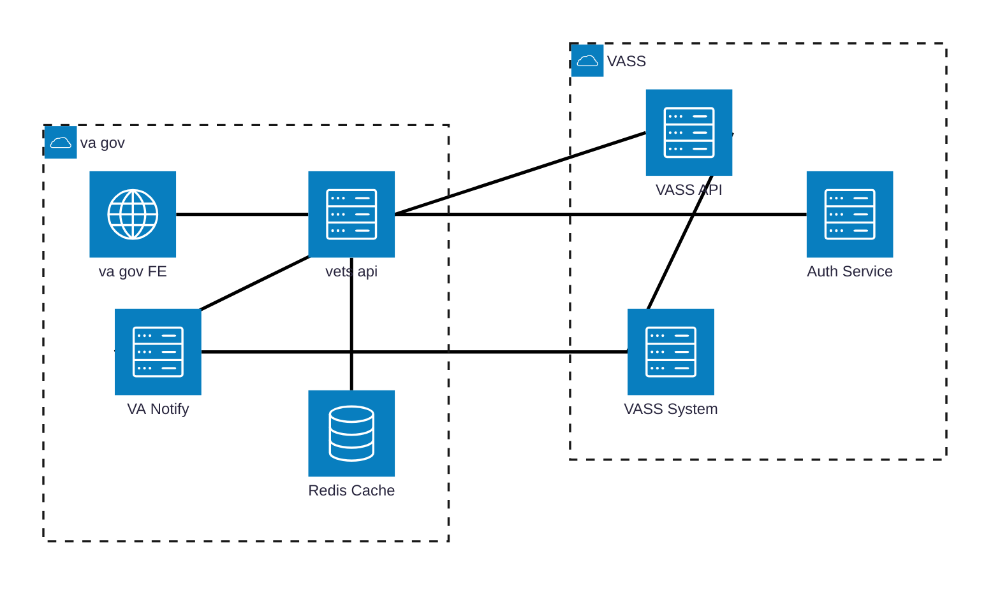

# Architecture

## High-Level System Architecture

**Communication Protocols:**
- **vets-api ↔ VASS API**: HTTPS (OAuth 2.0 Bearer token + Azure APIM Subscription-Key)
- **vets-api ↔ Auth Service(Azure AD)**: HTTPS (OAuth 2.0 client credentials flow)
- **VASS System → VA Notify**: HTTPS (REST API)
- **vets-api → VA Notify**: HTTPS (REST API)

**Email Delivery via VA Notify:**
- **VASS System → VA Notify**: Sends invitation emails (with UUID link) and appointment confirmation/cancellation emails
- **vets-api → VA Notify**: Sends OTP (one-time passcode) emails for veteran authentication

## Scope and Boundaries

### In-Scope Components (VASS Scheduling Module)

| Component | Technology | Purpose | Ownership |
|-----------|-----------|---------|-----------|
| **vets-website VASS module** | React, TypeScript | Veteran-facing UI for scheduling | UAE Team |
| **vets-api VASS module** | Ruby on Rails | Backend API, authentication orchestration | UAE Team |
| **OTP Service** | Ruby, Redis | One-time passcode generation/validation | UAE Team |
| **JWT Session Management** | Ruby JWT gem, Redis | Token issuance and validation | UAE Team |
| **VASS API Client** | Ruby Faraday, OAuth2 gem | HTTP client with OAuth 2.0 authentication | UAE Team |

### Product Dependencies (Existing VA.gov Infrastructure)

| Component | Technology | Purpose | Owner |
|-----------|-----------|---------|-------|
| **Redis** | Redis 6.x | Session storage, OTP storage, OAuth token caching | Platform |
| **VA Notify** | REST API | Email delivery (OTP, invitations, confirmations) | VA Notify Team |
| **Datadog** | APM, Logging | Metrics, logs, alerts | Platform |
| **vets-api framework** | Ruby on Rails | Request handling, authentication, logging | Platform |
| **vets-website framework** | React | Frontend routing, state management | Platform |

### External Dependencies (Outside VA.gov)

| Component | Technology | Purpose | Owner |
|-----------|-----------|---------|-------|
| **VASS API** | REST API (Azure APIM) | Appointment data, veteran cohort info | VASS Team (NCC) |
| **VASS System** | Backend system | Data storage for appointments, veteran records | VASS Team (NCC) |
| **Azure AD** | OAuth 2.0 provider | Service-to-service authentication | VASS Team (NCC) |

## Security Approaches Considered

### Veteran Authentication: OTP vs. LoROTA

**Approaches Evaluated:**

| Approach | Description | Pros | Cons |
|----------|-------------|------|------|
| **LoROTA (Low-Risk One-Time Authentication)** | Serverless AWS Lambda architecture with dedicated datastore, used by check-in | - Proven in check-in experience - Supports 7-day data persistence | - Adds infrastructure complexity - Requires separate AWS resources - Overkill for 1-hour session requirement |
| **OTP Flow (Selected)** | One-time passcode sent via email, validated against Redis cache | - Leverages existing Redis infrastructure - Simpler architecture - 1-hour session matches requirement - No new infrastructure provisioning | - Requires email delivery - 10-minute OTP window |

**Decision Rationale:**

LoROTA was initially proposed to reuse the check-in experience architecture. However, the check-in flow requires persistent data storage for up to 7 days (pre-check-in window), while VASS scheduling only needs 1-hour sessions. 

**Chosen Approach:** OTP flow using Redis for temporary storage. This eliminates the need for serverless infrastructure and a dedicated datastore while meeting functional requirements.

**Documentation:** See [ADR: Authentication Approach](./adr-authentication-approach.md)

## Dependencies and Libraries

No new dependencies
