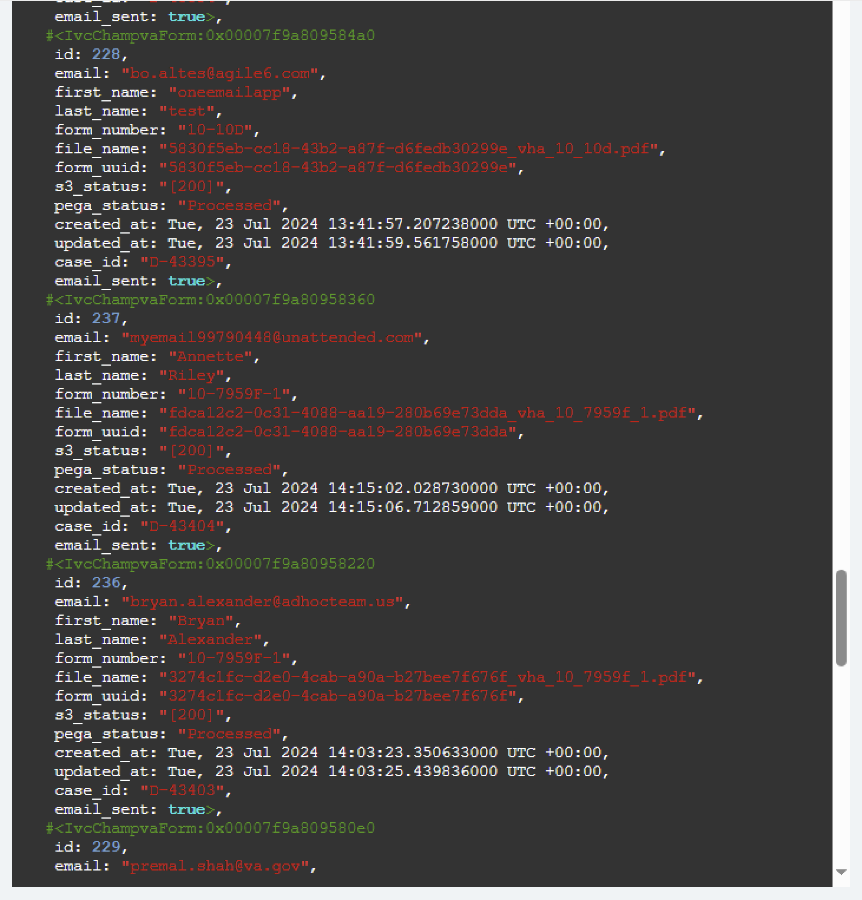

# Monitors and Alerts for form 10-10d
- Last Edit date: 7/23/2024 

This document lists the various monitors and alerts in place for form 10-10d.

All alerts are set up to populate the **#ivc-forms-datadog** slack channel.


## Monitor: Missing Pega Status
### Triggered: Missing Pega Status
#### Alert Reason:
### Alert Reason on What Triggers Missing Pega Status

The Missing Pega Status alert is triggered when certain conditions regarding the processing of forms are met. Specifically, if any form submissions do not receive a status update from the third-party system, Pega, it will generate an alert. For example, if forms are submitted but Pega fails to acknowledge or update their status within a specified timeframe, this will trigger the alert. This helps us identify and address any issues promptly. Additionally, the alert is triggered if the number of forms missing status updates exceeds a certain threshold. This threshold is set to ensure that any significant delays or failures in form processing are quickly flagged. By monitoring these alerts, we can maintain the efficiency and reliability of the form submission process.

#### Team Actions:
- IVC PRODUCT WILL ADD

### Recovered: Missing Pega Status
#### Alert Reason
- In order to troubleshoot the cause of the Missing Pega Status, follow these steps:
- Determine which environment the failure resides on: vets-api development, staging, sandbox, and production environments currently reside in EKS (Amazon Elastic Kubernetes Service).
- Use ArgoCD. ArgoCD provides a UI for developers to see the application and manages the deployment by checking the desired state against the deployed state.
- Access to the vets-api EKS applications is managed via GitHub teams [link here](https://github.com/department-of-veterans-affairs/va.gov-team/issues/new?assignees=&labels=external-request%2Cplatform-tech-team-support%2Cops-access-request&template=vetsapi-argo-terminal-access.yaml&title=Vets-api+terminal+access+for+%5Bindividual%5D). To obtain access, fill out a Vets-api ArgoCD terminal access request form. Note: prod access requires OCTO-DE approval and will take longer to get than the lower environments.
- Once you get ArgoCD approval from Platform, you will need to connect to the VA network using your PIC Card. Then navigate to the environment you want to access.
- [ArgoCd dev](https://argocd.vfs.va.gov/applications/vets-api-dev?view=tree&resource=)
- [ArgoCd Staging](https://argocd.vfs.va.gov/applications/vets-api-staging?view=tree&resource=})
- [ArgoCd Production](https://argocd.vfs.va.gov/applications/vets-api-prod?view=tree&resource=)

Once you have access to ArgoCd, follow these steps:
1. Search for "vets-api-{env-here}" in the search bar
2. Click on a vets-api-web-* pod (far right) Note: Look for the pod icon
3. A Terminal tab will appear on the far right
4. Run ```bundle exec rails c```
5. Run ```target_date = DateTime.new(2024, 7, 16)
          records = IvcChampvaForm.where("created_at > ?", target_date)
          records.each do |record|
          puts "ID: #{record.id}, Email: #{record.email}, First Name: #{record.first_name}, Last 
          Name: #{record.last_name}, Form Number: #{record.form_number}, Created At: #  
          {record.created_at}" end```   (Change the target_date filter the date you want to preview)


   

#### Team Actions:
- No Action needed, this alert is letting us know that volumes are back to normal

## Monitor: IVC ChampVA Forms Pega Callback API Errors
### Triggered: IVC ChampVA Forms Pega Callback API Errors
#### Alert Reason
IVC ChampVA Forms Pega Callback API errors occur when there is a problem with the communication between our system and the Pega system. These errors can be triggered if Pega is temporarily unavailable or experiencing an outage. Additionally, issues may arise if there are network connectivity problems that prevent our system from reaching Pega. Misconfigurations or incorrect data formats in the API requests can also lead to these errors. Another reason could be that the Pega system rejects the data due to validation errors. Finally, if our API rate limits are exceeded, it can cause callback errors. Monitoring these errors helps us quickly identify and resolve issues, ensuring smooth operation of the form submission process.

#### Team Actions
- IVC PRODUCT WILL ADD

### Recovered: IVC ChampVA Forms Pega Callback API Errors
#### Alert Reason
- IVC ENG PLEASE ADD
#### Team Actions:
- No Action needed, this alert is letting us know that the error rate is back to zero
