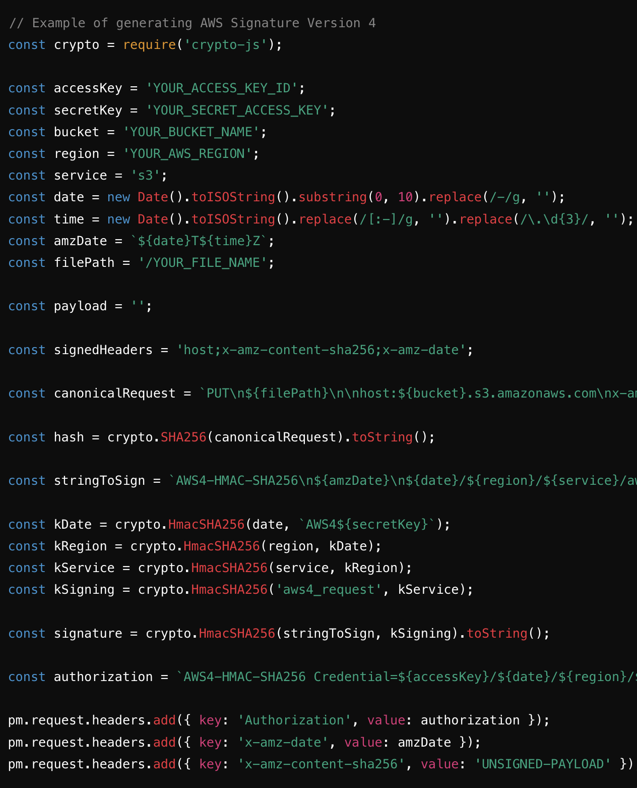

# Introduction
Amazon S3 (Simple Storage Service) is a service provided by Amazon Web Services (AWS) that allows you to store and retrieve data, such as files, images, and videos. This guide will help you connect to an AWS S3 bucket using a simple and straightforward approach.

# Prerequisites
Before you start, ensure you have the following by contacting a member of the IVC CHAMPVA Engineering team:

1. Bucketname
2. Region
3. Access key
4. Secret Access key

(Optional) Access to the AWS Management Console.

# Steps to Connect to an AWS S3 Bucket

Since the IVC CHAMPVA team is outside of the DOCMP PEGA team, we have limited access to the S3 bucket. We do not have sign in ability to their AWS Management Console.  In addition, we do not have the ability to download a completed file because we have to protect our clients Personal Identifiable Information.

There are 2 ways our team connects to PEGA's S3 bucket:

1.  Programically via Vets-API
2.  POSTMAN

# Programically via Vets-API

### Prerequisites
This assumes that you already have installed vets-api and running locally. If you do not have vets-api installed locally, please refer to this documentation: 

https://depo-platform-documentation.scrollhelp.site/developer-docs/base-setup-vets-api


1. After you have vets-api set up locally, you need to modify the file ```config/settings.yml``` with the IDE of your choice. Since we are mostly Ruby software developers, we use Visual Studio Code.

2. In the file ```config/settings.yml```, navigate to
  ```
ivc_forms:
    s3:
    aws_access_key_id: ~
    aws_secret_access_key: ~
    bucket: "bucket"
    enabled: true
    region: "region"
```

3. Important: DO NOT Commit the ``` config/settings.yml``` into Github. This is only for local testing.

4. Example:  
```
ivc_forms:
  s3:
    aws_access_key_id: AKDKOKWJJO2KALDFJALSDF;AKDFJ
    aws_secret_access_key: D92iK1eokda9i2i4urIDV92l2iduuhnc
    bucket: "staging-bucket"
    enabled: true
    region: "us-gov-bucket"
```

5. To migrate to staging and production, you will have to modify the environoment files. Contact the platform team via Slack and create a request to modify the staging and production .yml environment files.

# Connecting to AWS S3 via POSTMAN

We can test the connection the S3 bucket to test the initial connect and POST to the bucket.

### Introduction
Postman is a user-friendly tool that allows you to test and interact with APIs. This guide will walk you through the steps to connect to an AWS S3 bucket and upload a file using Postman.

### Prerequisites
Postman installed on your computer.

1.  Create a New PUT Request in Postman.
2.  Click on the New button in the top left corner of Postman and select Request. Name your request (e.g., "Upload to S3")
3.  Click Create Collection to organize your requests. Then click Save to [Your Collection Name].
4.  In the new request tab, change the request type to PUT using the dropdown menu to the left of the URL field.
5.  Enter the following URL format into the URL field: https://[bucket-name].s3.amazonaws.com/[file-name]. Replace [bucket-name] with your actual S3 bucket name and [file-name] with the name of the file you want to upload.
6.  Click on the Headers tab below the URL field.
7.  Add the following headers:
Authorization: This will be the AWS Signature Version 4 or manually entering the authorization into postman. This is a bit technical to generate manually, so we'll use Postman's pre-request script feature to automate it.
Content-Type: The MIME type of the file you're uploading (e.g., image/jpeg for a JPEG image, application/pdf for a PDF file).
8.  Add the File to the Request Body. Click on the Body tab. Select binary. Click Select File and choose the file you want to upload from your computer.
9.  Generate Authorization Header Using Pre-request Script
10.  Click on the Pre-request Script tab.
11.  Copy and paste the following script to generate the AWS Signature Version 4:
12.  
13.  Or you can enter the authorization manually


# (Optional) Connecting to S3 via the AWS Management Console

1. Sign in to the AWS Management Console
Open your web browser and go to the AWS Management Console.
Enter your AWS account credentials (email and password) to log in.
2. Navigate to S3 Service
Once logged in, you will see the AWS Management Console homepage.
In the search bar at the top, type "S3" and select "S3" from the dropdown menu.
3.  Locate Your S3 Bucket
On the Amazon S3 page, you will see a list of all your S3 buckets.
Find and click on the name of the S3 bucket you want to connect to.
4. Understanding the S3 Bucket Interface
Overview Tab: Shows general information about the bucket.
Properties Tab: Contains configuration settings.
Permissions Tab: Shows who has access to the bucket.
Management Tab: Used for setting up bucket policies and management tasks.
5. Accessing Files in the S3 Bucket
Objects Section: This section lists all the files and folders in your bucket.
Click on a file name to open it, or right-click to download it.
6. Uploading Files to the S3 Bucket
Click the "Upload" button.
Drag and drop files from your computer into the upload area or use the "Add files" button to select files.
Click "Upload" to add the files to the bucket.
7. Sharing Files from the S3 Bucket
Find the file you want to share.
Click on the file name to open its details.
Click the "Copy URL" button to get a shareable link.
8. Using S3 for Static Website Hosting (Optional)
Go to the Properties Tab of your bucket.
Scroll down to "Static website hosting" and click "Edit".
Enable static website hosting and set the index document (e.g., index.html).
Save changes. Your bucket can now serve static website content.

Conclusion
Connecting to an AWS S3 bucket is a simple process that allows you to store, retrieve, and share files easily. With these steps, you should be able to navigate the AWS Management Console and manage your S3 bucket efficiently.

If you have any questions or need further assistance, feel free to reach out to your AWS administrator or refer to the AWS S3 documentation.


