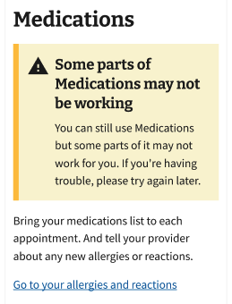
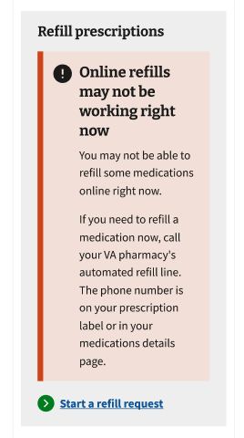

# Accessible Patterns

Collection of patterns supporting accessibility, along with the rationale for the pattern and a list of standards or other factors supported by the pattern.

Last updated: 12 Feb 2026

## Static Alerts

### Relevant standards
The following accessibility standards are supported by the Static Alerts pattern guidance.

- [SC 1.3.2 Meaningful Sequence (Level A)](https://www.w3.org/WAI/WCAG22/Understanding/meaningful-sequence): When the sequence in which content is presented affects its meaning, a correct reading sequence can be programmatically determined.
- [SC 2.4.3 Focus Order (Level A)](https://www.w3.org/WAI/WCAG21/Understanding/focus-order.html): If a web page can be navigated sequentially and the navigation sequences affect meaning or operation, focusable components receive focus in an order that preserves meaning and operability.
- [SC 4.1.3 Status Messages (Level AA)](https://www.w3.org/WAI/WCAG22/Understanding/status-messages): In content implemented using markup languages, status messages can be programmatically determined through role or properties such that they can be presented to the user by assistive technologies without receiving focus.

### Resources

- [Static Alert annotations (Figma)](https://www.figma.com/design/NI9ziF3FsJcU9SxoABc85v/%F0%9F%93%98-MHV---Accessibility-Explorations?node-id=6912-11642&t=EE024ZsypfinKXeu-1) — annotated patterns from MHV Accessibility includes details about positioning and accessibility attributes
- Static Alerts implementation (Storybook) — to come
- [Alert](https://design.va.gov/components/alert/) and [Alert - Expandable](https://design.va.gov/components/alert/alert-expandable/) — component documentation from VADS includes links to component in Figma and Storybook and usage guidance

---

### Patterns

#### Tool/Page Alert

- Guidance
  - Use for unprompted tool- or page-wide messages.
  - Place directly below the page heading.
  - Use only the standard Alert component for this type of alert.
  - Focus management:
    - Set focus to the page heading on page load (per [Focus Management on Page Load decision record](https://github.com/department-of-veterans-affairs/va.gov-team/blob/master/products/health-care/digital-health-modernization/mhv-to-va.gov/accessibility/documentation/decision-records.md#focus-management-on-page-load).
    - If the alert is dismissible, move focus back to the page heading when the alert is dismissed.
  - Role attribute: None
- Rationale
  - In most cases, the standard Alert (in all of its variations) should be placed directly below the intro text, near the top of the page. — Excerpted from VADS [Alert placement guidance](https://design.va.gov/components/alert/#web-4)
  - Location: After page title. — Guidance from VADS content style guide for this type of [alert messages](https://design.va.gov/content-style-guide/error-messages/access#system-downtime).
  - Alert - Expandable is only to be used within the contents of a page, not as a page-level alert. — Excerpted from VADS [Expandable Alert usage guidance](https://design.va.gov/components/alert/alert-expandable/#when-to-use-alert---expandable)
  - Static alert: No Role. If the alert is a static alert that exists on the page when the page gets loaded, it doesn’t need a role. — Excerpted from VADS [Alert aria-role guidance](https://design.va.gov/components/alert/#assign-an-appropriate-aria-role)

#### Feature/Section Alert

- Guidance
  - Use for unprompted feature- or section-specific messages.
  - Place directly below the  heading of the relevant section.
  - Use a Standard or Expandable Alert component for this type of alert. Use a Slim Alert only on pages with more than one alert.
  - Focus management: If the alert is dismissible, move focus back to the section heading when the alert is dismissed (note that Expandable Alerts cannot be dismissible).
  - Role attribute: None
- Rationale
  - Sub-alerts on the page. When your page has more than 1 alert and you are using the Standard and Slim alerts to create a hierarchy of alerts within the page. — Excerpted from VADS [Slim alerts usage guidance](https://design.va.gov/components/alert/#web-3)
  - When a standard Alert is applicable to a specific section of content on a page, it should be placed directly below the header of that section. — Excerpted from VADS [Alert placement guidance](https://design.va.gov/components/alert/#web-4)
  - Slim alerts related to a form field or section should be placed below the label, legend, or section header. — Excerpted from VADS [Alert placement guidance](https://design.va.gov/components/alert/#web-4)
