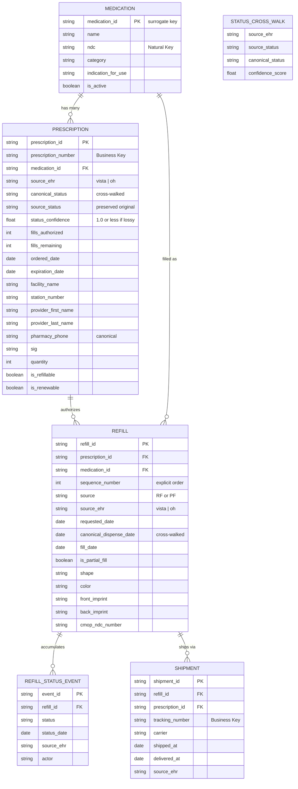

# MHV Medications: Data Architecture Modernization Proposal

> **Status:** Pre-RFC — Socializing for feedback
> **Scope:** `src/applications/mhv-medications/` and upstream BE systems
> **Author:** @sterkenburgsara
> **Date:** 2026-04-14

---

## TL;DR

The MHV Medications tool is built on a **single mega-object** (Prescription) that inlines medication identity, refill history, shipping tracking, provider info, and status into one deeply nested blob. This makes entity-level event tracking, ML/LLM readiness, dual-EHR normalization, and data lineage effectively impossible. We propose decomposing it into **6 first-class entities** with typed relationships, a semantic cross-walk layer for VistA/Oracle Health convergence, and a dbt-based data lineage pipeline from source EHRs through to consumption platforms (Datadog, Tableau/Power BI, ML feature stores).

---

## The Problem

### What exists today: 1 entity

There is no Medication entity, no Refill entity, and no Shipment entity in the current system. Everything is the Prescription:

- **Medication identity** = denormalized strings (`prescriptionName`, `cmopNdcNumber`) on the Prescription. If two prescriptions are for the same drug, there is no shared reference.
- **Refill history** = `rxRfRecords[]`, an anonymous nested array with **no primary key**. Refills are identified by array position. The MHV Java API **overwrites** the parent Prescription's `dispensedDate`, `refillDate`, and `refillRemaining` with the most recent refill record's values before sending the response — original fill data is destroyed in transit.
- **Tracking/Shipment** = `trackingList[]`, another nested array with no FK linking a shipment to the specific refill it belongs to.
- **Status** = a single overwritten field. No event history. When status changes from "Active" → "Refill in Process" → "Shipped", previous values are gone.
- **No source EHR provenance.** VistA and Oracle Health data arrive in the same shape but with different field semantics. Consumers must guess which EHR produced the data.

### Why this matters

| Blocked capability | Why it's blocked |
|---|---|
| Entity-level event tracking | Can't emit `refill.delayed` without unpacking from the mega-object; no stable refill ID to key on |
| ML/LLM feature engineering | Nested arrays with positional identity are fragile; no normalized entities for embedding pipelines or knowledge graphs |
| Error lineage | Can't trace a Datadog alert → specific Refill → source EHR system that caused the error |
| Dual-EHR normalization | VistA and OH have different statuses, field semantics, and API contracts; divergence is handled via ~40+ scattered if/else branches |
| Data warehouse / dbt modeling | No clean entity boundaries to model; the mega-object resists star-schema decomposition |
| Refill SLA monitoring | No discrete refill lifecycle (request → process → ship → deliver) to measure against |

---

## The Dual-EHR Complication

The VA is migrating facilities from VistA to Oracle Health (Cerner). These two EHR systems have incompatible semantics that the current architecture handles through conditional branching, not abstraction:

| Divergence | VistA | Oracle Health |
|---|---|---|
| Dispense date field | `dispensedDate` (actually pharmacy release date) | `whenHandedOver` (date handed to patient) |
| Status enums | 10+ statuses (e.g., "Active: Parked", "Active: On Hold") | 7 simplified statuses (e.g., "In progress", "Inactive") |
| Lossy status mapping | 1:1 canonical mapping possible | "Inactive" maps to on-hold OR discontinued — ambiguous |
| Refill action | `PATCH /prescriptions/:id/refill` | `POST /prescriptions/refill` with `[{id, stationNumber}]` body |
| API version | `/my_health/v1/...` | `/my_health/v2/...` |
| Prescription ID type | `number` | `string` |
| Pharmacy phone | `cmopDivisionPhone` (formatted) | `pharmacyPhoneNumber` (often primary) |

**A cross-walk layer that resolves these differences into canonical entities is not optional — it's required for any downstream analytics, ML, or lineage work.**

---

## Proposed Target: 6 Entities



### What changes

| Entity | Today | Proposed |
|---|---|---|
| **MEDICATION** | Does not exist. Drug identity = strings on Rx | First-class entity with surrogate PK. Shared across prescriptions. Enables drug-level analytics |
| **PRESCRIPTION** | The mega-object containing everything | Slimmed to the "order" — who prescribed what, when, where. Owns status + authorization |
| **REFILL** | Anonymous array `rxRfRecords[]` with no PK, identified by position | First-class entity with own PK, explicit sequence number, own lifecycle |
| **REFILL_STATUS_EVENT** | Does not exist. Status is a single overwritten field | Append-only event log. Full status transition history preserved |
| **SHIPMENT** | `trackingList[]` with no FK to specific refill | Linked to specific Refill, not just Prescription |
| **STATUS_CROSS_WALK** | Does not exist. VistA/OH divergence = scattered if/else | Version-controlled reference table with confidence scores for lossy mappings |

---

## Data Lineage Architecture

Modeled after a standard **Source → Raw → dbt Transform → Semantic Layer → Consumption** pattern:

```
  SOURCE SYSTEMS                          RAW WAREHOUSE TABLES
  ┌─────────────┐ ┌──────────────┐       ┌────────────────┐ ┌──────────────┐
  │  VistA EHR  │ │ Oracle Health│  ───▶  │ vista_rx_raw   │ │ oh_rx_raw    │
  └─────────────┘ └──────────────┘       │ ⚠️ naming       │ │ ⚠️ naming     │
  ┌─────────────┐                        │ conflicts      │ │ conflicts    │
  │ FE Events   │                ───▶    └────────────────┘ └──────────────┘
  │ (Datadog/GA)│                        ┌────────────────┐
  └─────────────┘                        │ events_raw     │
                                         └───────┬────────┘
                                                 │
                              dbt TRANSFORMATION MODELS
                              ┌──────────────────────────────────────┐
                              │ stg_vista_*    stg_oh_*  stg_events │
                              │        ↓          ↓         ↓       │
                              │ int_medications  (union + cross-walk │
                              │ int_prescriptions + entity creation) │
                              │ int_refills                         │
                              │ int_shipments                       │
                              │        ↓                            │
                              │ fct_refill_events                   │
                              │ fct_prescription_lifecycle          │
                              │ fct_error_lineage                   │
                              │ dim_medications  dim_facilities     │
                              └──────────────────┬───────────────────┘
                                                 │
                              SEMANTIC METRIC LAYER
                              ┌──────────────────────────────────────┐
                              │ refill_fulfillment_rate              │
                              │ avg_days_to_dispense                 │
                              │ refill_delay_rate                    │
                              │ error_rate_by_source_ehr             │
                              │ ehr_parity_score                     │
                              └──────────────────┬───────────────────┘
                                                 │
                              CONSUMPTION
                              ┌──────────┐ ┌──────────┐ ┌────────────┐
                              │ Datadog  │ │ Tableau/ │ │ ML Feature │
                              │Dashboards│ │ Power BI │ │ Store/LLM  │
                              └──────────┘ └──────────┘ └────────────┘
```

### Key semantic metrics enabled

| Metric | Definition | What it answers |
|---|---|---|
| `refill_fulfillment_rate` | dispensed refills / requested refills | Are we filling what veterans request? |
| `avg_days_to_dispense` | avg(dispensed_at − requested_at) | How fast is the pharmacy? |
| `refill_delay_rate` | delayed refills (>7d) / all refills | Are refills meeting SLA? |
| `error_rate_by_source_ehr` | errors grouped by VistA vs OH | Which system is causing user-facing errors? |
| `ehr_parity_score` | 1 − abs(metric_vista − metric_oh) / max | How close are the two EHRs to feature parity? |

---

## Existing Infrastructure We Can Lean On

| Asset | Status | How to leverage |
|---|---|---|
| **Datadog RUM** (`ddog-gov.com`) | ✅ Active | Extend custom actions with entity context (`refillId`, `sourceEhr`). Becomes `events_raw` source |
| **Google Analytics / dataLayer** | ✅ Active | Continue for UI events. Feed into warehouse via GA4 export |
| **Activity Audit Log (AAL)** | ✅ Active | Extend schema to include `entity_type`, `entity_id`, `source_ehr` |
| **80+ Datadog action names** | ✅ Cataloged | Refactor from flat strings to structured entity-keyed events |
| **RTK Query transform layer** | ✅ In place | Natural hook point for FE cross-walk/normalization on ingest |
| **VA Corporate Data Warehouse (CDW)** | ✅ Enterprise | Already ingests VistA clinical data. Potential `vista_rx_raw` source |
| **Tableau** | ✅ In use | Initial consumption platform alongside Datadog |
| **Feature flags** | ✅ Active | Input to cross-walk: determines which adapter to apply |

### What must be created

| Component | Priority |
|---|---|
| FE entity adapter layer (`vistaAdapter.js`, `oracleAdapter.js`, `crossWalk.js`) | Phase 1 |
| Structured event emitter with entity context | Phase 1 |
| Event schema registry | Phase 1 |
| Data warehouse provisioning (within DAIMO program) | Phase 2 |
| Ingestion pipeline (CDW → raw, OH API → raw, Datadog → raw) | Phase 2 |
| dbt project (staging → intermediate → mart models + cross-walk seed) | Phase 2 |
| Semantic metric layer (dbt Metrics or Cube.js) | Phase 3 |
| Error lineage dbt model (`fct_error_lineage`) | Phase 3 |
| ML feature store + triple-store export | Phase 4 |

---

## Phased Roadmap

| Phase | Scope | Timeline | Team | Backend dependency |
|---|---|---|---|---|
| **1** | FE cross-walk adapters + structured events | 3–5 sprints | FE medications | None |
| **2** | Warehouse + dbt models + ingestion | 5–8 sprints | FE + data eng + DAIMO | DAIMO coordination |
| **3** | Semantic metric layer + dashboards | 3–5 sprints | Data eng + analytics | Phase 2 mart models |
| **4** | ML feature store + knowledge graph | Multi-quarter | ML/AI + data eng | Phase 2–3 entities |
| **5** | Backend entity extraction (MHV API + vets-api) | Multi-quarter | MHV API + vets-api | Full cross-team |

**Phase 1 requires zero backend changes and can start immediately.** It proves the entity model, eliminates EHR branching from components, and enables entity-keyed Datadog queries — all before any cross-team coordination is needed.

---

## Key Risks

| Risk | Mitigation |
|---|---|
| Backend (MHV Java API) is owned by a different team | Phase 1 requires zero backend changes |
| OH "Inactive" is a lossy mapping | `confidence_score` on cross-walk table |
| ~40+ files touch the nested mega-object | Strangler fig pattern — old and new coexist |
| VistA refill subfiles have no universal unique ID | MHV DB assigns synthetic stable `refillId` on ingest |
| No dbt or modern data stack at VA today | Propose within DAIMO modernization program |

---

## Discussion Questions

1. **Warehouse platform:** Should we advocate for Snowflake, BigQuery, or align with whatever DAIMO selects?
2. **Cross-walk ownership:** Should the status cross-walk live in the FE adapter layer (fast), vets-api (pragmatic), or MHV Java API (ideal)?
3. **Medication entity scope:** Should `medication_id` be derived from NDC, drug name + strength, or a VA-specific drug identifier?
4. **Event schema format:** JSON Schema or Protobuf for the structured event contracts?
5. **Phase 1 starting point:** Should we start with the adapter layer or the structured event emitter?
