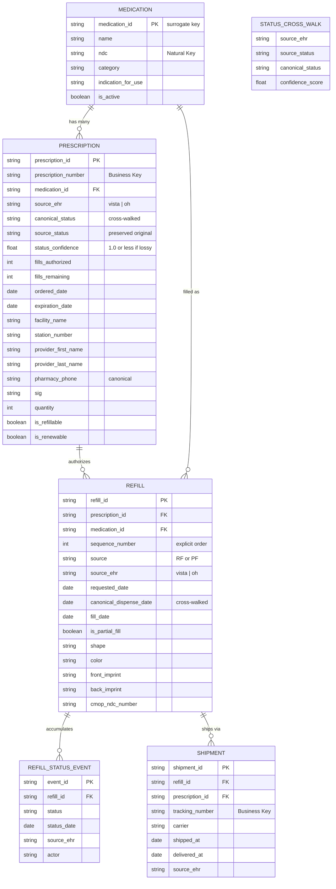

# MHV Medications: Data Architecture Modernization Proposal

> **Status:** Pre-RFC — Socializing for feedback
> **Scope:** `src/applications/mhv-medications/` and upstream BE systems
> **Author:** @sterkenburgsara
> **Date:** 2026-04-14

---

## Executive Summary

The MHV Medications tool is built on a **single mega-object** (Prescription) that inlines medication identity, refill history, shipping tracking, provider info, and status into one deeply nested blob. This makes entity-level event tracking, ML/LLM readiness, dual-EHR normalization, and data lineage effectively impossible. We propose decomposing it into **6 first-class entities** with typed relationships, a semantic cross-walk layer for VistA/Oracle Health convergence, and a dbt-based data lineage pipeline from source EHRs through to consumption platforms (Datadog, Tableau/Power BI, ML feature stores).

---

## The Problem

### What exists today: 1 entity

There is no Medication entity, no Refill entity, and no Shipment entity in the current system. Everything is the Prescription:

- **Medication identity** = denormalized strings (`prescriptionName`, `cmopNdcNumber`) on the Prescription. If two prescriptions are for the same drug, there is no shared reference.
- **Refill history** = `rxRfRecords[]`, an anonymous nested array with **no primary key**. Refills are identified by array position. The MHV Java API **overwrites** the parent Prescription's `dispensedDate`, `refillDate`, and `refillRemaining` with the most recent refill record's values before sending the response — original fill data is destroyed in transit.
- **Tracking/Shipment** = `trackingList[]`, another nested array with no FK linking a shipment to the specific refill it belongs to.
- **Status** = a single overwritten field. No event history. When status changes from "Active" → "Refill in Process" → "Shipped", previous values are gone.
- **No source EHR provenance.** VistA and Oracle Health data arrive in the same shape but with different field semantics. Consumers must guess which EHR produced the data.

### Why this matters

| Blocked capability | Why it's blocked |
|---|---|
| Entity-level event tracking | Can't emit `refill.delayed` without unpacking from the mega-object; no stable refill ID to key on |
| ML/LLM feature engineering | Nested arrays with positional identity are fragile; no normalized entities for embedding pipelines or knowledge graphs |
| Error lineage | Can't trace a Datadog alert → specific Refill → source EHR system that caused the error |
| Dual-EHR normalization | VistA and OH have different statuses, field semantics, and API contracts; divergence is handled via ~40+ scattered if/else branches |
| Data warehouse / dbt modeling | No clean entity boundaries to model; the mega-object resists star-schema decomposition |
| Refill SLA monitoring | No discrete refill lifecycle (request → process → ship → deliver) to measure against |

---

## The Dual-EHR Complication

The VA is migrating facilities from VistA to Oracle Health (Cerner). These two EHR systems have incompatible semantics that the current architecture handles through conditional branching, not abstraction:

| Divergence | VistA | Oracle Health |
|---|---|---|
| Dispense date field | `dispensedDate` (actually pharmacy release date) | `whenHandedOver` (date handed to patient) |
| Status enums | 10+ statuses (e.g., "Active: Parked", "Active: On Hold") | 7 simplified statuses (e.g., "In progress", "Inactive") |
| Lossy status mapping | 1:1 canonical mapping possible | "Inactive" maps to on-hold OR discontinued — ambiguous |
| Refill action | `PATCH /prescriptions/:id/refill` | `POST /prescriptions/refill` with `[{id, stationNumber}]` body |
| API version | `/my_health/v1/...` | `/my_health/v2/...` |
| Prescription ID type | `number` | `string` |
| Pharmacy phone | `cmopDivisionPhone` (formatted) | `pharmacyPhoneNumber` (often primary) |

**A cross-walk layer that resolves these differences into canonical entities is not optional — it's required for any downstream analytics, ML, or lineage work.**

---

## Proposed Target: 6 Entities



### What changes

| Entity | Today | Proposed |
|---|---|---|
| **MEDICATION** | Does not exist. Drug identity = strings on Rx | First-class entity with surrogate PK. Shared across prescriptions. Enables drug-level analytics |
| **PRESCRIPTION** | The mega-object containing everything | Slimmed to the "order" — who prescribed what, when, where. Owns status + authorization |
| **REFILL** | Anonymous array `rxRfRecords[]` with no PK, identified by position | First-class entity with own PK, explicit sequence number, own lifecycle |
| **REFILL_STATUS_EVENT** | Does not exist. Status is a single overwritten field | Append-only event log. Full status transition history preserved |
| **SHIPMENT** | `trackingList[]` with no FK to specific refill | Linked to specific Refill, not just Prescription |
| **STATUS_CROSS_WALK** | Does not exist. VistA/OH divergence = scattered if/else | Version-controlled reference table with confidence scores for lossy mappings |

---

## Data Lineage Architecture

Modeled after a standard **Source → Raw → dbt Transform → Semantic Layer → Consumption** pattern:

```
  SOURCE SYSTEMS                          RAW WAREHOUSE TABLES
  ┌─────────────┐ ┌──────────────┐       ┌────────────────┐ ┌──────────────┐
  │  VistA EHR  │ │ Oracle Health│  ───▶  │ vista_rx_raw   │ │ oh_rx_raw    │
  └─────────────┘ └──────────────┘       │ ⚠️ naming       │ │ ⚠️ naming     │
  ┌─────────────┐                        │ conflicts      │ │ conflicts    │
  │ FE Events   │                ───▶    └────────────────┘ └──────────────┘
  │ (Datadog/GA)│                        ┌────────────────┐
  └─────────────┘                        │ events_raw     │
                                         └───────┬────────┘
                                                 │
                              dbt TRANSFORMATION MODELS
                              ┌──────────────────────────────────────┐
                              │ stg_vista_*    stg_oh_*  stg_events │
                              │        ↓          ↓         ↓       │
                              │ int_medications  (union + cross-walk │
                              │ int_prescriptions + entity creation) │
                              │ int_refills                         │
                              │ int_shipments                       │
                              │        ↓                            │
                              │ fct_refill_events                   │
                              │ fct_prescription_lifecycle          │
                              │ fct_error_lineage                   │
                              │ dim_medications  dim_facilities     │
                              └──────────────────┬───────────────────┘
                                                 │
                              SEMANTIC METRIC LAYER
                              ┌──────────────────────────────────────┐
                              │ refill_fulfillment_rate              │
                              │ avg_days_to_dispense                 │
                              │ refill_delay_rate                    │
                              │ error_rate_by_source_ehr             │
                              │ ehr_parity_score                     │
                              └──────────────────┬───────────────────┘
                                                 │
                              CONSUMPTION
                              ┌──────────┐ ┌──────────┐ ┌────────────┐
                              │ Datadog  │ │ Tableau/ │ │ ML Feature │
                              │Dashboards│ │ Power BI │ │ Store/LLM  │
                              └──────────┘ └──────────┘ └────────────┘
```

### Key semantic metrics enabled

| Metric | Definition | What it answers |
|---|---|---|
| `refill_fulfillment_rate` | dispensed refills / requested refills | Are we filling what veterans request? |
| `avg_days_to_dispense` | avg(dispensed_at − requested_at) | How fast is the pharmacy? |
| `refill_delay_rate` | delayed refills (>7d) / all refills | Are refills meeting SLA? |
| `error_rate_by_source_ehr` | errors grouped by VistA vs OH | Which system is causing user-facing errors? |
| `ehr_parity_score` | 1 − abs(metric_vista − metric_oh) / max | How close are the two EHRs to feature parity? |

---

## Existing Infrastructure We Can Lean On

| Asset | Status | How to leverage |
|---|---|---|
| **Datadog RUM** (`ddog-gov.com`) | ✅ Active | Extend custom actions with entity context (`refillId`, `sourceEhr`). Becomes `events_raw` source |
| **Google Analytics / dataLayer** | ✅ Active | Continue for UI events. Feed into warehouse via GA4 export |
| **Activity Audit Log (AAL)** | ✅ Active | Extend schema to include `entity_type`, `entity_id`, `source_ehr` |
| **80+ Datadog action names** | ✅ Cataloged | Refactor from flat strings to structured entity-keyed events |
| **RTK Query transform layer** | ✅ In place | Natural hook point for FE cross-walk/normalization on ingest |
| **VA Corporate Data Warehouse (CDW)** | ✅ Enterprise | Already ingests VistA clinical data. Potential `vista_rx_raw` source |
| **Tableau** | ✅ In use | Initial consumption platform alongside Datadog |
| **Feature flags** | ✅ Active | Input to cross-walk: determines which adapter to apply |

### What must be created

| Component | Priority |
|---|---|
| FE entity adapter layer (`vistaAdapter.js`, `oracleAdapter.js`, `crossWalk.js`) | Phase 1 |
| Structured event emitter with entity context | Phase 1 |
| Event schema registry | Phase 1 |
| Data warehouse provisioning (within DAIMO program) | Phase 2 |
| Ingestion pipeline (CDW → raw, OH API → raw, Datadog → raw) | Phase 2 |
| dbt project (staging → intermediate → mart models + cross-walk seed) | Phase 2 |
| Semantic metric layer (dbt Metrics or Cube.js) | Phase 3 |
| Error lineage dbt model (`fct_error_lineage`) | Phase 3 |
| ML feature store + triple-store export | Phase 4 |

---

## Phased Roadmap

| Phase | Scope | Timeline | Team | Backend dependency |
|---|---|---|---|---|
| **1** | FE cross-walk adapters + structured events | 3–5 sprints | FE medications | None |
| **2** | Warehouse + dbt models + ingestion | 5–8 sprints | FE + data eng + DAIMO | DAIMO coordination |
| **3** | Semantic metric layer + dashboards | 3–5 sprints | Data eng + analytics | Phase 2 mart models |
| **4** | ML feature store + knowledge graph | Multi-quarter | ML/AI + data eng | Phase 2–3 entities |
| **5** | Backend entity extraction (MHV API + vets-api) | Multi-quarter | MHV API + vets-api | Full cross-team |

**Phase 1 requires zero backend changes and can start immediately.** It proves the entity model, eliminates EHR branching from components, and enables entity-keyed Datadog queries — all before any cross-team coordination is needed.

---

## Key Risks

| Risk | Mitigation |
|---|---|
| Backend (MHV Java API) is owned by a different team | Phase 1 requires zero backend changes |
| OH "Inactive" is a lossy mapping | `confidence_score` on cross-walk table |
| ~40+ files touch the nested mega-object | Strangler fig pattern — old and new coexist |
| VistA refill subfiles have no universal unique ID | MHV DB assigns synthetic stable `refillId` on ingest |
| No dbt or modern data stack at VA today | Propose within DAIMO modernization program |

---

## Product Opportunities Unlocked by Architecture Modernization

### Industry Context

The private-sector pharmacy industry has moved aggressively into AI-powered pharmacy care. CVS runs a Databricks Lakehouse with ML personalization engines. Walgreens operates robotic micro-fulfillment centers processing 50K prescriptions/day. Express Scripts uses predictive analytics to prevent therapy lapses. Amazon Pharmacy auto-ships before patients run out. Every one of these capabilities requires **normalized, entity-level data** — exactly what the proposed architecture creates and what the current mega-object prevents.

The VA has a head start in some areas — the **IIA Predictive Modeling System** already uses explainable AI for chronic disease risk, and **VHA Directive 1108.21** mandates pharmacy clinical informatics. But the MHV Medications frontend can't participate in any of this because its data model is a flat blob with no entity identity, no event history, and no EHR provenance.

---

### Opportunity 1: Predictive Refill Timing & Auto-Refill

**What industry does:** CVS and Walgreens use ML models to predict when a patient will need their next refill based on fill history, adherence patterns, and medication type — then proactively initiate the refill or send a precisely-timed reminder. Amazon Pharmacy auto-ships before patients run out.

**Why we can't do it today:** Refill history is a positional array (`rxRfRecords[0]`) with no stable identity, no `requested_date` as a discrete field, and the parent Rx's dates get overwritten by the latest fill. You can't build a time-series model on data that destroys its own history.

**Entities required:**

| Entity | Field | Purpose |
|---|---|---|
| REFILL | `requested_date` | Time-series of request intervals per veteran per medication |
| REFILL | `canonical_dispense_date` | Actual fulfillment dates (normalized across VistA/OH) |
| REFILL | `sequence_number` | Explicit ordering enables gap detection |
| MEDICATION | `medication_id` | Group refill patterns by drug, not just by prescription |
| PRESCRIPTION | `fills_remaining` | Remaining fills as a countdown signal |

**Product feature:** *"We predict you'll need your Amlodipine refill in 3 days based on your fill pattern. Would you like us to request it now?"* — surfaced as a proactive banner on the medications list page, or as a push notification if the veteran has opted in.

---

### Opportunity 2: Medication Adherence Scoring & Intervention

**What industry does:** Express Scripts and CVS build per-patient adherence scores using Proportion of Days Covered (PDC) — the gold-standard measure in pharmacy. Patients below threshold trigger pharmacist outreach, automated reminders, or care team alerts. CVS reported measurable increases in adherence rates from AI-driven interventions.

**Why we can't do it today:** PDC requires: (a) the date each fill was dispensed, (b) the days-supply of each fill, (c) the total observation window. With the mega-object, `dispensedDate` is overwritten by the latest RF record on the list endpoint, there's no discrete fill-level days-supply, and there's no Medication entity to compute PDC across prescription renewals for the same drug.

**Entities required:**

| Entity | Field | Purpose |
|---|---|---|
| REFILL | `canonical_dispense_date` | Each fill's actual dispense date (not overwritten) |
| PRESCRIPTION | `quantity` | Days-supply calculation per fill |
| MEDICATION | `medication_id` | Link refills across prescription renewals for the same drug |
| REFILL_STATUS_EVENT | `status`, `status_date` | Detect "stuck" refills (requested but never dispensed) |

**Product feature:** Per-veteran, per-medication adherence score visible to the veteran (*"You've taken 87% of your prescribed Metformin doses this year"*) and flagged to the care team when below threshold. The VA's IIA Predictive Modeling System could consume this score directly as a feature.

---

### Opportunity 3: Drug Interaction Detection & Safety Alerts

**What industry does:** Every major pharmacy chain runs real-time drug-drug interaction checking at point of dispense. CVS and Walgreens use AI to cross-reference full medication profiles, lab results, and patient conditions. Alto Pharmacy flags interactions with personalized pharmacist consultations.

**Why we can't do it today:** There is no Medication entity. Two prescriptions for the same drug are just two rows with the same `prescriptionName` string — there's no graph of what drugs a veteran is taking. You can't build an interaction checker against string comparisons; you need a drug identity linked to an interaction database (via NDC).

**Entities required:**

| Entity | Field | Purpose |
|---|---|---|
| MEDICATION | `ndc` | Linkable to FDA drug interaction databases, RxNorm, NDF-RT |
| MEDICATION | `medication_id` | Deduplicated drug list per veteran (even across prescriptions) |
| PRESCRIPTION | `canonical_status` | Only check interactions for active medications |
| MEDICATION | `is_active` | Formulary-level active/inactive status |

**Product feature:** When a new prescription appears, automatically check it against all other active medications for the veteran and surface warnings: *"⚠️ Amlodipine may interact with Lisinopril. Talk to your provider."* This is table-stakes for commercial pharmacies that the VA currently cannot offer through the medications tool.

---

### Opportunity 4: Refill SLA Monitoring & Delay Prediction

**What industry does:** Amazon Pharmacy and Capsule provide real-time delivery ETAs. Walgreens' robotic fulfillment centers track every step from receipt to dispense to ship. When delays occur, patients are proactively notified.

**Why we can't do it today:** The app has a hardcoded 7-day heuristic (`isRefillTakingLongerThanExpected`) that checks if `refillDate` or `refillSubmitDate` is older than 7 days. There's no event history to track *where* in the pipeline the delay occurred, no way to distinguish "pharmacy hasn't started" from "filled but not shipped" from "shipped but not delivered."

**Entities required:**

| Entity | Field | Purpose |
|---|---|---|
| REFILL_STATUS_EVENT | `status`, `status_date` | Full event timeline: requested → processing → filled → shipped → delivered |
| REFILL_STATUS_EVENT | `status_date` intervals | Measure duration at each stage |
| SHIPMENT | `shipped_at`, `delivered_at` | Precise shipping lifecycle |
| REFILL | `source_ehr` | Track if delays correlate with VistA vs OH facilities |

**Product feature:** Replace the binary "taking longer than expected" alert with a real-time process tracker: *"Your refill was requested 3 days ago → pharmacy received it 1 day ago → estimated ship date: April 17."* And for the operations team: dashboards showing avg time at each stage, by facility, by EHR source.

---

### Opportunity 5: Intelligent Prescription Renewal Workflow

**What industry does:** Express Scripts proactively identifies prescriptions approaching expiration and auto-initiates renewal workflows with the prescriber. CVS uses AI to determine the optimal time to begin the renewal process based on refill history and prescriber response patterns.

**Why we can't do it today:** `expirationDate` might be a cancel date (misleading field name), `fills_remaining` is overwritten by the latest RF record, and there's no event tracking for renewal requests. The current renewal flow (navigate to secure messaging, compose a message) is entirely manual with no intelligence about timing.

**Entities required:**

| Entity | Field | Purpose |
|---|---|---|
| PRESCRIPTION | `fills_remaining` | Accurate count (not overwritten) |
| PRESCRIPTION | `expiration_date` | True expiration vs cancel disambiguation |
| REFILL | `sequence_number` | How many fills have been used |
| MEDICATION | `medication_id` | Check if the drug is available in a different Rx that still has fills |
| REFILL_STATUS_EVENT | Full lifecycle | Track renewal request → approval → new Rx |

**Product feature:** *"Your Lisinopril has 0 refills left and expires in 21 days. Based on your fill history, we recommend requesting a renewal now. [Send renewal request]"* — with the renewal tracked as a first-class event, not a fire-and-forget secure message.

---

### Opportunity 6: Veteran-Facing Conversational AI (LLM/RAG)

**What industry does:** Amazon Pharmacy and Alto offer chat-based medication Q&A. CVS is rolling out AI-powered virtual assistants for pharmacy questions. These systems need structured, queryable data to ground their responses.

**Why we can't do it today:** An LLM cannot reliably answer "when will my refill arrive?" by parsing a mega-object with overwritten dates, dual-meaning fields, and positional arrays. RAG (Retrieval-Augmented Generation) requires entities with clear semantics and typed relationships to retrieve precise context.

**Entities required:**

| Entity | Field | Purpose |
|---|---|---|
| All 6 entities | Typed relationships | Knowledge graph for RAG retrieval |
| REFILL_STATUS_EVENT | `status`, `status_date` | Ground truth for "where is my refill?" |
| SHIPMENT | `tracking_number`, `carrier` | Direct answer to "how do I track my package?" |
| MEDICATION | `indication_for_use`, `sig` | Answer "what is this for?" and "how do I take it?" |
| All entities | `source_ehr` | LLM can explain *why* information may be limited |

**Example interactions:**

- *"When will my blood pressure medication arrive?"* → queries REFILL + SHIPMENT
- *"Can I take this with my other medications?"* → queries MEDICATION interaction graph
- *"Why can't I refill this?"* → queries PRESCRIPTION.canonical_status + REFILL_STATUS_EVENT + transition phase
- *"Show me my refill history for the last year"* → queries REFILL with time range

---

### Opportunity 7: Error Source Attribution & Self-Healing Systems

**What industry does:** CVS's intelligent automation platform uses AI to detect and route pharmacy errors before they reach patients. Walgreens' robotic systems self-correct dispensing errors in real-time.

**Why we can't do it today:** When an API error occurs, the Datadog action is a flat string like `"Refill Button - List Page"` with no entity context. You can't determine: was this a VistA error or an OH error? Was it a specific facility in transition? Was the refill already in a blocked state?

**Entities required:**

| Entity | Field | Purpose |
|---|---|---|
| All entities | `source_ehr` | Instant error attribution: VistA vs OH |
| PRESCRIPTION | `station_number` | Facility-level error isolation |
| REFILL_STATUS_EVENT | `status` | Was the refill in a valid state when the action was attempted? |
| `fct_error_lineage` | dbt model | Pre-computed error → entity → EHR → facility join |

**Product feature:** Self-healing error handling: *"This refill couldn't be submitted because your Spokane facility is transitioning to a new system. Refills will be available again after April 11. We'll notify you when this is ready."* — instead of the current generic *"There's a problem with our system."* And for engineering: auto-suppression of known transition-phase errors so they don't page on-call.

---

### Opportunity 8: Population Health Analytics for VA Leadership

**What industry does:** Express Scripts provides payer-level analytics on formulary utilization, adherence trends, and cost optimization. CVS's data platform feeds population-level insights to health plan partners.

**Why we can't do it today:** No Medication entity means you can't aggregate at the drug level across veterans. No Refill entity means you can't compute fulfillment rates. No `source_ehr` means you can't compare VistA vs OH performance.

**Metrics unlocked:**

| Metric | Stakeholder question it answers |
|---|---|
| `refill_fulfillment_rate` by facility | "Which VA pharmacies are underperforming?" |
| `avg_days_to_dispense` by source_ehr | "Is Oracle Health slower than VistA?" |
| `prescription_lapse_rate` by medication | "Which drugs have the highest abandonment?" |
| `ehr_parity_score` over time | "Is the OH migration improving or degrading the experience?" |
| `adherence_score` by veteran cohort | "Are younger veterans less adherent? Rural vs urban?" |

---

### Capability Gap Analysis: VA vs Industry

| Capability | CVS | Walgreens | Amazon Pharmacy | VA Today | VA After |
|---|---|---|---|---|---|
| Predictive refill timing | ✅ | ✅ | ✅ | ❌ | ✅ |
| Adherence scoring (PDC) | ✅ | ✅ | ✅ | ❌ | ✅ |
| Drug interaction detection | ✅ | ✅ | ✅ | ❌ | ✅ |
| Real-time refill stage tracking | ⚠️ | ✅ | ✅ | ❌ (7d heuristic) | ✅ |
| Intelligent renewal workflow | ✅ | ⚠️ | ✅ | ❌ (manual SM) | ✅ |
| Conversational AI (LLM) | 🔄 rolling out | ❌ | ✅ | ❌ | ✅ |
| Error source attribution | ✅ | ✅ | ✅ | ❌ (flat strings) | ✅ |
| Population health analytics | ✅ | ✅ | ✅ | ⚠️ (CDW only) | ✅ |
| EHR parity monitoring | N/A | N/A | N/A | ❌ | ✅ |

> **Key insight:** The VA has a unique advantage that commercial pharmacies don't — the IIA Predictive Modeling System and a research-grade Corporate Data Warehouse already in place. What's missing is the entity-level data model that feeds them with clean, normalized, provenance-tracked medication events. That's exactly what this architecture provides.

> Every one of these capabilities becomes a tractable engineering problem once you have discrete Medication, Prescription, Refill, and Shipment entities with stable PKs, typed relationships, and EHR provenance. Without them, each capability is a bespoke data-wrangling project that has to re-solve the mega-object decomposition problem from scratch.

---

## Discussion Questions

1. **Warehouse platform:** Should we advocate for Snowflake, BigQuery, or align with whatever DAIMO selects?
2. **Cross-walk ownership:** Should the status cross-walk live in the FE adapter layer (fast), vets-api (pragmatic), or MHV Java API (ideal)?
3. **Medication entity scope:** Should `medication_id` be derived from NDC, drug name + strength, or a VA-specific drug identifier?
4. **Event schema format:** JSON Schema or Protobuf for the structured event contracts?
5. **Phase 1 starting point:** Should we start with the adapter layer or the structured event emitter?
