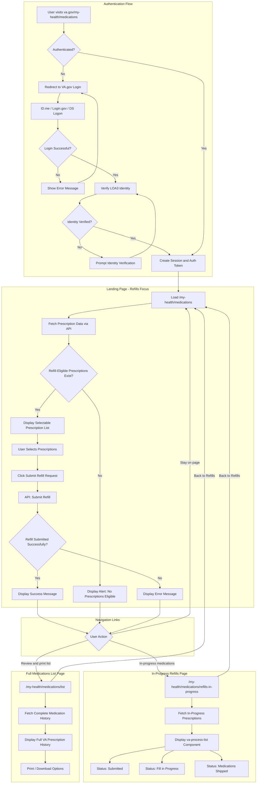

#MHV Medications - Medication Improvements Diagram

```mermaid

flowchart TD
    subgraph auth["Authentication Flow"]
        A[User visits va.gov/my-health/medications] --> B{Authenticated?}
        B -- No --> C[Redirect to VA.gov Login]
        C --> D[ID.me / Login.gov / DS Logon]
        D --> E{Login Successful?}
        E -- No --> F[Show Error Message]
        F --> C
        E -- Yes --> G[Verify LOA3 Identity]
        G --> H{Identity Verified?}
        H -- No --> I[Prompt Identity Verification]
        I --> G
        H -- Yes --> J[Create Session and Auth Token]
        B -- Yes --> J
    end

    subgraph landing["Landing Page - Refills Focus"]
        J --> K[Load /my-health/medications]
        K --> L[Fetch Prescription Data via API]
        L --> M{Refill-Eligible Prescriptions Exist?}
        M -- Yes --> N[Display Selectable Prescription List]
        N --> O[User Selects Prescriptions]
        O --> P[Click Submit Refill Request]
        P --> Q[API: Submit Refill]
        Q --> R{Refill Submitted Successfully?}
        R -- Yes --> S[Display Success Message]
        R -- No --> T[Display Error Message]
        M -- No --> U[Display Alert: No Prescriptions Eligible]
    end

    subgraph inprogress["In-Progress Refills Page"]
        V["/my-health/medications/refills-in-progress"]
        V --> W[Fetch In-Progress Prescriptions]
        W --> X[Display va-process-list Component]
        X --> Y1[Status: Submitted]
        X --> Y2[Status: Fill in Progress]
        X --> Y3[Status: Medications Shipped]
    end

    subgraph fulllist["Full Medications List Page"]
        Z["/my-health/medications/list"]
        Z --> AA[Fetch Complete Medication History]
        AA --> AB[Display Full VA Prescription History]
        AB --> AC[Print / Download Options]
    end

    subgraph navigation["Navigation Links"]
        S --> NAV1{User Action}
        U --> NAV1
        T --> NAV1
        NAV1 -- In-progress medications --> V
        NAV1 -- Review and print list --> Z
        NAV1 -- Stay on page --> K
        V -- Back to Refills --> K
        Z -- Back to Refills --> K
    end
```
