# MHV Medications – Management Improvements Architecture Diagram

## Color Legend

- **Green** — New pages (`RefillPrescriptionsV2`, `PrescriptionsInProgress`)
- **Yellow** — Moved page (`Prescriptions` list relocated to a new route)
- **Blue** — Feature flag gate (`mhv_medications_management_improvements`)
- **Gray** — Unchanged (`PrescriptionDetails`, legacy `/refill`)

## Architecture Diagram

```mermaid
graph TB
    subgraph User["Veteran (Browser)"]
        direction TB
        Browser["va.gov/my-health/medications"]
    end

    subgraph FeatureGate["Feature Flag Gate"]
        FF{"mhv_medications<br/>_management_improvements"}
    end

    Browser --> FF

    subgraph FrontendApp["MHV-Medications React App"]
        direction TB

        subgraph Bootstrap["App Bootstrap"]
            AppEntry["app-entry.jsx<br/>(Redux Provider + RouterProvider)"]
            AppContainer["App.jsx<br/>(Datadog RUM init, Downtime)"]
            AppProviders["AppProviders.jsx<br/>(RequiredLoginView, MhvServiceGuard)"]
        end

        subgraph Routing["React Router (v5-compat)"]
            direction LR
            RootRoute["/ (root)"]
            InProgressRoute["/in-progress"]
            RefillRoute["/refill (legacy)"]
            ListRoute["/ (flag OFF)"]
            DetailsRoute["/prescription/:id"]
        end

        subgraph Pages["Pages / Containers"]
            direction TB
            RefillV2["RefillPrescriptionsV2<br/>(NEW landing page)<br/>Refill-eligible list,<br/>select & submit refills,<br/>empty-state alert"]
            InProgress["PrescriptionsInProgress<br/>(NEW page)<br/>va-process-list:<br/>Submitted → Fill in progress<br/>→ Medications shipped"]
            MedsList["Prescriptions<br/>(Moved to new route)<br/>Full medication history,<br/>filter, sort, paginate"]
            RefillLegacy["RefillPrescriptions<br/>(Legacy /refill)"]
            Details["PrescriptionDetails"]
        end

        subgraph Components["Key Components"]
            direction TB
            RefillMedList["RefillMedicationList"]
            RefillNotifs["SuccessNotificationV2<br/>PartialRefillNotification<br/>ErrorNotification"]
            ProcessList["InProgressMedicationsProcessList<br/>Prescription<br/>TooEarlyToRefillCard"]
            MedsListComp["MedicationsList<br/>MedicationsListCard<br/>MedicationsListFilter<br/>MedicationsListSort"]
            SharedComp["Shared: PrintDownload,<br/>ApiErrorNotification,<br/>RefillButton, NeedHelp"]
        end

        subgraph StateLayer["State Management"]
            direction TB
            ReduxStore["Redux Store"]
            subgraph RTKQuery["RTK Query API Slices"]
                PrescApi["prescriptionsApi"]
                AllergyApi["allergiesApi"]
            end
            PrefsSlice["preferencesSlice<br/>(sort, filter, pagination<br/>→ sessionStorage)"]
            IPESlice["inProductEducation<br/>(tooltips)"]
        end

        subgraph Observability["Observability & Monitoring"]
            direction TB
            DatadogRUM["Datadog RUM<br/>100% session sample<br/>50% replay sample<br/>privacy: mask"]
            DDActions["data-dd-action-name<br/>(static labels only)"]
            GA["Google Analytics<br/>recordEvent<br/>(static labels)"]
            Sentry["Sentry<br/>(PDF errors only)"]
        end
    end

    FF -->|"Flag ON"| RootRoute
    FF -->|"Flag OFF"| ListRoute
    RootRoute --> RefillV2
    ListRoute --> MedsList
    InProgressRoute --> InProgress
    RefillRoute --> RefillLegacy
    DetailsRoute --> Details

    RefillV2 --> RefillMedList
    RefillV2 --> RefillNotifs
    InProgress --> ProcessList
    MedsList --> MedsListComp

    RefillV2 -.->|"Link: Go to your<br/>in-progress medications"| InProgressRoute
    RefillV2 -.->|"Link: Review and print<br/>list of medications"| MedsList
    InProgress -.->|"Link: Go to<br/>refill page"| RootRoute

    subgraph ExternalAPIs["vets-api (Backend — No Changes)"]
        direction TB
        PrescEndpoints["/my_health/v1 or v2/prescriptions<br/>GET list, GET by ID"]
        RefillableEndpoint["/prescriptions/<br/>list_refillable_prescriptions<br/>GET"]
        RefillEndpoint["/prescriptions/refill_prescriptions<br/>PATCH (v1) or POST (v2)<br/>Single & Bulk refill"]
        AllergyEndpoint["/medical_records/allergies<br/>GET"]
        DocEndpoint["/prescriptions/:id/documentation<br/>GET (Krames)"]
    end

    PrescApi --> PrescEndpoints
    PrescApi --> RefillableEndpoint
    PrescApi --> RefillEndpoint
    PrescApi --> DocEndpoint
    AllergyApi --> AllergyEndpoint

    subgraph Monitoring["Datadog Backend"]
        DatadogAPM["Datadog APM<br/>(API latency & errors)"]
        DatadogDash["Dashboard<br/>kbs-4z3-5pt"]
    end

    DatadogRUM --> DatadogDash
    ExternalAPIs --> DatadogAPM
    DatadogAPM --> DatadogDash

    DDActions -->|"New actions:<br/>Go To In-Progress Link<br/>Go To Full List Link<br/>Medication Name Link<br/>Go To Refill Page Link"| DatadogRUM

    subgraph Auth["Authentication"]
        SSOe["SSOe / ID.me / Login.gov"]
        VAMF["VA Mobile Framework"]
    end

    Browser --> SSOe
    SSOe --> VAMF
    VAMF --> ExternalAPIs
    AppProviders --> SSOe

    classDef newPage fill:#d4edda,stroke:#28a745,stroke-width:2px
    classDef movedPage fill:#fff3cd,stroke:#ffc107,stroke-width:2px
    classDef unchanged fill:#e2e3e5,stroke:#6c757d,stroke-width:1px
    classDef flagNode fill:#cce5ff,stroke:#004085,stroke-width:2px

    class RefillV2 newPage
    class InProgress newPage
    class MedsList movedPage
    class FF flagNode
    class Details,RefillLegacy unchanged
```

