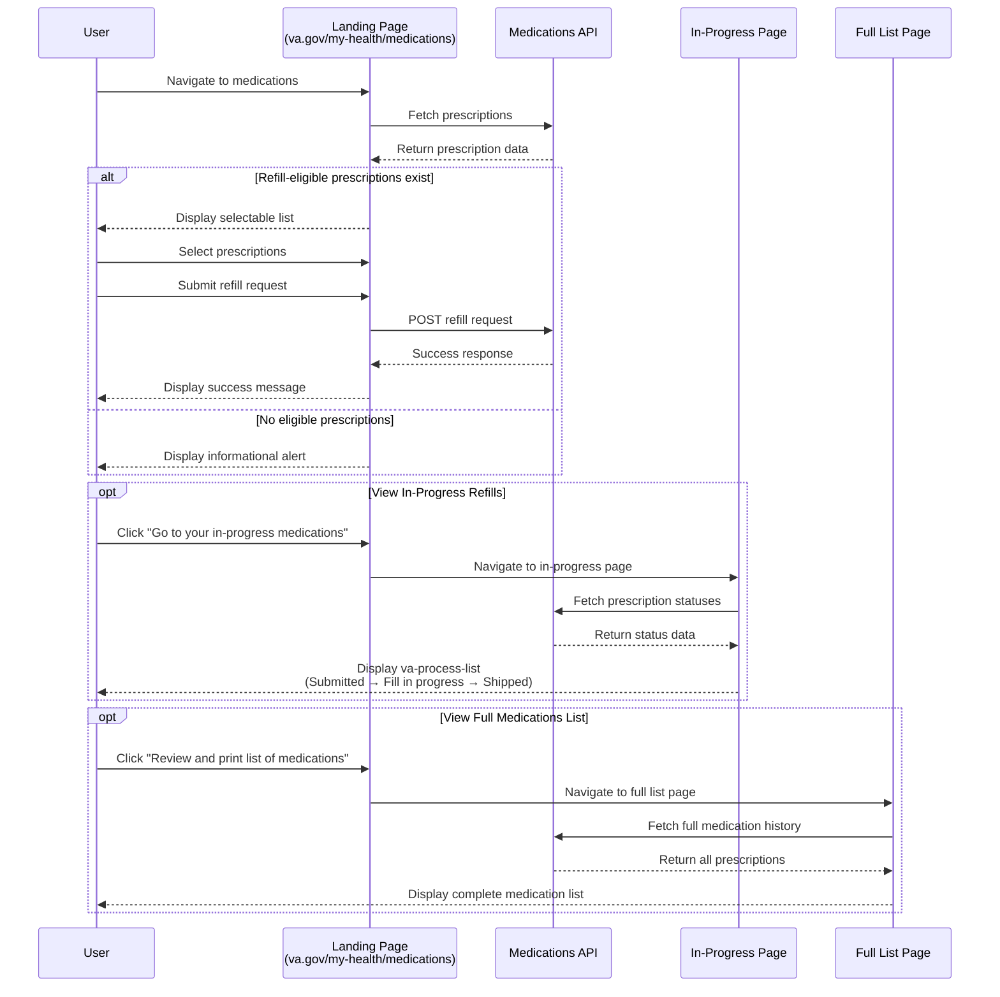

#MHV Medications - Medication Improvements Sequence

```mermaid
sequenceDiagram
    participant U as User
    participant LP as Landing Page<br/>(va.gov/my-health/medications)
    participant API as Medications API
    participant IP as In-Progress Page
    participant FL as Full List Page

    U->>LP: Navigate to medications
    LP->>API: Fetch prescriptions
    API-->>LP: Return prescription data

    alt Refill-eligible prescriptions exist
        LP-->>U: Display selectable list
        U->>LP: Select prescriptions
        U->>LP: Submit refill request
        LP->>API: POST refill request
        API-->>LP: Success response
        LP-->>U: Display success message
    else No eligible prescriptions
        LP-->>U: Display informational alert
    end

    opt View In-Progress Refills
        U->>LP: Click "Go to your in-progress medications"
        LP->>IP: Navigate to in-progress page
        IP->>API: Fetch prescription statuses
        API-->>IP: Return status data
        IP-->>U: Display va-process-list<br/>(Submitted → Fill in progress → Shipped)
    end

    opt View Full Medications List
        U->>LP: Click "Review and print list of medications"
        LP->>FL: Navigate to full list page
        FL->>API: Fetch full medication history
        API-->>FL: Return all prescriptions
        FL-->>U: Display complete medication list
    end
```
