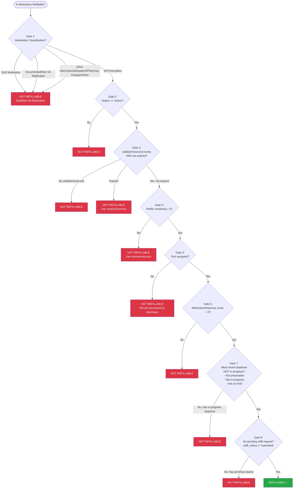

# Oracle Health VA Dispensed Medications - Refillability Specification

## Overview

A medication is **refillable** only if **ALL** of the following conditions are met. The checks are ordered from most fundamental to most specific.

---

## Refillability Gate Checks (In Order)

### Gate 1: Medication Classification

**Condition:** Must be classified as a **VA Prescription** AND must NOT be a DoD (Department of Defense) medication

See [Oracle Health Medications - Categorization and Filtering Specification](oracle_health_categorization_spec.md) for complete categorization rules.

| Classification     | Refillable?           |
| ------------------ | --------------------- |
| VA Prescription    | Continue to next gate |
| DoD Medication     | **NOT REFILLABLE**    |
| Any other category | **NOT REFILLABLE**    |

_Rationale: Only VA Prescriptions (VA-dispensed prescriptions for home use) can be refilled through the VA pharmacy system. DoD medications are managed by Department of Defense pharmacies and cannot be refilled through VA._

---

### Gate 2: MedicationRequest Status (Primary Gate)

**Condition:** `MedicationRequest.status` must be `'active'`

| Status           | Refillable?           |
| ---------------- | --------------------- |
| `active`         | Continue to next gate |
| Any other status | **NOT REFILLABLE**    |

_Rationale: Inactive, cancelled, completed, or on-hold requests cannot be refilled._

---

### Gate 3: Validity Period (Expiration)

**Condition:** Prescription must NOT be expired

The prescription is NOT expired if:

- `MedicationRequest.dispenseRequest.validityPeriod.end` exists AND
- Current date/time ≤ `MedicationRequest.dispenseRequest.validityPeriod.end`

| Validity Period State                             | Refillable?           |
| ------------------------------------------------- | --------------------- |
| `validityPeriod.end` does not exist               | **NOT REFILLABLE**    |
| Current date > `validityPeriod.end` (expired)     | **NOT REFILLABLE**    |
| Current date ≤ `validityPeriod.end` (not expired) | Continue to next gate |

_Rationale: Expired prescriptions cannot be refilled; they require renewal instead._

---

### Gate 4: Refills Remaining

**Condition:** Must have refills remaining greater than zero

Refills remaining is calculated as:
`MedicationRequest.dispenseRequest.numberOfRepeatsAllowed` minus the count of completed `MedicationDispense` resources (excluding the original fill)

```
refills_remaining = numberOfRepeatsAllowed - max(completed_dispenses - 1, 0)
```

Where `completed_dispenses` = count of `MedicationDispense` resources with `status == 'completed'`

| Refills Remaining | Refillable?           |
| ----------------- | --------------------- |
| `> 0`             | Continue to next gate |
| `0`               | **NOT REFILLABLE**    |

_Rationale: If no refills remain, the patient must request a renewal instead of a refill._

---

### Gate 5: Prescription Number (Rx#)

**Condition:** The prescription must have been processed by pharmacy and assigned a prescription number (Rx#)

A prescription receives an Rx# when the order (OrderID) is processed by the pharmacy in the Medication Management Record (MMR). Without an Rx#, the prescription has not yet been verified/processed by pharmacy and is not eligible for refill.

| Rx# State                  | Refillable?           |
| -------------------------- | --------------------- |
| Rx# assigned               | Continue to next gate |
| No Rx# assigned            | **NOT REFILLABLE**    |

_Rationale: A prescription that has not been processed by the pharmacy and assigned an Rx# is not yet ready to be refilled. The pharmacy must first verify and process the order._

> **Note:** In practice, a prescription cannot have an initial fill without first being assigned an Rx#, so this gate will typically be satisfied before Gate 6 (Dispense History) is evaluated. However, it is listed explicitly because it represents the fundamental pharmacy-processing prerequisite.

---

### Gate 6: Dispense History

**Condition:** Must have at least one `MedicationDispense` resource associated with the `MedicationRequest`

| MedicationDispense Count | Refillable?           |
| ------------------------ | --------------------- |
| `> 0`                    | Continue to next gate |
| `0`                      | **NOT REFILLABLE**    |

_Rationale: A medication that has never been dispensed cannot be refilled. The initial fill must be processed first._

> **Future Enhancement:** Prescriptions that are "on file" (i.e., have been assigned an Rx# by pharmacy but have not yet had an initial fill) should eventually be presented as refillable. This is analogous to the `ACTIVE: PARKED` status in VistA. Currently, however, the refill request mechanism requires at least one completed dispense, so this gate remains in effect. This gate will be updated when the system supports refill requests for "on file" prescriptions.

---

### Gate 7: No In-Progress Dispense

**Condition:** Most recent `MedicationDispense` must NOT have an in-progress status

In-progress statuses are:

- `preparation`
- `in-progress`
- `on-hold`

The most recent dispense is determined by the latest `MedicationDispense.whenHandedOver` date.

| Most Recent `MedicationDispense.status` | Refillable?           |
| --------------------------------------- | --------------------- |
| `completed`                             | Continue to next gate |
| `cancelled`                             | Continue to next gate |
| `declined`                              | Continue to next gate |
| `entered-in-error`                      | Continue to next gate |
| `stopped`                               | Continue to next gate |
| `unknown`                               | Continue to next gate |
| `preparation`                           | **NOT REFILLABLE**    |
| `in-progress`                           | **NOT REFILLABLE**    |
| `on-hold`                               | **NOT REFILLABLE**    |

_Rationale: Cannot request a new refill while a previous dispense is still being processed or prepared._

---

### Gate 8: No Pending Refill Request

**Condition:** Must NOT have a pending refill request (refill_status != 'submitted')

A pending refill request exists if:

- A `Task` resource exists with `intent='order'`, `status='requested'`, and `focus.reference` matching the parent `MedicationRequest`
- AND no `MedicationDispense` with `whenPrepared` or `whenHandedOver` date after the `Task.executionPeriod.start`

| Refill Status     | Refillable?                |
| ----------------- | -------------------------- |
| `active`          | **REFILLABLE ✓**           |
| `expired`         | Already failed Gate 3 or 4 |
| `refillinprocess` | Already failed Gate 7      |
| `submitted`       | **NOT REFILLABLE**         |
| Other statuses    | **REFILLABLE ✓**           |

_Rationale: Cannot request a new refill while a previous refill request is still pending._

---

## Decision Tree



---

## Summary Table

| Gate | Condition (must be TRUE to pass)                                                                                  | Fail Result    |
| ---- | ----------------------------------------------------------------------------------------------------------------- | -------------- |
| 1    | Medication is classified as **VA Prescription** AND is NOT a DoD medication (see [categorization spec](oracle_health_categorization_spec.md)) | NOT REFILLABLE |
| 2    | `MedicationRequest.status == 'active'`                                                                            | NOT REFILLABLE |
| 3    | `MedicationRequest.dispenseRequest.validityPeriod.end` exists AND current date ≤ `validityPeriod.end`             | NOT REFILLABLE |
| 4    | Refills remaining > 0                                                                                             | NOT REFILLABLE |
| 5    | Prescription has been assigned an Rx# by pharmacy                                                                 | NOT REFILLABLE |
| 6    | `MedicationDispense` count > 0 _(see future enhancement note for "on file" prescriptions)_                        | NOT REFILLABLE |
| 7    | Most recent `MedicationDispense.status` is NOT `preparation`, `in-progress`, or `on-hold`                         | NOT REFILLABLE |
| 8    | No pending refill request (refill_status != 'submitted')                                                          | NOT REFILLABLE |

**If all gates pass → REFILLABLE ✓**

---

## Refill vs Renewal

Understanding when to use refill vs renewal:

| Scenario                                                       | Action                    |
| -------------------------------------------------------------- | ------------------------- |
| Refills remaining > 0 AND not expired                          | **REFILL**                |
| Refills remaining == 0 AND not expired (or expired ≤ 120 days) | **RENEW**                 |
| Expired AND within 120 days of expiration                      | **RENEW**                 |
| Expired > 120 days                                             | New prescription required |

See [Oracle Health VA Dispensed Medications - Renewability Specification](oracle_health_renewability_spec.md) for renewal eligibility rules.

---

## Related Specifications

- [Oracle Health Medications - Categorization and Filtering Specification](oracle_health_categorization_spec.md) - Medication category definitions
- [Oracle Health VA Dispensed Medications - Renewability Specification](oracle_health_renewability_spec.md) - Renewal eligibility rules
