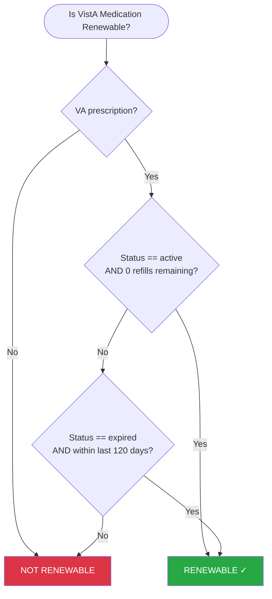
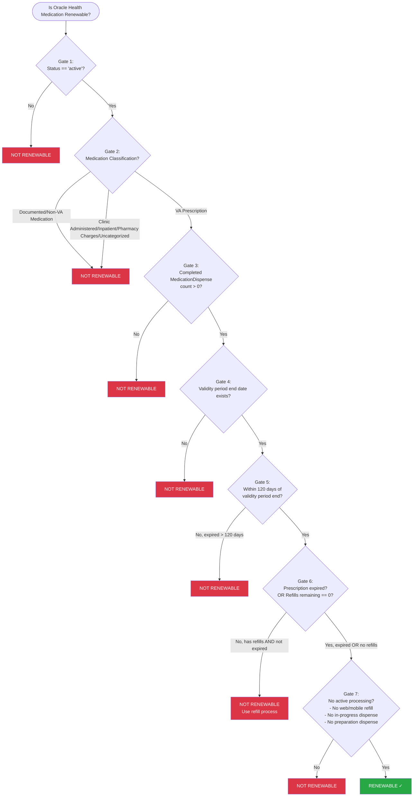

# VA Medications - Renewability Specification

## Overview

This specification defines when a VA medication is eligible for renewal. The rules differ by pharmacy system — **VistA** and **Oracle Health** — because the underlying data models and business logic differ between systems.

In both systems, renewal is the process of requesting a new prescription from a provider when the current prescription can no longer be refilled (either because refills are exhausted or the prescription has expired).

---

## VistA Medications

### Renewability Rules

A VistA medication is **renewable** if it is a **VA prescription** AND **EITHER** of the following conditions is met:

| #   | Condition                                                                          | Renewable?      |
| --- | ---------------------------------------------------------------------------------- | --------------- |
| 1   | Status is **active** with **no refills remaining**                                 | **RENEWABLE ✓** |
| 2   | Status is **expired** AND expiration date is within the last **120 days**           | **RENEWABLE ✓** |

Prescriptions with any other status (e.g., discontinued, hold, suspended) are **NOT RENEWABLE**, regardless of their expiration date.

If the medication is a non-VA (documented) prescription, or neither condition is met, the medication is **NOT RENEWABLE**.

_Rationale: Non-VA (documented) prescriptions are not managed through VA renewal. An active VA prescription with refills remaining should use the refill process instead. Only prescriptions with an **expired** status qualify for the 120-day renewal window — discontinued prescriptions also have expiration dates but are not eligible for renewal. Prescriptions expired more than 120 days ago require a new prescription from a provider rather than a renewal._

### Decision Tree

---

## Oracle Health Medications

Oracle Health renewability requires passing through multiple gate checks because the FHIR-based data model requires explicit validation of classification, dispense history, and processing state.

A medication is **renewable** only if **ALL** of the following gates pass. The checks are ordered from most fundamental to most specific.

### Gate Checks (In Order)

#### Gate 1: MedicationRequest Status (Primary Gate)

**Condition:** `MedicationRequest.status` must be `'active'`

| Status           | Renewable?            |
| ---------------- | --------------------- |
| `active`         | Continue to next gate |
| Any other status | **NOT RENEWABLE**     |

_Rationale: Inactive, cancelled, or completed requests cannot be renewed._

---

#### Gate 2: Medication Classification

**Condition:** Must be classified as a **VA Prescription** (NOT Documented/Non-VA Medication, Clinic Administered Medication, Inpatient, or Pharmacy Charges)

Medication classification is determined by the `MedicationRequest.category` array. See [Oracle Health Medications - Categorization and Filtering Specification](oracle_health_categorization_spec.md) for complete categorization rules.

##### Classification for Renewability

| Display Category                                                    | Renewable?            |
| ------------------------------------------------------------------- | --------------------- |
| **VA Prescription** (`community` + `discharge`)                     | Continue to next gate |
| **Clinic Administered Medication** (`outpatient`)                   | **NOT RENEWABLE**     |
| **Documented/Non-VA Medication** (`community` + `patientspecified`) | **NOT RENEWABLE**     |
| **Pharmacy Charges** (`charge-only`)                                | **NOT RENEWABLE**     |
| **Inpatient Medication** (`inpatient`)                              | **NOT RENEWABLE**     |
| **Uncategorized**                                                   | **NOT RENEWABLE**     |

##### Additional Classification Criteria

Beyond category, the following `MedicationRequest` fields must also match for **VA Prescription**:

- `MedicationRequest.reportedBoolean == false`
- `MedicationRequest.intent == 'order'`

_Rationale: VA Prescriptions (prescriptions dispensed for home use) are eligible for renewal. Clinic Administered Medications (administered in outpatient clinical settings) are viewable but not renewable per Pharmacy SME guidance. Documented/Non-VA Medications are patient-reported and not managed through VA renewal. Inpatient medications are administered during hospital stays and not self-managed._

---

#### Gate 3: Dispense History

**Condition:** Must have at least one `MedicationDispense` resource with `status == 'completed'` associated with the `MedicationRequest`

| Completed MedicationDispense Count | Renewable?            |
| ---------------------------------- | --------------------- |
| `> 0`                              | Continue to next gate |
| `0`                                | **NOT RENEWABLE**     |

_Rationale: A medication that has never been successfully dispensed cannot be renewed. Dispenses that are in-progress, cancelled, or otherwise incomplete do not qualify._

---

#### Gate 4: Validity Period Exists

**Condition:** `MedicationRequest.dispenseRequest.validityPeriod.end` must exist

| `MedicationRequest.dispenseRequest.validityPeriod.end` | Renewable?            |
| ------------------------------------------------------ | --------------------- |
| Exists                                                 | Continue to next gate |
| Not available                                          | **NOT RENEWABLE**     |

_Rationale: Prescriptions without a validity period end date cannot be evaluated for renewal eligibility._

---

#### Gate 5: Validity Period Window

**Condition:** Must NOT be more than 120 days past `MedicationRequest.dispenseRequest.validityPeriod.end`

A prescription is within the renewal window if:

- The validity period has not yet ended (prescription is not expired), OR
- The validity period ended within the last 120 days

| Time Relative to `MedicationRequest.dispenseRequest.validityPeriod.end` | Renewable?            |
| ----------------------------------------------------------------------- | --------------------- |
| Before validity end (not yet expired)                                   | Continue to next gate |
| 0-120 days after validity end                                           | Continue to next gate |
| More than 120 days after validity end                                   | **NOT RENEWABLE**     |

_Rationale: Prescriptions expired more than 120 days ago require a new prescription, not a renewal. This gate is evaluated before refills remaining because expired prescriptions (within 120 days) may still have refills remaining but should still be eligible for renewal._

---

#### Gate 6: Refills Remaining

**Condition:** Refills remaining must be zero OR prescription is expired (validity period has ended)

Refills remaining is calculated as:
`MedicationRequest.dispenseRequest.numberOfRepeatsAllowed` minus the count of associated `MedicationDispense` resources (excluding the original fill)

| Scenario                                                                   | Renewable?            |
| -------------------------------------------------------------------------- | --------------------- |
| Refills remaining == 0 AND prescription is NOT expired                     | Continue to next gate |
| Refills remaining >= 0 AND prescription is expired (validity period ended) | Continue to next gate |
| Refills remaining > 0 AND prescription is NOT expired                      | **NOT RENEWABLE**     |

_Rationale: If refills are available AND the prescription is still valid (not expired), patient should use the refill process instead of renewal. However, if the prescription is expired (even with zero or more refills remaining), renewal is the appropriate path since refills cannot be processed on an expired prescription._

---

#### Gate 7: Active Processing

**Condition:** No active refill request or in-progress dispense

The medication is **NOT RENEWABLE** if ANY of the following are true:

- A refill has been requested via web or mobile
- Any `MedicationDispense.status` == `in-progress`
- Any `MedicationDispense.status` == `preparation`

| Processing State                                 | Renewable?        |
| ------------------------------------------------ | ----------------- |
| No active processing                             | **RENEWABLE ✓**   |
| Refill requested via web/mobile                  | **NOT RENEWABLE** |
| Any `MedicationDispense.status` == `in-progress` | **NOT RENEWABLE** |
| Any `MedicationDispense.status` == `preparation` | **NOT RENEWABLE** |

_Rationale: Cannot request renewal while a previous request is still being processed._

### Decision Tree

### Summary Table

| Gate | Condition (must be TRUE to pass)                                                                                        | Fail Result   |
| ---- | ----------------------------------------------------------------------------------------------------------------------- | ------------- |
| 1    | `MedicationRequest.status == 'active'`                                                                                  | NOT RENEWABLE |
| 2    | Medication is classified as **VA Prescription** (see [categorization spec](oracle_health_categorization_spec.md))       | NOT RENEWABLE |
| 3    | `MedicationDispense` count where `status == 'completed'` > 0                                                            | NOT RENEWABLE |
| 4    | `MedicationRequest.dispenseRequest.validityPeriod.end` exists                                                           | NOT RENEWABLE |
| 5    | Current date ≤ `MedicationRequest.dispenseRequest.validityPeriod.end` + 120 days                                        | NOT RENEWABLE |
| 6    | Current date > `MedicationRequest.dispenseRequest.validityPeriod.end`, OR refills remaining == 0                        | NOT RENEWABLE |
| 7    | No active processing (no web/mobile refill requested, no `MedicationDispense.status` == `in-progress` or `preparation`) | NOT RENEWABLE |

**If all gates pass → RENEWABLE ✓**
