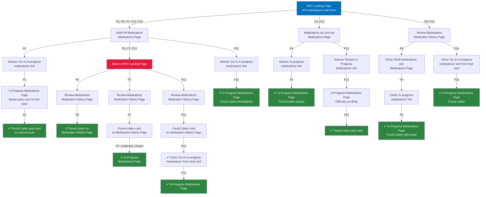

# Task 1: Check the status of a refill request that has already been submitted
Three entry patterns emerged:

1. **Refill-first (5 of 9):** P1, P5, P7, P12, P15 clicked "Refill VA medications" and had to redirect
2. **Medications nav (2 of 9):** P4, P13 used the secondary nav, landed on Medications Page, and quickly found cross-links to In-Progress
3. **Review-first (2 of 9):** P8, P16 went to "Review medications" / Medication History Page, then navigated to In-Progress

