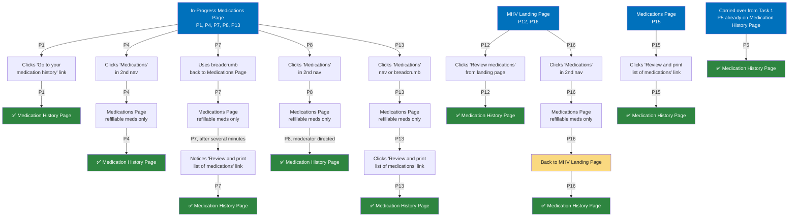

# Task 2: Find the name of an old medication (rash cream)

**Starting point:** Varies. Most participants carried over from their Task 1 ending location.

**Target destination:** Medication History Page with either "Inactive" or "All medications" filter applied.

---

## Entry patterns

1. **Started from In-Progress or Medications Page, used cross-links or nav (5 of 9):** P1, P7, P8, P13, P15 were on the In-Progress or Medications Page and had to find a path to the Medication History Page. Cross-links like "Review and print list of medications" were frequently missed.
2. **Used secondary nav or breadcrumbs to reach Medications Page first (3 of 9):** P4, P13, P16 clicked "Medications" in the secondary nav, which routed them to the Medications Page (refillable meds only), requiring a second redirect.
3. **Went directly to Medication History from landing page (1 of 9):** P12 clicked "Review medications" from the MHV landing page.

**Color key:**
- 🔵 **Blue** = Starting points (carried over from Task 1)
- 🟢 **Green** = Reached Medication History Page (target destination)
- 🟡 **Yellow** = Backtracking
