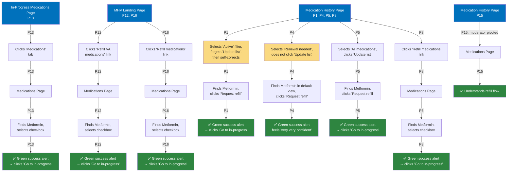

# Task 3: Request an urgent refill for Metformin medication

**Starting point:** Varies. Most participants carried over from their Task 2 ending location.

**Target destination:** Metformin can be refilled from three places:
1. Medications Page (first refillable medication in the list)
2. Medication History Page with "Active medications" filter applied
3. Medication History Page with "All medications" filter applied

---

## Entry patterns

1. **Already on Medication History Page, redirected to Medications Page or refilled from there (4 of 8):** P1, P4, P5, P8 were on the Medication History Page from Task 2 and either refilled directly or followed cross-links to the Medications Page.
2. **Used secondary nav or breadcrumbs to reach Medications Page (2 of 8):** P13, P15 navigated to the Medications Page via nav controls.
3. **Started from MHV Landing Page (2 of 8):** P12, P16 went to the landing page and clicked "Refill VA medications."

*P7 excluded due to technical issues. P15 did not complete the task as designed due to task comprehension but demonstrated understanding of the refill flow when the moderator pivoted.*

**Color key:**
- 🔵 **Blue** = Starting points (carried over from Task 2)
- 🟢 **Green** = Successfully refilled Metformin or demonstrated understanding of refill flow
- 🟡 **Yellow** = Filter friction ("Update list" missed or wrong filter selected)
