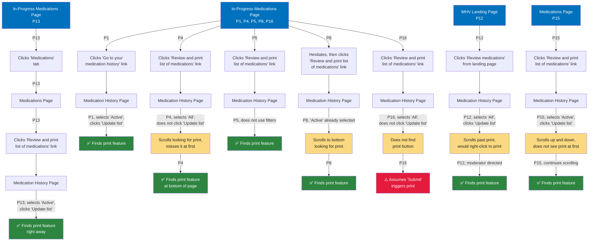

# Task 4: Find and print a list of current medications

**Starting point:** Varies. Most participants carried over from their Task 3 ending location.

**Target destination:** Medication History Page → Print feature (located at the bottom of the page). Participants could reach it via:
1. MHV Landing Page → "Review medications" link → Medication History Page → Print feature
2. Any Medications tool page → "Review and print list of medications" link → Medication History Page → Print feature

---

## Entry patterns

1. **Used "Review and print list of medications" cross-link (5 of 8):** P4, P5, P13, P15, P16 noticed the cross-link from the In-Progress or Medications Page and used it to reach the Medication History Page.
2. **Used "Go to your medication history" link (1 of 8):** P1 used the cross-link from the In-Progress Medications Page.
3. **Navigated from MHV Landing Page (1 of 8):** P12 clicked "Review medications" from the landing page.
4. **Hesitated, then found cross-link (1 of 8):** P8 initially considered the breadcrumb, then noticed the "Review and print list of medications" link.

*P7 excluded due to technical issues.*

**Color key:**
- 🔵 **Blue** = Starting points (carried over from Task 3)
- 🟢 **Green** = Successfully located print feature
- 🟡 **Yellow** = Difficulty finding print feature (scrolled past it, missed it initially)
- 🔴 **Red** = Did not locate the print feature as designed
