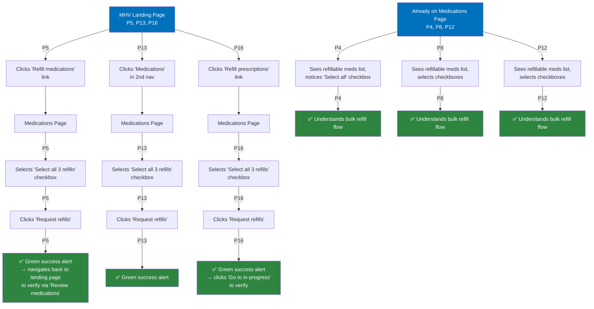

# Task 5: Refill all eligible medications at once

**Starting point:** Varies. Some participants were directed back to the MHV Landing Page; others carried over from Task 4. Some bulk refill behaviors were observed during Task 3.

**Target destination:** Medications Page → "Select all" checkbox → "Request refills" button. Participants could reach the refillable medications list via:
1. MHV Landing Page → "Refill VA medications" link → Medications Page → Refillable medications list
2. Medications tool → "Refill medications" link → Medications Page → Refillable medications list

---

## Entry patterns

1. **Started from MHV Landing Page (3 of 6):** P5, P13, P16 were directed back to the landing page and used "Refill medications" or the secondary nav to reach the Medications Page.
2. **Already on Medications Page from prior task (3 of 6):** P4, P8, P12 were already viewing the refillable medications list and demonstrated bulk refill behavior during or immediately after Task 3.

*P1 and P15 excluded (task added after their sessions). P7 excluded due to technical issues.*

**Color key:**
- 🔵 **Blue** = Starting points
- 🟢 **Green** = Successfully completed or demonstrated understanding of bulk refill flow
