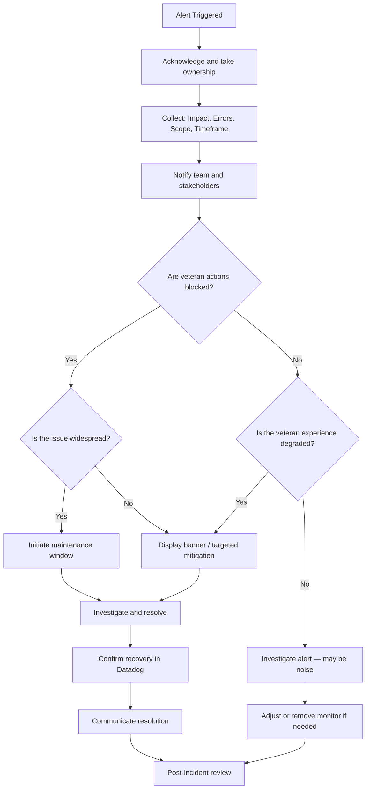
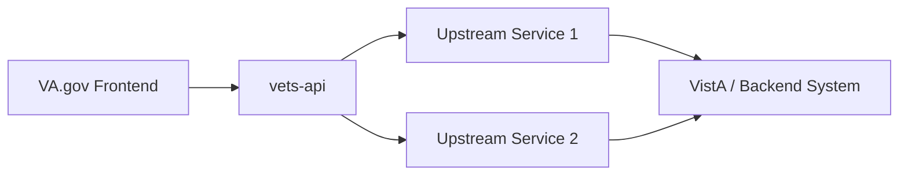

# [Product Name] Incident Response Playbook

> **Template version:** 1.0
>
> **Instructions:** Copy this template into your product's engineering folder and fill in all sections marked with `[PLACEHOLDER]`. Remove this instructions block when complete.

---

## What We're Monitoring

<!-- List the Datadog dashboards, monitors, and alerting channels your team uses. -->

| Dashboard        | Link          |
| ---------------- | ------------- |
| [Dashboard Name] | [Datadog URL] |
| [Dashboard Name] | [Datadog URL] |
| Platform E2E     | [Datadog URL] |

---

## 🚨 First Reaction

Do these 3 steps first, _before any investigation of root cause_.

### 1. Collect

Gather the following immediately:

1. **Veteran Impact:** How are Veterans affected? Can they complete their task?
2. **Error Type:** 500s? 400s? 403s? Timeouts?
3. **Scope:** Which systems/endpoints are involved?
4. **Timeframe:** How long has the issue been occurring?

### 2. Notify

Start a thread in `[#your-team-alerts-channel]` with this template:

```
@[OCTO Product Owner] @[OCTO UX Lead] @[OCTO Technical Lead]
@[team-tag]

We're investigating an ongoing issue with [Product Name].

Impact:              [Brief veteran-facing impact statement]
Impacted Veterans %: [xx% or explicit count]
Impacted Systems:    [System A, System B]
Timeframe:           Issue has been occurring for ~X minutes.

We are investigating and will post updates in this thread. :thread:
```

Work with your OCTO leads to determine if a **maintenance window** or **feature rollback** is warranted.

> **⚠️ CRITICAL: Protecting Veterans is the top priority.**
>**If the impact is clearly severe** (widespread 500s, core functionality completely blocked, Veterans unable to complete critical actions, etc.) **and OCTO leads are unavailable or unresponsive, do not wait.** The on-call engineer or Technical Lead has the authority — and the responsibility — to initiate a maintenance window or roll back a broken deployment immediately. Err on the side of protecting Veterans; you can always reverse the decision once leadership is available. Notify your OCTO leads as soon as possible after taking action.

### 3. Track

Start an incident investigation document using the [Incident Investigation Traceability Template][traceability-template].

<!-- Link your team's traceability template below -->
[traceability-template]: https://github.com/department-of-veterans-affairs/va.gov-team/blob/master/products/health-care/engineering/templates/incident-investigation-traceability-template.md

---

## Incident Response Decision Flow

<!-- Customize this flowchart for your product's user flows. -->



---

## 📞 Points of Contact

### Core Incident Roles

| Role                                                      | Name   | Slack Handle |
| --------------------------------------------------------- | ------ | ------------ |
| **Coordinator** — owns communication and overall response | [Name] | @[handle]    |
| **Backup Coordinator**                                    | [Name] | @[handle]    |
| **Technical Lead** — owns debugging and resolution        | [Name] | @[handle]    |
| **Backup Technical Lead**                                 | [Name] | @[handle]    |

### OCTO Roles

| Role               | Name   | Slack Handle | Reachable via   |
| ------------------ | ------ | ------------ | --------------- |
| **Product Owner**  | [Name] | @[handle]    | Slack, MS Teams |
| **UX Lead**        | [Name] | @[handle]    | Slack, MS Teams |
| **Technical Lead** | [Name] | @[handle]    | Slack, MS Teams |

### Supporting Teams & Contacts

| Team                    | Slack Channel           | When to Engage                                             |
| ----------------------- | ----------------------- | ---------------------------------------------------------- |
| [Upstream API Team]     | `#[channel]`            | Upstream service failures                                  |
| VFS Platform Team       | `#vfs-platform-support` | Widespread platform impact (confirm with OCTO leads first) |
| [Other dependency team] | `#[channel]`            | [Criteria]                                                 |

---

## 🔄 On-Call Process

### Schedule & Tooling

- **Schedule:** Managed in [PagerDuty][pagerduty-link]
- **Rotation:** [Weekly / Bi-weekly], minimum 1 person on call (ideally 2)
- **Alerting:** Alerts via Slack, text, and phone call through PagerDuty
- **Acknowledgement SLA:** On-call engineer must acknowledge within [X minutes]

<!-- Replace with your PagerDuty service URL -->
[pagerduty-link]: https://ecc.pagerduty.com/service-directory/[YOUR-SERVICE-ID]

### On-Call Criteria

1. On call during business hours: [Define hours, e.g., 8am–6pm ET weekdays]
2. On call 1 hour before and 1 hour after any moderately risky event (deployments, upstream releases, etc.)
3. On-call duties include:
   - Responding to alerts and incidents
   - Responding to testing requests from deploying teams
   - Validating deployments to production
   - Kicking off the escalation process when needed

---

## 🚀 Escalation

| Step                      | Action                                            | Timeframe                                                 |
| ------------------------- | ------------------------------------------------- | --------------------------------------------------------- |
| **Initial Triage**        | On-call engineer investigates                     | First 15 minutes                                          |
| **Technical Escalation**  | Page Technical Lead if no progress                | After 15 minutes                                          |
| **Leadership Escalation** | Notify Coordinator and OCTO leads                 | Sev 1 incidents, or Tech Lead cannot resolve              |
| **Platform Escalation**   | Engage `#vfs-platform-support` via `/support` bot | Widespread impact across VA.gov (confirm with OCTO leads) |

---

## Veteran Impact Classification

Classify the incident by how it affects the Veteran experience.

### High Impact: Veteran Actions Blocked

Failures that prevent Veterans from completing their primary task:

<!-- Customize these for your product -->
- [Core action 1 — e.g., Submitting a form]
- [Core action 2 — e.g., Completing a transaction]
- [Supporting data that blocks the flow — e.g., Cannot load required options]

**Response:** Initiate maintenance window.

### Lower Impact: Experience Degraded

Failures that affect visibility or quality but do not fully block actions:

- [Intermittent data fetch failures]
- [Partial data returned]
- [Slow response times]

**Response:** Display banner. Only escalate to high impact if degradation prevents Veterans from completing their task.

### Endpoint Impact Reference

<!-- Fill in your product's critical endpoints -->

| Endpoint                 | Impact Type        | Critical |
| ------------------------ | ------------------ | -------- |
| `POST /v2/[resource]`    | [Action] blocked   | Yes      |
| `GET /v2/[resource]`     | [Action] blocked   | Yes      |
| `GET /v2/[resource]/:id` | Viewing restricted | No       |

---

## 🛠️ Debugging Steps

### Dashboards & Observability

- [Product Dashboard][dashboard-link]
- [APM Service Page][apm-link]
- [Platform E2E Dashboard][e2e-link]
- Logs: [Datadog Logs link or query pattern]

<!-- Replace with your actual links -->
[dashboard-link]: https://vagov.ddog-gov.com/dashboard/[ID]
[apm-link]: https://vagov.ddog-gov.com/apm/entity/service%3A[service-name]?env=eks-prod
[e2e-link]: https://vagov.ddog-gov.com/dashboard/u27-88d-58v/platform-e2e

### Recent Changes

- [Merged PRs by team members][pr-search]
- Check `[#your-team-channel]` for upstream API or dependency updates
- Check shared calendar for scheduled releases

<!-- Customize the PR search URL with your team's GitHub usernames -->
[pr-search]: https://github.com/search?q=repo%3Adepartment-of-veterans-affairs%2Fvets-website+type%3APR+author%3A[user1]+author%3A[user2]+is%3Amerged&type=pullrequests

### Investigation Approach

1. **Determine veteran impact** — Reproduce or reason through the user flow
2. **Scope the issue** — Which endpoints, facilities, or features are affected?
3. **Identify origin** — Is this our application or an upstream dependency?
4. **Check for recent changes** — Deployments, config changes, upstream releases
5. **Use Datadog** — Metrics for trends, Logs for error patterns, APM for traces

For detailed debugging procedures, see: [In-Depth Debugging Guide][debug-guide]

<!-- Link your team's debugging guide -->
[debug-guide]: [URL]

---

## Communication

Communicate early and clearly. Every update should include:

1. **What is happening** — Technical summary
2. **Veteran impact** — What Veterans can and cannot do right now
3. **What you are doing next** — Current action and expected timeline

**Example:**

```
Update: We are seeing elevated failures on the [endpoint] endpoint.
Veterans are currently unable to [action]. The issue appears to be
upstream in [system]. We are coordinating with [team] for resolution.
Next update in 15 minutes.
```

---

## Resolution

1. Apply fix or mitigation
2. Confirm recovery in Datadog (error rates return to baseline)
3. Remove any maintenance windows or banners
4. Communicate resolution in the incident thread and relevant channels
5. Update the team's outage tracking artifact (canvas, spreadsheet, etc.)

---

## Post-Incident

### Required for all high-impact incidents

1. **Post-mortem** — Use the [VA.gov post-mortem template][postmortem-template]
2. **Alert review** — Was the alert useful? Should thresholds be adjusted?
3. **Runbook updates** — Does this playbook need to be updated based on what happened?
4. **Follow-up tickets** — Create issues for any preventive measures identified

### Recommended for lower-impact incidents

1. Brief retrospective in team standup
2. Alert tuning if the alert was noisy or missed the issue

[postmortem-template]: https://github.com/department-of-veterans-affairs/va.gov-team-sensitive/blob/master/Postmortems/_template.md

---

## 📊 System Integration Diagram

<!-- Add your system's architecture/dependency diagram here.
     Show upstream and downstream dependencies so on-call engineers
     can quickly understand the dependency chain. -->



> Replace this with your product's actual architecture diagram or link to one.

---

## Key Principles

- **Veteran impact first** — Always frame the incident in terms of what Veterans can and cannot do
- **Own it immediately** — Acknowledge alerts and take ownership; don't wait for confirmation
- **Communicate early** — A partial update is better than silence
- **Alerts mean action** — If an alert fires, it has already met the threshold; investigate, don't debate significance
- **Track everything** — Maintain an investigation document for audit trail and learning
- **Blameless post-mortems** — Focus on system improvements, not individual fault
