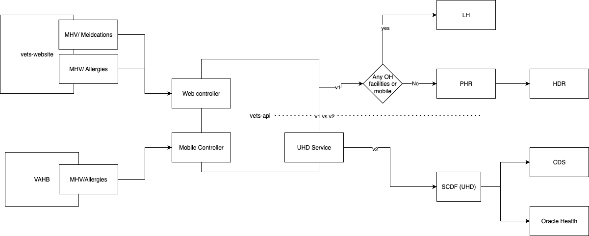

# Allergies

## Key terms

- v1 == current version of the API, this is what is live in production
- v2 == next version of the API, for this case this is SCDF

## Diagram



## Filter rules

Only show allergies that meet the following criteria:

- **`clinicalStatus` is Active** : This is a clinical verification that the allergy is still relevant to the patient and signed off by a provider. According to SCDF,  If a VistA records has a status of `f`. For OH records, we are being a pass through of the data we are getting from OH.
- **Has Facility information**.TBD

## For Clinical Status

### For Vista Records

We are looking at clinical Verification status codes:

```json
          "clinicalStatus": {
            "coding": [
              {
                "system": "https://terminology.hl7.org/CodeSystem/allergyintolerance-clinical",
                "code": "active"
              }
            ]
          },
```

### For Oracle Health Records

We are looking at clinical Verification status codes:

```json
          "clinicalStatus": {
            "coding": [
              {
                "system": "https://terminology.hl7.org/CodeSystem/allergyintolerance-clinical",
                "code": "active"
              }
            ]
          },
```
