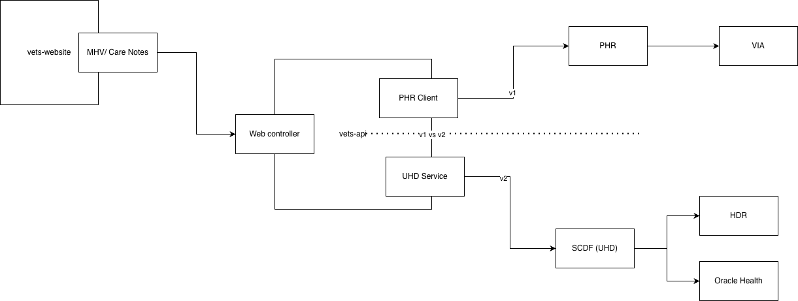

# Care Notes

## Overview

This document describes the architecture and filtering logic for clinical care notes in the Medical Records application.

### Key Terms

| Term | Description                    |
| ---- | ------------------------------ |
| v1   | Current production API         |
| v2   | Next-generation API using SCDF |

## Architecture Diagram



## Filtering Rules

### LOINC Code Mapping

The [Clinical Notes Adapter](https://github.com/department-of-veterans-affairs/vets-api/blob/master/lib/unified_health_data/adapters/clinical_notes_adapter.rb#L12-L17) maps LOINC codes to note types:

```ruby
LOINC_CODES = {
  '11506-3' => 'physician_procedure_note',
  '11488-4' => 'consult_result',
  '18842-5' => 'discharge_summary'
}.freeze
```

Notes with unmapped LOINC codes are categorized as `other`.

**Version differences:**

- **v1:** Notes categorized as `other` are not displayed
- **v2:** All note types are displayed pending further analysis of the `other` category

### Document Status

SCDF normalizes statuses to a `docStatus` field with the following possible values:

- `final`
- `amended`
- `preliminary`
- `entered-in-error`

**Display rules:**

- Only notes with `final` or `amended` status are shown (allowlist)
- Notes without a `docStatus` value are excluded

### SCDF-Specific Filters

| Filter         | Retention Period |
| -------------- | ---------------- |
| C&P exam notes | 30 days          |
| Signed notes   | Displayed        |
