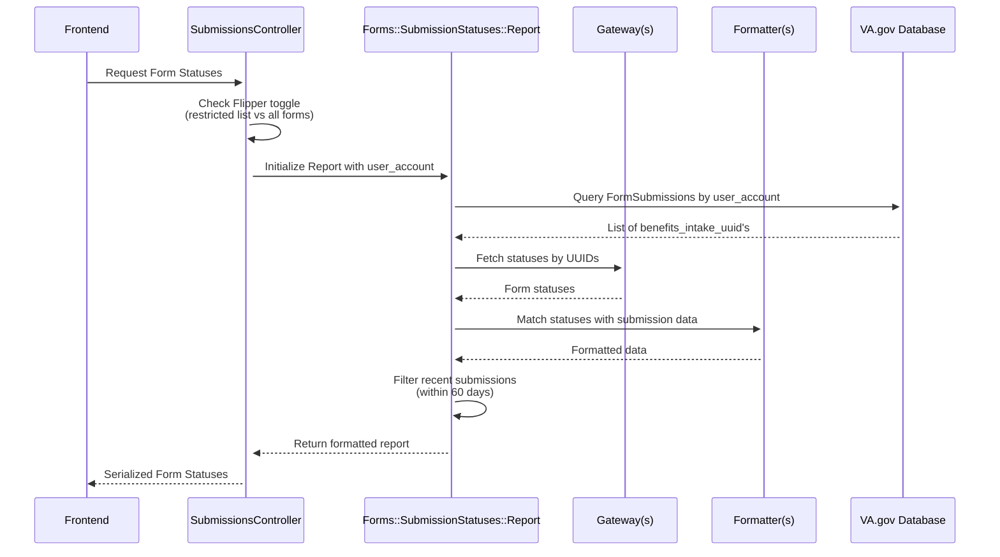

# How to Add Form Submission Status to My VA (Any Form API)
## Table of Contents
1. [Introduction](#introduction)
2. [Start Here: Identify Your Scenario](#start-here-identify-your-scenario)
3. [Form Status Card](#form-status-card)
4. [Form Status Workflow](#form-status-workflow)
    - [High-Level Workflow](#high-level-workflow)
    - [`vets-api` Workflow](#vets-api-workflow)
5. [Existing Pattern: Lighthouse Benefits Intake API Forms](#existing-pattern-lighthouse-benefits-intake-api-forms)
    - [How to Add a New Lighthouse Benefits Intake Form](#how-to-add-a-new-lighthouse-benefits-intake-form)
    - [Feature Toggle](#feature-toggle)
    - [List of Known Forms](#list-of-known-forms)
6. [Implementing Form Status for a New Form API](#implementing-form-status-for-a-new-form-api)
    - [Step 1 — Security Review](#step-1--security-review)
    - [Step 2 — Determine if a Gateway & Formatter Already Exist](#step-2--determine-if-a-gateway--formatter-already-exist)
    - [Step 3 — Existing Gateway Path (Restricted List)](#step-3--existing-gateway-path-restricted-list)
    - [Step 4 — First Team for This Form API](#step-4--first-team-for-this-form-api)
    - [Step 5 — Restricted vs Unrestricted](#step-5---restricted-vs-unrestricted)
    - [Unrestricted Implementation](#unrestricted-implementation)
7. [Team Implementations Tracker](#team-implementations-tracker)
8. [Quick Implementation Checklist](#quick-implementation-checklist)
9. [Other References](#other-references)


## Introduction
My VA currently supports showing the status of two categories of forms:
- Online forms
- Uploadable forms

Forms display _only_ **four statuses**:

1. **DRAFT**  
2. **SUBMISSION IN PROGRESS**  
3. **RECEIVED**  
4. **ACTION NEEDED**

> This guide focuses on statuses **2–4**, as **DRAFT** is handled entirely by the Save-in-Progress (SiP) implementation.  
> More details: [SiP guide](https://depo-platform-documentation.scrollhelp.site/developer-docs/va-forms-library-how-to-set-up-save-in-progress-si).


### Start Here: Identify Your Scenario
Use this guide to follow the correct implementation path for your form.
If unsure which path to follow, please reach out to our team channel in OCTO Slack [#accountexp-authexp](https://dsva.slack.com/archives/C909ZG2BB).

**Scenario A - Your form already uses Lighthouse Benefits Intake API**
- Go to Section 5: [Existing Pattern: Lighthouse Benefits Intake API Forms](#existing-pattern-lighthouse-benefits-intake-api-forms)
- You may only need to:
  - Add the form ID
  - Confirm FE includes it
  - Check feature toggle behavior
 
**Scenario B - Your Form API already has a Gateway & Formatter**
- Go to Section 6: [Implementing Form Status for a New Form API](#implementing-form-status-for-a-new-form-api) -> [Step 3 — Existing Gateway Path (Restricted List)](#step-3--existing-gateway-path-restricted-list)
- You likely only need to:
  - Add your form ID
  - Update/add tests
  - Validate status mapping

 **Scenario C - Your form is the first to use a brand-new Form API**
 - Go to Section 6: [Implementing Form Status for a New Form API](#implementing-form-status-for-a-new-form-api) -> [Step 4 — First Team for This Form API](#step-4--first-team-for-this-form-api)
 - You will need to:
   - Create a Gateway
   - Create a Formatter
   - Register both in Report
   - Decide restricted vs unrestricted 

### Form Status Card
Two card title options appear depending on whether the form is uploadable or uses SiP:

| Uploadable Form | Form with SiP |
|-----------------|---------------|
|  |  |

- **Uploadable forms** use a fallback header: `"VA Form XX-XXXX"`  
- **SiP forms** use the form title defined in `vets-website` with a subheading containing the form number: `"VA Form XX-XXXX"` (for details see [Instructions for teams, step 3](https://depo-platform-documentation.scrollhelp.site/developer-docs/va-forms-library-how-to-set-up-save-in-progress-si))  


## Form Status Workflow

### High-Level Workflow

> See the [original workflow diagram](https://github.com/department-of-veterans-affairs/va.gov-team-sensitive/blob/7693b23eafaabac7c52a288ce89ae04d45972170/products/identity-personalization/my-va/form-status/backend_documentation.md#form-status-workflow) for a visual overview.


### `vets-api` Workflow

> Use this workflow when implementing API-level status retrieval.



----------------------------------------

## Existing Pattern: Lighthouse Benefits Intake API Forms

These forms already follow a known backend pattern using:
  - BenefitsIntakeGateway
  - BenefitsIntakeFormatter
  - FormSubmission

### How to Add a New Lighthouse Benefits Intake Form

If your form submits through the Lighthouse Benefits Intake API:

#### Step 1 — Confirm submission is creating a FormSubmission

It must include:
- `benefits_intake_uuid`
- `form_type`

#### Step 2 — Ensure form ID is allowed

If following restricted approach, add form ID to `restricted_list_of_forms`.

If feature toggle `my_va_display_all_lighthouse_benefits_intake_forms` is enabled, nothing is required.

#### Step 3 — Confirm FE includes the form ID

Ensure the form ID exists in `VA_FORM_IDS`

#### Step 4 - Test locally

Check that:
- The form card appears
- Status is correctly mapped
- The 60-day filter works

Please reach out to our team in OCTO Slack [#accountexp-authexp](https://dsva.slack.com/archives/C909ZG2BB) if your form card requires different content than what automatically shows.

### Feature Toggle

`my_va_display_all_lighthouse_benefits_intake_forms`

### List of Known Forms

| Form Name                                        | Form ID            | Included in MVP| Included with Feature Toggle | Included in FE's VA_FORM_IDS |
|:-------------------------------------------------|:-------------------|:---------------|:-----------------------------|:-----------------------------|
| Request personal records                         | 20-10206           |✅              |                              | ✅ |
| Priority Processing                              | 20-10207           |✅              |                              | ✅ |
| Authorization to Release third party information | 21-0845            |✅              |                              | ✅ |
| Alternate Signer                                 | 21-0972            |✅              |                              | ✅ |
| Lay/witness Statement                            | 21-10210           |✅              |                              | ✅ |
| Request Private Medical Facilities               | 21-4142 & 21-4142a |✅              |                              | ✅ ❌|
| Request to be a substitute claimant              | 21P-0847           |✅              |                              | ✅ |
| Intent to File                                   | 21-0966            |❌              | ❌                           | ✅ |
| Application for Veterans Pension                 | 21P-527EZ          |❌              | ✅                           | ✅ |
| Presidential Memorial Certificate Request Form   | 40-0247            |❌              | ✅                           | ✅ |
| Report of Income from Property or Business       | 21P-4185-UPLOAD    |❌              | ✅                           | ✅ |
| Certification of School Attendance or Termination| 21-8960-UPLOAD     |❌              | ✅                           | ✅ |
| Court Appointed Fiduciary's Account              | 21P-4706c-UPLOAD   |❌              | ✅                           | ✅ |
| Employment Questionnaire                         | 21-4140-UPLOAD     |❌              | ✅                           | ✅ |
| School Attendance Report                         | 21-674b-UPLOAD     |❌              | ✅                           | ✅ |
| Statement of Dependency of Parent(s)             | 21-509-UPLOAD      |❌              | ✅                           | ✅ |
| Request for Details of Expenses                  | 21P-8049-UPLOAD    |❌              | ✅                           | ✅ |
| Information Regarding Apportionment of Beneficiary's Award | 21-0788-UPLOAD |❌        | ✅                           | ✅ |
| Improved Pension Eligibility Verification Report (Child or Children) | 21P-0519C-1-UPLOAD  | ❌ |  ✅                 | ✅ |
| Veteran's Application for Increased Compensation Based on Unemployability | 21-8940-UPLOAD | ❌ |  ✅                 | ✅ |
| State Application for Interment Allowance (Under 38 U.S.C. Chapter 23) | 21P-530a-UPLOAD   | ❌ |  ✅                 | ✅ |
| Improved Pension Eligibility Verification Report (Veteran with Children) | 21P-0517-1-UPLOAD | ❌    | ✅             | ✅ |
| Certificate of Balance on Deposit and Authorization to Disclose Financial Records | 21P-4718a |❌    | ✅             | ✅ |
| Improved Pension Eligibility Verification Report (Veteran with No Children) | 21P-0516-1-UPLOAD | ❌        | ✅      | ✅ |
| Application for Benefits for a Qualifying Veteran's Child Born with Disabilities | 21-0304-UPLOAD | ❌      | ✅      | ✅ |
| Examination for Housebound Status or Permanent Need for Regular Aid and Attendance | 21-2680-UPLOAD |❌     | ✅      | ✅ |
| Request for Employment Information in Connection with Claim for Disability Benefits | 21-4192-UPLOAD | ❌   | ✅      | ✅ |
| Request for Nursing Home Information in Connection with Claim for Aid and Attendance | 21-0779-UPLOAD | ❌  | ✅      | ✅ |
| Improved Pension Eligibility Verification Report (Surviving Spouse with Children) | 21P-0519S-1-UPLOAD | ❌ | ✅      | ✅ |
| Application for Pre-Need Determination of Eligibility for Burial in a VA National Cemetery | VA40-10007 | ❌| ✅      | ✅ |
| Notice of Waiver of VA Compensation or Pension to Receive Military Pay and Allowances | 21-8951-2-UPLOAD |❌| ✅      | ✅ |
| Improved Pension Eligibility Verification Report (Surviving Spouse with No Children) |  21P-0518-1-UPLOAD | ❌ | ✅   | ✅ |
| Election of Compensation in Lieu of Retired Pay<br/> or Waiver of Retired Pay to Secure Compensation<br/>from Department of Veterans Affairs (38 U.S.C. 5304(a)-5305) | 21-651-UPLOAD |❌| ✅ | ✅ |
| Notice to Department of Veterans Affairs of Veteran or Beneficiary Incarcerated in Penal Institution | 21-4193-UPLOAD |❌ | ✅ | ✅ |
| Statement in Support of Claimed Mental Health Disorder(s) Due to an In-Service Traumatic Event(s) | 21-0781 | ❌ | ❌ | ❌ |
| Application for Burial Benefits                  | 21P-530EZ          |❌              | ⚠️                           | ✅ |
| Personalized Career Planning and Guidance/Chapter 36 | 27-8832        |❌              | ⚠️                           | ✅ |

> ⚠️ These forms need further investigation on why they're not showing a status card upon successful submission (https://github.com/department-of-veterans-affairs/va.gov-team/issues/117244)

## Implementing Form Status for a New Form API

This section applies to any form that is not Lighthouse Benefits Intake or any team introducing a completely new Form API.

### Step 1 — Security Review

Platform Security requires teams to consult with them when adding a new API connection:
  - If the new gateway is **inside vets-api**, attend office hours or request a PR review
  - If the gateway pulls from **outside vets-api**, a full security checklist may be required. Contact Platform Security early

> To contact Platform Security, use the `#platform-security` Slack channel.

### Step 2 — Determine if a Gateway & Formatter Already Exist

If your Form API already has a Gateway and a Formatter -> Skip to Step 3

If not, you are the first team -> go to Step 4

### Step 3 — Existing Gateway Path (Restricted List)

If following restricted mode, add your form to `restricted_list_of_forms`

**Steps:**
1. Add your form ID (e.g., 21-4138).
2. Update/add Formatter/Gateway tests.
3. Verify FE status mapping.
4. Test locally to confirm the card displays.


### Step 4 — First Team for This Form API

ℹ️ Please refer to the diagram focused on the [`vets-api` Workflow](#vets-api-workflow) for a refresher on the flow/pattern you will be adding to.

If no Gateway/Formatter exists for your Form API, congratulations! You get to be the first 🎉:

1.	Create a Gateway to fetch status
2.	Add the newly created Gateway to `lib/forms/submission_statuses/report.rb`:
   - determine a service name, this will make sure the correct formatter is used for your data

```ruby
  def initialize(user_account:, allowed_forms:)
    @gateways = [
      { service: 'lighthouse_benefits_intake',
        gateway: BenefitsIntakeGateway.new(user_account:, allowed_forms:) },
      { service: 'your_new_service_name',
        gateway: YourNewGateway.new() }
    ]
  end
```
        
3.	Create a Formatter for your API data

Example input in `BenefitsIntakeFormatter`:

  ```ruby
    # Submissions data from the FormSubmission query
    submissions = [
      {
        benefits_intake_uuid: "123",
        form_type: "526EZ",
        created_at: "2023-01-01"
      }
    ]
    
    # Intake statuses data that comes from the BenefitsIntakeGateway
    statuses = [
      {
        "attributes" => {
          "guid" => "123",
          "detail" => "Processing",
          "message" => "Form received",
          "status" => "pending",
          "updated_at" => "2023-01-02"
        }
      }
    ]
  ```

Output format _must_ match the following example structure:

```ruby
    [
        OpenStruct.new(
          id: "123", # this should be the ID in the Form API
          form_type: "526EZ",
          created_at: "2023-01-01",
          updated_at: "2023-01-02",
          detail: "Processing",
          message: "Form received",
          status: "pending",
          pdf_support: true # determined by PdfUrls class
        )
    ]
```
  
4.	Add Formatter to `lib/forms/submission_statuses/report.rb`:
   - use the service name you determined in the gateway list
   
```ruby
      FORMATTERS = {
        'lighthouse_benefits_intake' => Formatters::BenefitsIntakeFormatter.new,
        'your_new_service_name' => Formatters::YourNewFormatter.new
      }.freeze
```

5. Update/add tests
6. Test locally to confirm the form status card appears correctly

### Step 5 - Restricted vs Unrestricted

You can:
- Continue with `restricted_list_of_forms`
- Allow all forms by setting `allowed_forms: nil`

#### Unrestricted Implementation

Set `return nil if display_all_forms?` in `forms_based_on_feature_toggle`

```ruby
      def show
        report = Forms::SubmissionStatuses::Report.new(
          user_account: @current_user.user_account,
          allowed_forms: forms_based_on_feature_toggle
        )

        result = report.run

        render json: serializable_from(result).to_json, status: status_from(result)
      end

      def forms_based_on_feature_toggle
        return nil if display_all_forms?

        restricted_list_of_forms
      end
```

----------------------------------------

## Team Implementations Tracker

This table is a shared resource for tracking each team’s implementation path, the forms they’ve added, and any notes that may help us and future teams provide better support.
If you are unable to edit this document to add your team's decisions, please let us know.

 <details>
  <summary>Click to expand: Team Implementations Tracker</summary>

| Team Name | Form API | First Team for API? | Restricted or Unrestricted? | Form(s) Added | Epic/Ticket Link | Notes / Useful Info |
|-----------|----------|----------------------|-----------------------------|---------------|------------------|----------------------|
| Example Team A | Lighthouse Benefits Intake | Yes | Unrestricted | All | Epic-1234 | Used feature toggle `flipper_name` |
| Example Team B | Forms API XYZ | No | Restricted | 21-4138 | Ticket-5678 | Continuing restricted path |
| Example Team C | Forms API ABC | Yes | Restricted | 20-10206, 21-4142 | Epic-9876 | `#slack-team-channel` |

 </details>


----------------------------------------

## Quick Implementation Checklist

Lighthouse Benefits Intake Form
- [ ] FormSubmission created with UUID + form_type
- [ ] Form ID added to restricted list (if needed)
- [ ] Form ID added to FE
- [ ] Feature toggle verified
- [ ] Tested locally
- [ ] Any issues/unexpected results discussed with Authenticated Experience team (if applicable)

⸻

Existing Gateway Form API
- [ ] Form ID added to restricted list
- [ ] Status mapping checked in FE
- [ ] Tests updated
- [ ] Verified locally
- [ ] Any issues/unexpected results discussed with Authenticated Experience team (if applicable)

⸻

New Gateway & Formatter
- [ ] Platform Security consulted
- [ ] Gateway created
- [ ] Formatter created
- [ ] Gateway registered in Report
- [ ] Formatter registered in `FORMATTERS`
- [ ] Restricted vs unrestricted decided
- [ ] Full test coverage added
- [ ] Verified locally
- [ ] Any issues/unexpected results discussed with Authenticated Experience team (if applicable)


## Other References:
- [Project outline: Forms Status on My VA MVP](https://github.com/department-of-veterans-affairs/va.gov-team/tree/master/products/identity-personalization/my-va/forms-status-on-My-VA)
  - This document will provide context for the MVP of Form Status 
- [Form Submission Status: Backend Documentation](https://github.com/department-of-veterans-affairs/va.gov-team-sensitive/blob/7693b23eafaabac7c52a288ce89ae04d45972170/products/identity-personalization/my-va/form-status/backend_documentation.md)
  - This document hold the final and current backend implementation of the Form Status
  - You can reference this document if you want more insight into how we work with the Lighthouse Benefits Intake API to retrieve the status of submitted forms
- [VA Forms Library - How to set up Save In Progress (SiP)](https://depo-platform-documentation.scrollhelp.site/developer-docs/va-forms-library-how-to-set-up-save-in-progress-si#VAFormsLibrary-HowtosetupSaveInProgress(SiP)-MyVAPage)
- [VA Design System Submission Status Pattern](https://design.va.gov/patterns/help-users-to/stay-informed-of-their-application-status#for-asynchronous-submissions)
