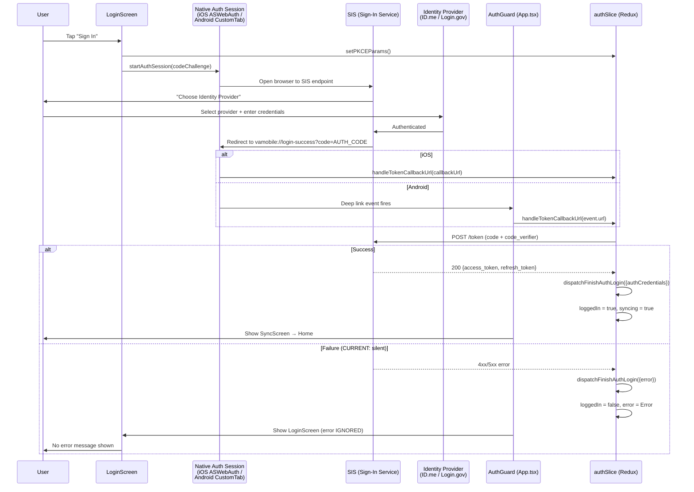
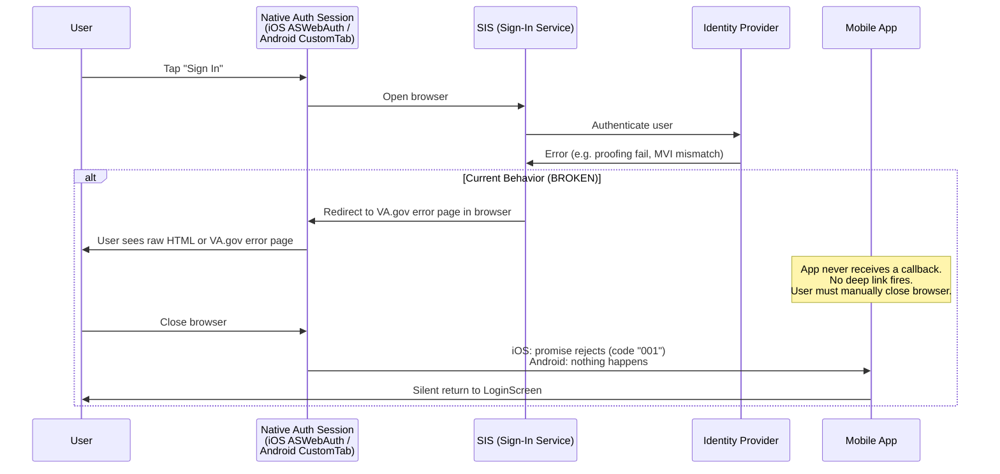
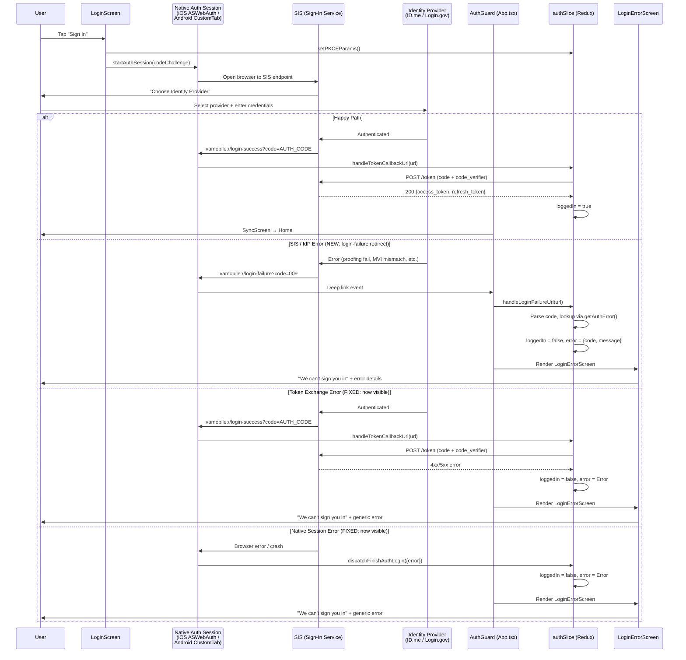
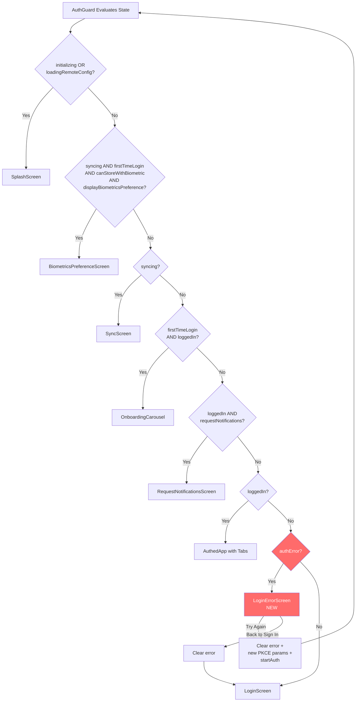
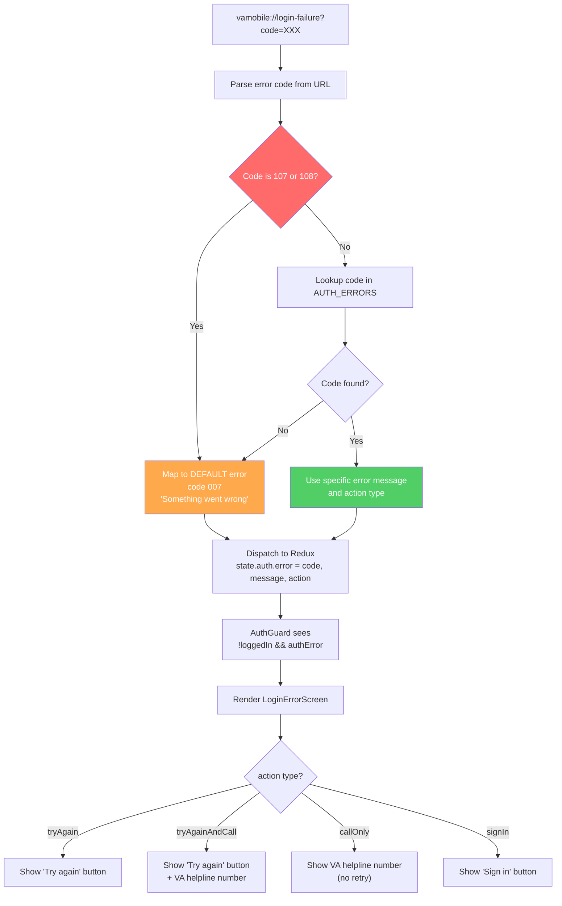

Login Error Visibility Fix

## Summary of the Problem

When login fails, the error is **caught and stored** in Redux state (`state.auth.error`) but **no UI component ever reads or displays it**. Users see a loading spinner, then are silently returned to the sign-in page with zero feedback.

---

## Root Cause Analysis

### The Error IS Captured (Backend/Redux Side Works)

In `src/store/slices/authSlice.ts:742-748`, `handleTokenCallbackUrl` catches errors and dispatches them to the store:

```ts
} catch (error) {
  if (isErrorObject(error)) {
    logNonFatalErrorToFirebase(error, `handleTokenCallbackUrl: ${authNonFatalErrorString}`)
    await logAnalyticsEvent(Events.vama_login_token_fetch(error))
    dispatch(dispatchFinishAuthLogin({ error }))  // Error stored in state
  }
}
```

The `dispatchFinishAuthLogin` reducer (`authSlice.ts:845-856`) resets to `initialAuthState` when an error is present:

```ts
dispatchFinishAuthLogin: (state, action: PayloadAction<AuthFinishLoginPayload>) => {
  const successfulLogin = !action.payload.error
  return {
    ...(action.payload.error ? initialAuthState : state), // Resets state on error
    ...action.payload, // Includes error field
    webLoginUrl: undefined,
    ...(action.payload.error ? { initializing: false } : { loading: false }),
    successfulLogin: successfulLogin,
    loggedIn: successfulLogin, // loggedIn = false on error
  }
}
```

### The Error IS NOT Displayed (Frontend Gap)

After the error is dispatched:

1. `AuthGuard` in `src/App.tsx:213-458` evaluates `loggedIn === false` and `initializing === false`
2. This renders the unauthenticated `Stack.Navigator` with `LoginScreen` (line 443-454)
3. **`LoginScreen` (`src/screens/auth/LoginScreen/LoginScreen.tsx`) never reads `state.auth.error`** - it only reads `firstTimeLogin`, `loadingRefreshToken`, and `authParamsLoadingState` from auth state (line 39-40)
4. Result: user is dropped back to the sign-in page with no explanation

### Additional Error Paths Not Handled

| Error Scenario                           | Where It Occurs                                                 | Current UI Behavior                                                                      |
| ---------------------------------------- | --------------------------------------------------------------- | ---------------------------------------------------------------------------------------- |
| Token exchange fails (4xx/5xx)           | `authSlice.ts:727-738` (`handleTokenCallbackUrl`)               | Silent return to LoginScreen                                                             |
| No auth code in callback URL             | `authSlice.ts:430-432` (`parseCallbackUrlParams`)               | Silent return to LoginScreen                                                             |
| No refresh/access token in response      | `authSlice.ts:461` (`processAuthResponse`)                      | Silent return to LoginScreen                                                             |
| Token refresh fails on app launch        | `authSlice.ts:560-572` (`attemptIntializeAuthWithRefreshToken`) | Silent return to LoginScreen                                                             |
| SIS/Identity Provider error (in-browser) | No handling exists                                              | User sees raw HTML/JSON or VA.gov error page in browser. App never learns what happened. |
| iOS ASWebAuthSession error (code "001")  | `src/utils/hooks/auth.tsx:42-43` (`useStartAuth`)               | Logged to Firebase only                                                                  |
| Android Custom Tab launch failure        | `CustomTabsIntentModule.kt:148-149`                             | Promise rejection, no UI                                                                 |

---

## Recommended Approach: `vamobile://login-failure` Callback + Custom Error Screen

### Overview

This approach requires two coordinated changes:

1. **Backend (SIS/vets-api)**: When an auth error occurs at the SIS or identity provider level, redirect to `vamobile://login-failure?code=<ERROR_CODE>` instead of showing the error in the browser or redirecting to the VA.gov web error page.
2. **Mobile (VAMobile)**: Handle the `vamobile://login-failure` deep link, parse the error code, map it to a user-friendly message, and display a `LoginErrorScreen`.

This closes the gap where SIS-level errors are currently invisible to the mobile app. Today the deep link listener only watches for `vamobile://login-success?` — errors that happen before the token exchange have no way to reach the app.

---

## Auth Error Code Mapping (from vets-api via vets-website)

Source: `vets-website/src/platform/user/authentication/errors.js` and `vets-website/src/applications/auth/components/RenderErrorContainer.jsx`

### Error codes to handle in mobile

| Code  | Key                    | Alert Message (adapted for mobile)                                                                                                                                     | User Action                                                                    |
| ----- | ---------------------- | ---------------------------------------------------------------------------------------------------------------------------------------------------------------------- | ------------------------------------------------------------------------------ |
| `001` | USER_DENIED            | "We couldn't complete the identity verification process. It looks like you selected \"Deny\" when we asked for your permission to share your information with VA.gov." | "Try again" button                                                             |
| `004` | MVI_MISMATCH           | "Something went wrong on our end, and we couldn't sign you in. Please try again in a few minutes."                                                                     | "Try again" button + call help center                                          |
| `005` | SESSION_EXPIRED        | "You didn't take any action for 30 minutes, so we signed you out to protect your personal information."                                                                | "Sign in" button                                                               |
| `009` | LOGINGOV_PROOFING_FAIL | "We were unable to verify your identity with Login.gov."                                                                                                               | "Try again" button + Login.gov help link (opens in WebView) + call help center |
| `102` | MULTIPLE_EDIPIS        | "We're having trouble signing you in because we found more than one DoD ID number for you."                                                                            | Call help center                                                               |
| `103` | ICN_MISMATCH           | "We're having trouble signing you in because your My HealtheVet account number doesn't match the account number on your VA.gov account."                               | Call help center                                                               |
| `104` | UUID_MISSING           | "We're having trouble signing you in because one of your account numbers is missing for your VA.gov account."                                                          | Call help center                                                               |
| `106` | MULTIPLE_CORPIDS       | "We're having trouble signing you in because we found more than one account number for you."                                                                           | Call help center                                                               |
| `007` | DEFAULT (catch-all)    | "We're sorry. Something went wrong on our end, and we couldn't sign you in."                                                                                           | "Try again" button + call help center                                          |
| `400` | GENERIC                | "We're sorry. Something went wrong on our end, and we couldn't sign you in."                                                                                           | "Try again" button + call help center                                          |

### Error codes to EXCLUDE from mobile (never display)

| Code  | Key        | Reason                            |
| ----- | ---------- | --------------------------------- |
| `107` | DEATH_FLAG | Must not be disclosed to the user |
| `108` | FRAUD_FLAG | Must not be disclosed to the user |

These should fall through to the default/generic error message ("Something went wrong on our end") so the user gets feedback without revealing the flag.

### Error codes removed (not applicable to mobile)

| Code  | Key                         | Reason                                                         |
| ----- | --------------------------- | -------------------------------------------------------------- |
| `002` | USER_CLOCK_MISMATCH         | Browser-specific; mobile uses native auth sessions             |
| `003` | SERVER_CLOCK_MISMATCH       | Covered by generic server error handling                       |
| `101` | MULTIPLE_MHVIDS             | MHV-specific account issue; troubleshooting steps are web-only |
| `110` | CERNER_PROVISIONING_FAILURE | Web-specific (Terms of Use / My VA Health)                     |
| `111` | CERNER_NOT_ELIGIBLE         | Web-specific (My VA Health eligibility)                        |
| `112` | MHV_PROVISIONING_FAILURE    | Web-specific (Terms of Use / My HealtheVet)                    |
| `201` | OAUTH_DEFAULT_ERROR         | Internal OAuth plumbing; not actionable for mobile users       |
| `202` | OAUTH_STATE_MISMATCH        | Internal OAuth plumbing; not actionable for mobile users       |
| `203` | OAUTH_INVALID_REQUEST       | Browser cookie/cache advice not applicable to mobile           |

---

## Files to Modify

### 1. `src/store/slices/authSlice.ts` - Add error clearing + failure URL handler

The `error` field already exists in `AuthState` (line 66).

**Add a new reducer** to clear the auth error so the user can dismiss and retry:

```ts
// New reducer in authSlice.reducers:
dispatchClearAuthError: (state) => {
  state.error = undefined
}
```

**Add a new thunk** to handle the `vamobile://login-failure?code=<ERROR_CODE>` deep link:

```ts
export const handleLoginFailureUrl =
  (url: string): AppThunk =>
  async (dispatch) => {
    const errorCode = parseLoginFailureCode(url)
    const error = new Error(getAuthErrorMessage(errorCode))
    error.code = errorCode
    dispatch(dispatchFinishAuthLogin({ error }))
  }
```

Export both alongside the existing actions (line 899-919).

### 2. Create `src/constants/authErrors.ts` - Error code mapping

Port the error codes from `vets-website/src/platform/user/authentication/errors.js` and the user-facing messages from `vets-website/src/applications/auth/components/RenderErrorContainer.jsx`, adapted for mobile context.

```ts
export const AUTH_ERRORS = {
  USER_DENIED: { errorCode: '001', message: '...', action: 'tryAgain' },
  MVI_MISMATCH: { errorCode: '004', message: '...', action: 'tryAgainAndCall' },
  SESSION_EXPIRED: { errorCode: '005', message: '...', action: 'signIn' },
  DEFAULT: { errorCode: '007', message: '...', action: 'tryAgainAndCall' },
  LOGINGOV_PROOFING: { errorCode: '009', message: '...', action: 'tryAgainAndCall' },
  MULTIPLE_EDIPIS: { errorCode: '102', message: '...', action: 'callOnly' },
  ICN_MISMATCH: { errorCode: '103', message: '...', action: 'callOnly' },
  UUID_MISSING: { errorCode: '104', message: '...', action: 'callOnly' },
  MULTIPLE_CORPIDS: { errorCode: '106', message: '...', action: 'callOnly' },
  GENERIC: { errorCode: '400', message: '...', action: 'tryAgainAndCall' },
} as const

// Codes that must NEVER show their real reason to the user
const SUPPRESSED_ERROR_CODES = ['107', '108']

export const getAuthError = (code: string) => {
  if (SUPPRESSED_ERROR_CODES.includes(code)) {
    return AUTH_ERRORS.DEFAULT
  }
  return Object.values(AUTH_ERRORS).find((e) => e.errorCode === code) ?? AUTH_ERRORS.DEFAULT
}
```

### 3. `src/App.tsx` (AuthGuard) - Handle failure deep link + error screen routing

**Deep link listener** (line 349-355) — add handling for `vamobile://login-failure?`:

```ts
const listener = (event: { url: string }): void => {
  if (event.url?.startsWith('vamobile://login-success?')) {
    dispatch(handleTokenCallbackUrl(event.url))
  } else if (event.url?.startsWith('vamobile://login-failure?')) {
    dispatch(handleLoginFailureUrl(event.url))
  } else if (event.url?.startsWith('vamobile://')) {
    setInitialDeepLink(event.url)
  }
}
```

**AuthGuard state** (line 216-222) — read the error:

```ts
const {
  initializing,
  loggedIn,
  syncing,
  error: authError,      // <-- ADD
  firstTimeLogin,
  ...
} = useSelector<RootState, AuthState>((state) => state.auth)
```

**Content routing** — add new condition before the `!loggedIn` fallback (before line 442):

```ts
} else if (!loggedIn && authError) {
  content = (
    <Stack.Navigator screenOptions={headerStyles}>
      <Stack.Screen
        name="LoginError"
        component={LoginErrorScreen}
        options={{ ...topPaddingAsHeaderStyles, title: t('login') }}
      />
    </Stack.Navigator>
  )
} else {
  // existing LoginScreen fallback
```

### 4. Create `src/screens/auth/LoginErrorScreen/LoginErrorScreen.tsx` (New File)

Reads `state.auth.error`, looks up the error code via `getAuthError()`, and renders the appropriate message and actions using existing components (`AlertWithHaptics`, `ClickToCallPhoneNumber`).

```tsx
function LoginErrorScreen() {
  const { error } = useSelector<RootState, AuthState>((state) => state.auth)
  const dispatch = useAppDispatch()
  const startAuth = useStartAuth()

  const authError = getAuthError(error?.code || '007')

  const onTryAgain = () => {
    dispatch(dispatchClearAuthError())
    dispatch(setPKCEParams())
    startAuth()
  }

  const onBackToSignIn = () => {
    dispatch(dispatchClearAuthError())
  }

  return (
    // Header: "We can't sign you in"
    // AlertWithHaptics variant="error" with authError.message
    // Conditionally render:
    //   - "Try again" button (action includes 'tryAgain')
    //   - ClickToCallPhoneNumber for VA helpline 800-698-2411 (action includes 'call')
    //   - "Back to sign in" link (always)
    // Footer: "Error code: {code}" (for support reference)
  )
}
```

### 5. `src/utils/hooks/auth.tsx` - Surface iOS native auth errors to Redux

Currently, non-cancel iOS errors (code "001") are only logged to Firebase (line 42-43) and never dispatched to the store:

```ts
} catch (e) {
  if (isErrorObject(e)) {
    if (iOS && e.code === '000') {
      dispatch(cancelWebLogin())
    } else {
      logNonFatalErrorToFirebase(e, `${iOS ? 'iOS' : 'Android'} Login Error`)
      dispatch(sendLoginFailedAnalytics(e))
      dispatch(dispatchFinishAuthLogin({ error: e }))  // <-- ADD THIS
    }
  }
}
```

---

## Implementation Order

1. **Create `src/constants/authErrors.ts`** — error code mapping with suppressed codes for death/fraud flags
2. **Add `dispatchClearAuthError` reducer + `handleLoginFailureUrl` thunk** to `authSlice.ts`
3. **Create `LoginErrorScreen`** — new screen component, no risk to existing functionality
4. **Update `AuthGuard` in `App.tsx`** — add failure deep link handler + error screen routing
5. **Update `useStartAuth` hook** — surface native auth errors to Redux state
6. **Add i18n translations** for all error messages, button labels, and accessibility labels
7. **Add unit tests** for `LoginErrorScreen`, `getAuthError`, and updated `AuthGuard` logic
8. **Add analytics events** for login error screen views and retry attempts
9. **Coordinate with backend team** to implement `vamobile://login-failure?code=<ERROR_CODE>` redirect in SIS

---

## Key Files Reference

| File                                                      | Role                                      | Change Needed                                                          |
| --------------------------------------------------------- | ----------------------------------------- | ---------------------------------------------------------------------- |
| `src/store/slices/authSlice.ts`                           | Auth Redux state & actions                | Add `dispatchClearAuthError` reducer + `handleLoginFailureUrl` thunk   |
| `src/App.tsx`                                             | AuthGuard navigation + deep link listener | Add `vamobile://login-failure` handler + `authError` routing condition |
| `src/screens/auth/LoginErrorScreen/LoginErrorScreen.tsx`  | **NEW** Login error display               | Create screen that maps error codes to user-facing messages            |
| `src/constants/authErrors.ts`                             | **NEW** Error code lookup                 | Port error codes from vets-website, suppress death/fraud flags         |
| `src/utils/hooks/auth.tsx`                                | OAuth flow hook                           | Dispatch error to store on native auth failure                         |
| `src/components/CommonErrorComponents/ErrorComponent.tsx` | Generic error display                     | No changes needed (reference for patterns)                             |
| `src/utils/errors.ts`                                     | Error classification utils                | No changes needed (reference for patterns)                             |
| `src/constants/errors.ts`                                 | Error type constants                      | No changes needed                                                      |

---

## Backend Coordination Required

The `vamobile://login-failure?code=<ERROR_CODE>` redirect must be implemented on the SIS/vets-api side. This is the critical piece that closes the gap for in-browser errors (SIS and identity provider failures) that currently have no path back to the mobile app.

Without this backend change, the mobile-side fixes above will only cover:

- Token exchange failures (post-callback)
- Native auth session errors (iOS "001", Android launch failure)
- Missing auth code in callback URL

With the backend change, the full set of vets-api error codes (001, 004, 005, 007, 009, 102, 103, 104, 106, 400) will be surfaced to the user with actionable messaging.

---

## Questions for the Team

1. **Analytics**: Should we fire a new analytics event (e.g., `vama_login_error_shown`) when the error screen is displayed, including the error code?
2. **Retry limit**: Should there be a limit on how many times a user can retry from the error screen before showing a different message?
3. **Backend timeline**: When can the SIS team implement the `vamobile://login-failure` redirect? The mobile-side work can proceed independently for token exchange and native session errors.

---

## Technical Architecture Diagrams

### 1. Current Auth Flow (No Error Visibility)



### 2. SIS/Identity Provider Error (Current: Invisible to App)



### 3. Proposed Auth Flow (With Error Visibility)



### 4. AuthGuard Routing Logic (With New Error Condition)



### 5. Error Code Resolution Flow


