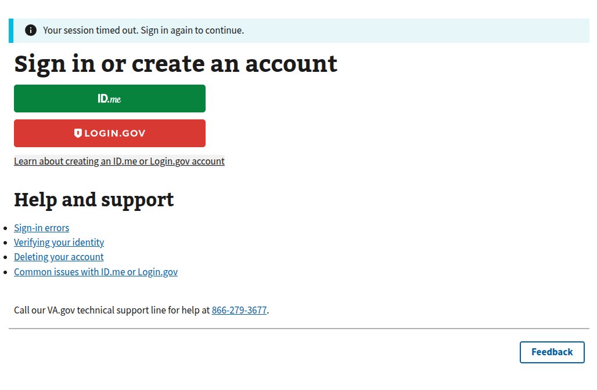
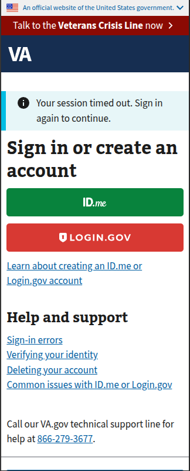

# Session Expired

## Error code
`005`

## Title
Session Timeout / Session Expired

## URL
https://dev.va.gov/sign-in/?status=session_expired

## Why it happens
This usually occurs when a session was invalidated during the Sign in process or the user was inactive for a period of 30 minutes or more on VA.gov.

## How to resolve the issue

1. Ask the user to clear their cookies & cache
2. Ask the user to try to sign in again with their credential provider

## Screenshot

  
View screenshot #1

  

  
View screenshot #2

  

## Content

[va-alert] Your session timed out. Sign in again to continue.

[h1] Sign in or create an account

[LoginButton] ID.me / Login.gov

[h2] Help and support

- [va-link] Sign-in errors
- [va-link] Verifying your identity
- [va-link] Deleting your account
- [va-link] Common issues with ID.me or Login.gov