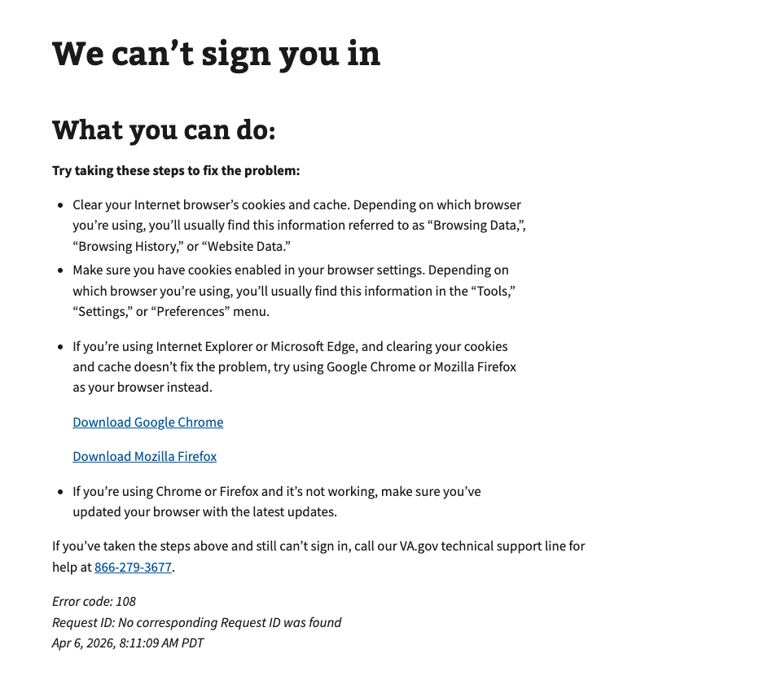

# MHV Verification Error

## Error code
`108`

## Title
MHV Verification Error

## URL
https://dev.va.gov/auth/login/callback/?auth=fail&code=108

## Why it happens
This occurs when a My HealtheVet Basic user is requesting access to a service that requires a My HealtheVet Premium account.  This error usually occurs when using the Sign in Service on the Unified Sign in Page for any application with a `client_id=mobile`.

## How to resolve the issue

1. Create a ticket with the help desk
2. Manually fix the record in MPI data after obtaining verifiable information from the user.

## Screenshot

  
View screenshot

  

## Content

[h1] We can't sign you in

[va-alert]

We’re having trouble signing you in with your My Healthevet account right now because the services you are requesting require you to have a Premium My Healthevet account.

[h2] What you can do:

Try taking these steps to fix the problem:

[list item 1]
Clear your Internet browser’s cookies and cache. Depending on which browser you’re using, you’ll usually find this information referred to as “Browsing Data,”, “Browsing History,” or “Website Data.”

[list item 2]
Make sure you have cookies enabled in your browser settings. Depending on which browser you’re using, you’ll usually find this information in the “Tools,” “Settings,” or “Preferences” menu.

[list item 3]
If you’re using Internet Explorer or Microsoft Edge, and clearing your cookies and cache doesn’t fix the problem, try using Google Chrome or Mozilla Firefox as your browser instead.

[link] Download Google Chrome
[link] Download Mozilla Firefox

[list item 4]
If you’re using Chrome or Firefox and it’s not working, make sure you’ve updated your browser with the latest updates.

If you’ve taken the steps above and still can’t sign in, call our VA.gov technical support line for help at 866-279-3677.

