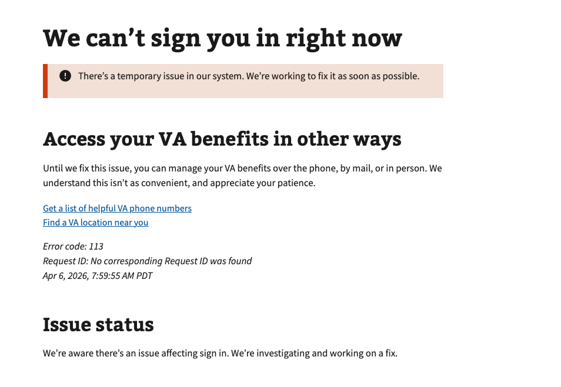

# MPI Personal Information Mismatch

## Title
Personal Information Mismatch (SSN)

## URL
https://dev.va.gov/auth/login/callback/?auth=fail&code=113

## Why it happens
This error occurs when VA.gov receives a **Social Security number (SSN)** attribute that **doesn’t match** the SSN on file in VA systems for the user’s identity record.

## How to resolve the issue
- There is currently no way for users to resolve this issue on their own
- Users will need to manage their VA benefits over the phone, by mail, or in person.

## Screenshot
## Screenshot

  
View screenshot

  

---

## Content

[h1] We can’t sign you in right now

[va-alert]
There’s a temporary issue in our system. We’re working to fix it as soon as possible.

[h2] Access you VA benefits in other ways

Until we fix this issue, you can manage your VA benefits over the phone, by mail, or in person. We understand this isn’t as convenient, and appreciate your patience.

[va-link href="/resources/helpful-va-phone-numbers/" text="Get a list of helpful VA phone numbers"]

[va-link href="/find-locations/" text="Find a VA location near you"]

[h2] Issue status

We’re aware there’s an issue affecting sign in. We’re investigating and working on a fix.
